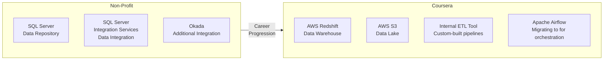

# Viewpoints: Tools, Databases, and Data Repositories of Choice

## Introduction

In this viewpoints lesson, several data engineering professionals share the real-world tools, databases, and data repositories they use in their daily work. Across all their stacks, a consistent theme emerges: **no data engineer works with just one tool**, and the field demands continuous learning as the ecosystem evolves.

> *"The ecosystem of data engineering is very, very vast."* — Data Professional

---

## Real-World Tool Stacks by Professional

### Professional 1 — Open-Source Focused Stack

This engineer's team prioritizes open-source tools and uses Python as the connective tissue across the entire stack.

| Category | Tool |
|---|---|
| **Relational DB** | MySQL |
| **NoSQL DB** | MongoDB, Cassandra |
| **Graph DB** | Neo4J |
| **General scripting / glue** | Python |
| **Pipeline orchestration** | Apache Airflow |
| **Big data processing** | Apache Spark |
| **Streaming data** | Apache Kafka |
| **ETL** | Talend |
| **Web scraping** | Beautiful Soup, Scrapy |
| **Storage** | Cloud storage (archival + daily) |

> *"Python is pretty much indispensable. Whatever feature we feel missing in our data engineering space, we first try to use Python to get that into place — and then over time, we see if any product can take its place."*

---

### Professional 2 — Non-Profit to Coursera Stack Evolution

This engineer's stack evolved significantly across organizations, illustrating how tools change by company size and maturity.

| Category | Non-Profit Tool | Coursera Tool |
|---|---|---|
| **Data Repository** | SQL Server | AWS Redshift (Warehouse) + AWS S3 (Lake) |
| **Data Integration** | SSIS + Okada | Internal ETL tool → Apache Airflow |
| **Orchestration** | Manual / SSIS | Apache Airflow (in progress) |

---

### Professional 3 — Relational + Streaming + Movement Stack

This engineer has broad cross-platform experience spanning relational databases, streaming technologies, and data movement tooling.

| Category | Tool | Purpose |
|---|---|---|
| **Relational DB** | IBM Db2, PostgreSQL, Microsoft SQL Server | Structured data storage and querying |
| **NoSQL DB** | Cassandra, MongoDB | Flexible-schema and high-volume workloads |
| **Streaming / Replication** | WebSphere MQ | Data replication between systems |
| **Streaming / Backend** | Apache Kafka | Moving transactional data to back-office databases |
| **ETL / Data Movement** | SSIS (SQL Server Integration Services) | Building data movement packages |
| **Data Movement** | Apache NiFi | Moving data between heterogeneous sources |
| **Custom scripting** | Shell, Perl | Bespoke data movement scripts |
| **API development** | Java APIs | Moving data between applications and vendors |

> **Spotlight — Apache NiFi:** Maintained by the Apache Foundation, NiFi is an open-source tool designed to move data between heterogeneous data sources. Its open-source nature means the full source code is available for learning — and for those with time and enthusiasm, contribution to the project is possible.

---

### Professional 4 — IBM Career to Big Data Evolution

This engineer spent the bulk of their career at IBM before expanding into Big Data systems, illustrating the importance of lifelong learning.

| Category | Tool |
|---|---|
| **Primary Relational DB** | IBM Db2 (Linux, Unix, Windows) |
| **Other Relational DBs** | MySQL, PostgreSQL |
| **Big Data** | Apache Hadoop, Apache Spark |

> *"As a data engineer in a field that continues to evolve, you need to become a lifelong learner and keep picking up skills required for your job and the problems you're trying to solve. As long as you're good with data fundamentals, you should be able to quickly pick up new skills and technologies."*

---

### Professional 5 — Enterprise Relational + DevOps-Integrated Stack

This engineer's stack reflects a mature, DevOps-oriented organization where database management is tightly integrated with deployment and change management tooling.

| Category | Tool | Purpose |
|---|---|---|
| **Primary Relational DB** | IBM Db2 (Linux, Unix, Windows) | Core enterprise database |
| **Cloud Relational DB** | AWS RDS with Microsoft SQL Server | Cloud-hosted relational workloads |
| **Relational DB** | MariaDB (on RDS + self-hosted) | Open-source relational alternative |
| **Version control** | Git / GitHub | Code management — integral to all DevOps and non-DevOps workflows |
| **CI/CD & automation** | Jenkins | Container management, maintenance jobs, code deploys |
| **Schema change management** | Liquibase | Tracking and managing database schema changes in containerized environments |

> **Spotlight — Liquibase:** Liquibase is a schema change management tool that works especially well with containers. It provides easy, auditable control over changes made to database schemas — critical in environments where schema drift can cause production issues.

---

## Cross-Stack Tool Summary

Aggregating all professionals' stacks reveals the tools that appear most broadly across real-world data engineering environments:

### Databases

| Type | Tools Mentioned |
|---|---|
| **Relational** | IBM Db2, MySQL, PostgreSQL, Microsoft SQL Server, MariaDB |
| **NoSQL — Document** | MongoDB |
| **NoSQL — Column** | Cassandra |
| **NoSQL — Graph** | Neo4J |
| **Cloud Relational (DBaaS)** | AWS RDS, AWS Redshift |

### Data Movement and Integration

| Tool | Category |
|---|---|
| Apache Airflow | Pipeline orchestration |
| Apache Kafka | Streaming / event processing |
| Apache NiFi | Heterogeneous data movement |
| Talend | ETL |
| SSIS | ETL / data movement packages |
| WebSphere MQ | Streaming replication |

### Big Data Processing

| Tool | Category |
|---|---|
| Apache Spark | Distributed data processing |
| Apache Hadoop | Distributed storage and batch processing |

### Storage

| Tool | Category |
|---|---|
| AWS S3 | Cloud object storage / data lake |

### Developer and DevOps Tools

| Tool | Category |
|---|---|
| Python | General scripting, glue code, automation |
| Shell / Perl | Custom data movement scripting |
| Java APIs | Application-to-application data movement |
| Git / GitHub | Version control |
| Jenkins | CI/CD, container management, deployment |
| Liquibase | Database schema change management |
| Beautiful Soup / Scrapy | Web scraping |

---

## Key Themes Across All Professionals

- **No data engineer works with a single tool** — real-world stacks combine relational DBs, NoSQL, streaming tools, orchestration platforms, and cloud services simultaneously.
- **Python is the universal glue** — used to fill gaps in the ecosystem before a dedicated product takes over.
- **The Apache ecosystem is central** to modern data engineering: Airflow (orchestration), Kafka (streaming), Spark (processing), NiFi (data movement), and Hadoop (big data) appear repeatedly across all stacks.
- **Open-source tools are preferred** where possible — they provide flexibility, avoid vendor lock-in, and their codebases serve as learning resources.
- **DevOps tooling (Git, Jenkins, Liquibase)** is increasingly part of the data engineer's toolkit — not just software engineers'.
- **The field evolves constantly.** Strong fundamentals in data (not just familiarity with specific tools) are what enable engineers to pick up new technologies quickly as the ecosystem changes.
- **Lifelong learning is not optional** — it is the core professional requirement for anyone in data engineering.
