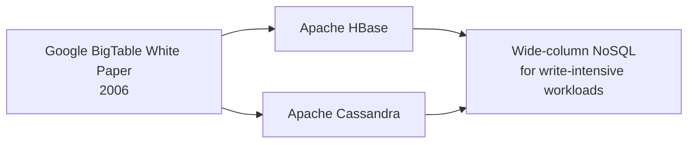
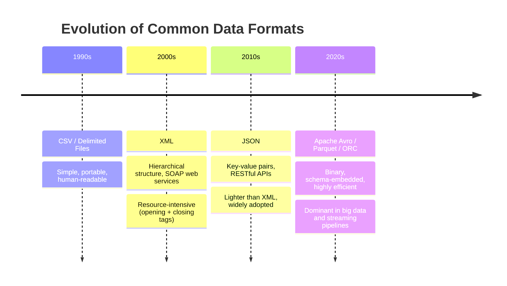

# Viewpoints: Working with Varied Data Sources and Types

## Overview

This document captures practitioner perspectives on the realities of working with diverse data sources and formats in real-world data engineering. Unlike conceptual overviews, these viewpoints reflect **hard-won experience** — the flexibility required, the tools that rise and fall in popularity, and the messy edge cases that textbooks rarely cover.

The key themes across all perspectives:

- Relational databases remain foundational but are not universal
- Every data format brings its own set of engineering challenges
- Adaptability and a willingness to learn new tools are as important as technical skills
- Real-world data migration is harder than it looks — often because of the *data itself*, not the tools

---

## 1. The Relational Database as a Foundation — and Its Limits

### The Case for SQL and Relational Databases

Many experienced data professionals default to **relational databases** as their primary tool. SQL's power for moving, structuring, and securing data has proven durable across decades and continues to be the backbone of most enterprise data environments.

Key strengths practitioners highlight:

- SQL is highly expressive for data movement and transformation between systems
- Relational databases provide mature, well-understood mechanisms for access control and security
- Their flexibility has allowed them to remain competitive across a wide range of use cases

### Where Relational Databases Fall Short

Despite their longevity, relational databases came under **intense scrutiny with the rise of unstructured data** — logs, documents, XML, JSON — and the explosion of data-intensive applications such as IoT platforms and social media systems.

The core technical issue:

> Relational databases are powered by **B-tree data structures**, which are optimized for balanced read/write patterns. **Heavy write-intensive workloads** — such as continuous sensor data ingestion or high-volume social media event streams — cause performance degradation due to the random read/write nature of B-tree updates.

This limitation drove the industry toward **NoSQL** alternatives.

**Google's BigTable white paper (2006)** became a pivotal moment: it proposed an architectural model for storing and accessing massive amounts of structured data at scale. Cassandra and HBase were both built from this same architectural lineage and became widely adopted solutions for the problems relational databases struggled to solve.

---

## 2. The Challenge of Moving Data Across Systems

### One-Time Migration vs. Continuous Movement

A critical distinction practitioners emphasize:

| Scenario | Complexity | Key Concern |
|---|---|---|
| **One-time migration** (sub-terabyte) | Moderate | Correctness and completeness |
| **Ongoing, continuous movement** | High | Performance, reliability, and maintainability |

Moving data once is manageable at moderate volumes. Moving data **consistently, continuously, and performantly** requires evaluating multiple solutions and remaining open to new approaches as requirements evolve.

### Cross-Vendor Migration: A Real-World Case Study

One particularly instructive challenge involves migrating data **from IBM Db2 to Microsoft SQL Server**. Each platform has different expectations for how imports and exports are structured — but in this case, the bigger obstacle was the *data itself*.

**The delimiter problem:**

When exporting data to a delimited flat file for transfer, engineers must choose a character to separate fields. The standard choice is a comma (CSV). However:

- If the data *contains commas*, those must be escaped or quoted — or a different delimiter must be chosen
- In this migration, data contained such a wide variety of special characters that **no single delimiter worked across all tables**
- Engineers were forced to use **different separators for different tables**
- Even unusual candidates like the **Bell character** (`\a`, ASCII 7) were disqualified — present in some tables or impractical to use as a separator

> **Practical takeaway:** When designing data export and ingestion pipelines, always audit the actual data for delimiter collisions *before* choosing a format. Never assume CSV will be clean.

### The Versioning Problem

A less obvious but common source of friction in multi-source environments is **database version incompatibility**:

- A feature available in a newer version of a database may not exist in the version deployed in production
- Behavior that worked in an older version may have changed in a newer release
- Engineers must constantly verify which version of each platform they are targeting and code defensively

---

## 3. The Evolution of Data Formats

Practitioners observe a clear **generational progression** in data formats, driven by the twin pressures of expressiveness and resource efficiency:

### Format-by-Format Challenges

#### Log Data
- **Structure:** Largely unstructured or semi-structured
- **Challenge:** No universal schema; parsing logic is application-specific
- **Engineering implication:** Custom parsers are often required depending on what fields you need to extract
- **Common approach:** Regular expressions, log parsing libraries, or purpose-built tools (e.g., Logstash, Fluentd)

#### XML
- **Peak adoption:** Widely used in the 2000s, particularly with **SOAP-based web services**
- **Limitation:** Verbose — every data element requires both an opening and a closing tag, making files significantly larger and more memory-intensive to parse
- **Status today:** Still present in legacy systems and certain enterprise integrations, but largely displaced by JSON for web APIs

#### JSON
- **Design philosophy:** Eliminated closing tags in favor of key-value pairs — achieving the same hierarchical expressiveness as XML with significantly less overhead
- **Current status:** The dominant format for **RESTful APIs** and web-based data exchange
- **Engineering note:** JSON is human-readable and easy to work with, but lacks a native schema enforcement mechanism (though JSON Schema and tools like Avro address this)

#### Apache Avro (and similar: Parquet, ORC)
- **Design philosophy:** Binary format with the schema embedded in the file itself
- **Advantages:** Compact storage, fast serialization/deserialization, schema evolution support
- **Use cases:** Streaming pipelines (Kafka), data lakes, Hadoop/Spark workloads
- **Status:** Rapidly gaining adoption as big data and streaming architectures mature

---

## 4. Practitioner Mindset: Adaptability as a Core Skill

A recurring theme across all viewpoints is that **technical breadth and adaptability matter as much as depth** in any single tool.

### What This Looks Like in Practice

- A data engineer may start a project expecting to work with relational databases and encounter NoSQL, flat files, streaming feeds, and proprietary formats before it's done
- Skills with standard formats (CSV, JSON, XML) are necessary but not sufficient — **proprietary formats** from specific vendors or legacy systems will appear
- Working with **data at rest** (batch), **streaming data** (real-time), and **data in motion** (in-transit) requires different tools and mental models

### The Learning Posture Required

| Scenario | Required Response |
|---|---|
| Unfamiliar data format | Learn the format's structure and find or build the appropriate parser |
| New database platform | Understand its import/export conventions and version-specific behavior |
| Performance bottleneck | Evaluate alternative architectures — don't assume the current stack is the right one |
| Cross-vendor migration | Audit the data first; the tool is rarely the hardest part |

> **Key insight from practitioners:** *"You might not have the skills to work with all of these different types of data sources from day one — but you need to be able to learn as you go and pick up the skills required for the project."*

---

## Summary and Key Takeaways

| Theme | Core Lesson |
|---|---|
| **Relational databases** | Powerful and durable, but not suited for heavy write-intensive workloads (IoT, social media) |
| **NoSQL emergence** | Driven by Google BigTable's 2006 architecture; Cassandra and HBase solve write-heavy use cases |
| **Data migration** | Continuous movement is far harder than one-time migration; cross-vendor work surfaces format and versioning complexity |
| **Delimiter pitfalls** | Always audit real data before choosing a delimiter; special characters in data can invalidate every standard option |
| **Format evolution** | XML → JSON → Avro/Parquet: each generation trades verbosity for efficiency |
| **Log data** | Unstructured and application-specific; often requires custom parsing tools |
| **Adaptability** | The ability to learn new formats, tools, and platforms on the job is a defining trait of effective data engineers |

**For data engineers entering the field:**

- Build fluency with CSV, JSON, and XML early — they appear everywhere
- Understand *why* NoSQL exists and which workload patterns it addresses; do not default to relational databases for every problem
- Treat data migration projects with respect — the data itself is typically the source of the hardest problems, not the tools
- Version awareness is non-negotiable in multi-platform environments; always know what version you are targeting
- Adopt a format-agnostic mindset: the right format depends on the workload, volume, and downstream consumers
