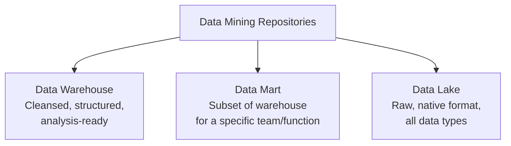
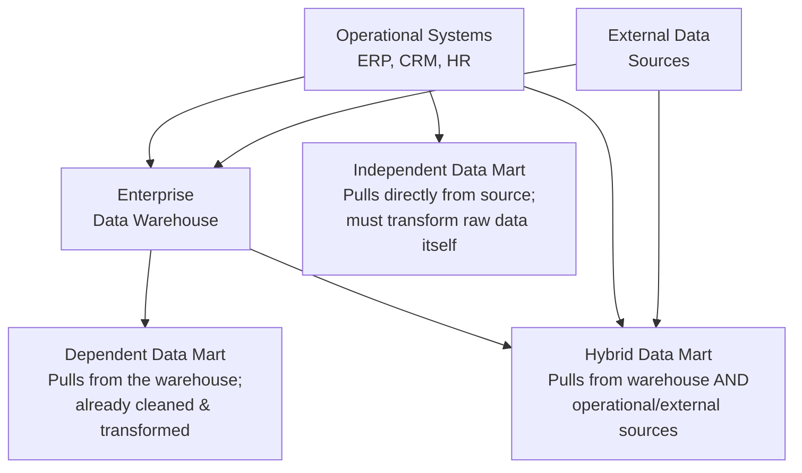
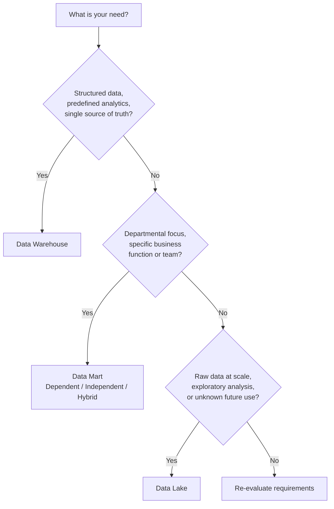

# Data Warehouses, Data Marts, and Data Lakes

## Introduction

All data mining repositories share a common goal: **house data for reporting, analysis, and deriving insights**. However, they differ in their purpose, the types of data they store, and how that data is accessed.



---

## Data Warehouse

### What It Is

A **data warehouse** is a central repository of data integrated from multiple sources. It serves as the **single source of truth** — storing current and historical data that has been:

- **Cleansed** — errors and inconsistencies removed
- **Conformed** — standardized across sources
- **Categorized** — organized into a coherent structure

When data lands in a data warehouse, it is already **modeled and structured for a specific purpose** — meaning it is **analysis-ready** from the moment it arrives.

> **Traditionally**, data warehouses stored relational data from transactional systems such as CRM, ERP, HR, and Finance applications. With the rise of NoSQL and new data sources, non-relational repositories are now also used for data warehousing.

---

### Three-Tier Architecture

```mermaid
flowchart TB
    subgraph Tier 3 — Top: Client Front-End Layer
        T3["Querying, Reporting & Analytics Tools\n(BI dashboards, SQL clients, visualization tools)"]
    end
    subgraph Tier 2 — Middle: OLAP Server
        T2["Online Analytical Processing Engine\nProcesses & analyzes data from multiple DB servers"]
    end
    subgraph Tier 1 — Bottom: Database Servers
        T1["Relational and/or Non-Relational DBs\nExtract data from source systems"]
    end

    T1 --> T2 --> T3
```

| Tier | Layer | Role |
|---|---|---|
| **Bottom** | Database Servers | Extract data from source systems (relational, non-relational, or both) |
| **Middle** | OLAP Server | Process and analyze information coming from multiple database servers |
| **Top** | Client Front-End | Tools and applications for querying, reporting, and analyzing data |

---

### On-Premise vs. Cloud Data Warehouses

Data warehouses that once resided in on-premise data centers are increasingly migrating to the cloud.

| Feature | On-Premise | Cloud-Based |
|---|---|---|
| **Cost** | High upfront hardware/infrastructure investment | Lower cost, pay-as-you-go |
| **Storage & Compute** | Fixed, capacity-limited | Limitless, elastic |
| **Scalability** | Manual, slow | Scale on demand |
| **Disaster Recovery** | Complex and slow | Faster, built-in replication |

---

### When to Use a Data Warehouse

Use a data warehouse when you have **massive amounts of operational data** that needs to be **readily available for reporting and analysis** across the enterprise.

### Popular Data Warehouse Platforms

| Platform | Provider |
|---|---|
| Teradata Enterprise Data Warehouse | Teradata |
| Oracle Exadata | Oracle |
| IBM Db2 Warehouse on Cloud | IBM |
| IBM Netezza Performance Server | IBM |
| Amazon Redshift | AWS |
| BigQuery | Google Cloud |
| Cloudera Enterprise Data Hub | Cloudera |
| Snowflake Cloud Data Warehouse | Snowflake |

---

## Data Mart

### What It Is

A **data mart** is a sub-section of the data warehouse, built specifically for a **particular business function, purpose, or community of users**.

> **Example:** The Sales team accesses a sales data mart for quarterly reporting and projections. The Finance team accesses a separate finance data mart for budgeting analysis. Each team gets a focused, fast, and secure slice of the enterprise data.

---

### Three Types of Data Marts



| Type | Data Source | Transformation Responsibility |
|---|---|---|
| **Dependent** | Enterprise data warehouse | None — data is already cleaned and transformed by the warehouse |
| **Independent** | Operational systems or external data | Must perform its own transformation on raw source data |
| **Hybrid** | Combination of warehouse, operational, and external systems | Varies — handles transformations from multiple input types |

---

### Purpose of a Data Mart

Regardless of type, every data mart is designed to:

- Provide users with the data **most relevant to them**, when they need it
- **Accelerate business processes** through efficient query response times
- Enable **cost- and time-efficient data-driven decisions**
- **Improve end-user response time** compared to querying the full warehouse
- Provide **secure access and control** — isolating one team's data from another's

---

## Data Lake

### What It Is

A **data lake** is a data repository that stores large amounts of **structured, semi-structured, and unstructured data in their native format** — straight from the source, without requiring a predefined structure or schema.

| Dimension | Data Warehouse | Data Lake |
|---|---|---|
| **Data state** | Cleaned, transformed, structured | Raw, native format |
| **Schema** | Defined before loading (schema-on-write) | Defined at query time (schema-on-read) |
| **Data types** | Primarily structured (relational) | All types: structured, semi-structured, unstructured |
| **Users** | Business analysts, BI teams | Data scientists, data engineers, analysts |
| **Use case** | Known, predefined reporting and analytics | Exploratory analysis, ML, future use cases not yet defined |

> **Important:** A data lake is **not** a dumping ground. While data can be stored in its raw form, it must still be appropriately **classified, protected, and governed**.

---

### Schema-on-Read vs. Schema-on-Write

```mermaid
flowchart LR
    subgraph Data Warehouse — Schema-on-Write
        A1[Raw Data] -->|Transform & structure\nbefore loading| B1[Warehouse\nAnalysis-ready]
    end

    subgraph Data Lake — Schema-on-Read
        A2[Raw Data] -->|Load immediately\nin native format| B2[Data Lake\nRaw storage]
        B2 -->|Apply structure\nat query time| C2[Analysis]
    end
```

---

### Deployment Options

A data lake is a **reference architecture independent of any single technology**. It can be deployed using:

- **Cloud Object Storage** — e.g., Amazon S3
- **Large-scale distributed systems** — e.g., Apache Hadoop (for Big Data processing)
- **Relational database management systems**
- **NoSQL data repositories** capable of storing very large volumes of data

---

### Benefits of a Data Lake

| Benefit | Description |
|---|---|
| **Stores all data types** | Unstructured (PDFs, emails, documents), semi-structured (JSON, XML, CSV, logs), and structured (relational DB exports) |
| **Scales elastically** | Grows from terabytes to petabytes as storage needs increase |
| **Saves time** | No need to define structures, schemas, or transformations before ingestion |
| **Flexible repurposing** | Data can be reused across many different use cases — including ones not anticipated at ingestion time |

> **Why the last point matters:** Businesses rarely know in advance all the ways they might need to use their data in the future. A data lake preserves that optionality by keeping data in its original form.

---

### Popular Data Lake Vendors

Amazon, Cloudera, Google, IBM, Informatica, Microsoft, Oracle, SAS, Snowflake, Teradata, Zaloni.

---

## Choosing the Right Repository



---

## Summary and Key Takeaways

| Repository | Data State | Schema | Best For |
|---|---|---|---|
| **Data Warehouse** | Cleansed, structured, analysis-ready | Defined before load (schema-on-write) | Enterprise reporting, BI, historical analysis |
| **Data Mart** | Cleansed subset of warehouse or source data | Predefined, scoped to business function | Departmental reporting (Sales, Finance, HR) |
| **Data Lake** | Raw, native format | Defined at query time (schema-on-read) | Exploratory analytics, data science, ML, raw archiving |

- A **data warehouse** is the single source of truth — structured, integrated, and analysis-ready from the moment data lands.
- A **data mart** is a focused, faster, more secure slice of that warehouse scoped to a team or function.
- A **data lake** trades upfront structure for maximum flexibility — storing everything raw so it can be repurposed for uses not yet defined.
- All three can coexist in a modern data architecture, and the right choice depends on the **use case, data type, and who needs access**.
