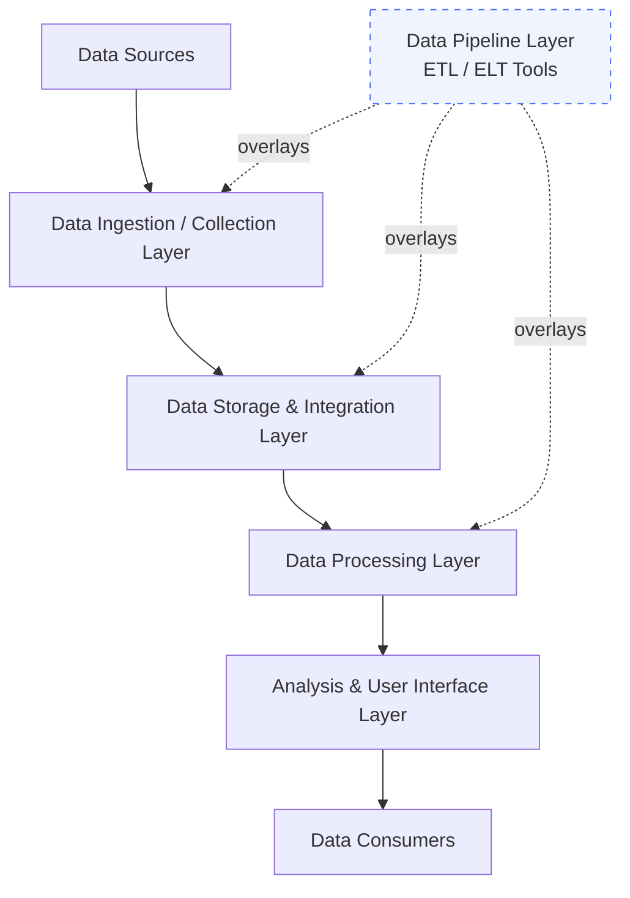
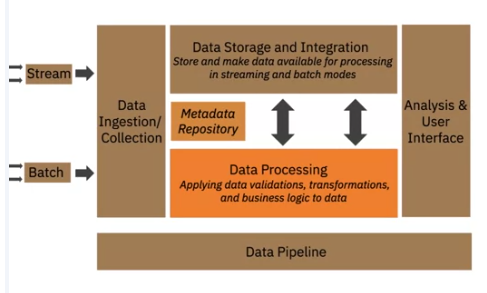

# Architecting the Data Platform

## Overview

A data platform is composed of distinct architectural layers, each responsible for a specific set of functions. Understanding these layers — and how data flows through them — is foundational to designing and operating a robust data engineering system. This lesson covers four primary layers plus one cross-cutting layer that binds them together.

---

## The Layers of a Data Platform Architecture

---

> **Figure:** The layered architecture of a data platform — data enters via Stream or Batch through the Ingestion/Collection layer, flows through Storage & Integration and Processing (with a shared Metadata Repository), surfaces at the Analysis & User Interface layer, and is orchestrated end-to-end by the Data Pipeline layer.

---

## Layer 1: Data Ingestion / Data Collection Layer

The Data Collection Layer is the entry point of the platform. It is responsible for **connecting to source systems** and pulling data into the platform.

### Key Responsibilities

- Connect to diverse data sources
- Transfer data in **streaming**, **batch**, or **hybrid** modes
- Maintain metadata about ingested data (e.g., batch size, source, timestamps)

### Common Tools

| Tool | Provider |
|---|---|
| Google Cloud Dataflow | Google Cloud |
| IBM Streams | IBM |
| IBM Streaming Analytics on Cloud | IBM |
| Amazon Kinesis | AWS |
| Apache Kafka | Open-source |

---

## Layer 2: Data Storage and Integration Layer

Once data is ingested, it must be stored reliably and integrated across sources before processing.

### Key Responsibilities

- Store data for both **immediate processing** and **long-term use**
- Transform and merge extracted data (logically or physically)
- Make data available in both **streaming** and **batch** modes

### Storage Requirements

The storage layer must be: **reliable**, **scalable**, **high-performing**, and **cost-efficient**.

### Relational Databases (On-Premise)

| Database | Provider |
|---|---|
| IBM DB2 | IBM |
| Microsoft SQL Server | Microsoft |
| MySQL | Open-source |
| Oracle Database | Oracle |
| PostgreSQL | Open-source |

### Relational Databases (Cloud / Database-as-a-Service)

| Service | Provider |
|---|---|
| IBM DB2 on Cloud | IBM |
| Amazon RDS | AWS |
| Google Cloud SQL | Google Cloud |
| SQL Azure | Microsoft |

### NoSQL / Non-Relational Databases (Cloud)

| Database | Type |
|---|---|
| IBM Cloudant | Document store |
| Redis | Key-value store |
| MongoDB | Document store |
| Cassandra | Wide-column store |
| Neo4J | Graph database |

### Integration Tools

- **IBM Cloud Pak for Data / Cloud Pak for Integration**
- **Talend Data Fabric / Open Studio**
- **Dell Boomi**, **SnapLogic** (open-source)

### Integration Platform as a Service (iPaaS)

| Platform | Provider |
|---|---|
| Adeptia Integration Suite | Adeptia |
| Google Cloud Cooperation 534 | Google Cloud |
| IBM Application Integration Suite on Cloud | IBM |
| Informatica Integration Cloud | Informatica |

---

## Layer 3: Data Processing Layer

The processing layer applies transformations and business logic to the stored data, making it ready for analysis.

### Key Responsibilities

- Read data in **batch or streaming** modes from storage
- Apply validations, transformations, and business logic
- Support popular querying tools and programming languages
- Scale to meet growing dataset demands
- Provide a working environment for analysts and data scientists

### Transformation Types

| Transformation | Description |
|---|---|
| **Structuring** | Changes to the form or schema of data — reordering fields, combining fields using joins/unions |
| **Normalization** | Removes unused data, reduces redundancy and inconsistency |
| **Denormalization** | Combines multiple tables into one for faster querying in reporting/analytics |
| **Data Cleaning** | Fixes irregularities to produce credible, downstream-ready data |

### Processing Tools

- **Spreadsheets**, **OpenRefine**, **Google DataPrep**
- **Watson Studio Refinery**, **Trifacta Wrangler**
- **Python** and **R** (with dedicated data processing libraries)

> **Note:** Storage and processing are not always separate. In relational databases, both can occur in the same layer. In Big Data systems, data may first be stored in **HDFS** and then processed by **Apache Spark**. The processing layer can also *precede* storage — transformations applied before data is loaded (ELT pattern).

---

## Layer 4: Analysis and User Interface Layer

The Analysis and UI Layer is the final delivery point — it surfaces processed data to the people and systems that consume it.

### Data Consumers

- **Business Intelligence Analysts** and stakeholders — through dashboards and reports
- **Data Scientists and Analysts** — for further processing and specific use cases
- **Applications and services** — consuming data as input via APIs

### Layer Requirements

The Analysis and UI Layer must support:

- **SQL** for relational databases; SQL-like tools (e.g., **CQL** for Cassandra) for non-relational
- **Programming languages**: Python, R, Java
- **APIs** for report generation (online and offline)
- **Real-time APIs** for consuming data in other applications
- **Dashboarding and BI tools**

### Dashboarding and BI Tools

| Tool | Provider |
|---|---|
| IBM Cognos Analytics | IBM |
| Tableau | Salesforce |
| Jupyter Notebooks | Open-source |
| Microsoft Power BI | Microsoft |
| Python / R libraries | Open-source |

---

## Cross-Cutting Layer: Data Pipeline Layer

The Data Pipeline Layer **overlays** the Ingestion, Storage & Integration, and Processing layers. It is responsible for implementing and maintaining a **continuously flowing data pipeline** using ETL (Extract, Transform, Load) or ELT tools.

### Popular Data Pipeline Solutions

| Tool | Notes |
|---|---|
| **Apache Airflow** | Open-source workflow orchestration |
| **Google Cloud Dataflow** | Managed pipeline service |

---

## Key Takeaways

- A data platform is composed of **four primary layers**: Data Collection, Storage & Integration, Processing, and Analysis & UI.
- The **Data Pipeline Layer** is a cross-cutting layer that orchestrates the flow of data across the other layers using ETL/ELT tools.
- Storage and processing are **not always separate** — their relationship depends on the architecture (relational vs. Big Data systems).
- The processing layer supports multiple transformation types: structuring, normalization, denormalization, and data cleaning.
- The Analysis & UI Layer serves diverse consumers — from BI dashboards to data scientists to external APIs.
- Tool selection at each layer depends on data size, structure, latency requirements, and organizational needs.
