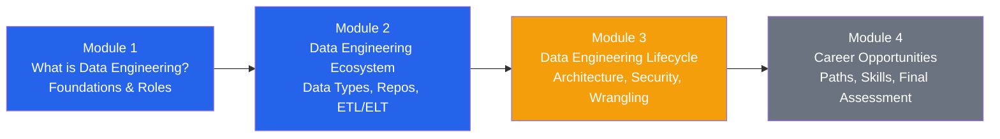
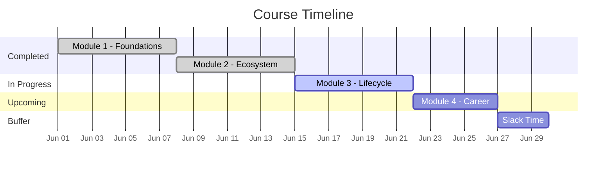

> **Course 1:** Introduction to Data Engineering
> **Module:** Full Course Overview

# Course Overview: Introduction to Data Engineering

## About This Course

**Platform:** Coursera — IBM
**Status:** Ahead of schedule (estimated completion: July 15, 2026)

This course provides a foundational understanding of the data engineering field — covering the ecosystem, tools, lifecycle, and career paths of a data engineer. It is organized into four modules that progressively build from conceptual foundations to practical lifecycle skills to professional context.

---

## Module 1: What is Data Engineering?

**Status:** ✅ Complete

### Description

An introduction to the modern data ecosystem and the role data professionals play within it. Covers what data engineering is, the key tasks in the data engineering lifecycle, and what it takes to be a data engineer day-to-day.

### Learning Objectives

- Recall the different entities that form a modern data ecosystem
- Describe and differentiate between the roles of Data Engineers, Data Scientists, Data Analysts, Business Analysts, and Business Intelligence Analysts
- Explain what Data Engineering is
- List the tasks that need to be performed in a typical data engineering lifecycle
- Identify the essential skills and qualities for data engineering as identified by data professionals
- Summarize how Data Engineering has evolved over the past few decades
- Discuss the responsibilities and skillsets of a Data Engineer
- Recall the various ways data professionals define data engineering and differentiate it from data analysis and data science
- Describe what a day in the life of a Data Engineer looks like

### Assessment Results

| Assessment | Score |
|---|---|
| Practice Quiz: Data Engineering Fundamentals | 75% |
| Practice Quiz: Understanding Data Roles and Responsibilities | 100% |
| Practice Quiz: Data Engineering Evolution and Roles | 75% |
| **Graded Quiz: Data Engineering** | **80%** |
| Practice Quiz: Data Engineering Responsibilities and Skills | 100% |
| **Graded Quiz: Application of Data Engineering Skills** | **87.50%** |

---

## Module 2: The Data Engineering Ecosystem

**Status:** ✅ Complete

### Description

A deep dive into the data engineering ecosystem — covering data types, file formats, data sources, programming languages, data repositories, ETL/ELT processes, data pipelines, and Big Data platforms.

### Learning Objectives

- Describe the elements of a data engineering ecosystem (data, repositories, integration platforms, pipelines, languages, BI tools)
- Differentiate between structured, semi-structured, and unstructured data
- Compare and contrast standard file formats for Data Engineering
- Describe common sources of data (relational databases, flat files, XML, APIs, web scraping, data streams)
- Discuss programming, querying, and scripting languages relevant to data professionals
- Define metadata management and explain its importance
- Explain what data repositories are and the purpose they serve
- Describe RDBMSs — examples, use cases, advantages, and disadvantages
- Define NoSQL databases, list their types, and differentiate from RDBMSs
- Discuss the characteristics and applications of data warehouses, data marts, and data lakes
- List essential considerations for choosing a data repository
- Summarize ETL, ELT, and data pipeline processes
- Explain the use of Data Integration Platforms
- Summarize what Big Data is and how it impacts data collection, storage, analysis, and reporting
- Discuss the roles of Apache Hadoop, Apache Hive, and Apache Spark in Big Data analytics

---

## Module 3: Data Engineering Lifecycle

**Status:** 🔄 In Progress

### Description

A practical walkthrough of the data engineering lifecycle — from platform architecture and data store design, through security, data collection, wrangling, querying, performance monitoring, and governance/compliance.

### Learning Objectives

- Identify the different layers of a data platform's architecture and the key tasks in each layer
- List primary considerations for selecting and designing a data store
- Explain the different dimensions of security as applied to the data engineering lifecycle
- Discuss data professionals' viewpoints on the importance of data security
- Summarize practices for gathering, wrangling, and querying data
- Define data wrangling and describe its transformation and cleansing activities
- Load data from a CSV file into a Db2 database
- Summarize essential querying techniques for analyzing data
- Discuss popular data wrangling tools
- Describe issues that impact data pipeline and database performance and how to troubleshoot them
- Perform SQL queries to analyze a dataset
- Explain why governance and compliance is vital throughout the data lifecycle and how technology enables it

### Documents Completed in Module 3

| Document | Status |
|---|---|
| Factors for Selecting and Designing Data Stores | ✅ Documented |
| Security in Data Platforms | ✅ Documented |
| Viewpoints: Importance of Data Security | ✅ Documented |
| Summary: Data Platforms, Stores, and Security | ✅ Documented |
| Quiz Review — Weak Areas (Round 1) | ✅ Documented |
| Quiz Review — Weak Areas (Round 2) | ✅ Documented |
| How to Gather and Import Data | ✅ Documented |
| Combining Fields Clarification | ✅ Documented |
| Data Wrangling | ✅ Documented |
| Tools for Data Wrangling | ✅ Documented |

---

## Module 4: Career Opportunities and Data Engineering in Action

**Status:** ⏳ Upcoming

### Description

An exploration of career paths and opportunities in data engineering, followed by the final graded assignment covering the full course.

### Learning Objectives

- List the different career opportunities in data engineering
- Recall how data professionals entered the field of data engineering
- Describe the different learning paths that lead to a career in data engineering
- Identify the characteristics that employers look for in a data engineer
- Discuss data professionals' perspectives on available paths into the field
- Recall advice that data professionals provide to aspiring data engineers
- Explain the data warehouse specialist role and the tasks and skills it requires

---

## Course Progress Summary

| Module | Title | Status | Assessments (Avg) |
|---|---|---|---|
| Module 1 | What is Data Engineering? | ✅ Complete | 86.25% |
| Module 2 | The Data Engineering Ecosystem | ✅ Complete | — |
| Module 3 | Data Engineering Lifecycle | 🔄 In Progress | — |
| Module 4 | Career Opportunities and Data Engineering in Action | ⏳ Upcoming | — |

**Schedule:** Ahead of schedule — on track to complete **10 days early** by July 15, 2026.

