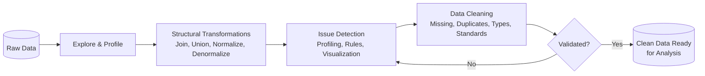
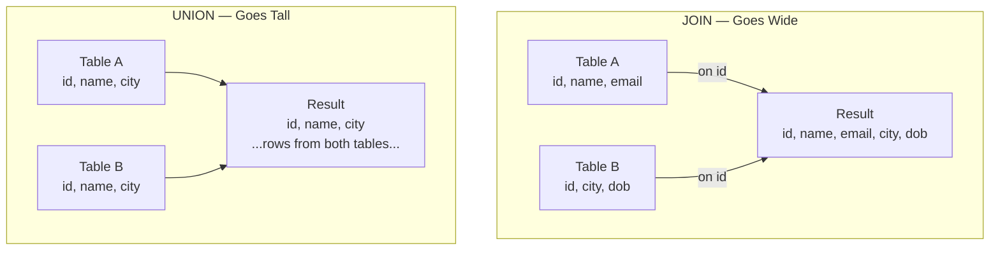

> **Course 1:** Introduction to Data Engineering
> **Module 3:** Data Engineering Lifecycle

# Data Wrangling

## Overview

Raw data is rarely analytics-ready. Before it can be meaningfully analyzed, it must go through a series of transformations and cleansing activities. **Data wrangling** (also known as **data munging**) is an iterative process that encompasses data exploration, transformation, validation, and preparation — producing credible, accurate data for downstream analysis.



> Data wrangling is inherently **iterative** — cleaning often reveals new structural issues, and structural changes can introduce new anomalies. The loop continues until the data meets quality thresholds.

---

## Part 1: Structural Transformations

Structural transformations change the **form and schema** of data. This is necessary when combining data from multiple sources that arrive in different formats (e.g., a relational database and a Web API).

### Joins vs. Unions

The two most common structural transformations for combining data from multiple tables:



| Operation | What It Combines | Result |
|---|---|---|
| **Join** | Columns | Each row in the result contains columns from **both** source tables — sources are merged side by side |
| **Union** | Rows | Each row in the result comes from **one** source table — sources are stacked on top of each other |

> **Simple rule:** Joins go **wide** (more columns). Unions go **tall** (more rows).

#### Join Types Quick Reference

| Join Type | Returns |
|---|---|
| `INNER JOIN` | Only rows with matching keys in both tables |
| `LEFT JOIN` | All rows from the left table, matching rows from the right (nulls where no match) |
| `RIGHT JOIN` | All rows from the right table, matching rows from the left (nulls where no match) |
| `FULL OUTER JOIN` | All rows from both tables (nulls on either side where no match) |

### Normalization vs. Denormalization

| Operation | Purpose | Typical Use Case |
|---|---|---|
| **Normalization** | Removes unused data, reduces redundancy and inconsistency | Transactional systems (OLTP) with frequent insert, update, and delete operations |
| **Denormalization** | Combines multiple tables into a single table for faster querying | Reporting and analytics — normalized transactional data is denormalized before running analytical queries |

Normalization typically progresses through **normal forms** (1NF, 2NF, 3NF), each eliminating a specific class of redundancy. Denormalization intentionally reintroduces some redundancy to avoid expensive join operations at query time.

---

## Part 2: Data Cleaning

Cleaning tasks fix irregularities in data to produce credible, accurate analysis results.

### Step 1: Detection — Finding Issues Before Fixing Them

Before cleaning, issues must be identified. Detection methods include:

| Method | How It Helps | Common Tools |
|---|---|---|
| **Scripts and rules-based validation** | Define specific rules and constraints; validate data against them | Great Expectations, Pandas assertions, SQL `CHECK` constraints |
| **Data profiling** | Inspects source data to understand structure, content, and interrelationships; uncovers anomalies (nulls, duplicates, out-of-range values) | Pandas Profiling (ydata-profiling), Apache Spark profiling, custom summary stats |
| **Data visualization / statistical methods** | Helps spot outliers — e.g., plotting average income in a demographic dataset reveals extreme values | Matplotlib, Seaborn, Tableau, scatter plots, box plots, z-score analysis |

### Step 2: Cleaning — Common Data Issues and How to Address Them

#### Missing Values

Missing values can cause unexpected or biased results. Three courses of action:

| Approach | When to Use | Trade-off |
|---|---|---|
| **Filter out** the records with missing values | When missing records won't significantly impact the analysis | Reduces sample size |
| **Source the missing data** externally | When the missing field is intrinsic to the use case (e.g., missing age in a demographics study) | Requires time, cost, and a reliable external source |
| **Imputation** (mean, median, mode) | Calculate the missing value using statistical methods | Can introduce bias if missingness is not random |

> The right approach depends entirely on the use case — there is no universal default. Understanding *why* data is missing (MCAR, MAR, MNAR) helps choose the appropriate strategy.

#### Duplicate Data

Repeated data points must be **removed**. Duplicates skew aggregations, counts, and statistical results. Deduplication strategies include:

- Exact-match deduplication — all columns identical
- Fuzzy matching — near-duplicates based on similarity thresholds (e.g., Levenshtein distance)

#### Irrelevant Data

Data that does not fit the context of the use case should be excluded. For example, contact numbers are irrelevant when analyzing the general health of a population segment. Irrelevant data introduces noise without informational value.

#### Data Type Conversion

Values must be stored as the correct data type for their field:

- Numbers stored as numerical types (not strings)
- Dates stored as date types (not plain text)
- Categories stored as categorical / enum types where supported

#### Standardization

Inconsistent formatting must be unified:

| Issue | Example | Fix |
|---|---|---|
| String case inconsistency | Mix of "New York", "new york", "NEW YORK" | `.str.title()` or `.str.lower()` |
| Date format inconsistency | "01/15/2024" vs. "2024-01-15" | `pd.to_datetime()` with consistent format |
| Unit of measurement inconsistency | Miles vs. kilometers | Convert to a single unit via arithmetic |

#### Syntax Errors

Common syntax issues to fix:

- **Extra whitespace** — leading or trailing spaces in string fields (`.str.strip()`)
- **Typos** — misspelled values (catalog lookup or fuzzy match against a reference list)
- **Format inconsistencies** — e.g., "New York" vs. "NY" for the same field in different records

#### Outliers

Outliers are values vastly different from the rest of the dataset. Critically, outliers may or may not be errors:

| Scenario | Interpretation | Action |
|---|---|---|
| Age value of 5 in a voters database | **Incorrect data** — must be corrected | Investigate source; correct or remove |
| One person earning $1M in a group otherwise earning $100K–$200K | **Valid but extreme** — must be investigated and handled appropriately | Retain or cap depending on analytical goals |

> **Key distinction:** Not all outliers are errors. Always evaluate outliers in context before deciding whether to correct, exclude, or retain them. Domain knowledge is essential.

#### Python Example — Basic Cleaning Pipeline

```python
import pandas as pd
import numpy as np

df = pd.read_csv("raw_data.csv")

# Detection: summary stats and null counts
print(df.info())
print(df.isnull().sum())

# Missing values: impute numeric columns with median
for col in df.select_dtypes(include=[np.number]).columns:
    df[col].fillna(df[col].median(), inplace=True)

# Duplicates: remove exact duplicates
df.drop_duplicates(inplace=True)

# Data type conversion: parse dates
df["event_date"] = pd.to_datetime(df["event_date"], format="%Y-%m-%d")

# Standardization: uniform text case
df["city"] = df["city"].str.strip().str.title()

# Outlier detection via z-score
from scipy import stats
z_scores = np.abs(stats.zscore(df.select_dtypes(include=[np.number])))
df = df[(z_scores < 3).all(axis=1)]  # remove rows with any z-score > 3
```

---

## Key Takeaways

- **Data wrangling** is an iterative process covering exploration, transformation, validation, and preparation of raw data for analysis.
- **Joins** combine columns (horizontal merge); **Unions** combine rows (vertical stack).
- **Normalization** reduces redundancy for transactional systems; **Denormalization** optimizes for analytical query speed.
- Data cleaning begins with **detection** — using profiling, rules validation, and visualization to identify issues before attempting fixes.
- Common data issues include: **missing values**, **duplicates**, **irrelevant data**, **wrong data types**, **non-standardized formats**, **syntax errors**, and **outliers**.
- **Missing values** can be handled by filtering, sourcing externally, or imputation — the right choice depends on the use case.
- **Outliers are not automatically errors** — context determines whether they should be corrected, excluded, or retained.

---

## Glossary

| Term | Definition |
|---|---|
| **Data Wrangling / Data Munging** | Iterative process of transforming and cleaning raw data into a structured, analysis-ready form |
| **Join** | Combines tables horizontally by matching on a common key (adds columns) |
| **Union** | Combines tables vertically by stacking rows (adds rows) |
| **Normalization** | Process of reducing redundancy by splitting tables into related, well-structured relations |
| **Denormalization** | Process of combining tables to reduce joins at the cost of some redundancy |
| **Imputation** | Replacing missing values with substituted values (mean, median, mode, or model-based) |
| **Data Profiling** | Examination of source data to understand its structure, content, and quality |
| **Outlier** | A value that deviates significantly from the rest of the dataset — may be an error or a valid extreme |
| **MCAR / MAR / MNAR** | Missing Completely At Random, Missing At Random, Missing Not At Random — taxonomies of missing data mechanisms |
