> **Course 1:** Introduction to Data Engineering
> **Module 3:** Data Engineering Lifecycle

# Factors for Selecting and Designing Data Stores

## Overview

A **data store** (or data repository) is any system used to collect, organize, and isolate data for business operations, reporting, or analysis. It may take the form of a database, data warehouse, data mart, big data store, or data lake. Selecting and designing the right data store is one of the most consequential decisions in data engineering — a well-designed repository is essential for scalability and performance under high workloads.

This lesson covers the five primary factors that guide data store selection and design:

1. **Type of data** — structured vs. semi-structured / unstructured
2. **Volume of data** — scale and velocity requirements
3. **Intended use of data** — transactional vs. analytical workloads
4. **Storage considerations** — performance, availability, integrity, recoverability
5. **Privacy, security, and governance** — regulatory compliance and defense-in-depth

The following decision flowchart summarizes how these factors map to data store types:

```mermaid
flowchart TD
    A[What type of data?] --> B{Structured?}
    B -->|Yes| C[Relational Database<br>RDBMS]
    B -->|No| D[Which NoSQL sub-type?]

    D --> E{Query pattern?}
    E -->|Simple lookups, caching| F[Key-Value Store]
    E -->|Flexible, nested documents| G[Document Store]
    E -->|Large-scale analytical reads| H[Column Store]
    E -->|Relationship-heavy traversals| I[Graph Database]

    C --> J{Volume & velocity?}
    J -->|Moderate| K[Standard RDBMS]
    J -->|High volume, raw / schema-less| L[Data Lake]
    J -->|High volume + high velocity| M[Big Data Repository]

    K --> N{Intended use?}
    L --> N
    M --> N
    F --> N
    G --> N
    H --> N
    I --> N

    N --> O[Transactional &#40;OLTP&#41; - Normalize]
    N --> P[Analytical &#40;OLAP&#41; - Denormalize]

    O --> Q[Design for: Performance, Availability,<br>Integrity, Recoverability]
    P --> Q

    Q --> R[Apply security & governance<br>from the start]
```

> **How to read this diagram:** Start at the top with the nature of your data. Follow the branches through volume, query pattern, and intended use. Every path converges at the bottom on storage properties and security — non-negotiable design concerns regardless of the technology chosen.

---

## Factor 1: Type of Data

The nature of your data determines which class of database is appropriate.

| Data Type | Database Type | Best For |
|---|---|---|
| **Structured** (well-defined schema, tabular) | Relational (RDBMS) | Transactions, structured queries |
| **Semi-structured / Unstructured** (schema-less, free-form) | Non-relational (NoSQL) | Flexible, diverse data types |

### NoSQL Sub-Types and Their Trade-offs

Non-relational databases are further divided into four types, each optimized for different query patterns:

| NoSQL Type | Best For | Avoid When |
|---|---|---|
| **Key-Value** | Fast lookups, caching | Complex queries needed |
| **Document** | Flexible, nested data | Complex multi-operation transactions |
| **Column** | Large-scale analytical reads | Frequent updates to individual records |
| **Graph** | Highly connected, relationship-heavy data | High-volume transactional analytics |

> **Key principle:** Choosing the wrong database type for your query pattern leads to performance bottlenecks. Match the database model to how the data will be *accessed*, not just how it is *structured*.

### Schema-on-Read vs. Schema-on-Write

A related design choice that depends on data type is when to apply the schema:

- **Schema-on-write** (RDBMS): The schema is enforced at ingestion time. Data that does not conform is rejected. Provides strong consistency guarantees.
- **Schema-on-read** (Data Lakes, many NoSQL stores): Raw data is stored as-is; the schema is applied at query time. Offers flexibility for exploratory analysis but places the burden of interpretation on the consumer.

---

## Factor 2: Volume of Data

The scale of data directly influences which storage architecture is appropriate.

| Volume Scenario | Recommended Store |
|---|---|
| Large volumes of **raw data in native format**, no predefined schema | **Data Lake** |
| High-volume **and** high-velocity data requiring distributed processing | **Big Data Repository** |

### How Big Data Stores Work

Big data stores split large files across multiple computers, enabling:

- **Parallel access** to data across nodes
- **Parallel computation** — processing runs on each node where data resides, rather than moving data to a central processor

This pattern, often referred to as **shared-nothing architecture**, is the foundation of frameworks like Apache Hadoop and Spark.

---

## Factor 3: Intended Use of Data

How data will be *used* is as important as what it *is*. Key usage considerations include:

- Number and frequency of transactions
- Type of operations (read-heavy vs. write-heavy)
- Required response times
- Backup and recovery requirements

### Transactional vs. Analytical Systems

| System Type | Purpose | Design Priority |
|---|---|---|
| **Transactional (OLTP)** | Capture high-volume, real-time transactions | High-speed read, write, and update |
| **Analytical (OLAP)** | Run complex queries on large historical datasets | Fast response to complex queries |

**OLTP** (Online Transaction Processing) systems drive the day-to-day operations of an organization — order entry, banking transactions, user authentication. **OLAP** (Online Analytical Processing) systems power business intelligence, reporting, and data science workloads.

### Scalability

The intended use also drives **scalability** requirements — the data store's ability to handle growth in data volume, concurrent workloads, and number of users must be provisioned for at design time.

Scalability generally takes two forms:

- **Vertical scaling (scale up):** Add more power (CPU, RAM, disk) to a single machine. Simpler but has hard physical limits.
- **Horizontal scaling (scale out):** Add more machines to a distributed cluster. More complex but virtually unlimited.

### Normalization Considerations

| Context | Normalization Approach |
|---|---|
| **Transactional systems** | Normalize — reduces redundancy, optimizes storage, simplifies maintenance |
| **Analytical systems** | Denormalize — improves query performance by reducing joins |

> **Note:** Normalization is beneficial for transactional data but can introduce performance issues in analytical systems that need to aggregate large amounts of data quickly. The trade-off is between **storage efficiency** (normalized) and **query speed** (denormalized).

---

## Factor 4: Storage Considerations

Four core storage properties must be designed for explicitly:

| Property | Description |
|---|---|
| **Performance** | **Throughput** (read/write rate) and **Latency** (time to access a specific location in storage) |
| **Availability** | Data must be accessible at all times — no downtime acceptable |
| **Integrity** | Data must be protected from corruption, loss, and external attack |
| **Recoverability** | The system must be able to restore data after failures or disasters |

> Schema design, indexing, and partitioning strategies all directly influence performance and should be aligned with how the data will be queried.

**Throughput vs. Latency** is a classic engineering trade-off:
- **Throughput:** The amount of data that can be read or written per second (e.g., MB/s, queries per second).
- **Latency:** The time it takes to complete a single operation (e.g., milliseconds per query).

Designs that maximize throughput (bulk loading, columnar storage) often increase latency for individual lookups, and vice versa.

---

## Factor 5: Privacy, Security, and Governance

Data security is not an afterthought — it must be **built into the design from the start**. Adding security measures after the fact results in fragmented, patchwork solutions.

### Security Strategy: A Layered Approach

- **Access control** — who can read, write, or modify data (e.g., role-based access control, attribute-based policies)
- **Multizone encryption** — data protected at rest (encrypted storage) and in transit (TLS)
- **Data management** — policies for data lifecycle, retention, and secure deletion
- **Monitoring systems** — continuous oversight for anomalies and breaches (audit logs, intrusion detection)

### Key Regulatory Frameworks

| Regulation | Scope |
|---|---|
| **GDPR** | Personal data of EU residents |
| **CCPA** | Personal data of California residents |
| **HIPAA** | Health information in the US |

These regulations restrict the ownership, use, and management of personal and sensitive data. Compliance requires controlled data flow and multiple data protection techniques applied consistently. Key operational requirements include:

- **Data classification** — tagging data by sensitivity level
- **Consent management** — tracking user permission for data use
- **Right to deletion / right to be forgotten** — the ability to remove an individual's data on request
- **Breach notification** — mandatory reporting timelines for security incidents

---

## Key Takeaways

- A data store can be a database, data warehouse, data mart, big data store, or data lake — the right choice depends on the data and its intended use.
- **Structured data → RDBMS; Semi/unstructured data → NoSQL** — and within NoSQL, the sub-type must match the query pattern.
- **Data lakes** suit large volumes of raw, schema-less data; **big data repositories** suit high-velocity, distributed workloads.
- **Transactional systems** prioritize speed of read/write; **analytical systems** prioritize complex query performance.
- **Normalization** benefits transactional systems but can hurt analytical performance — denormalization is often preferred for OLAP.
- Storage design must account for **performance, availability, integrity, and recoverability**.
- **Privacy and security must be designed in from the start** — not retrofitted later — with awareness of applicable regulations (GDPR, CCPA, HIPAA).

---

## Glossary

| Term | Definition |
|---|---|
| **OLTP** | Online Transaction Processing — systems optimized for high-volume, real-time transactional workloads |
| **OLAP** | Online Analytical Processing — systems optimized for complex queries over large historical datasets |
| **RDBMS** | Relational Database Management System — enforces a fixed schema and supports SQL |
| **NoSQL** | A broad class of non-relational databases optimized for flexible schemas and scale-out architectures |
| **Throughput** | The rate at which data is read or written (e.g., MB/s, QPS) |
| **Latency** | The time to complete a single operation (e.g., ms per query) |
| **Schema-on-write** | Schema validated at ingestion time (RDBMS approach) |
| **Schema-on-read** | Schema applied at query time (Data Lake / NoSQL approach) |
