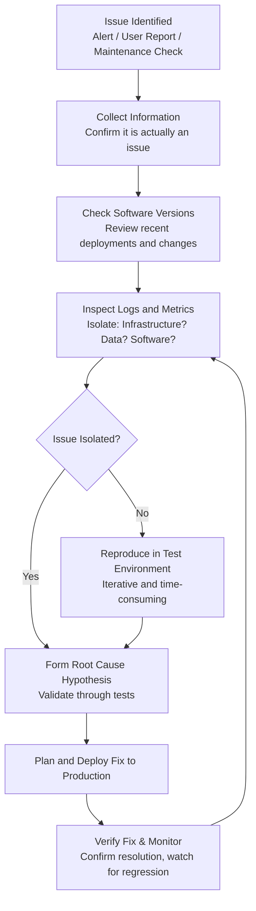

> **Course 1:** Introduction to Data Engineering
> **Module 3:** Data Engineering Lifecycle

# Performance Tuning and Troubleshooting

## Overview

Monitoring and optimizing systems and data flows for performance and availability is a core responsibility of a data engineer. Performance concerns span the entire data engineering lifecycle — from data pipelines and databases to applications, queries, and scheduled jobs. This lesson covers performance threats, metrics, troubleshooting steps, database optimization techniques, and monitoring and maintenance strategies.

---

## Part 1: Data Pipeline Performance

### Common Performance Threats

Data pipelines move data from source to destination through multiple systems, applications, and processes — often using a complex combination of tools. Common performance threats include:

| Threat | Description |
|---|---|
| **Scalability** | System struggles to handle increasing data volumes and workloads |
| **Application failures** | One or more components in the pipeline crash or error out |
| **Scheduled job issues** | Jobs don't start on schedule, wait on unresolved dependencies, run out of sequence, or fail to run at all |
| **Tool incompatibilities** | Conflicts between the variety of tools handling different tasks in the pipeline |

### Performance Metrics for Data Pipelines

To benchmark and evaluate pipeline performance, the following metrics must be tracked:

| Metric | Description |
|---|---|
| **Latency** | Time it takes for a service to fulfill a request |
| **Failures** | Rate at which a service fails |
| **Resource utilization** | How much CPU, memory, and disk is being consumed, and in what patterns |
| **Traffic** | Number of user requests received in a given period |

These four metrics are often referred to as the **Four Golden Signals** of monitoring (Google SRE).

---

## Part 2: Troubleshooting Performance Issues

When a performance issue is identified — whether through an alerting system, a user report, or a maintenance check — the troubleshooting process generally follows these steps:



### Step-by-Step Breakdown

1. **Collect information** — Gather as much context as possible. First, confirm the observed behavior is actually an issue and not expected behavior.
2. **Check software versions and recent changes** — Verify all components are on the correct versions. If there were recent deployments, investigate whether those changes could be connected to the issue.
3. **Inspect logs and metrics** — Check error messages, network load, memory utilization, and CPU utilization at the time of failure to isolate whether the issue is related to infrastructure, data, software, or a combination.
4. **Reproduce in a test environment** — If logs don't isolate the issue, reproduce it in a controlled environment. This is iterative and can be time-consuming.
5. **Validate the root cause hypothesis** — Once a hypothesis is formed, validate it through a series of tests.
6. **Deploy the fix** — Plan and move the validated fix to production per the team's process.
7. **Verify and monitor** — After deployment, confirm the fix resolved the issue and watch for regressions.

---

## Part 3: Database Performance Optimization

### Database Performance Metrics to Monitor

| Metric | Description |
|---|---|
| **System outages** | Unplanned downtime affecting availability |
| **Capacity utilization** | How much storage and compute is being used |
| **Application slowdown** | Degraded response times experienced by applications |
| **Query performance** | Speed and efficiency of queries being executed |
| **Conflicting activities** | Multiple users and batch processes competing for the same resources simultaneously |

### Best Practices for Database Optimization

#### Capacity Planning

The process of determining the **optimal hardware and software resources** required for performance as load fluctuates day-to-day. Capacity planning also accounts for **future growth requirements** — not just current load.

#### Database Indexing

Indexing allows the database to **quickly locate data without scanning every row**.

- Minimizes the number of disk accesses required when a query is processed
- Significantly speeds up read-heavy query workloads

| Index Type | Best For | Considerations |
|---|---|---|
| **B-tree** | General purpose, equality and range queries | Default in most RDBMSes; balanced tree structure |
| **Hash** | Exact-match lookups | Not suitable for range queries (`<`, `>`, `BETWEEN`) |
| **Bitmap** | Low-cardinality columns (e.g., gender, status flags) | Efficient for complex `WHERE` with `AND`/`OR` on few distinct values |
| **Clustered** | Primary key lookups | Determines physical row order; one per table |

```sql
-- Create an index to speed up queries filtering on dealer_area
CREATE INDEX idx_dealer_area ON used_cars(dealer_area);

-- After creating, queries like this use the index:
SELECT * FROM used_cars WHERE dealer_area = 'North';

-- Check query plan (PostgreSQL)
EXPLAIN ANALYZE
SELECT AVG(price) FROM used_cars WHERE dealer_area = 'North';
```

> **Indexing trade-off:** Indexes speed up reads but slow down writes (`INSERT`, `UPDATE`, `DELETE`) because the index must be updated with every write. Only index columns that are actually used in `WHERE`, `JOIN`, and `ORDER BY` clauses.

#### Database Partitioning

Partitioning divides **very large tables into smaller, individual tables**.

- Queries run faster because they access a smaller portion of the data
- Improves overall **data manageability**

| Partition Strategy | How It Works | Example |
|---|---|---|
| **Range** | Divides by contiguous value ranges | `PARTITION BY RANGE (purchase_date)` — monthly partitions |
| **List** | Divides by discrete value lists | `PARTITION BY LIST (dealer_area)` — one partition per region |
| **Hash** | Distributes rows across partitions via hash function | `PARTITION BY HASH (customer_id)` — even distribution |

```sql
-- Range partitioning by purchase date (PostgreSQL)
CREATE TABLE used_cars_partitioned (
    id INT,
    make VARCHAR(50),
    price DECIMAL,
    purchase_date DATE
) PARTITION BY RANGE (purchase_date);

CREATE TABLE used_cars_2024_q1 PARTITION OF used_cars_partitioned
    FOR VALUES FROM ('2024-01-01') TO ('2024-04-01');

CREATE TABLE used_cars_2024_q2 PARTITION OF used_cars_partitioned
    FOR VALUES FROM ('2024-04-01') TO ('2024-07-01');
```

#### Database Normalization

A design technique that reduces inconsistencies caused by data redundancy and anomalies arising from insert, update, and delete operations.

- Impacts the efficiency and speed of querying, cleansing, and analyzing operations
- Most beneficial for transactional systems (OLTP)

---

## Part 4: Monitoring and Alerting Systems

Monitoring and alerting systems collect **quantitative data in real time** across the entire data engineering lifecycle — providing visibility into pipelines, platforms, databases, applications, tools, queries, and scheduled jobs.

### Types of Monitoring Tools

| Tool Type | What It Monitors | How It Works |
|---|---|---|
| **Database monitoring tools** | Database performance indicators | Takes frequent snapshots of performance metrics to track when and how issues begin — helps isolate root causes efficiently |
| **Application performance management (APM) tools** | Application request response times, error messages, and resource usage per process | Enables proactive resource allocation to improve performance before issues escalate |
| **Query performance monitoring tools** | Query throughput, execution performance, and resource utilization patterns | Supports better planning and allocation of resources for query-heavy workloads |
| **Job-level runtime monitoring** | Individual steps within long-running pipeline jobs | Breaks jobs into logical steps monitored for completion and time-to-completion — reduces the cost of catching errors late in a process |
| **Data volume monitoring** | Amount of data flowing through a pipeline | Assesses whether workload size is causing system slowdowns |

### Common Monitoring and Alerting Platforms

| Platform | Type | Key Feature |
|---|---|---|
| **Prometheus + Grafana** | Open-source metrics + dashboards | Time-series collection, flexible alerting, rich visualization |
| **Datadog** | SaaS monitoring platform | Full-stack observability — infra, APM, logs in one pane |
| **AWS CloudWatch** | Cloud-native (AWS) | Metrics, logs, and alarms for AWS services |
| **Apache Airflow** | Pipeline orchestration | Built-in DAG-level and task-level monitoring with retries |
| **pgBadger / pg_stat_statements** | PostgreSQL-specific | Slow query log analysis and execution statistics |

> **Why job-level monitoring matters:** Data pipelines often involve long-running processes. If errors are only caught at the end, the cost of failure is high. Breaking jobs into monitored steps allows issues to be caught and addressed earlier.

---

## Part 5: Maintenance Routines

Preventive maintenance routines generate data that helps identify systems and procedures responsible for faults and low availability. Maintenance can be triggered in two ways:

| Type | Description | Example |
|---|---|---|
| **Time-based** | Scheduled at pre-fixed time intervals | Weekly index rebuild, monthly vacuum |
| **Condition-based** | Triggered when a specific issue arises or when a performance decrease is detected | Auto-vacuum when dead tuple threshold exceeded |

Common database maintenance tasks include:

- **VACUUM** (PostgreSQL) / **OPTIMIZE TABLE** (MySQL) — reclaim storage from deleted rows
- **UPDATE STATISTICS** — refresh optimizer statistics for better query plans
- **Index rebuilds** — defragment indexes that have become fragmented over time
- **Archival / purging** — move old data to cold storage to reduce active table size

---

## Key Takeaways

- Data pipeline performance threats include **scalability issues, application failures, scheduling problems, and tool incompatibilities**.
- Pipeline performance is measured using **latency, failure rate, resource utilization, and traffic**.
- Troubleshooting follows a structured process: collect information → check versions and changes → inspect logs → reproduce if needed → validate hypothesis → deploy fix → verify.
- Database optimization relies on **capacity planning, indexing, partitioning, and normalization**.
- **Indexing** speeds up data retrieval; **partitioning** improves query speed and manageability by splitting large tables; **normalization** reduces redundancy and anomalies.
- Monitoring systems provide real-time visibility across pipelines, databases, applications, queries, and jobs.
- **Job-level monitoring** is critical for long-running pipeline processes — catching errors early reduces the cost of failure.
- Maintenance routines can be **time-based** (scheduled) or **condition-based** (triggered by detected issues).

---

## Glossary

| Term | Definition |
|---|---|
| **Four Golden Signals** | Latency, traffic, errors, and saturation — the key monitoring metrics from Google SRE |
| **B-tree Index** | Default balanced-tree index structure; efficient for equality and range queries |
| **EXPLAIN / EXPLAIN ANALYZE** | SQL commands that show the query execution plan and actual run times |
| **Partitioning** | Dividing a large table into smaller physical segments while retaining a single logical table |
| **Clustered Index** | Index that determines the physical order of rows in a table; one per table |
| **VACUUM** | PostgreSQL process that reclaims storage occupied by dead tuples |
| **APM** | Application Performance Management — tools that monitor application response times and resource usage |
| **Capacity Planning** | Determining the optimal hardware/software resources for current and anticipated future load |
