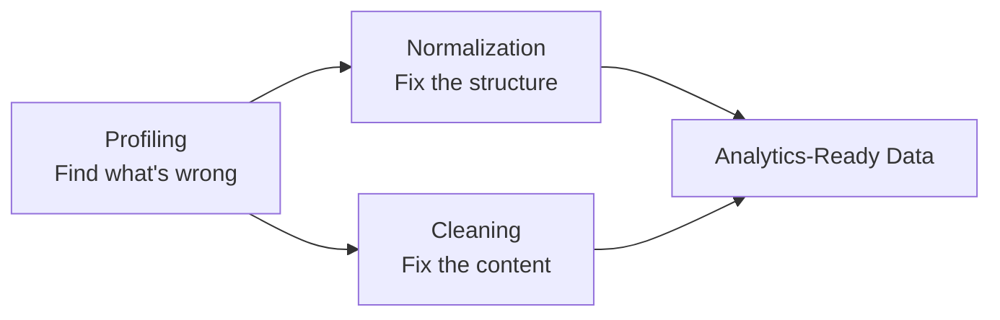

> **Course 1:** Introduction to Data Engineering
> **Module 3:** Data Engineering Lifecycle

# Q&A: What is the Difference Between Cleaning, Normalization, and Profiling?

## Question

> *What is the difference between cleaning, normalization, and profiling?*

---

## Answer

These three concepts all relate to data quality, but they serve different purposes and happen at different stages of the wrangling process.

---

## The Short Version

| Concept | What It Is | What It Does |
|---|---|---|
| **Profiling** | Inspection | Examines data to find what problems exist — no changes made |
| **Normalization** | Structural redesign | Reorganizes the database schema to eliminate redundancy |
| **Cleaning** | Record-level correction | Fixes specific errors in individual data values and records |

---

## Profiling — Finding Problems

Profiling is the **first step** — you run it before doing anything else. It inspects the source data to understand:

- Its structure and schema
- The content of its fields
- Interrelationships between fields and tables
- Anomalies such as nulls, duplicates, or out-of-range values

**Nothing changes.** Profiling is purely observational — it produces a report of what's wrong so you know what to fix.

> Think of it as a **health check** before treatment.

---

## Normalization — Fixing the Structure

Normalization operates at the **database design level** — it restructures how tables and relationships are organized, not the individual values within them. Its goals are:

- Remove unused or redundant data
- Eliminate inconsistency caused by data being duplicated across multiple tables
- Optimize storage

**Example:** If a customer's address is stored in both an `orders` table and a `customers` table, normalization would remove it from `orders` and link back to `customers` — one source of truth.

> Think of it as **redesigning the filing system** so nothing is filed in two places at once.

---

## Cleaning — Fixing the Content

Cleaning operates at the **record and value level** — it corrects specific errors in the actual data, not the structure. It addresses issues such as:

- Missing values (filter, source externally, or impute)
- Duplicate records
- Irrelevant data
- Wrong data types (number stored as text)
- Inconsistent formats (date as "01/15/2024" in one row, "2024-01-15" in another)
- Syntax errors (extra whitespace, typos, abbreviation vs. full form)
- Outliers that are incorrect

**Example:** A `date_of_birth` field containing the value `"N/A"` instead of a date — cleaning fixes that specific record.

> Think of it as **correcting errors in the individual files**, not the filing system itself.

---

## How They Work Together

In practice, these three activities form a natural sequence:

1. **Profile first** — understand what problems exist
2. **Normalize** — fix structural/design-level issues (redundancy, schema)
3. **Clean** — fix content-level issues (bad values, wrong formats, missing data)

---

## Key Takeaway

- **Profiling** = *diagnose* (what's wrong?)
- **Normalization** = *restructure* (fix how the database is organized)
- **Cleaning** = *correct* (fix the actual data values)

They are complementary, not interchangeable — profiling tells you *what* to fix, normalization and cleaning are two different categories of *how* to fix it.
