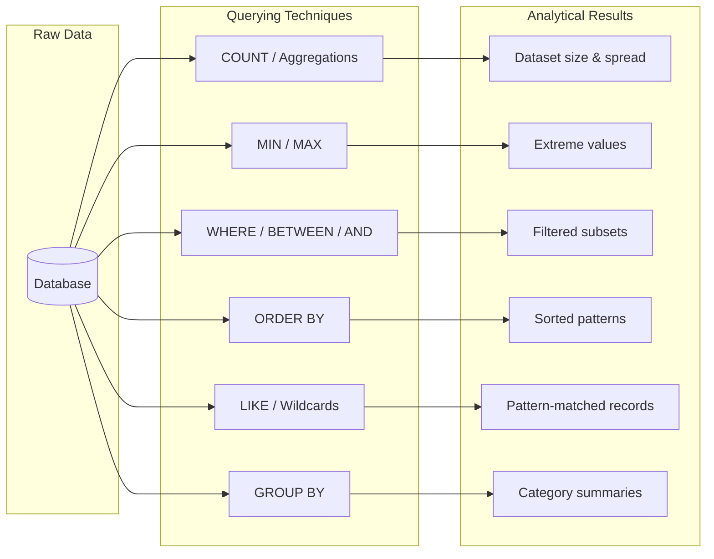

> **Course 1:** Introduction to Data Engineering
> **Module 3:** Data Engineering Lifecycle

# Querying and Analyzing Data

## Overview

Query languages are the primary tool for accessing and understanding data stored in a database. This lesson covers the foundational querying techniques used for data analysis — applicable to SQL (the standard for RDBMSes) as well as SQL-like languages used in NoSQL systems such as Cassandra CQL and Cypher for Neo4J, and APIs that can be used to query data.

The core techniques covered are:

1. Counting and Aggregating
2. Identifying Extreme Values
3. Slicing Data
4. Sorting Data
5. Filtering Patterns
6. Grouping Data



---

## Technique 1: Counting and Aggregating

### Counting Records

The first step when approaching a new dataset is understanding how much data you have.

```sql
-- Count total number of rows in a dataset
SELECT COUNT(*) FROM used_cars;
-- Result: 15 records

-- Count the number of unique car dealers
SELECT COUNT(DISTINCT dealer_id) FROM used_cars;
-- Result: 8 unique dealers
```

### Aggregation Functions

Aggregation functions summarize data from different perspectives:

| Function | Purpose | Example Use |
|---|---|---|
| `SUM()` | Total of a numeric column | Total revenue from all car sales |
| `AVG()` | Average value of a numeric column | Average cost of a used car |
| `STDDEV()` | Measures how spread out values are | How varied car prices are across the dataset |

```sql
-- Calculate average cost of used cars
SELECT AVG(price) FROM used_cars;
-- Result: ~$6,000

-- Measure spread of prices
SELECT STDDEV(price) FROM used_cars;
-- Result: >$11,000 (high spread — most cars under $2,000 but two records at $25,000+)
```

> **Why STDDEV matters:** The average alone can be misleading. In this dataset, the average price is ~$6,000, but most records are under $2,000 and a few outliers exceed $25,000. A standard deviation of $11,000+ reveals this wide spread — something the average alone would hide.

---

## Technique 2: Identifying Extreme Values

Extreme value functions help you find the highest and lowest values in a column.

| Function | Purpose |
|---|---|
| `MAX()` | Returns the maximum value in a column |
| `MIN()` | Returns the minimum value in a column |

```sql
-- Find the highest amount spent by a customer
SELECT MAX(price) FROM used_cars;
-- Result: $37,000

-- Find the lowest amount spent by a customer
SELECT MIN(price) FROM used_cars;
-- Result: $1,000
```

---

## Technique 3: Slicing Data

Slicing retrieves a subset of data based on specific conditions — filtering rows to only those that meet one or more criteria.

```sql
-- Retrieve customers who spent between $1,000 and $2,000
SELECT * FROM used_cars
WHERE price BETWEEN 1000 AND 2000;

-- Retrieve customers in a specific area who spent between $1,000 and $2,000
SELECT * FROM used_cars
WHERE price BETWEEN 1000 AND 2000
AND dealer_area = 'North';
```

> Slicing supports multiple conditions combined with operators like `AND` and `OR`, allowing precise targeting of the data subset you need.

### WHERE vs. HAVING

Both filter rows, but at different stages of query execution:

| Clause | Filters | Applied When |
|---|---|---|
| `WHERE` | Individual rows | Before grouping |
| `HAVING` | Groups | After `GROUP BY` |

```sql
-- WHERE: filter rows before aggregation
SELECT dealer_area, AVG(price)
FROM used_cars
WHERE price > 0
GROUP BY dealer_area;

-- HAVING: filter groups after aggregation
SELECT dealer_area, AVG(price) AS avg_price
FROM used_cars
GROUP BY dealer_area
HAVING AVG(price) > 5000;
```

---

## Technique 4: Sorting Data

Sorting arranges data in a meaningful order to make patterns easier to spot.

```sql
-- Sort car sales by date of purchase to identify festival-season spikes
SELECT * FROM used_cars
ORDER BY purchase_date ASC;

-- Sort by price in descending order (highest first)
SELECT * FROM used_cars
ORDER BY price DESC;
```

`ORDER BY` supports both **ascending (ASC)** and **descending (DESC)** ordering. Multiple columns can be specified:

```sql
-- Sort by area first, then by price within each area
SELECT * FROM used_cars
ORDER BY dealer_area ASC, price DESC;
```

---

## Technique 5: Filtering Patterns

The `LIKE` operator enables **partial matching** — useful when you know only part of a value.

Unlike the `=` (EQUAL TO) operator, which requires an exact match, `LIKE` allows you to specify a pattern using **wildcard characters**:

| Wildcard | Meaning | Example |
|---|---|---|
| `%` | Matches any sequence of characters (zero or more) | `'560%'` matches "56001", "56002" |
| `_` | Matches any single character | `'A_'` matches "AB", "AC" but not "ABC" |

```sql
-- Find all customers whose pincode starts with '560'
-- (first 3 digits are known, last 2 vary by area)
SELECT * FROM used_cars
WHERE pincode LIKE '560%';
```

> **Use case:** When the first three digits of a pincode identify a region but the last two digits vary per sub-area, `LIKE '560%'` returns all records in that region regardless of the sub-area suffix.

---

## Technique 6: Grouping Data

`GROUP BY` aggregates data into groups based on the values in one or more columns — essential for summarizing data by category.

```sql
-- Find the total amount spent by customers, grouped by pincode
SELECT pincode, SUM(price) AS total_spent
FROM used_cars
GROUP BY pincode;

-- Group by multiple columns with HAVING filter
SELECT dealer_area, make, AVG(price) AS avg_price, COUNT(*) AS num_sales
FROM used_cars
GROUP BY dealer_area, make
HAVING COUNT(*) >= 2
ORDER BY avg_price DESC;
```

> **Common pattern:** `GROUP BY` is almost always paired with an aggregation function (`SUM`, `COUNT`, `AVG`, etc.) — you group the rows and then aggregate within each group. Any column in the `SELECT` that is not an aggregate must appear in the `GROUP BY` clause.

---

## SQL Query Execution Order

Understanding the logical order in which SQL clauses are evaluated helps avoid common mistakes:

| Order | Clause | Purpose |
|---|---|---|
| 1 | `FROM` / `JOIN` | Identify source tables and relationships |
| 2 | `WHERE` | Filter individual rows |
| 3 | `GROUP BY` | Group rows into categories |
| 4 | `HAVING` | Filter groups |
| 5 | `SELECT` | Choose columns and compute aggregates |
| 6 | `ORDER BY` | Sort the result |
| 7 | `LIMIT` / `OFFSET` | Paginate the result |

This is why `WHERE` cannot reference aggregated columns (they don't exist yet), and why `HAVING` exists.

---

## Querying Techniques — Summary Reference

| Technique | Key Function / Operator | Purpose |
|---|---|---|
| **Counting** | `COUNT()`, `DISTINCT()` | Count total rows or unique values |
| **Aggregation** | `SUM()`, `AVG()`, `STDDEV()` | Summarize numeric columns |
| **Extreme Values** | `MAX()`, `MIN()` | Find highest and lowest values |
| **Slicing** | `WHERE`, `BETWEEN`, `AND` / `OR` | Filter rows by condition(s) |
| **Sorting** | `ORDER BY` | Arrange data in ascending or descending order |
| **Pattern Filtering** | `LIKE`, `%`, `_` | Partial matching on string values |
| **Grouping** | `GROUP BY`, `HAVING` | Aggregate data by category and filter groups |

---

## Key Takeaways

- SQL querying techniques are the foundation of data analysis — they apply not only to relational databases but also to NoSQL query languages (CQL, Cypher) and APIs.
- **COUNT + DISTINCT** is a quick way to assess dataset size and uniqueness of values.
- **STDDEV** adds analytical depth beyond averages — it reveals how spread out data is, which averages alone can obscure.
- **Slicing** with `WHERE` and multiple conditions allows precise targeting of data subsets.
- **ORDER BY** makes temporal and ranked patterns visible.
- **LIKE** with wildcards enables pattern-based filtering when exact values are unknown.
- **GROUP BY** paired with aggregation functions is essential for category-level summarization.

---

## Glossary

| Term | Definition |
|---|---|
| **Aggregate Function** | A function that computes a single value from multiple rows (`SUM`, `AVG`, `COUNT`, `MIN`, `MAX`, `STDDEV`) |
| **Cardinality** | The number of unique values in a column |
| **CQL** | Cassandra Query Language — SQL-like syntax for Apache Cassandra |
| **Cypher** | Declarative graph query language for Neo4J |
| **Execution Order** | The logical sequence in which SQL clauses are evaluated (`FROM` → `WHERE` → `GROUP BY` → `HAVING` → `SELECT` → `ORDER BY` → `LIMIT`) |
| **Wildcard** | A character used in pattern matching — `%` (any sequence) and `_` (single character) in SQL |
