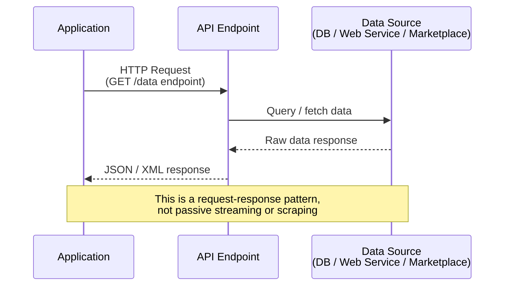

> **Course 1:** Introduction to Data Engineering
> **Module 3:** Data Engineering Lifecycle

# Quiz Review: Data Collection and Wrangling Tools — Weak Areas

## Overview

Two concepts from the graded quiz that need reinforcement: how APIs gather data, and which tool specifically offers discover, cleanse, and transform with built-in operations.

---

## Q1 — How is data gathered using APIs?

**Correct Answer:** APIs are invoked from applications to access databases, web services, data marketplaces, and other such data endpoints for gathering data

**Explanation:**

APIs work by being **called (invoked) by an application** that needs data. That application sends a request to an **endpoint** — which can be a database, a web service, or a data marketplace — and receives data back in response.

The other answer options each describe a *different* data gathering method:

| Answer Option | Actual Method |
|---|---|
| Aggregating constant streams from IoT devices, instruments, GPS | **Data Streams** |
| Capturing refreshed data from forums and news sites | **RSS Feeds** |
| **Invoking endpoints to access databases, web services, marketplaces** | **APIs** ✓ |
| Downloading specific data from web pages based on parameters | **Web Scraping** |

> **Memory anchor:** APIs are a *request-response* mechanism — an application asks an endpoint for data and gets it back. They are not passive (like RSS feeds) or scraping-based (like web harvesting). Think of an API as a waiter — your application places an order, the endpoint fulfills it.

---

## Q2 — Which tool allows you to discover, cleanse, and transform data with built-in operations?

**Correct Answer:** Watson Studio Refinery (IBM Data Refinery)

**Explanation:**

The phrase **"discover, cleanse, and transform with built-in operations"** is the specific language used to describe **IBM Data Refinery** (available via Watson Studio or Cloud Pak for Data). Each tool has its own distinct description — these are easy to confuse:

| Tool | Defining Description |
|---|---|
| **Watson Studio Refinery (IBM Data Refinery)** | **Discover, cleanse, and transform** data with built-in operations; auto-detects data types; enforces governance policies ✓ |
| **Google DataPrep** | Visually explore, clean, and prepare data; fully managed; auto-detects schemas and anomalies; suggests next steps |
| **OpenRefine** | Import/export across many formats (TSV, CSV, XLS, XML, JSON); menu-based; extend data with web services |
| **Trifacta Wrangler** | Clean and rearrange messy data into tables; export to Excel, Tableau, R; known for team collaboration |

> **Key distinction between Watson and DataPrep:** Both auto-detect schemas/types, but Watson Studio Refinery is the one described with "built-in operations" and automatic **governance policy enforcement** — that's its differentiator. Google DataPrep's differentiator is intelligent **next-step suggestions** and being fully managed with no infrastructure to install.
