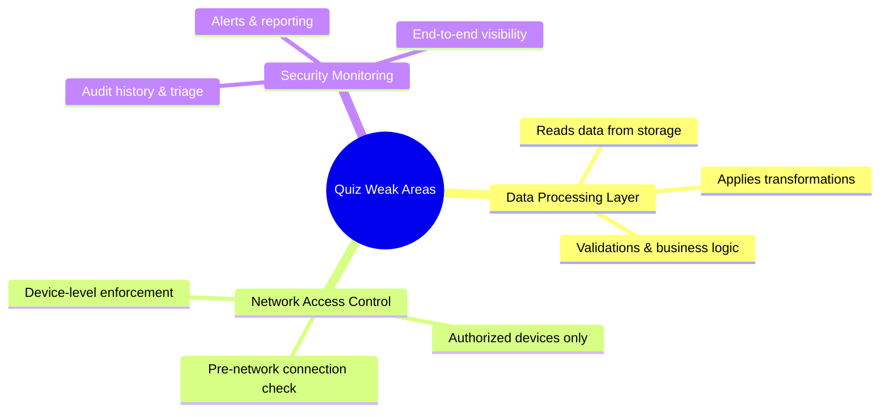

> **Course 1:** Introduction to Data Engineering
> **Module 3:** Data Engineering Lifecycle

# Quiz Review: Data Platforms and Security — Round 2 Weak Areas

## Overview

Three concepts from the graded quiz that need reinforcement: the Data Processing Layer's role, Network Access Control, and Security Monitoring systems.

---

## Q1 — Which step is intrinsic to the "Data Processing Layer"?

**Correct Answer:** Read data in batch or streaming modes from storage and apply transformations

**Explanation:**

The Processing Layer picks up where Storage & Integration left off — it *reads* data that has already been stored and *applies* transformations, validations, and business logic to it.

Full layer map for reference:

| Action | Layer |
|---|---|
| Transfer data from sources to the platform | **Data Ingestion / Collection Layer** |
| Transform and merge extracted data logically or physically | **Data Storage and Integration Layer** |
| **Read data from storage and apply transformations** | **Data Processing Layer** ✓ |
| Deliver processed data to data consumers | **Analysis and User Interface Layer** |

> **Watch the wording:** "Transform and merge" belongs to Storage & Integration (combining sources). "Apply transformations" belongs to Processing (validations, business logic). Both mention transformation — the difference is *what kind* and *at what stage*.

---

## Q2 — What is the role of Network Access Control (NAC)?

**Correct Answer:** To ensure endpoint security by allowing only authorized devices to connect to the network

**Explanation:**

NAC operates at the **device level** — it controls *what connects* to the network before any data is exchanged.

Full network security controls map:

| Control | Role |
|---|---|
| **Firewall** | Blocks unauthorized access to private networks from the internet |
| **Network Access Control (NAC)** | **Endpoint security — only authorized devices can connect** ✓ |
| **Network Segmentation** | Creates VLANs to segregate assets by security level |
| **Security Protocols** | Prevent attackers from intercepting data in transit |
| **IDS/IPS** | Inspect incoming traffic for intrusion attempts and vulnerabilities |

> **Memory anchor:** NAC = "Is this *device* allowed in?" — it's the checkpoint before you even get on the network. IDS/IPS = "Is this *traffic* suspicious?" — it watches what's already flowing in.

---

## Q3 — What do Security Monitoring and Intelligence systems do?

**Correct Answer:** Create an audit history for triage and compliance purposes

**Explanation:**

Security Monitoring and Intelligence systems are the **oversight and reporting layer** of a security strategy. Their specific functions are:

- Create a **complete audit history** for triage and compliance
- Generate **reports and alerts** that enable timely response to security violations
- Provide **end-to-end visibility** across the enterprise

The other answer options map to different controls entirely:

| Option | Actual Control |
|---|---|
| Ensure only authorized devices connect | **Network Access Control (NAC)** |
| Create VLANs to segregate assets | **Network Segmentation** |
| Ensure users access info based on role/privileges | **Authorization** (part of Data Security) |
| **Create audit history for triage and compliance** | **Security Monitoring and Intelligence** ✓ |

> **Key distinction:** Authorization controls *who can access what*. Security Monitoring *records and reports on what actually happened* — it's reactive visibility, not access control.

---

## Security Controls — Master Reference Table

Since security is a consistent weak area, here's a consolidated single-table reference across all controls:

| Control | Category | Role |
|---|---|---|
| **Firewalls** | Network | Block unauthorized internet access to private networks |
| **Network Access Control (NAC)** | Network | Allow only authorized devices to connect |
| **Network Segmentation** | Network | Create VLANs to isolate assets by security level |
| **Security Protocols (SSL/TLS)** | Network | Prevent interception of data in transit |
| **IDS/IPS** | Network | Inspect incoming traffic for intrusion attempts |
| **Authentication** | Data | Verify identity (passwords, tokens, biometrics) |
| **Authorization** | Data | Grant access based on role and privileges |
| **Encryption at Rest** | Data | Protect stored data from disclosure if lost or intercepted |
| **Encryption in Transit (HTTPS/TLS)** | Data | Protect data moving between systems |
| **Security Monitoring & Intelligence** | Enterprise | Audit history, alerts, and end-to-end visibility for compliance |
| **Threat Modeling** | Application | Identify weaknesses and attack patterns |
| **Secure Design & Coding** | Application | Mitigate risks at the architecture and code level |
| **Security Testing** | Application | Validate the app is free from known vulnerabilities before deployment |
