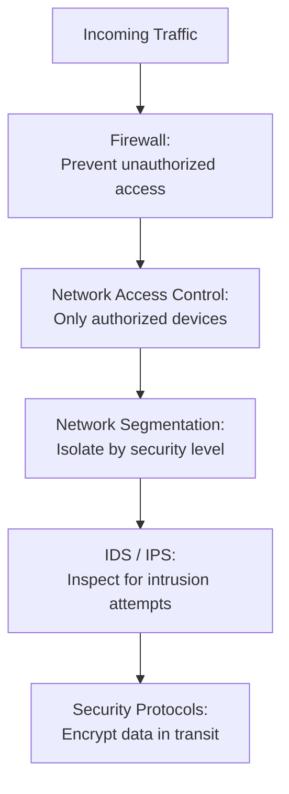

> **Course 1:** Introduction to Data Engineering
> **Module 3:** Data Engineering Lifecycle

# Quiz Review: Data Platforms, Data Stores, and Security — Weak Areas

## Overview

This document addresses the specific questions missed during the Data Platforms, Data Stores, and Security quiz. Each entry restates the question, identifies the correct answer, and clarifies the concept to close the knowledge gap.

---

## Q1 — Which step is intrinsic to the "Data Storage and Integration Layer"?

**Correct Answer:** Transform and merge extracted data, either logically or physically

**Explanation:**

Each layer of the data platform has a distinct, non-overlapping responsibility. The key to this question is knowing which action belongs to which layer:

| Action | Layer |
|---|---|
| Transfer data from sources to the platform (streaming/batch) | **Data Ingestion / Collection Layer** |
| **Transform and merge extracted data, logically or physically** | **Data Storage and Integration Layer** ✓ |
| Read data from storage and apply transformations | **Data Processing Layer** |
| Deliver processed data to data consumers | **Analysis and User Interface Layer** |

> **Common confusion:** "Apply transformations" sounds like it could belong to Storage & Integration, but in the platform architecture, the *Processing Layer* is where data validations, transformations, and business logic are applied. The Storage & Integration Layer's transformation role is specifically about **merging and integrating** data from multiple sources — structurally combining it for storage, not applying business logic.

---

## Q2 — Transactional systems need to be designed for faster response times to complex queries. True or False?

**Correct Answer:** False

**Explanation:**

This is a classic OLTP vs. OLAP distinction — the two system types have opposite design priorities:

| System Type | Primary Design Priority |
|---|---|
| **Transactional (OLTP)** | High-speed **read, write, and update** operations for high-volume transactions |
| **Analytical (OLAP)** | **Faster response times to complex queries** on large historical datasets |

```mermaid
flowchart LR
    subgraph OLTP["Transactional &#40;OLTP&#41;"]
        T1[High-volume point transactions]
        T2[Optimized for read/write speed]
        T3[Normalized schema]
    end

    subgraph OLAP["Analytical &#40;OLAP&#41;"]
        A1[Complex queries over history]
        A2[Optimized for aggregation speed]
        A3[Denormalized schema]
    end

    T1 -->|Feeds| A1
```

Faster response to *complex queries* is the requirement of **analytical systems**, not transactional ones. Transactional systems are optimized for *throughput and speed of individual operations* — not for running large, multi-step analytical queries.

---

## Q3 — What is the role of Intrusion Detection and Intrusion Prevention in network security?

**Correct Answer:** Inspect incoming network traffic for intrusion attempts and vulnerabilities

**Explanation:**

There are five distinct network security controls, each with a specific purpose. These are easy to mix up:

| Network Security Control | Purpose |
|---|---|
| **Firewall** | Prevent unauthorized access to private networks connected to the internet |
| **Network Access Control (NAC)** | Ensure endpoint security — only authorized devices can connect to the network |
| **Network Segmentation** | Create silos or VLANs to segregate assets by required security level |
| **Security Protocols** | Ensure attackers cannot tap into data while it is in transit |
| **Intrusion Detection / Prevention (IDS/IPS)** | **Inspect incoming traffic for intrusion attempts and vulnerabilities** ✓ |

> **Memory tip:** Think of IDS/IPS as the **surveillance camera at the door** — it watches what's coming in and flags anything suspicious. NAC is the **bouncer** — it decides who gets in at all. Network Segmentation is the **floor plan** — it determines which rooms each person can reach once inside.
