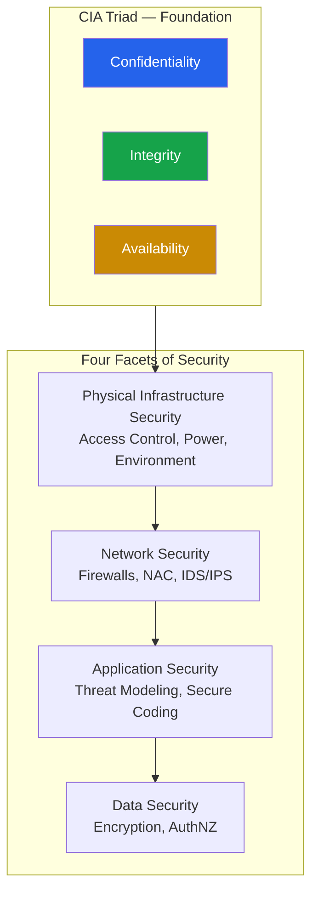

> **Course 1:** Introduction to Data Engineering
> **Module 3:** Data Engineering Lifecycle

# Security in Data Platforms

## Overview

Enterprise-level data platforms and repositories must tackle security across multiple layers. Security is not a single control or tool — it is a comprehensive strategy spanning physical infrastructure, networks, applications, and the data itself. This lesson covers the foundational security framework (the CIA Triad) and the four facets of security that apply to data platforms and data lifecycle management.

The following diagram shows how the four facets of security build on one another, with the CIA Triad as the unifying foundation:

> Each layer depends on the one beneath it. A breach in physical security renders network and application controls moot. The CIA Triad principles must be enforced at every layer.

---

## The CIA Triad: Foundation of Information Security

All security strategies — regardless of which facet they address — are anchored in three core principles known as the **CIA Triad**:

| Letter | Principle | Description |
|---|---|---|
| **C** | **Confidentiality** | Control unauthorized access to data and systems |
| **I** | **Integrity** | Validate that resources are trustworthy and have not been tampered with |
| **A** | **Availability** | Ensure authorized users can access resources when they need them |

> The CIA Triad applies universally — to infrastructure, network, application, and data security alike.

---

## The Four Facets of Security

### Facet 1: Physical Infrastructure Security

The physical security of the facilities that house IT systems is the foundational layer of any security strategy. For cloud computing, this extends to the cloud service provider's infrastructure.

**Key physical security measures:**

| Measure | Purpose |
|---|---|
| **Perimeter access control** | Authentication required for entry/exit, with round-the-clock surveillance |
| **Power redundancy** | Multiple feeds from independent utility providers, dedicated generators, and UPS battery backup |
| **Environmental controls** | Heating and cooling systems to manage temperature and humidity |
| **Location planning** | Facilities are never placed in flood plains; earthquake-prone regions require earthquake-resistant structures |
| **Lightning protection** | Multi-level lightning protection and earthing systems |

> **Cloud shared responsibility:** In IaaS/PaaS models, physical security is the provider's responsibility (AWS, Azure, GCP handle data center security). However, the customer remains responsible for everything above the hypervisor — network configs, access policies, and data encryption.

---

### Facet 2: Network Security

Network security protects interconnected systems and the data flowing between them.

| Control | Purpose |
|---|---|
| **Firewalls** | Prevent unauthorized access to private networks connected to the internet |
| **Network Access Control (NAC)** | Enforce endpoint security — only authorized, up-to-date devices can connect (e.g., devices with outdated service packs may be blocked from a corporate network) |
| **Network Segmentation** | Divide the network into silos or VLANs (Virtual Local Area Networks), segregating assets based on their required security level |
| **Security Protocols** | Prevent attackers from intercepting data in transit |
| **Intrusion Detection / Prevention Systems (IDS/IPS)** | Inspect incoming traffic for intrusion attempts and known vulnerabilities |

#### IDS vs. IPS

| System | Action |
|---|---|
| **IDS** (Intrusion Detection System) | Monitors and alerts — does not take action |
| **IPS** (Intrusion Prevention System) | Monitors, alerts, and actively blocks or drops malicious traffic |

Many modern deployments use a **unified threat management (UTM)** or **next-generation firewall (NGFW)** that combines both.

---

### Facet 3: Application Security

Application security protects customer data and ensures applications remain fast, responsive, and free from exploitable vulnerabilities. Security must be built into the application from the ground up — not added after the fact.

**Security engineering practices:**

| Practice | Description |
|---|---|
| **Threat Modeling** | Identify relative weaknesses and attack patterns specific to the application |
| **Secure Design** | Architect the application to mitigate identified risks |
| **Secure Coding Guides** | Follow established coding standards that prevent common vulnerabilities |
| **Security Testing** | Validate that the application is free from known issues before deployment and on an ongoing basis |

#### Threat Modeling Frameworks

| Framework | Approach |
|---|---|
| **STRIDE** (Microsoft) | Classifies threats into Spoofing, Tampering, Repudiation, Information Disclosure, Denial of Service, Elevation of Privilege |
| **PASTA** (Process for Attack Simulation and Threat Analysis) | Risk-centric, seven-stage methodology that aligns business objectives with technical requirements |
| **OWASP Top 10** | Web application-specific — regularly updated list of the most critical security risks |

> **Key principle:** Vulnerabilities introduced by other applications and services can be prevented by building security into the application's foundation — not patching it in later.

---

### Facet 4: Data Security

Data exists in one of two states at any given time — **at rest** or **in transit** — and must be protected in both.

#### Authentication and Authorization

The primary control for data security is governing *who* can access *what*:

| Control | Description | Examples |
|---|---|---|
| **Authentication** | Verifies identity | Passwords, MFA tokens, biometrics, SSO |
| **Authorization** | Grants access based on role and privilege | RBAC, ABAC, ACLs |

> **AuthN vs. AuthZ:** Authentication answers *"Who are you?"*; Authorization answers *"What are you allowed to do?"*. Both are required — authentication without authorization offers no access control; authorization without authentication cannot verify identity.

#### Data at Rest

Data stored physically — in databases, data warehouses, tapes, off-site backups, or mobile devices.

- **Primary protection: Encryption** — encrypting data at rest protects it from disclosure even if the storage medium is lost or intercepted.
- **Common techniques:** AES-256 (symmetric), TDE (Transparent Data Encryption), disk-level encryption (e.g., BitLocker, LUKS), and object-store server-side encryption (SSE-S3, SSE-KMS).

#### Data in Transit (Data in Motion)

Data moving between systems, applications, services, or workloads — such as transmissions over the internet.

- **Primary protection: Encrypted transport protocols**

| Protocol | Use |
|---|---|
| **HTTPS** | Secure web communication — HTTP over TLS |
| **SSL** | Secure Sockets Layer (deprecated) — encrypts data in transit |
| **TLS** | Transport Layer Security — successor to SSL, industry standard for securing data in motion |

> **SSL vs. TLS:** SSL 3.0 and earlier are considered insecure and should not be used. TLS 1.2 and 1.3 are the current standards. In common parlance "SSL" is often used generically to mean TLS, but production systems should explicitly enforce TLS 1.2+.

#### Encryption Key Management

Encryption is only as strong as the protection of its keys. Key management best practices include:

- **Hardware Security Modules (HSMs)** — dedicated hardware for key generation and storage
- **Key rotation** — periodic replacement of encryption keys to limit blast radius of a key compromise
- **Separation of duties** — the team that manages keys should not be the same team that manages the data

---

## Security Monitoring and Intelligence

Proactive monitoring is essential — identifying and reacting to security violations in time requires **end-to-end visibility** across the enterprise.

Security monitoring and intelligence systems provide:

- A **complete audit history** for triage and compliance
- **Reports and alerts** that enable timely response to violations
- **Integration of security processes and tools** across the enterprise

### Common Monitoring Tools and Practices

| Tool / Practice | Role |
|---|---|
| **SIEM** (Security Information and Event Management) | Centralized log aggregation, correlation, and alerting |
| **SOAR** (Security Orchestration, Automation and Response) | Automated incident response playbooks |
| **Vulnerability Scanning** | Periodic or continuous scanning for known CVEs |
| **Penetration Testing** | Simulated attacks to validate defenses |

---

## Enterprise Security Policy

Every enterprise must have a **corporate-level security policy** that unifies people, policy, processes, systems, and tools toward shared security goals. Security is not an IT-only concern — business stakeholders at all levels must contribute to achieving them.

**A robust security policy typically covers:**

| Domain | Content |
|---|---|
| **Acceptable Use** | What employees can and cannot do with company systems |
| **Access Control** | Identity provisioning, review cycles, offboarding |
| **Incident Response** | Roles, escalation paths, notification procedures |
| **Data Classification** | Labeling schemas (public, internal, confidential, restricted) and corresponding controls |
| **Business Continuity** | Disaster recovery, backup schedules, RTO/RPO targets |
| **Compliance** | Mapping controls to regulatory requirements (GDPR, CCPA, HIPAA, SOC 2, PCI DSS) |

---

## Key Takeaways

- The **CIA Triad** (Confidentiality, Integrity, Availability) is the foundational framework for all security decisions.
- Security must be addressed at **four levels**: physical infrastructure, network, application, and data.
- **Physical security** covers access control, power redundancy, environmental protection, and location planning.
- **Network security** tools include firewalls, NAC, network segmentation, security protocols, and IDS/IPS systems.
- **Application security** must be built in from the start — through threat modeling, secure design, secure coding, and security testing.
- **Data at rest** is protected primarily through encryption; **data in transit** is protected through protocols like HTTPS, SSL (deprecated), and TLS 1.2+.
- **Authentication** verifies identity; **authorization** controls what an authenticated user can access.
- **Security monitoring** systems provide audit trails, alerts, and enterprise-wide visibility for compliance and incident response.
- A **corporate-level security policy** is essential — security is a shared responsibility across people, processes, and technology.

---

## Glossary

| Term | Definition |
|---|---|
| **CIA Triad** | Confidentiality, Integrity, Availability — the three core principles of information security |
| **AuthN** | Authentication — verifying a user's identity |
| **AuthZ** | Authorization — determining what an authenticated user may access |
| **IDS** | Intrusion Detection System — monitors network traffic and alerts on suspicious activity |
| **IPS** | Intrusion Prevention System — monitors and actively blocks malicious traffic |
| **SSL** | Secure Sockets Layer — deprecated cryptographic protocol for securing data in transit |
| **TLS** | Transport Layer Security — industry-standard successor to SSL (current versions: 1.2, 1.3) |
| **NAC** | Network Access Control — enforces device security compliance before granting network access |
| **SIEM** | Security Information and Event Management — centralized logging and alerting platform |
| **HSM** | Hardware Security Module — dedicated hardware for secure key generation and storage |
