> **Course 1:** Introduction to Data Engineering
> **Module 3:** Data Engineering Lifecycle

# Summary and Highlights: Data Platforms, Data Stores, and Security

## Overview

This summary consolidates the key concepts covered across the Data Platforms, Data Stores, and Security lessons in this module.

---

## Data Platform Architecture

A data platform can be understood as a set of **layers**, each performing a specific set of tasks. Together, these layers form a complete pipeline from raw data ingestion to end-user consumption.

```mermaid
flowchart TB
    subgraph Pipeline["Data Pipeline Layer &#40;Orchestration &amp; Monitoring&#41;"]
        direction LR
        L1[Data Ingestion<br>&#40;Collect&#41;]
        L2[Data Storage &amp; Integration<br>&#40;Store &amp; Merge&#41;]
        L3[Data Processing<br>&#40;Validate &amp; Transform&#41;]
        L4[Analysis &amp; User Interface<br>&#40;Deliver&#41;]
    end

    SRC[(Source Systems)] --> L1
    L1 --> L2
    L2 --> L3
    L3 --> L4
    L4 --> USR[Data Consumers<br>Analysts, Dashboards, APIs]
```

| Layer | Responsibility |
|---|---|
| **Data Ingestion / Collection Layer** | Connects to source systems and brings data into the data platform |
| **Data Storage and Integration Layer** | Stores and merges extracted data for processing and long-term use |
| **Data Processing Layer** | Validates, transforms, and applies business rules to data |
| **Analysis and User Interface Layer** | Delivers processed data to data consumers (analysts, dashboards, APIs) |
| **Data Pipeline Layer** | Implements and maintains a continuously flowing data pipeline across all layers |

> The Data Pipeline Layer wraps all others — it is responsible for orchestration, scheduling, monitoring, and observability across the entire platform.

---

## Designing Data Repositories

A well-designed data repository is essential for building a system that is **scalable** and capable of **performing under high workloads**. The choice or design of a data store is shaped by four primary factors:

- **Type of data** — structured data suits relational databases (RDBMS); semi-structured and unstructured data suits NoSQL
- **Volume of data** — large raw volumes suit data lakes; high-velocity, distributed workloads suit big data repositories
- **Intended use of data** — transactional systems need fast read/write; analytical systems need fast complex queries
- **Storage considerations** — performance (throughput and latency), availability, integrity, and recoverability must all be designed for
- **Privacy, security, and governance needs** — regulatory requirements (GDPR, CCPA, HIPAA) and organizational policies must be embedded from the start

### Data Store Selection Quick Reference

| Factor | Structured Data | Semi-structured / Unstructured Data |
|---|---|---|
| **Data Type** | RDBMS | NoSQL (Key-Value, Document, Column, Graph) |
| **High Volume** | Scale vertically or shard | Data Lake or Big Data Repository |
| **Transactional Use** | Normalize for write performance | Limited suitability |
| **Analytical Use** | Denormalize for query speed | Column stores excel |
| **Storage Priority** | Integrity, Consistency | Availability, Scalability |

---

## The CIA Triad: Foundation of Information Security

The **CIA Triad** defines the three pillars of an effective information security strategy:

| Principle | Description |
|---|---|
| **Confidentiality** | Control unauthorized access to data and systems |
| **Integrity** | Ensure resources are trustworthy and have not been tampered with |
| **Availability** | Guarantee authorized users can access resources when needed |

The CIA Triad applies universally across all facets of security:

| Security Facet | Confidentiality | Integrity | Availability |
|---|---|---|---|
| **Physical Infrastructure** | Access control, surveillance | Tamper-proof hardware, logging | Power redundancy, environmental controls |
| **Network** | Firewalls, NAC, segmentation | IDS/IPS, traffic inspection | Redundant pathways, DDoS protection |
| **Application** | AuthN/AuthZ, RBAC | Input validation, audit trails | Load balancing, failover |
| **Data** | Encryption at rest and in transit | Checksums, hashing, versioning | Backups, replication, DR |

---

## Key Takeaways

- A data platform is composed of **five functional layers** — Ingestion, Storage & Integration, Processing, Analysis & UI, and the overarching Data Pipeline layer.
- Data store design must account for **data type, volume, intended use, storage properties, and security/governance requirements**.
- The **CIA Triad** (Confidentiality, Integrity, Availability) is the foundational framework for security decisions at every level of the data platform.
- Security must be **designed in from the start** — not added as an afterthought.
