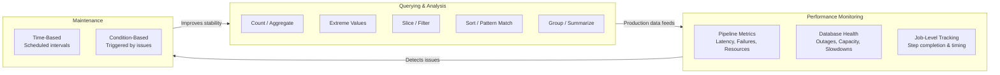

> **Course 1:** Introduction to Data Engineering
> **Module 3:** Data Engineering Lifecycle

# Summary and Highlights: Querying, Performance Tuning, and Troubleshooting

## Overview

This summary consolidates the key concepts covered across the Querying and Analyzing Data and Performance Tuning and Troubleshooting lessons in this module.

---

---

## Querying Data for Analysis

Making raw data analytics-ready requires understanding it from multiple perspectives. Querying is one of the primary ways to explore a dataset. Basic querying techniques include:

| Technique | Purpose |
|---|---|
| **Counting and Aggregating** | Take stock of dataset size and summarize numeric columns (`COUNT`, `SUM`, `AVG`, `STDDEV`) |
| **Identifying Extreme Values** | Find the highest and lowest values in a column (`MAX`, `MIN`) |
| **Slicing Data** | Filter rows based on specific conditions (`WHERE`, `BETWEEN`) |
| **Sorting Data** | Arrange data in meaningful order to surface patterns (`ORDER BY`) |
| **Filtering Patterns** | Perform partial matches on string values (`LIKE`, wildcards) |
| **Grouping Data** | Aggregate data by category (`GROUP BY`) |

These six techniques cover the essential operations for exploratory data analysis and can be applied across SQL, NoSQL query languages (CQL, Cypher), and query-capable APIs.

---

## Performance Monitoring in the Data Engineering Lifecycle

Performance must be **constantly monitored** across every component of the data engineering lifecycle — pipelines, platforms, databases, applications, tools, queries, and scheduled jobs.

### Data Pipeline Performance Threats

| Threat | Description |
|---|---|
| **Workload increases** | Significant growth in data volume overwhelms pipeline capacity |
| **Application failures** | One or more pipeline components crash or error out |
| **Scheduled job failures** | Jobs don't run as expected — missed schedules, dependency issues, or incorrect sequencing |
| **Tool incompatibilities** | Conflicts between the variety of tools operating within the pipeline |

### Database Vulnerabilities

Databases are susceptible to:

- **System outages** — unplanned downtime
- **Capacity overutilization** — storage and compute resources pushed beyond limits
- **Application slowdown** — degraded response times for dependent applications
- **Conflicting activities** — multiple users and batch processes competing for resources simultaneously

### Optimization Strategies vs. the Threats They Address

| Strategy | Mitigates |
|---|---|
| **Indexing** | Query slowdown, application slowdown |
| **Partitioning** | Capacity overutilization, query slowdown |
| **Normalization** | Anomalies from conflicting activities (OLTP) |
| **Capacity planning** | Workload increases, capacity overutilization |
| **Job-level monitoring** | Scheduled job failures, late error detection |

---

## Monitoring and Alerting Systems

Monitoring and alerting systems collect **quantitative data in real time**, providing visibility across the entire lifecycle — pipelines, platforms, databases, applications, tools, queries, scheduled jobs, and more.

The **Four Golden Signals** (latency, traffic, errors, saturation) provide a framework for deciding what to monitor. As they apply to data pipelines:

| Signal | Pipeline Example |
|---|---|
| **Latency** | Time from source event to destination availability |
| **Traffic** | Records ingested per second |
| **Errors** | Failed task rate, dropped records |
| **Saturation** | CPU / memory / disk of pipeline nodes |

---

## Maintenance Schedules

Preventive maintenance routines generate data that identifies systems and procedures responsible for faults and low availability:

| Type | Trigger | Example |
|---|---|---|
| **Time-based** | Scheduled at pre-fixed intervals | Weekly index rebuild, nightly vacuum |
| **Condition-based** | Triggered by a detected issue or flagged performance decrease | Auto-vacuum when dead tuple threshold exceeded |

---

## Key Takeaways

- Querying is a foundational technique for exploring and understanding raw data before and during transformation.
- The six core querying techniques — counting, aggregating, extreme values, slicing, sorting, pattern filtering, and grouping — cover the most essential data analysis operations.
- Performance monitoring must be continuous and span the full data engineering lifecycle.
- Data pipeline performance is threatened by workload growth, application failures, scheduling issues, and tool incompatibilities.
- Databases face risks from outages, capacity overuse, application slowdown, and resource conflicts.
- Monitoring and alerting systems provide real-time quantitative visibility to support proactive and reactive performance management.
- Maintenance routines are either **time-based** (scheduled) or **condition-based** (triggered), and both generate data for diagnosing faults and availability issues.
