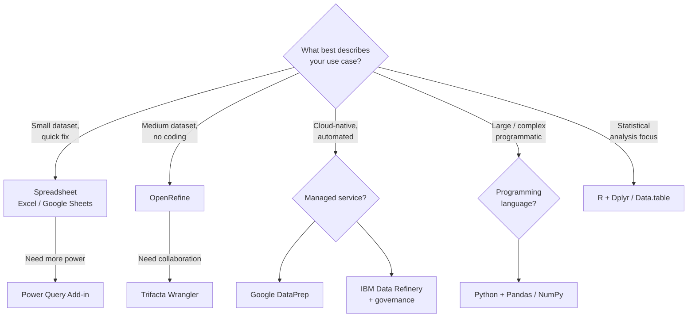

> **Course 1:** Introduction to Data Engineering
> **Module 3:** Data Engineering Lifecycle

# Tools for Data Wrangling

## Overview

Data wrangling can be performed using a wide range of tools — from manual spreadsheet-based approaches to intelligent cloud services and full programming languages. Tool selection depends on the specific use case, infrastructure, and team capabilities. This lesson surveys the most commonly used data wrangling tools and their key characteristics.



---

## Tool Comparison at a Glance

| Tool | Type | Best For | Skill Level | Scale |
|---|---|---|---|---|
| **Excel / Google Sheets** | Spreadsheet | Manual wrangling, small datasets | Beginner | Small |
| **Power Query / Sheets Query** | Spreadsheet Add-in | Importing and transforming data within spreadsheets | Intermediate | Small–Medium |
| **OpenRefine** | Open-source desktop tool | Format conversion, cleaning, extending with web services | Beginner | Medium |
| **Google DataPrep** | Managed cloud service | Visual exploration of structured/unstructured data | Beginner | Large |
| **Watson Studio / IBM Data Refinery** | Managed cloud service | Enterprise cleansing with governance enforcement | Intermediate | Large |
| **Trifacta Wrangler** | Cloud-based interactive tool | Team collaboration on messy data | Intermediate | Medium–Large |
| **Python** (Jupyter, NumPy, Pandas) | Programming language | Large-scale, complex data manipulation | Advanced | Very Large |
| **R** (Dplyr, Data.table, Jsonlite) | Programming language | Statistical data wrangling, API interaction | Advanced | Large |

---

## Spreadsheets

**Tools:** Microsoft Excel, Google Sheets

The most basic approach to manual data wrangling. Spreadsheets offer built-in formulae for identifying issues, cleaning, and transforming data.

**Add-ins that extend spreadsheet capabilities:**

| Add-in | Platform | Purpose |
|---|---|---|
| **Microsoft Power Query** | Excel | Import data from multiple source types; clean and transform |
| **Google Sheets Query function** | Google Sheets | Query and transform data within the sheet |

> Spreadsheets are ideal for **ad-hoc exploration** but break down at scale. Performance degrades noticeably beyond ~100K rows, and reproducibility is difficult to maintain.

---

## OpenRefine

- **Type:** Open-source desktop tool
- **Supported formats:** TSV, CSV, XLS, XML, JSON
- **Key capabilities:**
  - Import and export data across a wide variety of formats
  - Clean and transform data
  - Extend data using web services and external data sources
- **Ease of use:** Menu-based operations — no commands or syntax to memorize
- **Accessibility:** Easy to learn and use, suitable for non-developers

> OpenRefine's **facet and clustering** features make it especially powerful for detecting and merging inconsistent categorical values (e.g., "NY", "N.Y.", "New York").

---

## Google DataPrep

- **Type:** Intelligent cloud data service (fully managed)
- **Key capabilities:**
  - Visually explore, clean, and prepare both structured and unstructured data
  - Automatically detects schemas, data types, and anomalies
  - Suggests ideal next steps with every action taken
- **Infrastructure:** No installation or infrastructure management required — fully managed by Google

> DataPrep is serverless — you define the transformation logic through a visual interface, and Google handles scaling, execution, and storage.

---

## Watson Studio / IBM Data Refinery

- **Type:** Managed cloud service (available via IBM Watson Studio or Cloud Pak for Data)
- **Key capabilities:**
  - Discover, cleanse, and transform data with built-in operations
  - Transforms large volumes of raw data into analytics-ready, quality information
  - Explores data across a wide spectrum of data sources
  - Automatically detects data types and classifications
  - **Automatically enforces applicable data governance policies** — a key differentiator for enterprise environments

> Data Refinery's governance-aware approach is unique among wrangling tools — it can apply classification labels and masking rules automatically during the transformation process.

---

## Trifacta Wrangler

- **Type:** Interactive cloud-based service
- **Key capabilities:**
  - Cleans and rearranges messy, real-world data into structured data tables
  - Exports results to Excel, Tableau, and R
- **Key differentiator:** Strong **collaboration features** — multiple team members can work on the same dataset simultaneously

> Trifacta uses a **predictive interaction** model — it suggests transformations based on your actions, reducing the number of clicks required to clean data.

---

## Python

Python offers a rich ecosystem of libraries purpose-built for data wrangling at scale.

### Jupyter Notebook

- Open-source web application
- Widely used for data cleaning, transformation, statistical modeling, and data visualization
- Provides an interactive environment for running and documenting Python code

### NumPy (Numerical Python)

- The foundational package for numerical computing in Python
- Characteristics: fast, versatile, interoperable, easy to use
- Provides support for **large, multi-dimensional arrays and matrices**
- Includes high-level mathematical functions for operating on arrays

### Pandas

- Designed for **fast and easy data analysis operations**
- Supports complex operations — merging, joining, and transforming large datasets — using simple, single-line commands
- Helps prevent common errors caused by misaligned data arriving from different sources

```python
import pandas as pd
import numpy as np

# Load and inspect
df = pd.read_csv("sales_data.csv")
print(df.info())

# Melt wide-to-long transformation
melted = pd.melt(df, id_vars=["region"], var_name="month", value_name="revenue")

# Grouped aggregation
summary = df.groupby("region").agg({"revenue": ["sum", "mean", "count"]})

# Merge two datasets
customers = pd.read_csv("customers.csv")
merged = df.merge(customers, on="customer_id", how="left")
```

---

## R

R offers a set of libraries explicitly designed for wrangling messy data.

| Library | Purpose |
|---|---|
| **Dplyr** | Powerful data wrangling library with a precise, straightforward syntax |
| **Data.table** | Aggregates large datasets quickly |
| **Jsonlite** | Robust JSON parsing tool — ideal for interacting with web APIs |

```r
library(dplyr)
library(data.table)

# Dplyr pipe workflow
cleaned <- raw_data %>%
  filter(!is.na(age)) %>%
  mutate(age_group = case_when(
    age < 18 ~ "Minor",
    age < 65 ~ "Adult",
    TRUE ~ "Senior"
  )) %>%
  group_by(age_group) %>%
  summarise(count = n(), avg_income = mean(income, na.rm = TRUE))

# Data.table for large datasets
dt <- as.data.table(raw_data)
result <- dt[, .(count = .N, avg_income = mean(income, na.rm = TRUE)), by = age_group]
```

---

## How to Choose the Right Tool

No single tool is universally best. Selection should be driven by factors specific to your use case, infrastructure, and team:

| Factor | Consideration |
|---|---|
| **Supported data size** | Can the tool handle your volume? |
| **Data structures** | Does it support the formats your data arrives in? |
| **Cleaning and transformation capabilities** | Does it cover the operations you need? |
| **Infrastructure needs** | On-premise, cloud, or managed service? |
| **Ease of use and learnability** | What is the skill level of the team using it? |
| **Collaboration** | Does the tool support multiple users on the same dataset? |
| **Governance requirements** | Does your organization require automated policy enforcement? |
| **Reproducibility** | Can the wrangling steps be versioned and audited? |

---

## Key Takeaways

- Spreadsheets (Excel, Google Sheets) with add-ins are the entry point for manual, small-scale wrangling.
- **OpenRefine** is a strong open-source option for format conversion and enriching data with external sources — no coding required.
- **Google DataPrep** and **IBM Data Refinery** are fully managed cloud services that automate schema detection and anomaly identification; Data Refinery additionally enforces governance policies automatically.
- **Trifacta Wrangler** stands out for team collaboration on data cleaning tasks.
- **Python** (Jupyter, NumPy, Pandas) is the go-to for large-scale, programmatic data manipulation.
- **R** (Dplyr, Data.table, Jsonlite) is well-suited for statistical wrangling and API data interaction.
- Tool selection must account for data size, structure, capabilities, infrastructure, and team expertise.

---

## Glossary

| Term | Definition |
|---|---|
| **Pandas** | Python library for fast, expressive data manipulation with DataFrame objects |
| **NumPy** | Python library for numerical computing with multi-dimensional arrays |
| **Jupyter Notebook** | Interactive web environment for code execution, visualization, and documentation |
| **Dplyr** | R package for data manipulation with a consistent `verb()` syntax |
| **Data.table** | R package optimized for fast aggregation and large dataset operations |
| **Jsonlite** | R package for robust JSON parsing and API interaction |
| **OpenRefine** | Open-source desktop tool for data cleaning, format conversion, and reconciliation |
| **ETL** | Extract, Transform, Load — the standard pipeline pattern for moving and preparing data |
