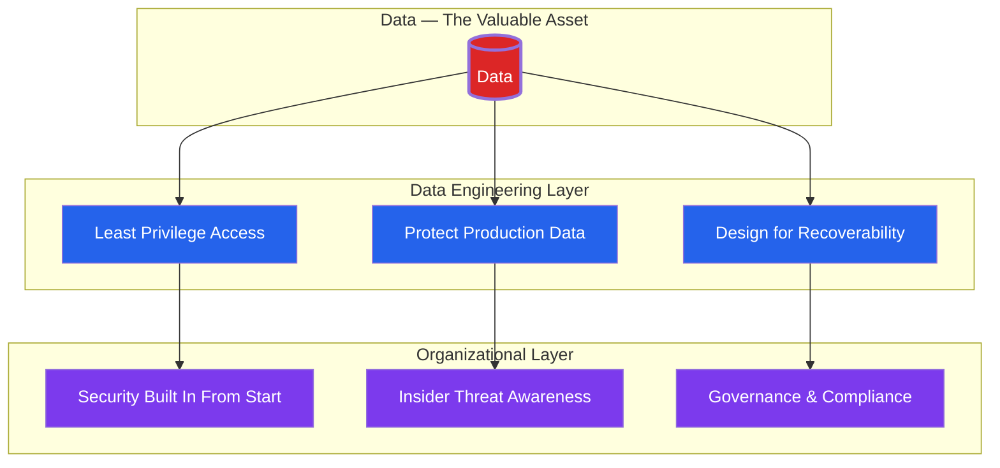

> **Course 1:** Introduction to Data Engineering
> **Module 3:** Data Engineering Lifecycle

# Viewpoints: Importance of Data Security

## Overview

This lesson captures perspectives from practicing data professionals on why data security is one of the most critical concerns in data engineering — and why it must be treated as an organizational priority, not an afterthought.

The following diagram illustrates how security responsibility radiates outward from the data itself through engineering and into the broader organization:

> Security is not a single control — it is a set of interlocking responsibilities. The data sits at the center; engineering builds the protective layer around it; the organization provides the culture, policy, and accountability that makes both effective.

---

## Data is the Most Valuable Resource

> *"The world's most valuable resource is no longer oil, but data."* — The Economist

Data has become a fundamental organizational asset. If data is the most valuable resource an organization holds, the consequences of failing to protect it can be catastrophic — ranging from reputational damage to company-ending data loss.

- For **large organizations**, a breach may be survivable but costly in trust and compliance penalties
- For **smaller organizations**, losing access to their own data can be an existential threat

---

## Security Must Be Built In From the Start

One of the most consistent themes from practitioners is that data security cannot be deferred:

- A common mistake is treating security as something to "harden just before go-live" — this is a dangerous posture
- Security must be considered **at every step** of the data engineering lifecycle, not bolted on at the end
- Retrofitting security into a system that wasn't designed for it results in gaps, patchwork controls, and exposure

---

## Security is an Organizational Responsibility, Not Just an Engineering One

Data security, governance, and compliance are not solely the concern of the data engineer. They must permeate:

- The **data architecture** itself
- **Organizational processes** at every level
- Every team and stakeholder that touches data

> Every part of the organization needs to keep on top of security — not just the technical teams.

---

## Key Practitioner Principles

### Least Privilege Access

One of the most actionable security principles emphasized by practitioners:

- Understand the **security levels and roles** of every tool in use
- Ensure each user receives only the **minimum access they need** to do their job
- Excess access is one of the most common sources of data breaches

> *"It's when we give people more access that we really open things up to data breaches and data security problems."*

### Protect Production Data from Lower Environments

- **Production and non-production environments must be kept strictly separate**
- Production data must never be unmasked or exposed into development or staging environments
- Data breaches can — and do — happen through lower-environment leakage
- Access to production data should be limited strictly to those who genuinely require it

### The Insider Threat is the Most Likely Threat

A perspective that often surprises people:

- The majority of threats to organizational data come from **inside** the organization, not from external attackers
- Insider threats include both malicious misuse and accidental exposure — e.g., employees accessing sensitive records (such as celebrity prescriptions in healthcare) without business need
- External hacking scenarios, while dramatic, are statistically less common than internal incidents

### Data Recovery as Part of Security

One practitioner perspective broadens the traditional definition of data security to include **recoverability**:

- The ability to **restore data** and **recover from hardware failure** is part of data security
- If data becomes inaccessible due to hardware failure, the availability principle of the CIA Triad has been violated — the data is effectively "lost" even without a breach
- Backup, recovery, and business continuity planning belong in any comprehensive data security strategy

---

## Principles at a Glance

| Principle | Core Idea | Who Owns It |
|---|---|---|
| **Least Privilege** | Minimum access per role | Data engineers, platform admins |
| **Environment Isolation** | Production data never exposed to lower environments | DevOps, data engineering |
| **Insider Threat Awareness** | Most breaches originate internally | Entire organization |
| **Recoverability as Security** | Backup and DR are security concerns | Data engineers, IT operations |
| **Security by Design** | Embed security at every lifecycle stage | Data architects, engineering leads |
| **Shared Responsibility** | Security is everyone's job, not just IT | All stakeholders |

---

## Key Takeaways

- **Data is the most valuable organizational asset** — its protection must be treated with corresponding seriousness.
- **Security cannot be deferred** — it must be embedded from the earliest stages of data architecture and engineering, not added just before deployment.
- Data security is **an organizational responsibility**, not just a technical one — governance and compliance must be owned across every function.
- **Least privilege** is a core security principle — users should have the minimum access necessary, and no more.
- **Production data must be isolated** from non-production environments to prevent inadvertent exposure.
- **Insider threats are the most prevalent risk** — organizations should design controls with internal misuse in mind, not only external attacks.
- **Recoverability is part of security** — the inability to access data due to hardware failure is itself a security failure under the availability principle.
