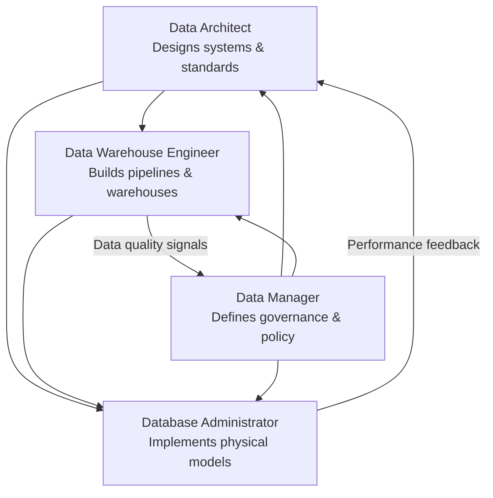

# Comparing Data Roles: Engineer, Architect, Manager, and Administrator

## Overview

Modern data organizations rely on a set of distinct but deeply interconnected roles to build, govern, and maintain data systems. While these roles often collaborate closely, each carries a unique mandate — from hands-on pipeline construction to high-level governance strategy.

This document provides a comprehensive breakdown of four foundational data roles:

- **Data Warehouse Engineer**
- **Data Architect**
- **Data Manager**
- **Database Administrator (DBA)**

Understanding how these roles differ — and where they overlap — is essential for structuring effective data teams, defining clear ownership, and avoiding gaps or duplication of responsibility.

---

## At a Glance: Role Comparison Table

| Aspect             | Data Warehouse Engineer                                      | Data Architect                                              | Data Manager                                      | Database Administrator                            |
|--------------------|--------------------------------------------------------------|-------------------------------------------------------------|---------------------------------------------------|---------------------------------------------------|
| **Focus**          | Data pipelines and warehousing                               | Data warehouses, big data systems, analytics platforms      | Strategy and governance                           | Operational management                            |
| **Key Deliverables** | ETL pipelines, data transformation, and warehouse deployment | Scalable data management systems                            | Policies, standards, and compliance               | Reliable and secure database operations           |
| **Tools Used**     | Apache Kafka, Spark, cloud data warehouses                   | ERD tools, MySQL, MongoDB, cloud data platforms             | Data governance platforms                         | SQL, database monitoring tools                    |
| **Collaboration**  | Works with Data Architects, DBAs, and BI Analysts            | Engages with engineers, DBAs, and business leaders          | Works with business and technical teams           | Partners with engineers and architects            |
| **Importance**     | Supports data accessibility for analytics and reporting      | Ensures scalable and adaptable data management              | Aligns data with business goals                   | Maintains data reliability and security           |

---

## Role Deep Dives

### 1. Data Warehouse Engineer

#### Focus
Data Warehouse Engineers are the builders of the data movement layer. Their primary concern is the reliable, performant flow of data from source systems into analytical storage — typically a data warehouse or data lakehouse.

#### Key Deliverables

- **ETL/ELT Pipelines** — Design and implement Extract, Transform, Load (or Load, then Transform) workflows that ingest raw data from operational systems, APIs, or event streams.
- **Data Transformation** — Apply business logic, deduplication, normalization, and enrichment so that downstream consumers receive clean, consistent data.
- **Warehouse Deployment** — Provision, configure, and maintain cloud or on-premises data warehouse environments, including schema design and partitioning strategies.

#### Tools Used

| Tool Category          | Examples                                      |
|------------------------|-----------------------------------------------|
| Stream Processing      | Apache Kafka, Apache Flink                    |
| Batch Processing       | Apache Spark, dbt, Apache Airflow             |
| Cloud Data Warehouses  | Snowflake, Google BigQuery, Amazon Redshift   |

#### Collaboration
Data Warehouse Engineers sit at the intersection of infrastructure and analytics. They regularly work with:
- **Data Architects** — to implement designs that conform to the approved data model and infrastructure blueprint.
- **DBAs** — to coordinate on storage performance, indexing, and access control.
- **BI Analysts** — to understand reporting requirements and ensure pipelines deliver the right grain and shape of data.

#### Why This Role Matters
Without well-built pipelines, data simply doesn't move — or moves incorrectly. The Data Warehouse Engineer ensures that analytics and reporting teams always have access to fresh, trustworthy data.

> **Common Pitfall:** Over-engineering transformations inside the ETL layer rather than pushing logic downstream to a transformation tool like dbt, which is harder to test and version-control.

---

### 2. Data Architect

#### Focus
Data Architects operate at the design level. They define *how* data systems should be structured, interconnected, and scaled — across warehouses, big data platforms, and analytics environments. Their work precedes implementation and provides the blueprint that engineers build from.

#### Key Deliverables

- **Scalable Data Management Systems** — Architect end-to-end data platforms that can grow with organizational needs without requiring costly rewrites.
- **Data Models** — Produce entity-relationship diagrams (ERDs), dimensional models (star/snowflake schemas), and data vault designs.
- **Platform Standards** — Define which technologies, storage formats, and integration patterns are approved for use across the organization.

#### Tools Used

| Tool Category          | Examples                                            |
|------------------------|-----------------------------------------------------|
| Modeling & ERD Tools   | erwin, Lucidchart, dbdiagram.io, draw.io            |
| Relational Databases   | MySQL, PostgreSQL                                   |
| NoSQL / Big Data       | MongoDB, Apache Cassandra, Apache Hive              |
| Cloud Data Platforms   | AWS Glue, Azure Synapse, Google Cloud Dataflow      |

#### Collaboration
The Data Architect serves as a bridge between technical implementation and business strategy:
- **Engineers** — Communicate architectural decisions and review implementations for conformance.
- **DBAs** — Align on physical data model choices, indexing, and performance tuning.
- **Business Leaders** — Translate business requirements into data system capabilities and roadmaps.

#### Why This Role Matters
A well-designed architecture prevents technical debt and enables the organization to adapt as data volumes and use cases evolve. Poor architectural decisions compound over time, leading to fragile, expensive-to-maintain systems.

> **Best Practice:** Data Architects should document architecture decision records (ADRs) to capture the reasoning behind major design choices, enabling future teams to understand *why* a system was built a certain way.

---

### 3. Data Manager

#### Focus
The Data Manager is primarily a governance and strategy role. Rather than building systems, they define the rules, standards, and organizational processes that govern how data is created, stored, used, and protected.

#### Key Deliverables

- **Policies** — Formal documentation of data handling rules, including retention, classification, and access policies.
- **Standards** — Naming conventions, metadata requirements, data quality thresholds, and taxonomy definitions enforced across the organization.
- **Compliance** — Ensuring the organization meets regulatory requirements such as GDPR, CCPA, HIPAA, or industry-specific mandates.

#### Tools Used

| Tool Category             | Examples                                              |
|---------------------------|-------------------------------------------------------|
| Data Governance Platforms | Collibra, Alation, Apache Atlas, Microsoft Purview    |
| Data Catalog Tools        | DataHub, Amundsen, Google Data Catalog                |
| Policy & Compliance       | OneTrust, BigID                                       |

#### Collaboration
The Data Manager operates across both business and technical domains:
- **Business Teams** — Capture data requirements, enforce data ownership, and translate business rules into governance policies.
- **Technical Teams** — Work with engineers and architects to ensure governance requirements are baked into system design rather than bolted on after the fact.

#### Why This Role Matters
Data without governance becomes a liability. The Data Manager ensures that data assets are discoverable, trustworthy, and compliant — turning raw data into a governed, reliable organizational resource.

> **Common Pitfall:** Treating data governance as a one-time project rather than an ongoing program. Policies must evolve as systems, regulations, and business needs change.

---

### 4. Database Administrator (DBA)

#### Focus
The Database Administrator (DBA) is responsible for the day-to-day operational health of database systems. This is the most operationally focused of the four roles, centered on keeping databases running reliably, securely, and at peak performance.

#### Key Deliverables

- **Reliable Database Operations** — Uptime management, backup and recovery, patching, and incident response.
- **Secure Database Operations** — User access control, role-based permissions, encryption at rest and in transit, and audit logging.
- **Performance Tuning** — Query optimization, index management, statistics maintenance, and capacity planning.

#### Tools Used

| Tool Category              | Examples                                              |
|----------------------------|-------------------------------------------------------|
| Query & Management         | SQL (ANSI, T-SQL, PL/SQL), pgAdmin, DBeaver           |
| Monitoring Tools           | Datadog, SolarWinds DPA, pgBadger, Grafana            |
| Backup & Recovery          | Veeam, pgBackRest, AWS RDS automated snapshots        |

#### Collaboration
DBAs are operational partners to the broader data organization:
- **Engineers** — Review schema changes, advise on query performance, and validate migration scripts.
- **Architects** — Implement physical data model decisions and feed performance data back to inform architectural refinements.

#### Why This Role Matters
Even the most elegant data architecture fails if the underlying databases are slow, insecure, or unavailable. The DBA is the last line of defense for data reliability and the first responder when production systems degrade.

> **Best Practice:** Implement automated backup verification — regularly restore from backups in a test environment to confirm recoverability before it's needed in a real incident.

---

## Role Interaction Map

The four roles are not siloed — they form a feedback loop across the data lifecycle:

---

## Key Takeaways

| Theme                  | Insight                                                                                                                  |
|------------------------|--------------------------------------------------------------------------------------------------------------------------|
| **Specialization**     | Each role owns a distinct slice of the data lifecycle — design, build, govern, and operate.                              |
| **Interdependence**    | No role functions in isolation. Architects design what Engineers build; DBAs operate what Architects specify; Managers govern all of it. |
| **Tooling divergence** | Tool sets reflect focus areas — stream processors for Engineers, ERD tools for Architects, governance platforms for Managers, monitoring suites for DBAs. |
| **Shared goal**        | All four roles ultimately serve the same outcome: trustworthy, accessible, performant, and compliant data.               |
| **Career pathways**    | Data Warehouse Engineers often grow into Architect roles; DBAs may specialize into cloud database engineering or move toward architecture. |

---

## Glossary

| Term              | Definition                                                                                  |
|-------------------|---------------------------------------------------------------------------------------------|
| **ETL**           | Extract, Transform, Load — a data integration pattern for moving data between systems.      |
| **ELT**           | Extract, Load, Transform — a modern variant where raw data is loaded first, then transformed in place. |
| **ERD**           | Entity-Relationship Diagram — a visual model of data entities and their relationships.       |
| **Data Vault**    | A modeling methodology designed for auditability and scalability in enterprise data warehouses. |
| **GDPR**          | General Data Protection Regulation — EU regulation governing personal data handling.         |
| **CCPA**          | California Consumer Privacy Act — US state-level data privacy regulation.                   |
| **HIPAA**         | Health Insurance Portability and Accountability Act — US regulation for healthcare data.     |
| **Data Catalog**  | A metadata management tool that helps users discover, understand, and trust organizational data assets. |

---

*Source: IBM Skills Network — Comparing the Roles in Data Engineering*
