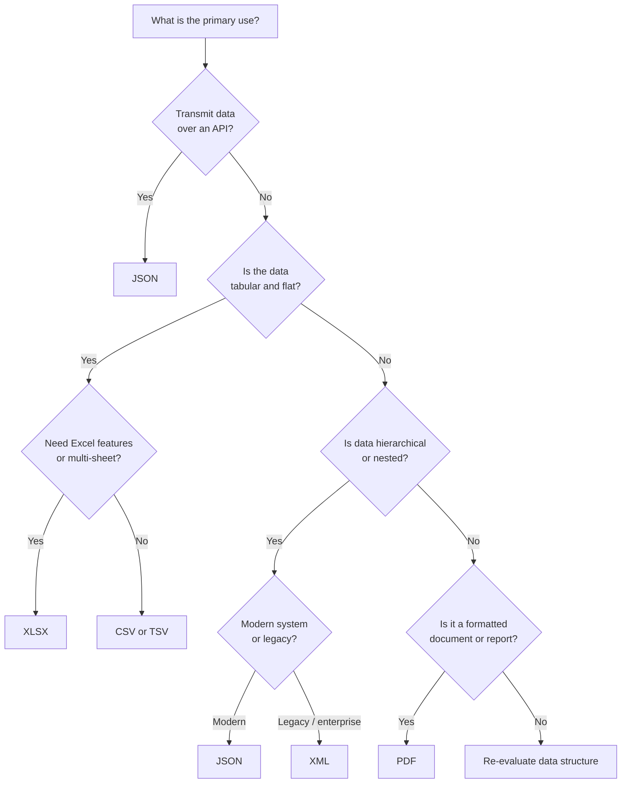

> **Course 1:** Introduction to Data Engineering
> **Module 2:** The Data Engineering Ecosystem

# Understanding Different Types of File Formats

## Overview

Data professionals work with a wide variety of file formats on a daily basis — ingesting them from source systems, transforming them mid-pipeline, and delivering them to downstream consumers. Choosing the wrong format for a given workload leads to real consequences: bloated storage costs, slow query performance, incompatible tooling, or loss of data fidelity.

This document covers the six standard file formats introduced in the course, examining the internal structure of each, its strengths and limitations, and the scenarios where it is most appropriately used. Formats covered:

- Delimited Text Files (CSV, TSV)
- Microsoft Excel Open XML Spreadsheet (XLSX)
- Extensible Markup Language (XML)
- Portable Document Format (PDF)
- JavaScript Object Notation (JSON)

---

## Core Concept: What Is a File Format?

A file format defines the **structure, encoding, and rules** by which data is organized inside a file. Two files can contain the same information but be completely different in format — one might be a CSV, another a JSON — and the correct parser is required to read each one.

Understanding a format means understanding three things:

1. **Structure** — How is data laid out? (rows/columns, hierarchical, flat, binary, etc.)
2. **Readability** — Is it human-readable text or a binary representation?
3. **Portability** — Which systems, tools, and languages can consume it natively?

---

## 1. Delimited Text Files (CSV and TSV)

### What They Are

A **delimited text file** stores tabular data as plain text, where each line represents a record (row), and values within that record are separated by a special character called a **delimiter**.

> A **delimiter** is a sequence of one or more characters used to specify the boundary between independent values in a data stream.

Any character can technically serve as a delimiter, but the most commonly used are:

| Delimiter | Name | Format Name |
|---|---|---|
| `,` | Comma | CSV — Comma-Separated Values |
| `\t` | Tab | TSV — Tab-Separated Values |
| `:` | Colon | — |
| `\|` | Vertical bar (pipe) | — |
| ` ` | Space | — |

**CSV and TSV are by far the most prevalent** delimited formats in data engineering.

### Structure

```
# Example CSV — first row is the column header
employee_id,first_name,last_name,hire_date,salary
1001,Alice,Nguyen,2021-03-15,92000
1002,Bob,Martinez,2019-07-22,87500
1003,Carol,Smith,2023-01-08,95000
```

```
# Equivalent TSV
employee_id	first_name	last_name	hire_date	salary
1001	Alice	Nguyen	2021-03-15	92000
1002	Bob	Martinez	2019-07-22	87500
```

**Structural rules:**
- Each row (line) represents one record.
- The **first row** is conventionally the column header — it defines the field names.
- Each column can hold a different data type (date, string, integer, float, boolean).
- Field values may be of any length.
- Values containing the delimiter character must be **quoted** (e.g., `"Smith, Jr."` in a CSV).

### When to Use CSV vs. TSV

| Scenario | Recommended Format |
|---|---|
| General tabular data with no commas in values | CSV |
| Text fields that contain commas (e.g., addresses, names with suffixes) | TSV |
| Data with tab characters in values | CSV |
| Maximum compatibility with spreadsheet tools (Excel, Google Sheets) | CSV |

> **Why TSV over CSV?** Tab stops (`\t`) are rarely used in natural language text, making them a safer delimiter when field values contain punctuation-heavy content. A field like `"New York, NY"` breaks a naive CSV parser but is unambiguous in a TSV.

### Strengths

- **Universal compatibility** — parseable by virtually every tool, language, and platform.
- **Human-readable** — can be opened and inspected in a text editor.
- **Lightweight** — no markup overhead; pure data.
- **Standard schema representation** — the header row provides a straightforward information schema.

### Limitations

- **No native data typing** — every value is stored as text; type enforcement is the application's responsibility.
- **No support for hierarchical or nested data** — a flat, two-dimensional structure only.
- **Fragile with inconsistent delimiters** — a single unescaped delimiter character in a value corrupts the parse.
- **No metadata** — no way to encode column types, null representations, or encoding within the file itself.

---

## 2. Microsoft Excel Open XML Spreadsheet (XLSX)

### What It Is

**XLSX** is the default file format for Microsoft Excel workbooks since Excel 2007. Despite being associated with a proprietary application, XLSX is built on an **open standard** — it is an XML-based format (technically a ZIP archive of XML files and assets) defined by the Open XML specification (ECMA-376).

The `.xlsx` extension stands for **Excel Open XML Spreadsheet**.

### Structure

An XLSX file is organized as a **workbook** containing one or more **worksheets**. Each worksheet is a grid of **rows** and **columns**, at the intersection of which lies a **cell**. Each cell holds a value, which may be a number, string, date, boolean, formula, or empty.

```
Workbook (file.xlsx)
├── Sheet1 (worksheet)
│   ├── Row 1: A1, B1, C1, ...  ← typically column headers
│   ├── Row 2: A2, B2, C2, ...  ← data rows
│   └── ...
├── Sheet2 (worksheet)
│   └── ...
└── [shared strings, styles, formulas, named ranges, etc.]
```

> **Under the hood:** An `.xlsx` file is a ZIP archive. Rename it to `.zip`, unzip it, and you will find a directory of XML files (`xl/workbook.xml`, `xl/worksheets/sheet1.xml`, etc.). This is why XLSX is interoperable with many tools — any system that can parse XML can, in principle, read it.

### Strengths

- **Open format** — accessible to most applications (LibreOffice, Google Sheets, pandas, openpyxl, etc.), not locked to Microsoft.
- **Rich feature set** — supports formulas, charts, named ranges, data validation, conditional formatting, pivot tables.
- **Multiple sheets** — a single file can contain logically grouped datasets.
- **Security** — cannot embed or execute macros (that is the `.xlsm` format); XLSX cannot save malicious code.
- **Data typing** — cells have explicit types (number, date, text, boolean) preserved in the XML.

### Limitations

- **Not ideal for large-scale pipelines** — parsing XLSX in Python (via `openpyxl` or `pandas`) is memory-intensive compared to CSV.
- **Binary-adjacent complexity** — despite being XML-based, the format is verbose and non-trivial to generate or modify programmatically without a library.
- **Not streamable** — unlike CSV, you typically must load the entire file into memory to process it.

### Common Use in Data Engineering

XLSX is a frequent **source format** — business teams produce it, data engineers ingest it. It is rarely used as an intermediate or output format within automated pipelines; those typically use CSV, Parquet, or JSON instead.

```python
# Reading an XLSX file with pandas
import pandas as pd

df = pd.read_excel("sales_report.xlsx", sheet_name="Q4_2024")
print(df.head())
```

---

## 3. Extensible Markup Language (XML)

### What It Is

**XML** is a text-based markup language that defines a set of rules for encoding data in a format that is both **human-readable** and **machine-readable**. Unlike HTML (which uses a fixed set of predefined tags for rendering web pages), XML uses **custom, user-defined tags** to describe the structure and meaning of data.

XML was designed primarily for **transmitting structured data between systems**, particularly over the internet. It is platform-independent and programming-language-independent, making it a natural choice for interoperability.

### Structure

XML organizes data in a **hierarchical tree** of elements. Every XML document has a single **root element**, which contains all other elements as children.

```xml
<?xml version="1.0" encoding="UTF-8"?>
<employees>
  <employee id="1001">
    <first_name>Alice</first_name>
    <last_name>Nguyen</last_name>
    <hire_date>2021-03-15</hire_date>
    <salary currency="USD">92000</salary>
    <department>Engineering</department>
  </employee>
  <employee id="1002">
    <first_name>Bob</first_name>
    <last_name>Martinez</last_name>
    <hire_date>2019-07-22</hire_date>
    <salary currency="USD">87500</salary>
    <department>Product</department>
  </employee>
</employees>
```

Key structural concepts:

| Concept | Description | Example |
|---|---|---|
| **Element** | A named node enclosed in opening/closing tags | `<first_name>Alice</first_name>` |
| **Attribute** | A key-value pair inside an opening tag | `id="1001"`, `currency="USD"` |
| **Root element** | The single top-level element that wraps all others | `<employees>` |
| **Nesting** | Elements can contain child elements (hierarchical) | `<employee>` contains `<first_name>` |
| **Prolog** | Optional declaration of XML version and encoding | `<?xml version="1.0"?>` |

### XML vs. HTML

| Dimension | XML | HTML |
|---|---|---|
| Purpose | Data transport and storage | Web page rendering |
| Tags | User-defined, custom | Predefined (`<p>`, `<div>`, `<a>`, etc.) |
| Case sensitivity | Case-sensitive | Case-insensitive |
| Closing tags | Mandatory | Often optional |
| Validation | Against a schema (XSD, DTD) | Against HTML spec |

### Strengths

- **Self-descriptive** — the tags describe the meaning of the data they wrap, making the document interpretable without external documentation.
- **Platform and language independent** — parseable in any language, on any OS.
- **Supports hierarchy and nesting** — can represent complex, deeply nested structures that flat formats cannot.
- **Schema validation** — can be validated against an XML Schema Definition (XSD) to enforce structure and data types.
- **Widely adopted in enterprise** — many legacy systems (SOAP APIs, ERP exports, configuration files) produce and consume XML.

### Limitations

- **Verbose** — the repeated open/close tag syntax produces files significantly larger than equivalent JSON or CSV.
- **Slower to parse** — verbosity means more bytes to read and more tokens to process.
- **Complex for simple data** — representing a flat list of records is noisier in XML than in CSV or JSON.

---

## 4. Portable Document Format (PDF)

### What It Is

**PDF** is a file format developed by **Adobe Systems** to present documents — including text, images, vector graphics, and fonts — in a manner that is independent of the application, hardware, and operating system used to view them. A PDF renders identically on any device.

PDF was designed for **document fidelity**, not data exchange. Its primary purpose is presentation and preservation of layout.

### Structure

Unlike the other formats in this document, PDF is **not** a tabular or hierarchical data format in the traditional sense. A PDF encodes:

- **Text** as positioned character streams (not semantically tagged rows/columns).
- **Images** as embedded binary blobs.
- **Fonts** as embedded or referenced font programs.
- **Layout** as absolute or relative positioning instructions.

This means that extracting structured data *from* a PDF requires specialized tooling that attempts to reverse-engineer the visual layout back into machine-readable structure — a process that is inherently imperfect for complex or scanned documents.

### Common Uses in Data Engineering

| Use Case | Description |
|---|---|
| **Document storage** | Legal contracts, financial reports, invoices stored for archival |
| **Form data** | Interactive PDF forms with fillable fields (name, date, signature) |
| **Source for extraction** | OCR or text extraction pipelines that convert PDF content to structured data |
| **Regulatory filings** | SEC filings, tax documents, compliance reports often arrive as PDFs |

### Extracting Data from PDFs

Since PDF is the most common "accidental unstructured data" format in enterprise pipelines, data engineers frequently need to extract content from PDFs programmatically.

```python
# Extracting text from a PDF using pdfplumber
import pdfplumber

with pdfplumber.open("contract_q4_2024.pdf") as pdf:
    for page in pdf.pages:
        text = page.extract_text()
        print(text)

# Extracting a table from a PDF page
with pdfplumber.open("report.pdf") as pdf:
    table = pdf.pages[0].extract_table()
    for row in table:
        print(row)
```

> **Common Pitfall:** PDFs generated by scanning a physical document are images, not text. A text extraction library will return nothing useful. These require **OCR (Optical Character Recognition)** tooling (e.g., Tesseract, AWS Textract) to convert pixel data to text before any further processing.

### Strengths

- **Universal rendering** — identical visual output on any device or OS.
- **Compact for rich documents** — efficiently encodes text, images, and fonts in a single file.
- **Supports interactive forms** — fillable fields, checkboxes, signatures.
- **Trusted in legal/financial contexts** — widely accepted as a format for official documents.

### Limitations

- **Not designed for data extraction** — structured data buried in a PDF is difficult to reliably extract at scale.
- **Not queryable** — no native way to filter or aggregate PDF content without extraction.
- **Scanned PDFs are images** — require OCR before any text-based processing.

---

## 5. JavaScript Object Notation (JSON)

### What It Is

**JSON** is a lightweight, text-based, open standard for representing structured data. Despite its name referencing JavaScript, JSON is **language-independent** — it can be read, written, and parsed in virtually every programming language. It was designed specifically for **transmitting structured data over the web**, and has become the dominant format for web APIs and inter-service communication.

### Structure

JSON is built on two fundamental data structures:

1. **Object** — an unordered collection of key/value pairs, enclosed in `{}`.
2. **Array** — an ordered list of values, enclosed in `[]`.

Values in JSON can be of the following types:

| Type | Example |
|---|---|
| String | `"Alice"` |
| Number | `92000`, `3.14` |
| Boolean | `true`, `false` |
| Null | `null` |
| Object | `{ "key": "value" }` |
| Array | `[1, 2, 3]` |

```json
// Example JSON — a list of employee objects
[
  {
    "employee_id": 1001,
    "first_name": "Alice",
    "last_name": "Nguyen",
    "hire_date": "2021-03-15",
    "salary": 92000,
    "department": "Engineering",
    "skills": ["Python", "SQL", "Spark"],
    "address": {
      "city": "San Francisco",
      "state": "CA"
    }
  },
  {
    "employee_id": 1002,
    "first_name": "Bob",
    "last_name": "Martinez",
    "hire_date": "2019-07-22",
    "salary": 87500,
    "department": "Product",
    "skills": ["SQL", "Tableau"],
    "address": {
      "city": "Austin",
      "state": "TX"
    }
  }
]
```

Notice that JSON naturally accommodates **nested objects** (`"address"`) and **arrays of values** (`"skills"`) within a single record — a capability flat formats like CSV do not have.

### JSON in APIs and Web Services

JSON is the default response format for the vast majority of modern REST APIs and web services. When a data engineer queries an API to pull data, the response will almost always arrive as JSON.

```python
# Calling a REST API and parsing the JSON response
import requests

response = requests.get("https://api.example.com/employees")
data = response.json()  # Parses the JSON string into a Python dict/list

for employee in data:
    print(employee["first_name"], employee["salary"])
```

### Strengths

- **Language-independent** — parseable in any programming language with a standard library.
- **Supports nesting** — represents hierarchical and nested data structures natively.
- **Wide browser and web compatibility** — natively supported in JavaScript; no parsing library required in front-end code.
- **Compact relative to XML** — no verbose open/close tag pairs; key-value pairs are more concise.
- **Versatile data types** — can carry any data type, including nested structures, making it suitable for payloads of any size and complexity.
- **De facto standard for APIs** — most web services and cloud platform APIs return JSON.

### Limitations

- **No comments** — JSON does not support inline comments, which can make configuration files harder to annotate.
- **No schema enforcement** — unlike XML (which has XSD), there is no built-in mechanism for schema validation. JSON Schema exists but is external and optional.
- **Numbers lack precision guarantees** — JSON numbers are IEEE 754 floats by default; very large integers can lose precision in some parsers.
- **Not column-oriented** — JSON is row-oriented and not optimized for analytical queries over large datasets (Parquet or ORC are better choices for that use case).

---

## Format Comparison Summary

| Dimension | CSV / TSV | XLSX | XML | PDF | JSON |
|---|---|---|---|---|---|
| **Structure** | Flat tabular | Tabular (multi-sheet) | Hierarchical tree | Document / layout | Hierarchical (objects + arrays) |
| **Human-readable** | ✅ Yes | ⚠️ Via application | ✅ Yes | ✅ Visually | ✅ Yes |
| **Machine-parseable** | ✅ Easy | ✅ With library | ✅ With parser | ⚠️ Difficult | ✅ Easy |
| **Supports nesting** | ❌ No | ❌ No | ✅ Yes | N/A | ✅ Yes |
| **Schema enforcement** | ❌ No | ⚠️ Cell types only | ✅ XSD/DTD | N/A | ⚠️ Optional (JSON Schema) |
| **Ideal for APIs** | ❌ No | ❌ No | ⚠️ Legacy (SOAP) | ❌ No | ✅ Yes |
| **Large-scale pipelines** | ✅ Efficient | ⚠️ Memory-intensive | ⚠️ Verbose | ❌ No | ✅ Moderate |
| **Primary use case** | Data exchange, ETL input/output | Business reports, source data | Config, enterprise data exchange | Documents, archival | APIs, web data, semi-structured data |

---

## Choosing the Right Format: Decision Guide



---

## Key Takeaways

- **Delimited files (CSV/TSV)** are the workhorse of flat tabular data exchange — simple, universal, and nearly friction-free to produce and consume, but limited to two dimensions and untyped.
- **XLSX** is the standard for business-facing spreadsheets; use it at ingestion when dealing with Excel-produced source data, but convert to a more pipeline-friendly format (CSV, Parquet) for processing at scale.
- **XML** is self-descriptive and hierarchical, making it well-suited to document-oriented or enterprise data exchange, but its verbosity is a practical disadvantage in modern high-throughput pipelines.
- **PDF** is a presentation format, not a data format — treat it as unstructured data requiring extraction, not as a queryable source.
- **JSON** is the dominant format for web APIs and semi-structured data; its native support for nesting makes it far more expressive than CSV for representing real-world entities, and its language independence makes it the lingua franca of modern data exchange.
- **No single format is universally best** — the right choice is determined by the system interface, the data's structure, the volume, and the downstream consumer's requirements.
