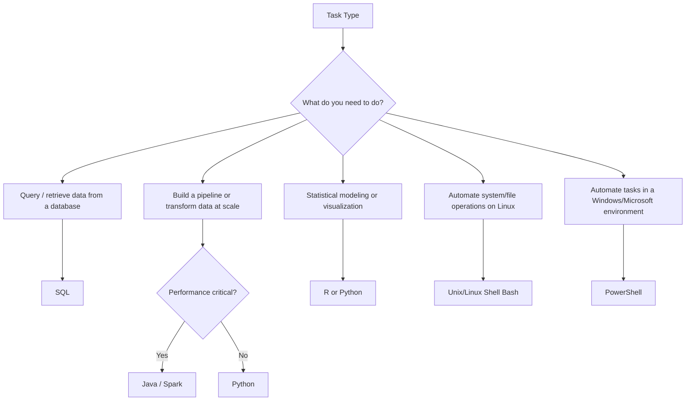

> **Course 1:** Introduction to Data Engineering
> **Module 2:** The Data Engineering Ecosystem

# Languages for Data Professionals

---

## Overview

Data professionals work with a diverse set of languages, each designed for a different class of problems. Proficiency in **at least one language from each of the three core categories** below is considered essential for any practicing data engineer or data analyst:

| Category | Purpose | Examples |
|---|---|---|
| **Query Languages** | Accessing and manipulating data in databases | SQL |
| **Programming Languages** | Developing applications and controlling behavior | Python, R, Java |
| **Shell & Scripting Languages** | Automating repetitive and operational tasks | Unix/Linux Shell, PowerShell |

---

## Query Languages

### SQL (Structured Query Language)

SQL is the foundational language for working with data stored in databases. It is a **declarative querying language**, meaning you describe *what* you want — not *how* to get it — and the database engine figures out the execution plan.

#### What SQL Can Do

```sql
-- Insert a new record
INSERT INTO employees (employee_id, first_name, department, salary)
VALUES (1004, 'Diana', 'Engineering', 91000);

-- Update an existing record
UPDATE employees
SET salary = 97000
WHERE employee_id = 1001;

-- Delete a record
DELETE FROM employees
WHERE employee_id = 1002;

-- Create a new table
CREATE TABLE departments (
    department_id   INT PRIMARY KEY,
    department_name VARCHAR(100) NOT NULL
);

-- Create a view
CREATE VIEW engineering_team AS
SELECT employee_id, first_name, last_name, salary
FROM employees
WHERE department = 'Engineering';

-- Write a stored procedure
CREATE PROCEDURE get_employee_by_department(IN dept_name VARCHAR(100))
BEGIN
    SELECT * FROM employees WHERE department = dept_name;
END;
```

#### Key Advantages of SQL

- **Platform portability:** SQL runs on virtually every relational database (PostgreSQL, MySQL, SQL Server, Oracle, SQLite) and even on non-relational systems (BigQuery, Snowflake, Redshift, Spark SQL).
- **English-like syntax:** Core keywords (`SELECT`, `FROM`, `WHERE`, `INSERT`, `UPDATE`) read almost like natural language, lowering the barrier to entry.
- **Conciseness:** Complex data retrieval that would take hundreds of lines in a general-purpose language can often be expressed in a few lines of SQL.
- **Interpreter-based execution:** SQL is executed immediately upon submission — no compile step required — making it excellent for rapid prototyping and exploratory analysis.
- **Efficiency at scale:** Databases are optimized to execute SQL queries against large datasets far faster than equivalent row-by-row code in most languages.
- **Massive community and documentation:** SQL has been in use since the 1970s.

> **Note for Data Engineers:** While core SQL is standardized (ANSI SQL), every database vendor introduces extensions and variations. Window functions, JSON operators, and procedural extensions differ across platforms.

---

## Programming Languages

### Python

Python is a **widely-used, open-source, general-purpose, high-level programming language**. It is currently the dominant language in data engineering, data science, and machine learning.

#### Why Python is Popular in Data Work

- **Readable syntax:** Python's syntax is clean and close to plain English.
- **Fewer lines of code:** Compared to older languages (Java, C++), Python accomplishes the same tasks in significantly fewer lines.
- **Low learning curve:** Python is widely regarded as one of the easiest languages for beginners.
- **Multi-paradigm:** Python supports object-oriented, imperative, functional, and procedural styles.
- **Cross-platform:** Runs on Windows, Linux, and macOS.
- **Free and open-source.**

#### Python's Data Engineering Ecosystem

| Library | Category | Use Case |
|---|---|---|
| `pandas` | Data manipulation | Loading, cleaning, transforming tabular data |
| `numpy` | Numerical computing | Array operations, mathematical functions |
| `scipy` | Statistical analysis | Statistical tests, signal processing |
| `matplotlib` | Data visualization | Line charts, bar graphs, histograms |
| `seaborn` | Statistical visualization | Aesthetic plots on top of matplotlib |
| `beautifulsoup` | Web scraping | Parsing HTML and XML from web pages |
| `scrapy` | Web scraping | Full-featured web crawling framework |
| `opencv` | Image processing | Computer vision and image manipulation |
| `sqlalchemy` | Database connectivity | ORM and raw SQL across multiple databases |
| `apache-airflow` | Pipeline orchestration | Scheduling and monitoring data workflows |

```python
import pandas as pd

df = pd.read_csv("raw_sales.csv")
print(df.dtypes)
df = df.dropna(subset=["customer_id", "amount"])
df["amount_usd"] = df["amount"] * 1.0
df_clean = df[df["amount"] > 0]
df_clean.to_parquet("clean_sales.parquet", index=False)
```

---

### R

R is an **open-source programming language and environment** purpose-built for statistical analysis, data visualization, and machine learning.

#### Key Strengths of R

- **Statistical depth:** Unmatched depth in statistical modeling, hypothesis testing, and experimental design.
- **Superior visualization:** `ggplot2` produces publication-quality charts.
- **Structured and unstructured data:** Handles both tabular and text/document data natively.
- **Extensibility:** CRAN hosts over 20,000 packages.
- **Interoperability:** Can be paired with Python (via `reticulate`) and with databases.
- **Reporting:** R Markdown and `shiny` enable dynamic documents and web apps.

| Library | Use Case |
|---|---|
| `ggplot2` | Declarative data visualization |
| `plotly` | Interactive, web-based charts |
| `dplyr` | Data manipulation (filter, group, summarize) |
| `tidyr` | Data reshaping (pivot, unpivot) |
| `caret` / `tidymodels` | Machine learning workflows |
| `shiny` | Interactive web applications |

---

### Java

Java is an **object-oriented, class-based, platform-independent programming language**. It is the backbone language of the big data ecosystem.

#### Java's Role in Data Engineering

| Tool | Language | Role |
|---|---|---|
| Apache Hadoop | Java | Distributed storage and batch processing |
| Apache Hive | Java | SQL-on-Hadoop query engine |
| Apache Spark | Scala/Java | Unified analytics engine |
| Apache Kafka | Java/Scala | Distributed event streaming |
| Apache Flink | Java | Stream processing |
| Elasticsearch | Java | Distributed search and analytics |

#### Key Characteristics

- **Performance:** Compiled JVM code is significantly faster than interpreted languages for CPU-intensive work.
- **Platform independence:** "Write once, run anywhere" via the JVM.

> **Practical Note:** Data engineers rarely write raw Java for pipelines today. They interact with Java-based tools (Spark, Kafka, Hadoop) through higher-level APIs in Python (PySpark, kafka-python) or Scala.

---

## Shell and Scripting Languages

### Unix/Linux Shell

A **Unix/Linux Shell script** is a plain-text file containing a sequence of UNIX commands executed in order by the shell interpreter (`bash`, `sh`, `zsh`). Shell scripting is the standard tool for **automating operational tasks** in data engineering environments, which predominantly run on Linux.

#### Typical Use Cases

- File manipulation (moving, renaming, archiving data files)
- Executing programs and chaining tool outputs via pipes
- System administration (disk backups, log evaluation)
- Installation scripts for complex software environments
- Routine scheduled backups (via `cron`)
- Running batch jobs

```bash
#!/bin/bash
DATE=$(date +%Y-%m-%d)
SOURCE_DIR="/data/incoming"
ARCHIVE_DIR="/data/archive/$DATE"

mkdir -p $ARCHIVE_DIR

for FILE in $SOURCE_DIR/*.csv; do
    FILENAME=$(basename "$FILE")
    if [ -s "$FILE" ]; then
        echo "Processing $FILENAME..."
        mv "$FILE" "$ARCHIVE_DIR/$FILENAME"
    else
        echo "WARNING: $FILENAME is empty, skipping."
    fi
done
```

---

### PowerShell

PowerShell is a **cross-platform automation tool and configuration framework by Microsoft**. Unlike Unix shells (which work with plain text streams), PowerShell is **object-based** — commands pass structured .NET objects through pipelines.

#### What Makes PowerShell Unique

- **Object-based pipeline:** Outputs are .NET objects, not text strings — no text parsing needed.
- **Structured data native support:** Optimized for JSON, CSV, XML, and REST APIs out of the box.
- **Cross-platform:** PowerShell Core (v6+) runs on Linux and macOS.
- **Data mining and reporting:** Can build GUIs, charts, dashboards, and interactive reports.

```powershell
$data = Import-Csv "sales.csv"
$filtered = $data | Where-Object { [int]$_.amount -gt 1000 }
$filtered | Export-Csv "high_value_sales.csv" -NoTypeInformation

$response = Invoke-RestMethod -Uri "https://api.example.com/data" -Method GET
$response.records | Sort-Object -Property date | Select-Object -First 10
```

#### PowerShell vs. Unix Shell

| Property | Unix/Linux Shell | PowerShell |
|---|---|---|
| Primary OS | Linux / macOS | Windows (cross-platform in PS Core) |
| Pipeline type | Text streams | .NET objects |
| Structured data | Manual parsing (awk, sed, jq) | Native (CSV, JSON, XML cmdlets) |
| Best for | Linux server automation, cron jobs | Windows automation, Microsoft ecosystem |

---

## Summary: Language Selection Guide



---

## Key Takeaways

- **SQL** is the non-negotiable baseline for all data professionals.
- **Python** is the most versatile programming language in the data ecosystem, covering data wrangling, pipeline development, machine learning, and automation.
- **R** is the preferred choice for statistical computing, academic research, and high-quality data visualization.
- **Java** underpins the big data ecosystem (Hadoop, Spark, Kafka, Flink) and is the right choice for performance-critical, high-throughput applications.
- **Unix/Linux Shell** is essential for automating jobs, managing files, and orchestrating system-level operations on servers.
- **PowerShell** fills the same role in Windows/Microsoft environments with native structured data handling.

> **Best Practice:** Data engineers rarely use only one language. A typical pipeline might use **shell scripts** to trigger jobs, **Python** to fetch and clean data, **SQL** to load and query a warehouse, and **Spark (Java/Scala under the hood)** for distributed transformation at scale. Build proficiency in at least one language per category, then specialize based on your team's stack.
