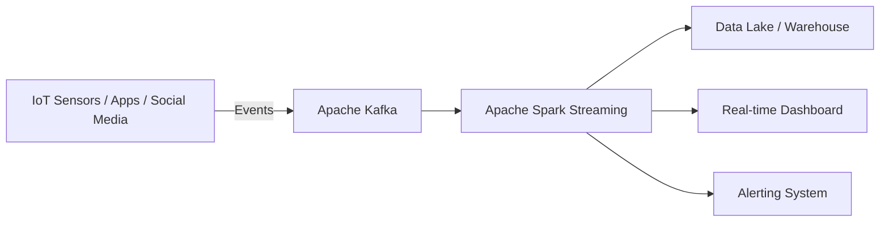

# Sources of Data

## Overview

Modern data engineering operates in an environment where data is more **dynamic, diverse, and distributed** than ever before. Understanding *where* data originates is foundational: the choice of data source directly influences ingestion strategy, pipeline architecture, storage design, and downstream analytics quality.

This document catalogues the primary categories of data sources encountered in real-world data engineering work, explains their characteristics, and highlights tools and use cases associated with each.

---

## 1. Relational Databases

### What They Are

Organizations rely on **relational database management systems (RDBMS)** to power their internal applications — managing day-to-day business activities such as customer transactions, human resource operations, and operational workflows. These systems store data in a highly structured, tabular format governed by a schema.

**Common RDBMS platforms:**

| Platform     | Common Use Case                          |
|--------------|------------------------------------------|
| SQL Server   | Enterprise ERP and CRM systems           |
| Oracle DB    | Financial and large-scale OLTP workloads |
| MySQL        | Web applications and SaaS platforms      |
| IBM DB2      | Banking, insurance, and mainframe-backed systems |

### Role as a Data Source

Data stored in relational databases and data warehouses serves as a primary source for analytical pipelines. Examples:

- **Retail transaction systems** → regional sales analysis, inventory forecasting
- **CRM systems** → sales projections, customer churn prediction, lead scoring

### Key Characteristics

- Structured data with enforced schemas
- Supports ACID transactions
- Queried via SQL
- Well-suited for joins across normalized tables

---

## 2. Flat Files and XML Datasets

External datasets — from government agencies, data vendors, and third-party providers — are commonly distributed as **flat files** or **XML documents**. These formats are widely used because they are portable, human-readable, and do not require a database engine to consume.

### 2.1 Flat Files

Flat files store data in **plain text format**, with one record per line and values separated by a **delimiter** (comma, semicolon, tab, pipe, etc.).

> **Key distinction:** Flat files map to a **single table**, unlike relational databases which contain multiple related tables.

**Common delimiter types:**

| Format | Delimiter       | Extension   |
|--------|-----------------|-------------|
| CSV    | Comma (`,`)     | `.csv`      |
| TSV    | Tab (`\t`)      | `.tsv`      |
| PSV    | Pipe (`\|`)     | `.txt`/`.psv` |

### 2.2 Spreadsheet Files

Spreadsheets are a **specialized form of flat file** that organize data in a tabular (rows and columns) layout. Unlike basic flat files:

- A single spreadsheet can contain **multiple worksheets**, each mapping to a different logical table.
- Files can store **additional metadata** such as formatting, formulas, data validation rules, and charts — beyond raw data.
- Although content is text-based, the files are stored in **proprietary or open binary formats**.

**Common spreadsheet formats:**

| Application     | Format(s)         |
|-----------------|-------------------|
| Microsoft Excel | `.xls`, `.xlsx`   |
| Google Sheets   | Google-native (cloud) |
| Apple Numbers   | `.numbers`        |
| LibreOffice Calc | `.ods`           |

### 2.3 XML Files

**XML (Extensible Markup Language)** files identify data values using **tags**, enabling representation of more complex, **hierarchical data structures** — unlike the flat, single-table nature of CSV files.

```xml
<!-- Example: A bank statement entry in XML -->
<transaction>
  <date>2024-06-15</date>
  <description>Wire Transfer</description>
  <amount currency="USD">5000.00</amount>
  <type>debit</type>
</transaction>
```

**Common XML use cases in data engineering:**

- Data from online surveys
- Bank statements and financial exports
- Configuration files for ETL tools
- RSS and Atom feeds
- Legacy enterprise system integrations

---

## 3. APIs and Web Services

**APIs (Application Programming Interfaces)** and **Web Services** are programmatic interfaces that allow multiple users or applications to request and receive data over a network — without direct database access.

### How They Work

APIs typically **listen for incoming requests** (HTTP/HTTPS) and return data in one of several formats:

- Plain text
- **JSON** (most common in modern APIs)
- XML
- HTML
- Binary / media files

### Common API Data Source Use Cases

| Use Case | Example APIs |
|---|---|
| Social media analytics | Twitter API, Facebook Graph API |
| Financial market data | Stock market APIs (share prices, EPS, historical data) |
| Data validation and enrichment | Postal/ZIP code lookup APIs, address verification |
| Internal database access | Enterprise REST APIs wrapping internal databases |

#### Example: Social Media Sentiment Analysis

Twitter and Facebook APIs are widely used to source posts and tweets for **opinion mining** and **sentiment analysis** — summarizing public appreciation or criticism of a product, service, government policy, or brand.

#### Example: Stock Market APIs

These APIs supply:
- Real-time and historical share prices
- Commodity prices
- Earnings per share (EPS)
- Used for algorithmic trading systems and financial analytics pipelines

#### Example: Data Lookup APIs

Useful during **data preparation and cleansing** phases — for example, resolving which city or state a postal/ZIP code belongs to, enabling accurate geographic co-relation across datasets.

---

## 4. Web Scraping

**Web scraping** (also called *screen scraping*, *web harvesting*, or *web data extraction*) is a technique for programmatically extracting structured data from **unstructured web page sources** based on defined parameters.

### What Can Be Scraped

- Text content
- Contact information
- Images and videos
- Product listings and pricing
- Forum posts and community data

### Common Use Cases

| Use Case | Description |
|---|---|
| Price comparison engines | Collect product details from retailers, manufacturers, and eCommerce sites |
| Sales lead generation | Extract business contact data from public directories |
| Community intelligence | Extract posts and author metadata from forums |
| ML dataset construction | Build training and testing datasets for machine learning models |

### Popular Web Scraping Tools

| Tool | Notes |
|---|---|
| **BeautifulSoup** | Python library for parsing HTML/XML trees |
| **Scrapy** | Full-featured Python scraping framework with built-in crawling |
| **Pandas** | Can read HTML tables directly via `pd.read_html()` |
| **Selenium** | Automates a real browser; handles JavaScript-rendered pages |

```python
# Example: Simple web scrape using BeautifulSoup
import requests
from bs4 import BeautifulSoup

url = "https://example.com/products"
response = requests.get(url)
soup = BeautifulSoup(response.content, "html.parser")

products = soup.find_all("div", class_="product-item")
for product in products:
    name = product.find("h2").text
    price = product.find("span", class_="price").text
    print(f"{name}: {price}")
```

> **Best Practice:** Always check a website's `robots.txt` and terms of service before scraping. Many sites prohibit automated access or rate-limit aggressively.

---

## 5. Data Streams and Feeds

**Data streams** represent a fundamentally different ingestion paradigm: instead of querying a static dataset, engineers **aggregate continuous, real-time flows of data** from a variety of live sources.

### Characteristics of Streaming Data

- **Timestamped:** Each event carries a timestamp indicating when it was generated.
- **Geo-tagged:** Many streams include geographic metadata (latitude/longitude) for location-aware analytics.
- **Unbounded:** Unlike batch datasets, streams have no defined end — they are continuous by nature.

### Common Data Stream Sources

| Source | Engineering Use Case |
|---|---|
| Stock and market tickers | Real-time financial trading algorithms |
| Retail transaction streams | Demand prediction, supply chain optimization |
| Surveillance and video feeds | Threat detection, security monitoring |
| Social media feeds | Sentiment analysis, trend detection |
| Industrial IoT sensor data | Predictive maintenance for machinery |
| Web click/event streams | Web performance monitoring, UX optimization |
| Real-time flight event data | Rebooking and schedule rescheduling systems |
| GPS data from vehicles | Route optimization, traffic analytics |

### Stream Processing Platforms

| Tool | Description |
|---|---|
| **Apache Kafka** | Distributed event streaming platform; acts as a high-throughput message broker |
| **Apache Spark Streaming** | Micro-batch and continuous stream processing on top of Spark |
| **Apache Storm** | Low-latency, distributed real-time computation system |



---

## 6. RSS Feeds

**RSS (Really Simple Syndication)** feeds are a specialized form of data stream designed for capturing **continuously refreshed content** from online sources such as news sites, blogs, and forums.

### How RSS Works

1. A publisher (e.g., a news website) generates an **RSS XML file** that lists recent articles, titles, links, and publication dates.
2. A **feed reader** (aggregator) periodically polls the RSS endpoint and parses the XML.
3. New or updated content is streamed to subscriber devices or downstream systems.

### Engineering Use Cases

- Monitoring competitor news and press releases
- Aggregating industry publications for NLP analysis
- Building news sentiment pipelines
- Tracking regulatory or policy updates in real time

---

## Summary and Key Takeaways

| Source Type | Format | Latency | Best For |
|---|---|---|---|
| Relational Databases | Tables (SQL) | Batch / Near-real-time | Structured transactional data |
| Flat Files / CSV | Delimited text | Batch | Bulk data transfer, simple datasets |
| Spreadsheets | `.xlsx`, `.ods` | Batch | Business reports, ad-hoc data |
| XML Files | Tagged markup | Batch | Hierarchical and legacy data |
| APIs / Web Services | JSON, XML | Near-real-time | Third-party data integration |
| Web Scraping | HTML → structured | Batch / Scheduled | Public web data without an API |
| Data Streams | Event records | Real-time | IoT, financial tickers, clickstreams |
| RSS Feeds | XML | Near-real-time | News, blogs, forum content |

**Core principles to remember:**

- **Match source type to ingestion strategy:** Static files suit batch pipelines; streams require dedicated streaming platforms.
- **Understand data freshness requirements:** Real-time use cases (trading, fraud detection) cannot rely on batch file drops.
- **APIs abstract complexity but introduce rate limits and schema drift:** always build robust error handling and schema validation into API-based pipelines.
- **Web scraping is fragile by nature:** website structure changes break scrapers. Maintain scrapers actively and prefer APIs when available.
- **Streaming data must be handled at scale:** tools like Kafka are designed for fault-tolerant, high-throughput delivery — do not attempt to handle high-volume streams with simple polling loops.
