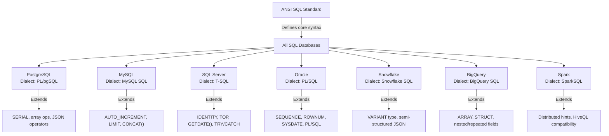

> **Course 1:** Introduction to Data Engineering
> **Module 2:** The Data Engineering Ecosystem

# SQL Vendors and Platform Variations

---

## Overview

When learning SQL, one of the first confusing moments is hearing that "SQL is standardized, but every vendor is a little different." This document explains what a **vendor** is in the context of databases, what **ANSI SQL** (the standard) means, why vendors deviate from it, and what this means practically for a data engineer.

---

## What is a "Vendor" in Software?

A **vendor** is simply a **company that builds and sells (or distributes) a software product**.

In the context of databases, a vendor is the organization that created and maintains a specific database system. You don't just use "SQL" in the abstract — you use SQL *through* a specific database product that a vendor built.

Think of it like this:

> **SQL is the language. The database is the engine. The vendor built the engine.**

Just like every car runs on the same roads and uses the same traffic laws, but a Toyota engine behaves differently from a BMW engine under the hood — all SQL databases accept SQL, but each one has its own implementation, quirks, and extra features.

---

## The Major SQL Database Vendors

| Vendor | Product | Type | Notes |
|---|---|---|---|
| **Oracle Corporation** | Oracle Database | Commercial | Dominant in enterprise/banking; very feature-rich |
| **Microsoft** | SQL Server (MSSQL) | Commercial | Common in Windows-heavy enterprises; uses T-SQL dialect |
| **IBM** | Db2 | Commercial | Used in mainframe and enterprise environments |
| **MySQL AB → Oracle** | MySQL | Open-source | Most popular for web applications (LAMP stack) |
| **PostgreSQL Global Dev Group** | PostgreSQL | Open-source | Most SQL-standards-compliant; highly extensible |
| **SQLite Consortium** | SQLite | Open-source | Lightweight, file-based; used in mobile apps and browsers |
| **Snowflake Inc.** | Snowflake | Cloud (SaaS) | Cloud-native data warehouse; columnar storage |
| **Google** | BigQuery | Cloud (SaaS) | Serverless, massively scalable analytics warehouse |
| **Amazon (AWS)** | Amazon Redshift | Cloud (SaaS) | Cloud data warehouse; PostgreSQL-based |
| **Databricks** | Databricks SQL / Spark SQL | Cloud (SaaS) | SQL interface on top of Apache Spark |
| **Microsoft** | Azure Synapse Analytics | Cloud (SaaS) | Microsoft's cloud data warehouse |

Each of these products accepts SQL — but they don't all accept *identical* SQL.

---

## Why is There a Standard at All? — ANSI SQL

In the early days of relational databases (1970s–1980s), every database vendor invented their own query language. This was chaotic — a query written for Oracle couldn't run on IBM's database at all.

To fix this, the **American National Standards Institute (ANSI)** and the **International Organization for Standardization (ISO)** created a standardized specification for SQL. This is referred to as **ANSI SQL** or **Standard SQL**.

### What ANSI SQL Defines

ANSI SQL specifies the core syntax and behavior that every SQL-compliant database must support:

```sql
-- These are ANSI SQL — they work on virtually every database

SELECT first_name, last_name
FROM employees
WHERE department = 'Engineering';

SELECT department, COUNT(*) AS headcount, AVG(salary) AS avg_salary
FROM employees
GROUP BY department
HAVING AVG(salary) > 80000;

SELECT e.first_name, d.department_name
FROM employees e
JOIN departments d ON e.department_id = d.department_id;

INSERT INTO employees (first_name, last_name, department)
VALUES ('Alice', 'Johnson', 'Engineering');

UPDATE employees SET salary = 95000 WHERE employee_id = 1001;

DELETE FROM employees WHERE employee_id = 1005;
```

If you write queries using only the constructs above, they will run on virtually any SQL database with little to no modification.

### ANSI SQL Versions Over Time

| Standard | Year | Notable Additions |
|---|---|---|
| SQL-86 | 1986 | First official standard |
| SQL-89 | 1989 | Minor refinements |
| SQL-92 | 1992 | Joins, subqueries, string functions |
| SQL:1999 | 1999 | Recursive queries, triggers, OO features |
| SQL:2003 | 2003 | Window functions, XML support, sequences |
| SQL:2008 | 2008 | TRUNCATE, FETCH FIRST (LIMIT) |
| SQL:2011 | 2011 | Temporal tables (time-travel queries) |
| SQL:2016 | 2016 | JSON support |
| SQL:2023 | 2023 | Property graph queries, multi-dimensional arrays |

---

## Why Do Vendors Deviate from the Standard?

Despite the standard existing, vendors deviate for several reasons:

### 1. The Standard Leaves Gaps
ANSI SQL does not define *everything*. Many common operations — auto-incrementing IDs, string manipulation, date arithmetic, pagination — were left unspecified in early versions. Vendors filled these gaps with their own solutions before the standard caught up.

### 2. Performance Optimizations
Each vendor builds their database engine differently. They may introduce syntax or hints that expose their specific engine's optimization capabilities, which would not make sense in a generic standard.

### 3. Competitive Differentiation
Vendors add proprietary features to make their product more powerful or easier to use. This creates lock-in — once you use a vendor-specific feature, your queries don't easily migrate to a competitor.

### 4. Historical Legacy
Some vendors (Oracle, SQL Server) have decades of proprietary syntax. Users built massive codebases on top of those features. Removing them would break existing systems.

---

## What Are "Vendor Extensions" and "Dialects"?

A **SQL dialect** is the specific flavor of SQL that a database vendor implements — the combination of standard SQL plus that vendor's own additions, modifications, and omissions.

A **vendor extension** is a specific feature a vendor added that is not part of the ANSI SQL standard.

### Real-World Examples of Vendor Differences

#### Auto-Incrementing Primary Keys

```sql
-- MySQL / MariaDB
CREATE TABLE employees (
    employee_id INT AUTO_INCREMENT PRIMARY KEY,
    first_name  VARCHAR(100)
);

-- PostgreSQL
CREATE TABLE employees (
    employee_id SERIAL PRIMARY KEY,
    first_name  VARCHAR(100)
);

-- SQL Server (T-SQL)
CREATE TABLE employees (
    employee_id INT IDENTITY(1,1) PRIMARY KEY,
    first_name  VARCHAR(100)
);

-- Oracle
CREATE SEQUENCE emp_seq START WITH 1 INCREMENT BY 1;
CREATE TABLE employees (
    employee_id INT DEFAULT emp_seq.NEXTVAL PRIMARY KEY,
    first_name  VARCHAR(100)
);

-- ANSI SQL:2003+ standard
CREATE TABLE employees (
    employee_id INT GENERATED ALWAYS AS IDENTITY PRIMARY KEY,
    first_name  VARCHAR(100)
);
```

#### Limiting Query Results

```sql
-- MySQL, PostgreSQL, SQLite, BigQuery
SELECT * FROM employees LIMIT 10;

-- SQL Server (T-SQL)
SELECT TOP 10 * FROM employees;

-- Oracle (older versions)
SELECT * FROM employees WHERE ROWNUM <= 10;

-- Oracle 12c+ / ANSI SQL:2008
SELECT * FROM employees FETCH FIRST 10 ROWS ONLY;
```

#### String Concatenation

```sql
-- ANSI SQL standard: || operator
SELECT first_name || ' ' || last_name AS full_name FROM employees;

-- SQL Server: + operator
SELECT first_name + ' ' + last_name AS full_name FROM employees;

-- MySQL: CONCAT() function
SELECT CONCAT(first_name, ' ', last_name) AS full_name FROM employees;
```

#### Getting the Current Date/Time

```sql
-- MySQL
SELECT NOW();
SELECT CURDATE();

-- PostgreSQL
SELECT NOW();
SELECT CURRENT_DATE;

-- SQL Server
SELECT GETDATE();

-- Oracle
SELECT SYSDATE FROM DUAL;

-- ANSI SQL (works in most modern systems)
SELECT CURRENT_TIMESTAMP;
```

---

## Vendor-Specific SQL Dialects

| Dialect | Vendor / Platform | Key Characteristics |
|---|---|---|
| **T-SQL** (Transact-SQL) | Microsoft SQL Server, Azure SQL | Procedural programming, `TOP`, `IDENTITY`, `GETDATE()`, `TRY/CATCH` |
| **PL/SQL** | Oracle Database | Full procedural language with loops, cursors, exceptions, packages |
| **PL/pgSQL** | PostgreSQL | Procedural language similar to PL/SQL |
| **MySQL SQL** | MySQL, MariaDB | `AUTO_INCREMENT`, `LIMIT`, unique string functions |
| **SparkSQL** | Apache Spark / Databricks | SQL over distributed data; HiveQL-compatible |
| **BigQuery SQL** | Google BigQuery | Extensions for arrays, structs, nested data |
| **Snowflake SQL** | Snowflake | Close to ANSI; adds VARIANT type for JSON |

---

## What This Means Practically for a Data Engineer

### You Learn SQL Once, Then Adapt

The core of SQL — `SELECT`, `FROM`, `WHERE`, `JOIN`, `GROUP BY`, `HAVING`, `ORDER BY`, `INSERT`, `UPDATE`, `DELETE` — is consistent everywhere. Learning it once gives you 80–90% of what you need on any platform.

```
Core ANSI SQL (universal)
├── SELECT / FROM / WHERE / JOIN
├── GROUP BY / HAVING / ORDER BY
├── INSERT / UPDATE / DELETE
├── Subqueries and CTEs (WITH clause)
└── Window functions (most modern databases)

Vendor-specific (check the docs)
├── Auto-increment syntax
├── Date/time functions
├── String functions
├── Pagination (LIMIT vs TOP vs FETCH FIRST)
├── JSON/array handling
├── Procedural logic (IF, LOOP, cursors)
└── Performance hints and query options
```

### Migration Between Databases is Not Trivial

If a company decides to migrate from Oracle to PostgreSQL, a data engineer must audit all existing SQL code for vendor-specific syntax and rewrite it. This is called **SQL migration** or **query porting**, and it is a real, non-trivial engineering task.

### Cloud Warehouses Are "Close Enough" to Standard

Modern cloud data warehouses (Snowflake, BigQuery, Redshift) all aim for close compliance with ANSI SQL, making queries more portable across platforms than in the Oracle/SQL Server era. However, they still have their own extensions — especially around handling **semi-structured data** (JSON, arrays, nested records).

---

## Visual Summary



---

## Key Takeaways

- A **vendor** is the company that built a specific database product (Oracle, Microsoft, Google, Snowflake, etc.).
- **ANSI SQL** is the international standard that defines a common SQL core — it's what makes SQL "portable."
- Despite the standard, every vendor adds **extensions**, creating a unique **SQL dialect**.
- The **core SQL** (SELECT, JOIN, GROUP BY, etc.) works everywhere. Differences appear in auto-increment syntax, date functions, pagination, JSON handling, and procedural logic.
- As a data engineer, you will encounter multiple SQL dialects. The skill is not memorizing every vendor's syntax — it is knowing that differences exist, knowing where to look them up, and adapting your queries to the platform you're on.

> **Best Practice:** When starting work on a new database platform, immediately identify the dialect and bookmark the official documentation's function reference. This single habit saves hours of debugging syntax errors that are not logic errors — just dialect differences.
