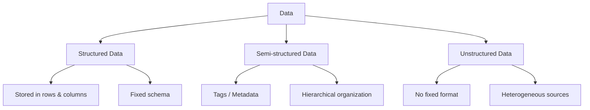

> **Course 1:** Introduction to Data Engineering
> **Module 2:** The Data Engineering Ecosystem

# Types of Data

## Overview

Data is the raw material that data engineers collect, transport, transform, and store so that it can eventually be turned into insight. Before diving into pipelines, tools, or storage systems, it is essential to understand **what data actually looks like** when it arrives — because the *type* of data determines almost every downstream decision: which database to use, which file format to choose, which processing tools apply, and how a pipeline should be designed.

At a foundational level, **data** is unorganized information that is processed to make it meaningful. It is composed of facts, observations, perceptions, numbers, characters, symbols, and images that can be interpreted to derive meaning. While data can be categorized along many dimensions, one of the most fundamental and widely used classifications is by **structure**. Under this classification, data falls into three broad categories:

- **Structured data**
- **Semi-structured data**
- **Unstructured data**

Understanding these categories is a prerequisite for nearly every later topic in data engineering, including data repositories, data lakes, data warehouses, and ETL/ELT pipeline design.



---

## 1. Structured Data

### Definition

**Structured data** has a well-defined structure, or adheres to a specified data model. It can be stored in well-defined schemas, such as those found in relational databases, and in many cases can be represented in a tabular form — that is, organized into **rows and columns**.

Structured data essentially consists of objective facts and numbers. Because it conforms to a predictable schema, it can be easily collected, exported, stored, organized, and queried using standard tools.

### Common Sources of Structured Data

| Source | Description |
|---|---|
| **SQL Databases / OLTP Systems** | Online Transaction Processing systems that record day-to-day business transactions (e.g., banking, retail sales) |
| **Spreadsheets** | Tools such as Microsoft Excel and Google Sheets, where data is naturally arranged in rows and columns |
| **Online Forms** | Web or app forms that capture structured fields (name, email, date, etc.) |
| **Sensors** | Devices such as GPS (Global Positioning System) and RFID (Radio Frequency Identification) tags that emit structured readings |
| **Network and Web Server Logs** | Logs that follow a consistent, predictable format for each entry |

### Why It Matters

> **Best Practice:** Structured data's predictability makes it the easiest data type to validate, index, and query efficiently. Whenever data *can* be modeled with a fixed schema, doing so early in the pipeline reduces downstream processing complexity.

Structured data is typically stored in **relational (SQL) databases**, and it lends itself naturally to standard data analysis methods and tools (SQL queries, BI dashboards, statistical packages, etc.) because its shape is known in advance.

```sql
-- Example: structured data represented in a relational table
CREATE TABLE transactions (
    transaction_id INT PRIMARY KEY,
    customer_id INT,
    transaction_date DATE,
    amount DECIMAL(10,2),
    payment_method VARCHAR(20)
);
```

---

## 2. Semi-Structured Data

### Definition

**Semi-structured data** has *some* organizational properties, but it lacks a fixed or rigid schema. Unlike structured data, it cannot be neatly stored in the rows-and-columns format of a traditional database. Instead, it contains **tags and elements (metadata)** that are used to group data and organize it into a hierarchy.

This middle category exists because much real-world data is *partially* organized — it has identifiable components, but those components can vary from record to record (e.g., optional fields, nested structures, varying depth).

### Common Sources of Semi-Structured Data

- E-mails (structured headers like sender/subject, but unstructured body content)
- XML and other markup languages
- Binary executables
- TCP/IP network packets
- Zipped/compressed files
- Data integrated from multiple heterogeneous sources

### Key Formats: XML and JSON

**XML (eXtensible Markup Language)** and **JSON (JavaScript Object Notation)** are the two most widely used formats for representing semi-structured data. Both allow users to define their own **tags and attributes**, enabling data to be stored and exchanged in a **hierarchical** form.

```xml
<!-- Example: semi-structured data in XML -->
<customer>
    <name>Jane Doe</name>
    <email>jane.doe@example.com</email>
    <orders>
        <order id="1001">
            <item>Laptop</item>
            <price>1200.00</price>
        </order>
    </orders>
</customer>
```

```json
{
  "customer": {
    "name": "Jane Doe",
    "email": "jane.doe@example.com",
    "orders": [
      { "id": 1001, "item": "Laptop", "price": 1200.00 }
    ]
  }
}
```

> **Why It Matters:** Because semi-structured data carries its own metadata (tags), it is self-describing to a degree — a consumer of the data can infer some structure without needing an external schema definition, unlike unstructured data.

---

## 3. Unstructured Data

### Definition

**Unstructured data** is data that does not have an easily identifiable structure, and therefore cannot be organized into the rows-and-columns format of a mainstream relational database. It does not follow a particular format, sequence, semantics, or set of rules.

Unstructured data is inherently **heterogeneous** — it can take many different forms and originate from many different sources — and it has become central to modern business intelligence (BI) and analytics applications (e.g., sentiment analysis, image recognition, natural language processing).

### Common Sources of Unstructured Data

- Web pages
- Social media feeds
- Images, in varied formats (JPEG, GIF, PNG)
- Video and audio files
- Documents and PDF files
- PowerPoint presentations
- Media logs
- Survey responses (open-ended/free text)

### Storage Considerations

Unstructured data is typically stored in one of two ways:

1. **Files and documents** (e.g., a Word document) — appropriate for manual or ad-hoc analysis.
2. **NoSQL databases** — which come with their own specialized tools for examining and querying this type of data, since traditional SQL engines are not well-suited to unstructured content.

> **Common Pitfall:** Treating unstructured data as if it can be forced into a rigid schema early in a pipeline often leads to data loss or excessive preprocessing overhead. Instead, unstructured data is usually ingested "as-is" into flexible storage (such as a data lake or NoSQL store) and structured later, closer to the point of analysis.

---

## Comparison Summary

| Characteristic | Structured Data | Semi-Structured Data | Unstructured Data |
|---|---|---|---|
| **Schema** | Fixed, well-defined | Flexible, tag/metadata-based | None |
| **Storage Format** | Rows and columns (tabular) | Hierarchical (tags/elements) | No consistent format |
| **Typical Storage** | Relational / SQL databases | XML/JSON stores, document stores | Files, NoSQL databases, data lakes |
| **Examples** | SQL databases, spreadsheets, sensor data | Emails, XML, JSON, TCP/IP packets | Images, videos, PDFs, social media feeds |
| **Ease of Analysis** | High — standard tools and methods apply directly | Moderate — requires parsing tags/hierarchy | Lower — often requires specialized tools (NLP, computer vision, etc.) |

---

## Key Takeaways

1. **Data** is raw, unorganized information that becomes meaningful once processed and interpreted.
2. Data can be classified by structure into three categories: **structured**, **semi-structured**, and **unstructured**.
3. **Structured data** follows a fixed schema, fits naturally into rows and columns, and is the easiest to store and analyze using standard relational database tools.
4. **Semi-structured data** has partial organization via tags/metadata (commonly XML or JSON) and is organized hierarchically rather than tabularly.
5. **Unstructured data** has no identifiable structure, comes from highly varied sources (text, images, audio, video), and is typically stored in files or NoSQL databases with specialized analysis tools.
6. Recognizing which category a dataset belongs to is a foundational step in data engineering, as it directly informs decisions about storage systems, file formats, and processing tools later in the data lifecycle.

*Next topic: Understanding Different Types of File Formats.*
