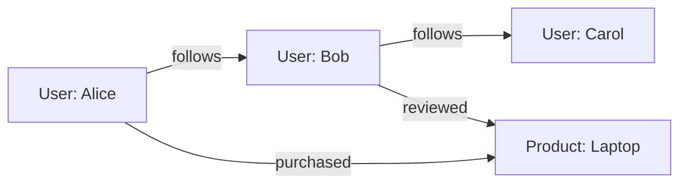
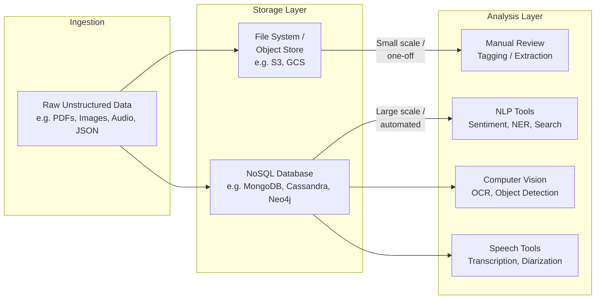

> **Course 1:** Introduction to Data Engineering
> **Module 2:** The Data Engineering Ecosystem

# Unstructured Data: Storage and Analysis Paths

## Overview

Unstructured data — text documents, PDFs, images, audio recordings, social media posts, video files — has no fixed schema and cannot be forced into traditional rows-and-columns storage without significant pre-processing. This creates a fundamental challenge: how do you store something that has no predictable shape, and how do you extract meaning from it once it's stored?

The answer depends on **scale and intent**. At small volumes or for one-off investigations, a lightweight file-based approach with human review is often the most pragmatic option. At scale, however, dedicated NoSQL databases and specialized analysis tooling become necessary. These two paths are not mutually exclusive — many real-world pipelines begin with manual exploration and graduate to automated, tool-assisted analysis as data volumes grow.

This document explores both paths in detail: the storage options available for unstructured data, the analysis tools paired with each, and the design principles that explain *why* these two concerns — storage and analysis — are handled as separate layers in the unstructured world.

---

## The Core Distinction: Structured vs. Unstructured Data Handling

With **structured data** (e.g., a relational database), the storage engine and the analysis interface are tightly coupled. You store data in a SQL database and you query it with SQL — the same system handles both concerns.

With **unstructured data**, this tight coupling breaks down. There is no universal query language for a folder of PDFs or a collection of audio recordings. Instead, the pipeline splits into two distinct layers:

| Concern | Structured Data | Unstructured Data |
|---|---|---|
| **Storage** | Relational database (PostgreSQL, MySQL, etc.) | File system / document store / NoSQL |
| **Analysis interface** | SQL | Varies by content type (NLP, CV, search, etc.) |
| **Schema requirement** | Required at write time | Not required |
| **Scalability of analysis** | Native (SQL engines scale with the DB) | Requires external tooling |

The practical implication: when designing a pipeline for unstructured data, you must make *two* independent architectural decisions — where to store the data, and what tools will analyze it.

---

## Path 1: Files and Documents → Manual Analysis

### When to Use This Path

This approach is appropriate when:

- Data volumes are small or bounded (e.g., a one-time batch of scanned contracts, a folder of weekly reports).
- The analysis task is exploratory or non-repeating (e.g., a business analyst reviewing documents to answer a specific question).
- Automation is not yet justified by cost or complexity.
- The output is human judgment rather than a machine-generated signal.

### Storage: File Systems and Document Repositories

In this path, unstructured data is stored exactly as it arrives — as files. Common storage locations include:

- **Local or network file systems** — directories of `.pdf`, `.docx`, `.jpg`, `.mp4`, etc.
- **Cloud object stores** — Amazon S3, Google Cloud Storage, Azure Blob Storage. These are effectively infinitely scalable file systems in the cloud. Files are stored as "objects" with metadata but no enforced schema.
- **Document management systems** — SharePoint, Google Drive, Confluence. These add metadata (author, date, tags) and access control on top of raw file storage but do not transform the underlying content.

> **Best Practice:** Even when storing raw files, attach as much metadata as possible (source, ingestion timestamp, content type, size, owner). This metadata, often managed in a separate catalog or database, is what makes later retrieval feasible.

### Analysis: Manual Review

"Analysis" in this path means a human engaging directly with the content. This may involve:

- **Reading and summarizing** — a data analyst or domain expert reads documents and extracts key findings.
- **Tagging and labeling** — manually applying categories or labels to files for downstream use (e.g., labeling a set of support tickets as "billing", "technical", "complaint").
- **Point-tool usage** — using Ctrl+F in a PDF reader, grep in a terminal, or find-in-files in an IDE to locate specific strings.
- **Spreadsheet extraction** — copying key data points from documents into a structured spreadsheet for further analysis.

### Limitations of This Path

| Limitation | Description |
|---|---|
| **Does not scale** | A team of analysts cannot manually review millions of documents. |
| **Inconsistency** | Different reviewers may interpret or label the same content differently. |
| **No repeatability** | Manual analysis cannot be re-run automatically when new data arrives. |
| **No aggregation** | You cannot ask "what is the average sentiment across 50,000 reviews?" via manual review. |

Manual analysis is a valid starting point, but it is a dead end at scale. The moment volume, velocity, or the need for repeatable, automated insight emerges, the pipeline must migrate to Path 2.

---

## Path 2: NoSQL Databases → Specialized Analysis Tools

### When to Use This Path

This approach is appropriate when:

- Data volumes are large (millions of documents, images, or records).
- Analysis must be automated, repeatable, or real-time.
- Multiple downstream consumers need access to the same data.
- The analysis task is well-defined enough to be expressed as a pipeline or model.

### Storage: NoSQL Databases

NoSQL ("Not Only SQL") databases are designed to store data without requiring a fixed schema. This makes them well-suited to unstructured and semi-structured data. There are four major NoSQL data models, each optimized for different content types:

#### Document Stores

Store data as self-describing documents, typically JSON or BSON. Each document can have a different structure — there is no enforced schema across a collection.

- **Example:** MongoDB, CouchDB
- **Best for:** JSON/XML data, content management, user profiles, product catalogs, logs
- **Key trait:** Documents are queryable (e.g., find all documents where `status == "active"`), but there is no join semantics across documents by default.

```json
// Example MongoDB document — note the variable structure per record
{
  "_id": "doc_001",
  "type": "support_ticket",
  "customer": "Acme Corp",
  "description": "Login page returns 502 after password reset.",
  "tags": ["auth", "bug", "high-priority"],
  "attachments": ["screenshot_1.png"]
}
```

#### Key-Value Stores

Store data as simple key → value pairs. The value can be anything: a string, a blob, a JSON object. The store has no awareness of the value's internal structure.

- **Example:** Redis, DynamoDB (in key-value mode)
- **Best for:** Caching, session storage, real-time leaderboards, feature flags
- **Key trait:** Extremely fast reads and writes; no query capability on the value's contents.

#### Wide-Column Stores

Organize data into rows and dynamic columns. Unlike relational databases, each row can have a different set of columns, and columns are grouped into "column families."

- **Example:** Apache Cassandra, HBase
- **Best for:** Time-series data, IoT sensor streams, event logs, write-heavy workloads
- **Key trait:** Horizontally scalable to petabyte scale; optimized for append-heavy workloads.

#### Graph Databases

Store data as nodes (entities) and edges (relationships), enabling traversal of complex, many-to-many relationships that would require expensive JOINs in a relational system.

- **Example:** Neo4j, Amazon Neptune
- **Best for:** Social networks, fraud detection, knowledge graphs, recommendation engines
- **Key trait:** Query language traverses relationships naturally (e.g., "find all users within 3 hops of this fraudulent account").



#### NoSQL vs. Relational — Side-by-Side

| Dimension | Relational (SQL) | NoSQL |
|---|---|---|
| Schema | Fixed, enforced at write | Flexible, enforced at read (schema-on-read) |
| Scaling model | Vertical (bigger server) | Horizontal (more servers) |
| Query language | SQL (universal) | Database-specific (MQL, CQL, Cypher, etc.) |
| Joins | Native and efficient | Limited or absent |
| ACID compliance | Strong by default | Varies (eventual consistency common) |
| Best fit | Structured, relational data | Unstructured, high-volume, diverse data |

> **Common Pitfall:** Choosing a NoSQL store because it sounds modern, without considering the data model. Each NoSQL type is optimized for a specific access pattern. Using a key-value store for data that requires rich querying, or a document store for heavily relational data, leads to poor performance and complex application-layer workarounds.

---

### Analysis: Specialized Tools by Content Type

Once unstructured data is loaded into a NoSQL store (or even into an object store), the analysis layer uses tools purpose-built for that content type. Unlike SQL, there is no universal analysis interface — the right tool depends on what kind of unstructured data you have.

#### Text and Natural Language Processing (NLP)

Text data (documents, emails, social media posts, support tickets) requires NLP tools that can parse language semantically rather than just pattern-match strings.

Common NLP analysis tasks:

| Task | Description | Example Tools |
|---|---|---|
| **Sentiment analysis** | Classify text as positive, negative, or neutral | Hugging Face Transformers, VADER, spaCy |
| **Named entity recognition (NER)** | Extract people, places, organizations, dates | spaCy, Stanford NLP, AWS Comprehend |
| **Topic modeling** | Discover latent themes across a document corpus | LDA (Gensim), BERTopic |
| **Text classification** | Categorize documents into predefined classes | scikit-learn, fine-tuned BERT models |
| **Summarization** | Generate condensed versions of long documents | GPT-based models, BART |
| **Full-text search** | Retrieve documents matching a query term or phrase | Elasticsearch, OpenSearch, Apache Solr |

```python
# Example: Named Entity Recognition with spaCy
import spacy

nlp = spacy.load("en_core_web_sm")
doc = nlp("Acme Corp filed a complaint with the SEC on March 15, 2024.")

for ent in doc.ents:
    print(f"{ent.text:30} → {ent.label_}")

# Output:
# Acme Corp                      → ORG
# SEC                            → ORG
# March 15, 2024                 → DATE
```

> **Note on Full-Text Search:** Elasticsearch and OpenSearch are commonly layered *on top of* a primary NoSQL or object store. The documents live in MongoDB or S3; Elasticsearch holds an inverted index of their contents for fast keyword and relevance-ranked retrieval. These two systems serve different purposes and are often run in tandem.

#### Computer Vision (Images and Video)

Image and video data requires pixel-level or feature-level analysis that SQL cannot provide.

| Task | Description | Example Tools |
|---|---|---|
| **Image classification** | Assign a label to an image | TensorFlow, PyTorch, AWS Rekognition |
| **Object detection** | Identify and locate objects within an image | YOLO, Detectron2, Azure Computer Vision |
| **OCR (Optical Character Recognition)** | Extract text from scanned images or documents | Tesseract, AWS Textract, Google Vision API |
| **Facial recognition** | Identify or verify individuals | AWS Rekognition, DeepFace |
| **Video analysis** | Extract frames, detect motion, recognize actions | OpenCV, Google Video Intelligence API |

#### Audio and Speech Analysis

Audio data requires transformation into a format that downstream tools can process (typically, transcription to text followed by NLP).

| Task | Description | Example Tools |
|---|---|---|
| **Speech-to-text** | Transcribe spoken audio to text | Whisper (OpenAI), Google Speech-to-Text, AWS Transcribe |
| **Speaker diarization** | Identify who is speaking at each moment | pyannote.audio |
| **Audio classification** | Categorize audio clips (music genre, background noise, etc.) | librosa + ML models |
| **Sentiment from speech** | Detect emotional tone in voice recordings | AWS Comprehend (after transcription) |

---

## The Storage–Analysis Split: A Design Principle

The architectural insight this section illustrates is worth making explicit:

> **In unstructured data pipelines, storage and analysis are decoupled layers. You choose each independently, and you connect them deliberately.**

This stands in contrast to structured data, where the storage system *is* the analysis interface (a Postgres database you query with SQL). In unstructured pipelines:

1. **Storage layer** answers: "Where does this data live in a way that is durable, scalable, and retrievable?"
2. **Analysis layer** answers: "What specialized processing does this content type require to extract meaning?"



The choice of path is driven by **volume and repeatability**, not by the content type alone. A company with 100 scanned contracts can handle them manually. The same company with 10 million contracts must automate — and the pipeline shifts to Path 2.

---

## Key Takeaways

- **Unstructured data has no fixed schema**, which means it cannot be stored in or queried by traditional relational databases without significant pre-processing.
- **Two paths exist** for handling unstructured data: file/document storage with manual analysis (low volume, one-off), and NoSQL storage with specialized analysis tools (high volume, automated).
- **NoSQL databases** are the foundational storage mechanism for unstructured data at scale. The four major types — document, key-value, wide-column, and graph — each serve different data models and access patterns.
- **Analysis tools are content-specific**: text requires NLP tooling, images require computer vision, audio requires speech processing. There is no equivalent of SQL that works across all content types.
- **Storage and analysis are decoupled** in unstructured pipelines — a deliberate architectural pattern that distinguishes this domain from structured data engineering.
- **Full-text search engines** (Elasticsearch, OpenSearch) are a common analysis layer for text-heavy NoSQL collections and are often run alongside, not instead of, the primary data store.
- **Scale and repeatability** are the key decision drivers when choosing between the two paths. Manual analysis is a legitimate starting point; automated pipelines are the destination once volume justifies the investment.
