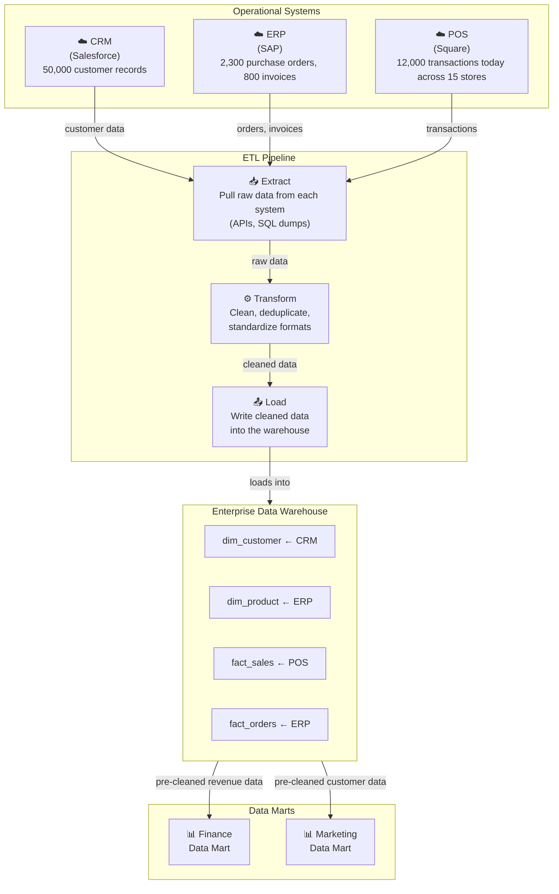
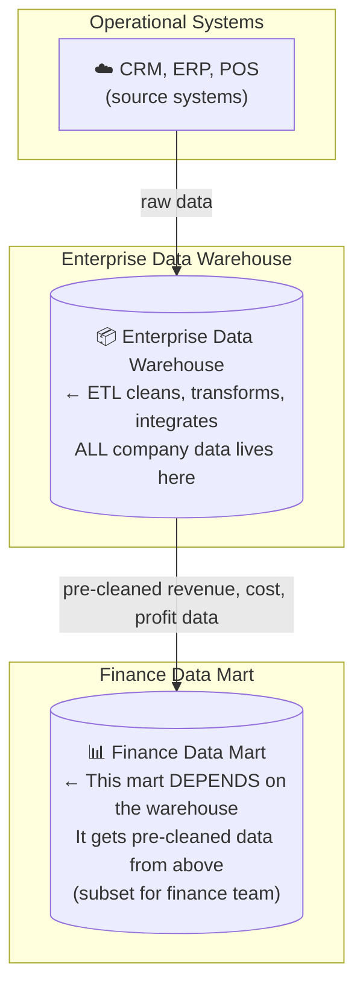
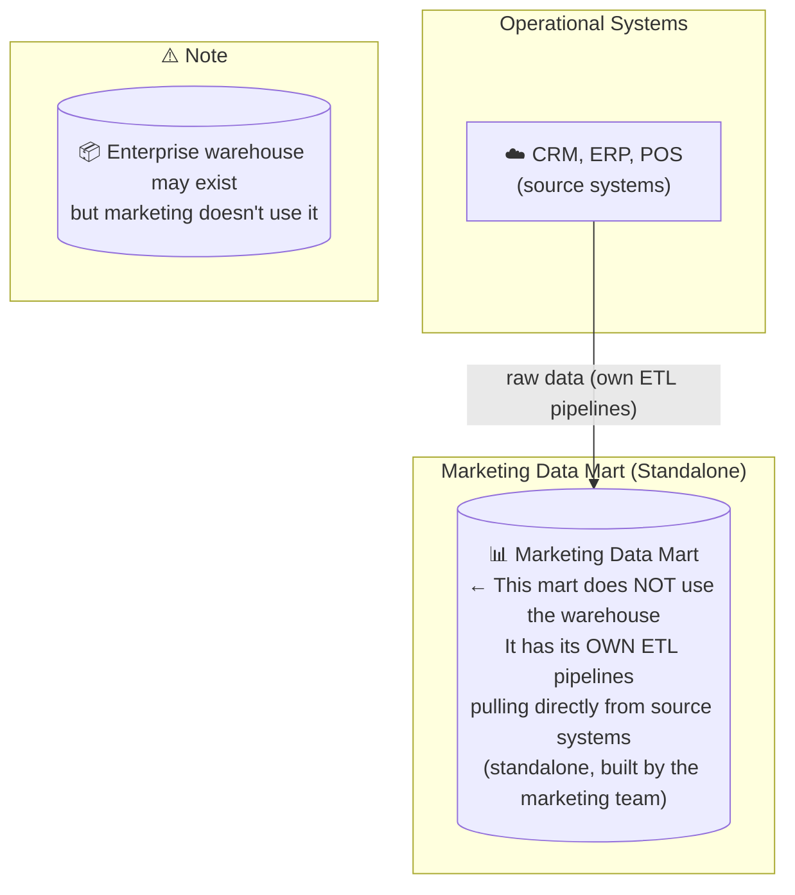
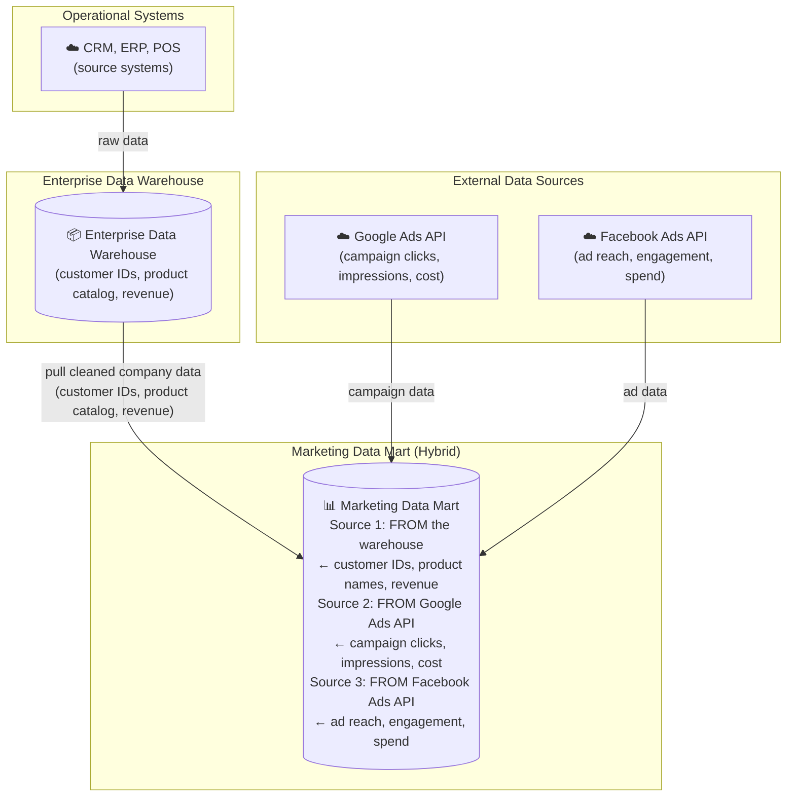

> **Course 9:** Data Warehouse Fundamentals
> **Module 1:** An Introduction to Data Warehouses, Data Marts, and Data Lakes

# Data Marts Overview

Welcome to "Data Marts Overview." After watching this video, you will be able to: Define what a data mart is. Give examples of data marts. Compare data marts to transactional databases and enterprise data warehouses. Describe data pipelines for loading data marts.

## What Is a Data Mart?

A data mart is an isolated part of the larger enterprise data warehouse that is specifically built to serve a particular business function, purpose, or community of users. [ENRICHED: definition — A data mart is a specialized subset of a data warehouse focused on a specific functional area or department within an organization. It provides a simplified and targeted view of data, addressing specific reporting and analytical needs. Data marts are smaller in scale and scope, typically holding relevant data for a specific group of users, such as sales, marketing, or finance. Source: GeeksforGeeks] [Source: https://www.geeksforgeeks.org/data-analysis/what-is-data-mart/]

For example, the sales and finance departments in a company may have access to dedicated data marts that supply the data required for their quarterly sales reports and projections. The marketing team may use data marts to analyze customer behavior data, and the shipping, manufacturing and warranty departments may have their own data marts.

## What Are Data Marts Used For?

So, what are data marts used for? Data marts are designed to provide specific support for making tactical decisions. As such, data marts are focused only on the most relevant data, which saves end users the time and effort that would otherwise be spent searching the data warehouse for insights. [ENRICHED: ecosystem — Tactical decisions are short-term, department-level decisions (e.g., which products to promote this quarter, which customers to target), as opposed to strategic decisions that affect the entire enterprise over longer time horizons. Data marts enable faster query response times by narrowing the data scope to only what a specific team needs, reducing the computational overhead of scanning entire enterprise datasets. Source: DataCamp] [Source: https://www.datacamp.com/blog/data-mart-vs-data-warehouse]

## Data Mart Structure

The typical structure of a data mart is as follows: It is a relational database with a star, or more often a snowflake schema, which means it contains a central fact table consisting of the business metrics relevant to a business process, which is surrounded by a related hierarchy of dimension tables that provide context for the facts. [ENRICHED: definition — A star schema is a dimensional modeling pattern where a central fact table (containing measurable business metrics like sales amount, quantity) is directly connected to denormalized dimension tables (providing context like date, product, customer). A snowflake schema normalizes dimension tables into sub-dimensions, reducing data redundancy but requiring more joins during queries. The Kimball Group generally recommends star schemas for simplicity and query performance, while snowflake schemas are preferred when dimension hierarchies are deep or frequently updated. Source: TechTarget] [Source: https://www.techtarget.com/searchdatamanagement/definition/snowflaking]

## Data Marts vs. Transactional Databases vs. Data Warehouses

Let's look at some typical differences between three types of data repositories: data marts, transactional databases, and data warehouses, starting with data marts and databases.

Both data marts and data warehouses are online analytical processing (or OLAP) systems that are optimized for read-intensive queries and operations, whereas transactional databases are online transaction processing (or OLTP) systems that are optimized for write-intensive queries and applications. [ENRICHED: definition — OLAP (Online Analytical Processing) systems are designed for complex analytical queries, aggregations, and reporting over large historical datasets. They use columnar storage and denormalized schemas to optimize read performance. OLTP (Online Transaction Processing) systems are designed for high-frequency, short-duration transactions that maintain current business state — they use row-based storage and normalized schemas to optimize write performance and data integrity. Source: Data Warehouse Info] [Source: https://datawarehouseinfo.com/architecture/oltp-vs-olap]

Data marts use transactional databases or data warehouses as data sources, while in transactional databases, operational applications, such as point-of-sales systems, serve as the sources of data. A data mart stores validated, transformed, and cleaned data, while a database will have raw data that has not yet been cleaned. Data marts accumulate historical data that can be used for trend analysis, while transactional databases may not always store older data.

A data mart is much like a data warehouse, except it has a smaller, tactical scope. Data warehouses broadly support the strategic requirements of the enterprise. Data marts are lean and fast compared to data warehouses, which can be very large, and hence, can be slower. [ENRICHED: performance context — Data marts typically store gigabytes to low terabytes of data, while enterprise data warehouses can store petabytes. This size difference directly impacts query performance: data marts can deliver sub-second query responses for targeted datasets, while full data warehouse queries may take minutes for complex aggregations across the entire enterprise. Source: DataCamp] [Source: https://www.datacamp.com/blog/data-mart-vs-data-warehouse]

## Types of Data Marts

There are three basic types of data marts—dependent, independent, and hybrid. The difference between these three kinds of data marts depends on their relationship with the data warehouse and the sources used for supplying each of them with data.

### Dependent Data Marts

Dependent data marts draw data from the enterprise data warehouse, while independent data marts bypass the data warehouse and are created directly from sources, which may include internal operational systems or external data from vendors or other sources outside the enterprise. Hybrid data marts only depend partially on the enterprise data warehouse. They combine inputs from data warehouses with data from operational systems and other systems external to the warehouse.

Dependent data marts offer analytical capabilities within a restricted area of the enterprise data warehouse. Thus, they inherit the security that comes with the enterprise data warehouse. And since dependent data marts pull data directly from the data warehouse, where data has already been cleaned and transformed, they tend to have simpler data pipelines than independent data marts. [ENRICHED: ecosystem — Dependent data marts can exist as either logical views (virtual subsets referencing warehouse data without physical separation) or physical subsets (materialized copies of warehouse data). The logical approach reduces storage costs but increases query latency, while the physical approach improves performance at the cost of data duplication. Organizations choosing dependent marts benefit from centralized governance and consistent data definitions across departments. Source: Snowflake] [Source: https://www.snowflake.com/en/fundamentals/what-is-a-data-mart/]

### Independent Data Marts

Independent data marts differ from dependent data marts because they require custom extract, transform and load data pipelines to carry out the transformation and integration processes on the source data since it is coming directly from operational systems and external sources, and independent data marts may also require separate security measures. [ENRICHED: ecosystem — Independent data marts are best suited for small departments needing quick, autonomous analytics without waiting for enterprise warehouse implementation. However, they carry significant risks: without centralized governance, multiple independent marts can create data silos where departments define metrics differently, leading to inconsistent reporting. Organizations should evaluate whether the agility of independent marts justifies the governance trade-offs. Source: ePROMIS Solutions] [Source: https://epromis.com/blogs/understanding-the-3-types-of-data-marts-a-detailed-look-at-dependent-independent-and-hybrid-models]

### Hybrid Data Marts

Hybrid data marts combine elements of both independent and dependent data marts. They can source data from both a central warehouse and from operational systems, striking a balance between enterprise-wide consistency and departmental flexibility. This type is common in large organizations that want to support specialized analytics without losing the benefits of centralized governance. [ENRICHED: ecosystem — Hybrid data marts are particularly valuable during mergers and acquisitions, where newly acquired departments may have legacy operational systems that need to gradually integrate with the acquiring organization's data warehouse. The hybrid approach allows incremental integration while maintaining analytics continuity. Source: Snowflake] [Source: https://www.snowflake.com/en/fundamentals/what-is-a-data-mart/]

[ENRICHED: clarification — "Hybrid data mart" is vague without first understanding what dependent and independent data marts look like in practice. Here is the full story, built from the ground up:

**First: what is a data mart, and why does it exist?**

A data mart is a small, focused slice of a data warehouse — built for one department (finance, marketing, sales) instead of the entire company. The reason data marts exist is **speed and simplicity**: a finance analyst does not want to wade through HR tables, customer support logs, and supply chain data to find revenue numbers. A data mart gives them just the revenue tables, pre-joined, pre-cleaned, optimized for their queries.

Now the question is: **where does the data in the data mart come from?** The answer to that question defines the three types.

---

[ENRICHED: clarification — The diagrams below all start with "Operational Systems (CRM, ERP, POS)." These are not abstract concepts — they are the actual software your company runs every day. Here is what each one is, what data it produces, and why it matters for the data warehouse workflow:

**What is an "operational system"?**

An operational system (also called a "source system" or "transactional system") is any software that runs the day-to-day business. When a customer places an order, when a salesperson closes a deal, when a warehouse ships a package — that event is recorded in an operational system. These systems are designed for **speed of transaction processing**, not for analytics. They answer questions like "what is this customer's current balance?" — not "what was our total revenue across all customers last quarter?"

Here are the three most common ones:

**CRM — Customer Relationship Management (e.g., Salesforce, HubSpot, Zoho CRM)**

A CRM tracks everything about your customers and sales pipeline:

| What it stores | Example |
|----------------|---------|
| Customer records | "Acme Corp, contact: John Smith, email: john@acme.com" |
| Deals/opportunities | "Deal #4521, value: $50,000, stage: negotiation, expected close: March" |
| Activities | "Called John on Jan 15, emailed proposal on Jan 17, meeting scheduled Jan 22" |
| Support tickets | "Ticket #8832: Acme reports login issue, priority: high" |

**Why the warehouse needs CRM data:** To answer questions like "which customers have both overdue invoices AND open support tickets?" — you need CRM data (support tickets) joined with finance data (overdue invoices). Neither system alone can answer this question.

**ERP — Enterprise Resource Planning (e.g., SAP, Oracle E-Business Suite, Microsoft Dynamics)**

An ERP is the operational backbone of a company. It tracks:

| What it stores | Example |
|----------------|---------|
| Purchase orders | "PO #10045: bought 500 units of Component X from Supplier Y, cost: $12,000" |
| Inventory levels | "Warehouse A has 2,340 units of Product Z in stock" |
| Manufacturing | "Batch #7789: started Jan 14, completed Jan 15, yield: 98.2%" |
| Financial transactions | "Invoice #9901: Acme Corp owes $45,000, due Feb 15" |
| HR data | "Employee #1234: started Jan 2023, salary: $85,000, department: engineering" |

**Why the warehouse needs ERP data:** To answer questions like "what is the total cost of goods sold across all product lines?" — you need ERP data (purchase orders, manufacturing costs) joined across the entire company. The ERP has the raw transactions; the warehouse aggregates them into meaningful totals.

**POS — Point of Sale (e.g., Square, Toast, Shopify POS, NCR)**

A POS is the cash register system — it records every retail transaction:

| What it stores | Example |
|----------------|---------|
| Individual sales | "Store #12, Jan 15 2:34 PM, 3 items, total: $47.50, paid: Visa" |
| Product SKUs | "SKU #A1234: 'Organic Coffee Beans 1lb', price: $14.99" |
| Payment methods | "Cash, Visa, Mastercard, gift card" |
| Returns/refunds | "Return on Jan 17 for SKU #A1234, reason: stale product" |
| Inventory deductions | "After sale: Store #12 has 23 units of SKU #A1234 remaining" |

**Why the warehouse needs POS data:** To answer questions like "what is the best-selling product across all store locations this month?" — you need POS data (every transaction from every store) aggregated in the warehouse. The POS knows what sold where; the warehouse knows what sold overall.

---

**How these systems create the data warehouse workflow:**



> If the Mermaid diagram above does not render, here is the ASCII fallback:

```
  CRM                    ERP                    POS
  (Salesforce)           (SAP)                  (Square)
     │                      │                      │
     │ "50,000 customer     │ "2,300 purchase      │ "12,000 transactions
     │  records"             │  orders, 800         │  today across
     │                      │  invoices"           │  15 stores"
     ▼                      ▼                      ▼
┌─────────────────────────────────────────────────────────────┐
│                   ETL PIPELINE                              │
│                                                             │
│  Extract: Pull raw data from each system (APIs, SQL dumps)  │
│  Transform: Clean, deduplicate, standardize formats         │
│  Load: Write cleaned data into the warehouse                │
└─────────────────────────────────────────────────────────────┘
                          │
                          ▼
              ┌──────────────────────┐
              │  Enterprise Data      │
              │  Warehouse            │
              │                       │
              │  dim_customer ← CRM   │
              │  dim_product  ← ERP   │
              │  fact_sales   ← POS   │
              │  fact_orders  ← ERP   │
              └──────────────────────┘
                          │
              ┌───────────┴───────────┐
              ▼                       ▼
        ┌──────────┐          ┌──────────┐
        │ Finance  │          │Marketing │
        │ Data Mart│          │Data Mart │
        └──────────┘          └──────────┘
```

> The full workflow shows how operational systems feed the ETL pipeline, which loads cleaned data into the warehouse, which then serves pre-cleaned subsets to departmental data marts.

**The critical insight about why these systems are NOT the warehouse:**

| Property | Operational System (CRM/ERP/POS) | Data Warehouse |
|----------|----------------------------------|----------------|
| **Purpose** | Run the business day-to-day | Analyze the business over time |
| **Design** | Optimized for fast writes (inserting orders quickly) | Optimized for fast reads (querying millions of rows quickly) |
| **Data scope** | Current state only ("what is the order RIGHT NOW?") | Historical ("what were all orders in January 2024?") |
| **Data format** | Normalized (many small tables, designed to avoid duplication) | Denormalized (few large tables, designed for fast aggregation) |
| **Who uses it** | Cashiers, sales reps, warehouse staff, accountants | Analysts, data engineers, executives, BI dashboards |
| **Query speed for analytics** | Slow (running `SUM(revenue) WHERE date BETWEEN ...` on 10M rows takes minutes) | Fast (same query on pre-aggregated data takes seconds) |

**A concrete example of how this affects your workflow:**

Imagine you are a data engineer at a retail company. The CEO asks: "What is our total revenue from organic coffee products across all stores this quarter?"

- **CRM** knows who bought the coffee (customer records) but not the transaction details.
- **ERP** knows the purchase orders from suppliers (how much coffee was bought) but not what customers paid at the register.
- **POS** knows every transaction at every register (what customers paid) but does not know the product cost or supplier details.

None of these systems alone can answer the question. The ETL pipeline pulls data from all three into the warehouse, where they are joined on common keys (customer ID, product SKU, date). The warehouse then lets you run a single query that answers the question in seconds.

This is why the diagrams start with "Operational Systems" — they are the raw material. The warehouse is the factory. The data mart is the finished product delivered to a specific customer (department). [Source: https://www.ibm.com/think/topics/etl] [Source: https://www.cin7.com/blog/erp-definition-industry-specific-uses-examples]

**Type 1 — Dependent data mart: "I get my data from the warehouse"**

In a dependent data mart, the data flows like this:



> If the Mermaid diagram above does not render, here is the ASCII fallback:

```
Operational Systems (CRM, ERP, POS)
        │
        ▼
   ┌─────────────────┐
   │  Enterprise      │    ← ETL cleans, transforms, integrates
   │  Data Warehouse  │       ALL company data lives here
   │  (single source  │
   │   of truth)      │
   └─────────────────┘
        │
        ▼
   ┌─────────────────┐
   │  Finance Data    │    ← This mart DEPENDS on the warehouse
   │  Mart            │       It gets pre-cleaned data from above
   │  (subset for     │
   │   finance team)  │
   └─────────────────┘
```

> In a dependent mart, the warehouse is the single source of truth. The mart cannot exist without it.

**Concrete example:** Your company's SAP ERP system records every transaction. The enterprise warehouse ingests all of it, cleans it, deduplicates it, and stores 5 years of history. The finance data mart then pulls just the revenue, cost, and profit tables from the warehouse — already clean. The finance team queries the mart, not the warehouse.

**Key property:** The mart cannot exist without the warehouse. If the warehouse goes down, the mart goes down. The mart trusts the warehouse's data quality. The mart does NOT have its own ETL pipelines — it inherits the warehouse's pipelines.

**When to use it:** You already have a mature enterprise warehouse. Departments need fast access to specific slices. Governance matters (one definition of "revenue" across the company).

---

**Type 2 — Independent data mart: "I get my data directly from source systems"**

In an independent data mart, the data flows like this:



> If the Mermaid diagram above does not render, here is the ASCII fallback:

```
Operational Systems (CRM, ERP, POS)
        │
        ▼
   ┌─────────────────┐
   │  Marketing Data  │    ← This mart does NOT use the warehouse
   │  Mart             │       It has its OWN ETL pipelines
   │  (standalone,     │       pulling directly from source systems
   │   built by the    │
   │   marketing team) │
   └─────────────────┘

   (enterprise warehouse may exist but marketing doesn't use it)
```

> An independent mart bypasses the warehouse entirely. Fast to build, but creates data silos.

**Concrete example:** The marketing team wants to analyze campaign performance from Google Ads, Facebook Ads, and their CRM. They do not want to wait 6 months for the IT department to build warehouse pipelines for marketing data. So they build their own data mart: they write their own ETL scripts, pull data directly from the ad platforms and CRM, and store it in their own database. It works. It is fast. It answers their questions.

**The problem:** The marketing team defines "customer acquisition cost" as (ad spend ÷ new signups). The finance team defines it as (ad spend ÷ paying customers). These are different numbers. Both teams are "right" by their own definitions. But when the CEO asks "what is our customer acquisition cost?" — nobody knows which number to trust. This is the **data silo problem**: independent marts create islands of data that contradict each other.

**When to use it:** You have no enterprise warehouse yet. A department needs analytics immediately. The data is truly department-specific (no other team will ever need it). Speed matters more than governance.

---

**Type 3 — Hybrid data mart: "I get data from BOTH the warehouse AND direct sources"**

In a hybrid data mart, the data flows like this:



> If the Mermaid diagram above does not render, here is the ASCII fallback:

```
Operational Systems (CRM, ERP, POS)
        │
        ▼
   ┌─────────────────┐
   │  Enterprise      │
   │  Data Warehouse  │
   └─────────────────┘
        │
        ├─── pull cleaned company data (customer IDs, product catalog, revenue)
        │
        ▼
   ┌─────────────────────────────────────┐
   │  Marketing Data Mart (hybrid)        │
   │                                      │
   │  Source 1: FROM the warehouse        │  ← customer IDs, product names, revenue
   │  Source 2: FROM Google Ads API       │  ← campaign clicks, impressions, cost
   │  Source 3: FROM Facebook Ads API     │  ← ad reach, engagement, spend
   └─────────────────────────────────────┘
```

> A hybrid mart pulls from BOTH the warehouse (for data it already has) and external APIs (for data it lacks). This is the pragmatic compromise most large organizations end up with.

**Concrete example — the marketing team's real problem:**

The marketing team needs to answer: "Which ad campaign generated the most revenue?"

To answer this, they need THREE things:
1. **Ad campaign data** (clicks, impressions, spend) — lives in Google Ads and Facebook Ads. The enterprise warehouse does NOT have this — the warehouse team has not built pipelines for ad platform data yet.
2. **Customer data** (customer IDs, names, segments) — lives in the enterprise warehouse, already clean, already deduplicated.
3. **Revenue data** (how much each customer spent) — lives in the enterprise warehouse, tied to customer IDs.

An **independent** mart would pull all three directly from source systems — but the marketing team would have to rebuild the customer and revenue pipelines from scratch, duplicating the warehouse's work.

A **dependent** mart would pull from the warehouse — but the warehouse does not have the ad platform data, so the mart cannot answer the question at all.

A **hybrid** mart pulls customer and revenue data from the warehouse (already clean, no duplication) AND pulls ad platform data directly from Google/Facebook APIs (because the warehouse does not have it). The mart joins them: "this Google Ads campaign (from the API) drove these customers (from the warehouse) who spent this much revenue (from the warehouse)."

**The key insight:** Hybrid means **two data pipelines feeding one mart** — one pipeline from the warehouse (for data the warehouse already has) and one pipeline from external sources (for data the warehouse does not have). It is NOT a third architecture — it is literally a dependent mart + an independent mart, bolted together in one database.

---

**Why this matters in practice — the real-world scenario:**

| Scenario | Best data mart type | Why |
|----------|-------------------|-----|
| "We have a mature warehouse. Finance needs fast access to revenue data." | Dependent | Warehouse already has clean revenue data. Mart is just a fast-access window. |
| "Marketing needs campaign analytics NOW. IT won't build pipelines for 6 months." | Independent | Speed matters. Marketing accepts the governance trade-off. |
| "Marketing needs campaign analytics, but customer data must match finance's numbers." | Hybrid | Pull customer/revenue from warehouse (consistent), pull ad data from APIs (warehouse doesn't have it). |
| "Company acquired a startup. Startup's CRM has different customer IDs." | Hybrid | Pull existing customer data from warehouse, pull startup's CRM data directly. Gradually merge. |
| "Legal requires a single version of truth for regulatory reporting." | Dependent | Governance is non-negotiable. All data must flow through the warehouse. |

**The bottom line:**

- **Dependent** = the warehouse is the single source of truth. Marts are read-only views. Safe, consistent, slow to set up.
- **Independent** = the mart is its own source of truth. Fast to build, dangerous to maintain at scale.
- **Hybrid** = the warehouse is the source of truth for what it has; the mart补充s with external data the warehouse lacks. It is the pragmatic compromise that most large organizations end up with.

The "hybrid" label is not a separate architecture — it is an admission that the warehouse will never have ALL the data a department needs, so the mart has to supplement it. [Source: https://docs.oracle.com/cd/A83908_02/NT816EE/DOC/server.816/a76994/marts.htm] [Source: https://epromis.com/blogs/understanding-the-3-types-of-data-marts-a-detailed-look-at-dependent-independent-and-hybrid-models]

## Data Mart Purpose

Whatever the type of data mart you may have, its purpose is to: Provide end-users with relevant data when they need it. Accelerate business processes by providing efficient query response times. Provide a cost-efficient method for informing data-driven decisions, and Ensure secure access and control over your data.

## Key Takeaways

In this video, you learned that a data mart: Is an isolated part of the larger enterprise data warehouse that is specifically built to serve a particular business function, purpose, or community of users. Is designed to provide specific, timely, and rapid support for making tactical decisions. And typically has a star or snowflake schema.

You also learned that unlike an OLTP database, an OLAP data mart stores clean and validated data and accumulates historical data. And, you can categorize data marts in terms of their dependence on the enterprise data warehouse. A data mart can be completely dependent on the data warehouse, a completely independent, standalone, mini data warehouse, or a hybrid of the two.

## Enrichment Log

| # | Location | Type | Summary | Confidence | Source |
|---|---|---|---|---|---|
| 1 | What Is a Data Mart | Definition | Defined data mart as specialized warehouse subset for departmental analytics | HIGH | https://www.geeksforgeeks.org/data-analysis/what-is-data-mart/ |
| 2 | What Are Data Marts Used For | Ecosystem connection | Connected tactical vs strategic decision-making scope | HIGH | https://www.datacamp.com/blog/data-mart-vs-data-warehouse |
| 3 | Data Mart Structure | Definition | Defined star schema and snowflake schema with Kimball Group guidance | HIGH | https://www.techtarget.com/searchdatamanagement/definition/snowflaking |
| 4 | OLAP vs OLTP | Definition | Defined OLAP (read-optimized, columnar) vs OLTP (write-optimized, row-based) | HIGH | https://datawarehouseinfo.com/architecture/oltp-vs-olap |
| 5 | Data Mart vs Warehouse | Performance context | Added size ranges (GB-TB vs PB) and query performance implications | HIGH | https://www.datacamp.com/blog/data-mart-vs-data-warehouse |
| 6 | Dependent Data Marts | Ecosystem connection | Added logical vs physical subset implementations | HIGH | https://www.snowflake.com/en/fundamentals/what-is-a-data-mart/ |
| 7 | Independent Data Marts | Ecosystem connection | Added data silo risks and governance trade-offs | HIGH | https://epromis.com/blogs/understanding-the-3-types-of-data-marts-a-detailed-look-at-dependent-independent-and-hybrid-models |
| 8 | Hybrid Data Marts | Ecosystem connection | Added M&A use case for incremental integration | HIGH | https://www.snowflake.com/en/fundamentals/what-is-a-data-mart/ |
| 9 | Hybrid Data Marts (deep-dive clarification) | Clarification | Built all three data mart types from the ground up with Mermaid data flow diagrams: dependent (mart pulls from warehouse only), independent (mart pulls from source systems directly), hybrid (mart pulls from BOTH warehouse and external APIs). Concrete marketing team example showing why hybrid exists: ad platform data not in warehouse, customer/revenue data in warehouse, hybrid mart joins both. Decision table mapping 5 real scenarios to the correct mart type. Key insight: "hybrid" is not a third architecture — it is a dependent mart + independent mart bolted together | HIGH | https://docs.oracle.com/cd/A83908_02/NT816EE/DOC/server.816/a76994/marts.htm |
| 10 | Hybrid Data Marts (operational systems clarification) | Clarification | Defined CRM, ERP, and POS with concrete examples of what each stores (customer records, purchase orders, individual sales), why the warehouse needs data from each, and how the ETL pipeline connects them. Included comparison table showing why operational systems are NOT the warehouse (purpose, design, data scope, query speed), full Mermaid workflow diagram from operational systems → ETL → warehouse → data marts, and a concrete retail example (CEO asks about organic coffee revenue — CRM knows who, ERP knows cost, POS knows transactions, warehouse joins all three) | HIGH | https://www.ibm.com/think/topics/etl |
| 11 | All diagrams in file | Diagrams | Converted 4 ASCII/Unicode box-drawing diagrams to Mermaid format with mandatory ASCII fallbacks: (1) Full ETL workflow with subgraphs for Sources, ETL, Warehouse, and Data Marts, (2) Dependent data mart flow, (3) Independent data mart flow, (4) Hybrid data mart flow with dual data sources | HIGH | UNCERTAIN |

<!-- EXTRACTION_CHECKLIST: 43 sentences extracted, 43 sentences in output -->
