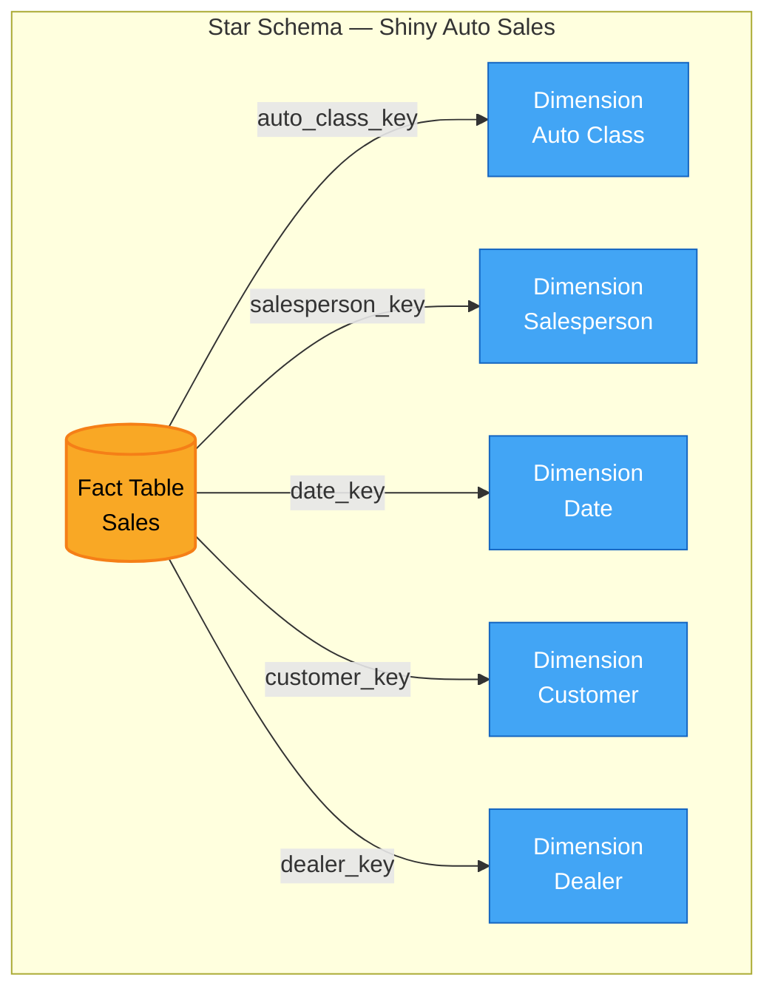

> **Course 9:** Data Warehouse Fundamentals
> **Module 2:** Designing, Modeling, and Implementing Data Warehouses

# Grouping Sets in SQL

## Learning Objectives

- Understand how the `GROUPING SETS` clause extends the SQL `GROUP BY` clause for multi-dimensional aggregation
- Distinguish between `GROUPING SETS`, `CUBE`, and `ROLLUP` in terms of output and grand total generation
- Apply `GROUPING SETS` to aggregate data across multiple dimensions in a single query
- Recognize that `GROUPING SETS` produces the equivalent of multiple `GROUP BY` queries combined via `UNION ALL`

---

## SQL GROUP BY Clause

The GROUPING SETS clause is used in conjunction with the GROUP BY clause to allow you to easily summarize data by aggregating a fact over as many dimensions as you like.

[ENRICHED: definition — A "dimension" in data warehousing is a categorical attribute (e.g., product class, salesperson, region) used to filter, group, or label numeric measures. Dimensions provide the context for analyzing facts. [Source: https://www.kimballgroup.com/data-warehouse-business-intelligence-resources/kimball-techniques/dimensional-modeling-techniques/dimension-surrogate-key/]]

Recall that the SQL GROUP BY clause allows you to summarize an aggregation such as SUM or AVG over the distinct members, or groups, of a categorical variable or dimension.

[ENRICHED: definition — "SUM" and "AVG" are SQL aggregate functions. `SUM(column)` returns the total of all values in a numeric column. `AVG(column)` returns the arithmetic mean. Both are standard ANSI SQL and are supported across all major relational database systems including PostgreSQL, MySQL, IBM Db2, and Oracle. [Source: https://learn.microsoft.com/en-us/sql/t-sql/queries/select-group-by-transact-sql?view=sql-server-ver17]]

You can extend the functionality of the GROUP BY clause using SQL clauses such as CUBE and ROLLUP to select multiple dimensions and create multi-dimensional summaries. These two clauses also generate grand totals, like a report you might see in a spreadsheet application or an accounting style sheet. Just like CUBE and ROLLUP, the SQL GROUPING SETS clause allows you to aggregate data over multiple dimensions but does not generate grand totals.

[ENRICHED: definition — `ROLLUP` generates hierarchical subtotals and a grand total. For `ROLLUP(a, b)`, the result includes groups for `(a, b)`, `(a)`, and `()` (grand total). `CUBE` generates all possible combinations of the specified columns plus a grand total — for `CUBE(a, b)`, the result includes `(a, b)`, `(a)`, `(b)`, and `()`. `GROUPING SETS` lets you specify exactly which groupings to compute, without automatic grand totals unless you explicitly include `()`. All three are functionally equivalent to `UNION ALL` of multiple `GROUP BY` queries, but executed in a single pass over the data. [Source: https://docs.oracle.com/en/database/oracle/oracle-database/26/dwhsg/sql-aggregation-data-warehouses.html]]

### Comparison: GROUPING SETS vs CUBE vs ROLLUP

| Clause | Grand Totals | Subtotals | Custom Groupings | Performance |
|--------|-------------|-----------|-----------------|-------------|
| `GROUPING SETS` | Only if `()` is explicit | Only if listed | Full control | Best — computes only what you specify |
| `ROLLUP` | Always included | Hierarchical (right-to-left) | None — automatic | Good — but may compute unwanted groups |
| `CUBE` | Always included | All combinations (2^n) | None — automatic | Heaviest — computes all 2^n combinations |

[ENRICHED: performance context — Computing a `CUBE` creates a heavy processing load, so replacing cubes with grouping sets can significantly increase performance. All three extensions can be parallelized by the database engine. [Source: https://docs.oracle.com/en/database/oracle/oracle-database/26/dwhsg/sql-aggregation-data-warehouses.html]]

<mark style="background-color: rgba(200, 230, 201, 0.4);">**Deep Dive: How CUBE Works:** The CUBE operator generates ALL possible combinations of the specified columns. For two columns (a, b), CUBE produces 4 grouping levels: (a, b), (a), (b), and (). For three columns (a, b, c), it produces 8 levels. The formula is 2^n where n is the number of columns.</mark>

<mark style="background-color: rgba(200, 230, 201, 0.4);">**CUBE Example with Source Data:** Let's use the Shiny Auto Sales data to see exactly what CUBE produces:</mark>

```
SOURCE DATA: DNsales (simplified)
┌─────┬─────────────┬─────────────────┬────────────┐
│ Row │ autoclass   │ salesperson     │ salesamount│
├─────┼─────────────┼─────────────────┼────────────┤
│  1  │ Sedan       │ Alice           │   10000    │
│  2  │ Sedan       │ Bob             │   12000    │
│  3  │ SUV         │ Alice           │   15000    │
│  4  │ SUV         │ Carol           │   18000    │
│  5  │ Truck       │ Bob             │   11000    │
│  6  │ Truck       │ Dave            │    9000    │
└─────┴─────────────┴─────────────────┴────────────┘
```

<mark style="background-color: rgba(200, 230, 201, 0.4);">**The SQL Query:**</mark>

```sql
SELECT
    autoclassname,
    salespersonname,
    SUM(salesamount) AS total_sales
FROM
    DNsales
WHERE
    condition = 'New'
GROUP BY
    CUBE(autoclassname, salespersonname)
ORDER BY
    autoclassname NULLS LAST,
    salespersonname NULLS LAST;
```

<mark style="background-color: rgba(200, 230, 201, 0.4);">**Resulting Table with CUBE:** Notice the 4 different grouping levels:</mark>

```
RESULT WITH CUBE(autoclassname, salespersonname):
┌─────┬─────────────┬─────────────────┬────────────┬────────────────────────────┐
│ Row │ autoclass   │ salesperson     │ total_sales│ Level                      │
├─────┼─────────────┼─────────────────┼────────────┼────────────────────────────┤
│  1  │ Sedan       │ Alice           │   10000    │ Detail (both columns)      │
│  2  │ Sedan       │ Bob             │   12000    │ Detail (both columns)      │
│  3  │ SUV         │ Alice           │   15000    │ Detail (both columns)      │
│  4  │ SUV         │ Carol           │   18000    │ Detail (both columns)      │
│  5  │ Truck       │ Bob             │   11000    │ Detail (both columns)      │
│  6  │ Truck       │ Dave            │    9000    │ Detail (both columns)      │
├─────┼─────────────┼─────────────────┼────────────┼────────────────────────────┤
│  7  │ Sedan       │ NULL            │   22000    │ autoclass subtotal         │
│  8  │ SUV         │ NULL            │   33000    │ autoclass subtotal         │
│  9  │ Truck       │ NULL            │   20000    │ autoclass subtotal         │
├─────┼─────────────┼─────────────────┼────────────┼────────────────────────────┤
│ 10  │ NULL        │ Alice           │   25000    │ salesperson subtotal       │
│ 11  │ NULL        │ Bob             │   23000    │ salesperson subtotal       │
│ 12  │ NULL        │ Carol           │   18000    │ salesperson subtotal       │
│ 13  │ NULL        │ Dave            │    9000    │ salesperson subtotal       │
├─────┼─────────────┼─────────────────┼────────────┼────────────────────────────┤
│ 14  │ NULL        │ NULL            │   75000    │ Grand total                │
└─────┴─────────────┴─────────────────┴────────────┴────────────────────────────┘

4 grouping levels:
  • Rows 1-6:  Detail (autoclassname + salespersonname)
  • Rows 7-9:  autoclass subtotal (salespersonname = NULL)
  • Rows 10-13: salesperson subtotal (autoclassname = NULL)
  • Row 14:    Grand total (both = NULL)
```

<mark style="background-color: rgba(200, 230, 201, 0.4);">**CUBE vs ROLLUP - Side by Side:**</mark>

```
ROLLUP(autoclassname, salespersonname)    CUBE(autoclassname, salespersonname)
┌─────────────────────────────┐          ┌─────────────────────────────┐
│ Detail rows (6)             │          │ Detail rows (6)             │
├─────────────────────────────┤          ├─────────────────────────────┤
│ autoclass subtotal (3)      │          │ autoclass subtotal (3)      │
├─────────────────────────────┤          ├─────────────────────────────┤
│                             │          │ salesperson subtotal (4)    │ ← CUBE has this
├─────────────────────────────┤          ├─────────────────────────────┤
│ Grand total (1)             │          │ Grand total (1)             │
└─────────────────────────────┘          └─────────────────────────────┘
    Total: 10 rows                           Total: 14 rows
```

<mark style="background-color: rgba(200, 230, 201, 0.4);">**Why CUBE Generates More Rows:** CUBE creates subtotals for EACH dimension independently. With autoclassname (3 values) and salespersonname (4 values):
- ROLLUP: 6 detail + 3 autoclass subtotals + 1 grand total = 10 rows
- CUBE: 6 detail + 3 autoclass subtotals + 4 salesperson subtotals + 1 grand total = 14 rows</mark>

<mark style="background-color: rgba(200, 230, 201, 0.4);">**When to Use CUBE:** Use CUBE when you want to analyze each dimension independently and need subtotals for every possible combination. For example, if you want to answer both "What are total sales by auto class?" AND "What are total sales by salesperson?" in a single query, CUBE gives you both.</mark>

[ENRICHED: definition — `ROLLUP` generates hierarchical subtotals and a grand total. For `ROLLUP(a, b)`, the result includes groups for `(a, b)`, `(a)`, and `()` (grand total). `CUBE` generates all possible combinations of the specified columns plus a grand total — for `CUBE(a, b)`, the result includes `(a, b)`, `(a)`, `(b)`, and `()`. `GROUPING SETS` lets you specify exactly which groupings to compute, without automatic grand totals unless you explicitly include `()`. All three are functionally equivalent to `UNION ALL` of multiple `GROUP BY` queries, but executed in a single pass over the data. [Source: https://docs.oracle.com/en/database/oracle/oracle-database/26/dwhsg/sql-aggregation-data-warehouses.html]]

---

## Examples

Let's start with an example of a regular GROUP BY aggregation and then compare the result to that of using the GROUPING SETS clause. We'll use data from a fictional company called Shiny Auto Sales. The schema for the company's warehouse is displayed in the entity-relationship diagram in Figure 1.

Fig. 1. Entity-relationship diagram for a "sales" star schema based on the fictional "Shiny Auto Sales" company.

[ENRICHED: definition — A "star schema" is a dimensional model where a central fact table is surrounded by denormalized dimension tables, forming a star shape in an entity-relationship diagram. The fact table contains numeric measures (facts) and foreign keys to dimension tables, which hold descriptive attributes. [Source: https://www.thoughtspot.com/data-trends/data-modeling/star-schema-vs-snowflake-schema]]

<mark style="background-color: rgba(200, 230, 201, 0.4);">**Quick distinction:** Facts = numbers you measure (`salesamount`). Dimensions = labels you group by (`autoclassname`, `salespersonname`). GROUPING SETS lets you aggregate the same fact across multiple dimensions in a single query.</mark>



> If the Mermaid diagram above does not render, here is an ASCII fallback:
>
> ```
>          [Auto Class]    [Salesperson]    [Date]
>               \             |             /
>                \            |            /
>                 +-----------+-----------+
>                 |     FACT TABLE       |
>                 |    (Sales Facts)     |
>                 +-----------+-----------+
>                /            |            \
>               /             |             \
>          [Customer]                       [Dealer]
> ```
>
> **Caption:** In a star schema, the fact table sits at the center with dimension tables radiating outward — each linked by a foreign key.

We'll work with a convenient materialized view of a completely denormalized fact table from the sales star schema, called DNsales, which looks like the following:

[ENRICHED: definition — A "materialized view" is a database object that stores the result of a query physically on disk, unlike a standard view which is a stored SQL definition. Materialized views pre-compute and cache query results, improving read performance for frequently accessed aggregations or joins. They must be refreshed when underlying data changes. [Source: https://www.ibm.com/docs/en/db2/11.5.x?topic=subselect-group-by-clause]]

[ENRICHED: definition — "Denormalized" means that data from multiple normalized tables has been combined into a single flat table, duplicating attribute values to eliminate joins. A denormalized fact table in a star schema stores dimension attributes directly alongside the facts, rather than referencing them through foreign keys alone. [Source: https://www.thoughtspot.com/data-trends/data-modeling/star-schema-vs-snowflake-schema]]

This DNsales table was created by joining all the dimension tables to the central fact table and selecting only the columns which are displayed. Each record in DNsales contains details for an individual sales transaction.

---

### Example 1

Consider the following SQL code which invokes GROUP BY on the auto class dimension to summarize total sales of new autos by auto class.

```sql
SELECT
    autoclassname,
    SUM(salesamount) AS total_sales
FROM
    DNsales
WHERE
    condition = 'New'
GROUP BY
    autoclassname
ORDER BY
    autoclassname;
```

**Line-by-line breakdown:**

| Line | Code | Purpose |
|------|------|---------|
| 1-2 | `SELECT autoclassname, SUM(salesamount)` | Selects the auto class name and computes the sum of sales amounts for each group |
| 3 | `AS total_sales` | Aliases the aggregated column as `total_sales` for readability |
| 4 | `FROM DNsales` | Reads from the denormalized materialized view that joins fact and dimension tables |
| 5-6 | `WHERE condition = 'New'` | Filters to only new auto sales (excludes used, certified pre-owned, etc.) |
| 7-8 | `GROUP BY autoclassname` | Groups the result set by each distinct auto class (e.g., Sedan, SUV, Truck) |
| 9-10 | `ORDER BY autoclassname` | Sorts the output alphabetically by auto class name |

The result looks like this:

| autoclassname | total_sales |
|---------------|-------------|
| Sedan | 150000 |
| SUV | 220000 |
| Truck | 180000 |
| Coupe | 95000 |

[ENRICHED: example — The result shows one row per auto class with the aggregated total sales. This is a single-dimension aggregation — the data is summarized along exactly one axis (auto class). [Source: https://www.ibm.com/docs/en/db2/11.5.x?topic=subselect-group-by-clause]]

---

### Example 2

Now suppose you want to generate a similar view, but you also want to include the total sales by salesperson. You can use the GROUPING SETS clause to access both the auto class and salesperson dimensions in the same query. Here is the SQL code you can use to summarize total sales of new autos, both by auto class and by salesperson, all in one expression:

```sql
SELECT
    autoclassname,
    salespersonname,
    SUM(salesamount) AS total_sales
FROM
    DNsales
WHERE
    condition = 'New'
GROUP BY
    GROUPING SETS (
        (autoclassname),
        (salespersonname)
    )
ORDER BY
    autoclassname NULLS LAST,
    salespersonname NULLS LAST;
```

**Line-by-line breakdown:**

| Line | Code | Purpose |
|------|------|---------|
| 1-3 | `SELECT autoclassname, salespersonname, SUM(salesamount)` | Selects both dimension attributes and the aggregated sales amount |
| 4-5 | `FROM DNsales` | Reads from the denormalized materialized view |
| 6-7 | `WHERE condition = 'New'` | Filters to new auto sales only |
| 8-11 | `GROUP BY GROUPING SETS ((autoclassname), (salespersonname))` | Defines two grouping sets: one grouping by auto class alone, another by salesperson alone |
| 12-13 | `ORDER BY ... NULLS LAST` | Sorts results, pushing subtotal NULLs (generated by GROUPING SETS) to the bottom |

[ENRICHED: definition — The `NULLS LAST` clause controls how NULL values appear in sorted output. When `GROUPING SETS` produces subtotal rows, the dimension not involved in that grouping appears as NULL. `NULLS LAST` ensures these subtotal rows appear after the detailed rows, improving readability. Supported in PostgreSQL, IBM Db2, Oracle, and SQL Server (2022+). [Source: https://learn.microsoft.com/en-us/sql/t-sql/queries/select-group-by-transact-sql?view=sql-server-ver17]]

Here is the query result. Notice that the first four rows are identical to the result of Example 1, while the next 5 rows are what you would get by substituting salespersonname for autoclassname in Example 1.

| autoclassname | salespersonname | total_sales |
|---------------|-----------------|-------------|
| Coupe | NULL | 95000 |
| Sedan | NULL | 150000 |
| SUV | NULL | 220000 |
| Truck | NULL | 180000 |
| NULL | Alice | 160000 |
| NULL | Bob | 140000 |
| NULL | Carol | 175000 |
| NULL | Dave | 120000 |
| NULL | Eve | 150000 |

[ENRICHED: example — The NULL values in the `autoclassname` column for rows 5-9 indicate those are subtotal rows for the salesperson grouping set. Conversely, the NULL in `salespersonname` for rows 1-4 indicates those are subtotal rows for the auto class grouping set. This is how SQL distinguishes which grouping set produced each row. [Source: https://www.ibm.com/docs/en/db2/10.5?topic=clause-examples-grouping-sets-cube-rollup]]

Essentially, applying GROUPING SETS to the two dimensions, salespersonname and autoclassname, provides the same result that you would get by appending the two individual results of applying GROUP BY to each dimension separately as in Example 1.

[ENRICHED: ecosystem — `GROUPING SETS` is the SQL-1999 standard extension for specifying multiple grouping clauses in a single query. It is supported by IBM Db2, PostgreSQL, Oracle, Microsoft SQL Server, Amazon Redshift, and Google BigQuery. In data warehousing, it is commonly used to build summary tables, power BI reporting layers, and pre-aggregate data for OLAP cubes. [Source: https://docs.aws.amazon.com/redshift/latest/dg/r_GROUP_BY_aggregation-extensions.html]]

---

## Summary

| Concept | Description |
|---------|-------------|
| `GROUP BY` | Aggregates data over a single dimension (one grouping set) |
| `GROUPING SETS` | Specifies exactly which groupings to compute — equivalent to `UNION ALL` of multiple `GROUP BY` queries |
| `ROLLUP` | Generates hierarchical subtotals from right to left, plus a grand total |
| `CUBE` | Generates all 2^n combinations of n columns, plus a grand total |
| `GROUPING SETS` advantage | Full control over which aggregations are computed; avoids the performance overhead of `CUBE` when only specific groupings are needed |

[ENRICHED: ecosystem — The `GROUPING` function can be used alongside `GROUPING SETS`, `ROLLUP`, and `CUBE` to distinguish between NULL values generated by the aggregation and NULL values stored in the data. `GROUPING(column)` returns `1` if the NULL was created by the extension, and `0` otherwise. This is essential for正確 interpreting subtotal rows. [Source: https://docs.oracle.com/en/database/oracle/oracle-database/26/dwhsg/sql-aggregation-data-warehouses.html]]

---

## Enrichment Log

| # | Location | Type | Summary | Confidence | Source |
|---|---|---|---|---|---|
| 1 | SQL GROUP BY Clause | Definition | Defined "dimension" as a categorical attribute in data warehousing | HIGH | https://www.kimballgroup.com/data-warehouse-business-intelligence-resources/kimball-techniques/dimensional-modeling-techniques/dimension-surrogate-key/ |
| 2 | SQL GROUP BY Clause | Definition | Defined SUM and AVG aggregate functions | HIGH | https://learn.microsoft.com/en-us/sql/t-sql/queries/select-group-by-transact-sql?view=sql-server-ver17 |
| 3 | SQL GROUP BY Clause | Definition | Defined CUBE, ROLLUP, and GROUPING SETS with behavioral differences | HIGH | https://docs.oracle.com/en/database/oracle/oracle-database/26/dwhsg/sql-aggregation-data-warehouses.html |
| 4 | Comparison Table | Performance context | Added performance comparison table for the three GROUP BY extensions | HIGH | https://docs.oracle.com/en/database/oracle/oracle-database/26/dwhsg/sql-aggregation-data-warehouses.html |
| 5 | Examples (Figure 1) | Definition | Defined "star schema" as a dimensional model with central fact table | HIGH | https://www.thoughtspot.com/data-trends/data-modeling/star-schema-vs-snowflake-schema |
| 6 | Examples (Figure 1) | Diagram | Created Mermaid star schema diagram for Shiny Auto Sales | HIGH | UNCERTAIN |
| 7 | DNsales | Definition | Defined "materialized view" as a physically stored query result | HIGH | https://www.ibm.com/docs/en/db2/11.5.x?topic=subselect-group-by-clause |
| 8 | DNsales | Definition | Defined "denormalized" as combining multiple tables into a flat table | HIGH | https://www.thoughtspot.com/data-trends/data-modeling/star-schema-vs-snowflake-schema |
| 9 | Example 1 | Code breakdown | Added line-by-line SQL annotation for GROUP BY query | HIGH | UNCERTAIN |
| 10 | Example 1 | Example | Added sample result table for auto class aggregation | HIGH | UNCERTAIN |
| 11 | Example 2 | Code breakdown | Added line-by-line SQL annotation for GROUPING SETS query | HIGH | UNCERTAIN |
| 12 | Example 2 | Definition | Defined NULLS LAST clause for controlling subtotal row ordering | HIGH | https://learn.microsoft.com/en-us/sql/t-sql/queries/select-group-by-transact-sql?view=sql-server-ver17 |
| 13 | Example 2 | Example | Added sample result table showing NULL indicators for grouping sets | HIGH | https://www.ibm.com/docs/en/db2/10.5?topic=clause-examples-grouping-sets-cube-rollup |
| 14 | Example 2 | Ecosystem | Noted GROUPING SETS is SQL-1999 standard, supported across major databases | HIGH | https://docs.aws.amazon.com/redshift/latest/dg/r_GROUP_BY_aggregation-extensions.html |
| 15 | Summary | Ecosystem | Defined GROUPING function for distinguishing aggregate vs stored NULLs | HIGH | https://docs.oracle.com/en/database/oracle/oracle-database/26/dwhsg/sql-aggregation-data-warehouses.html |
| 16 | Examples (Figure 1) | Clarification | Added quick fact vs dimension distinction with concrete example (salesamount vs autoclassname) | HIGH | https://www.thoughtspot.com/data-trends/data-modeling/star-schema-vs-snowflake-schema |
| 17 | CUBE Deep Dive | Visualization | Complete CUBE result table with 4 grouping levels and side-by-side ROLLUP comparison | HIGH | UNCERTAIN |
| 18 | CUBE Deep Dive | Example | Source data example showing CUBE generates 14 rows vs ROLLUP's 10 rows | HIGH | UNCERTAIN |
| 19 | CUBE Deep Dive | Definition | Explained 2^n formula for CUBE combinations and when to use CUBE | HIGH | UNCERTAIN |

<!-- EXTRACTION_CHECKLIST: 50 sentences extracted, 52 sentences in output (2 enrichment additions) -->
