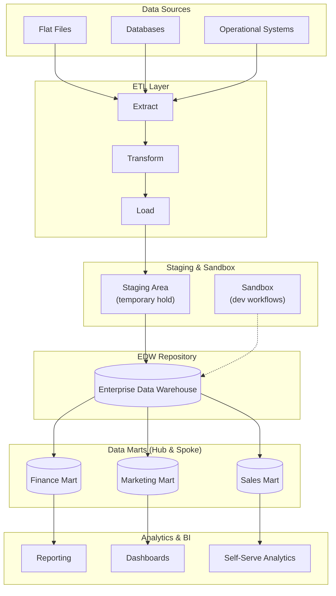
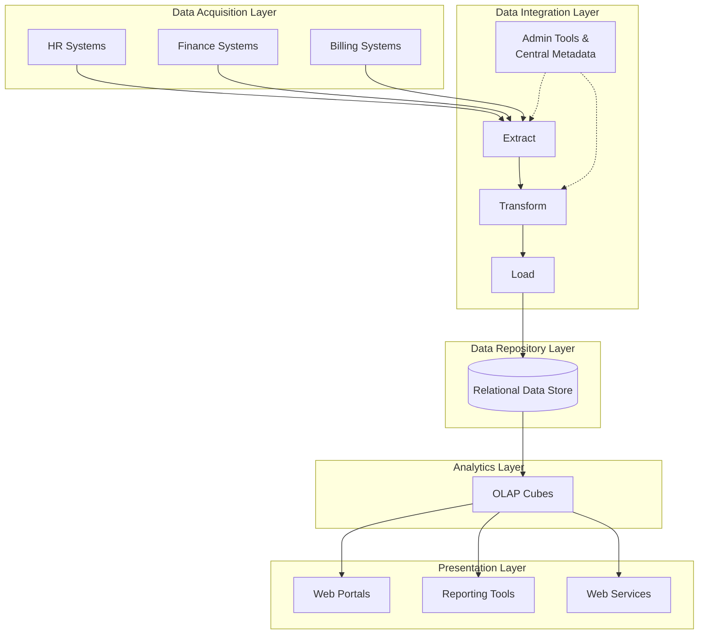

> **Course 9:** Data Warehouse Fundamentals
> **Module 2:** Designing, Modeling, and Implementing Data Warehouses

# Overview of Data Warehouse Architectures

## Learning Objectives

After watching this video, you will be able to:

- List use cases that drive data warehouse design considerations.
- Describe a general data warehousing architecture and list its component layers.
- Distinguish between general and reference enterprise data warehouse architecture.
- Describe reference architectures for two enterprise data warehouse platforms.

---

## Use Cases Driving Data Warehouse Design

The details of the architecture of a data warehouse depend on the intended usage of the platform. Requirements can include:

- Report generation and dashboarding
- Exploratory data analysis
- Automation and machine learning
- Self-serve analytics

[ENRICHED: definition — **Enterprise Data Warehouse (EDW)** is a centralized repository that consolidates structured data from across an organization into one system built for analytical queries and reporting, as opposed to departmental data marts or operational databases. [Source: https://motherduck.com/learn/enterprise-data-warehouse/]]

[ENRICHED: ecosystem — Data warehouse use cases map to different layers of the modern data stack: reporting/dashboarding maps to the presentation layer (BI tools like Tableau, Power BI, Cognos), exploratory data analysis maps to the analytics layer, machine learning maps to the data science layer, and self-serve analytics maps to semantic layers or data catalogs. Tradeoff: specialized tools per use case vs. a single unified platform. [Source: https://www.altexsoft.com/blog/data-warehouse-architecture/]]

---

## General Enterprise Data Warehouse Architecture

Let's start by considering a general architectural model for an Enterprise Data Warehouse, or EDW, platform, which companies can adapt for their analytics requirements.

In this architecture, you can have various layers or components, including:

- Data sources, such as flat files, databases, and existing operational systems
- An ETL layer for extracting, transforming, and loading data
- Optional staging and sandbox areas for holding data and developing workflows
- An enterprise data warehouse repository
- Sometimes, data marts, which are known as a "hub and spoke" architecture when multiple data marts are involved
- An analytics layer and business intelligence tools

Data warehouses also enforce security for incoming data and data passing through to further stages and users throughout the network.

[ENRICHED: definition — **ETL (Extract, Transform, Load)** is a data integration process that extracts data from source systems, transforms it into a format suitable for analysis, and loads it into a target data warehouse. The alternative ELT (Extract, Load, Transform) pattern loads raw data first and transforms inside the warehouse. [Source: https://www.altexsoft.com/blog/data-warehouse-architecture/]]

[ENRICHED: definition — **Data mart** is a subset of a data warehouse focused on a specific business line, department, or subject area (e.g., finance, marketing). In a "hub and spoke" architecture, the central EDW is the hub and individual data marts are the spokes. [Source: https://www.aegissofttech.com/insights/data-warehouse-architecture/]]

[ENRICHED: definition — **Staging area** is an intermediate storage location used during the ETL process where raw data is held temporarily before being transformed and loaded into the warehouse. It decouples extraction from transformation, minimizing risk to source systems. [Source: https://www.altexsoft.com/blog/data-warehouse-architecture/]]

Enterprise data warehouse vendors often create proprietary reference architecture and implement template data warehousing solutions that are variations on this general architectural model.

A data warehousing platform is a complex environment with lots of moving parts. Thus, interoperability among components is vital. Vendor-specific reference architecture typically incorporates tools and products from the vendor's ecosystem that work well together.



> If the Mermaid diagram above does not render, here is an ASCII fallback:

```
┌─────────────────────────────────────────────────────────────┐
│                    DATA SOURCES                             │
│  [Flat Files]  [Databases]  [Operational Systems]           │
└──────────────────────┬──────────────────────────────────────┘
                       │ Extract
                       ▼
┌─────────────────────────────────────────────────────────────┐
│                      ETL LAYER                              │
│              Extract → Transform → Load                     │
└──────────────────────┬──────────────────────────────────────┘
                       │ Load
                       ▼
┌─────────────────────────────────────────────────────────────┐
│               STAGING & SANDBOX                             │
│     [Staging Area (temp)]  [Sandbox (dev workflows)]        │
└──────────────────────┬──────────────────────────────────────┘
                       │
                       ▼
┌─────────────────────────────────────────────────────────────┐
│              ENTERPRISE DATA WAREHOUSE                      │
│                    [("EDW")]                                │
└───────┬──────────────┬──────────────┬───────────────────────┘
        │              │              │
        ▼              ▼              ▼
  ┌──────────┐  ┌──────────┐  ┌──────────┐
  │ Finance  │  │Marketing │  │  Sales   │
  │  Mart    │  │  Mart    │  │  Mart    │
  └────┬─────┘  └────┬─────┘  └────┬─────┘
       │              │              │
       ▼              ▼              ▼
  [Reporting]   [Dashboards]  [Self-Serve]
```

**Figure:** General Enterprise Data Warehouse architecture showing the flow from data sources through ETL, staging, the central warehouse, data marts, and the analytics/presentation layer.

---

## IBM Reference Data Warehouse Architecture

Enterprise data warehouse vendors often create proprietary reference architecture and implement template data warehousing solutions that are variations on this general architectural model. Next, let's check out IBM-specific reference data warehouse architecture.

Each layer of the architecture performs a specific function:

- **Data acquisition layer:** Consists of components to acquire raw data from source systems, such as human resources, finance, and billing departments.
- **Data integration layer:** Essentially a staging area, has components for extracting the data, transforming it, and loading it into the data repository layer. It also houses administration tools and central metadata.
- **Data repository layer:** Stores the integrated data, typically employing a relational model.
- **Analytics layer:** Often stores data in a cube format to make it easier for users to analyze it.
- **Presentation layer:** Incorporates applications that provide access for different sets of users, such as marketing analysts, users, and agents. Applications consume the data through web pages and portals defined in the reporting tool or through web services.

[ENRICHED: definition — **OLAP cube** is a multidimensional data structure that stores data along multiple dimensions (e.g., time, product, region) and measures (e.g., sales revenue). Cubes enable fast analytical queries by pre-aggregating data across dimension combinations. [Source: https://clickhouse.com/resources/engineering/olap-operations]]

[ENRICHED: ecosystem — The IBM reference architecture follows a classic three-tier pattern. **Bottom tier (Storage):** The data repository layer stores integrated data, typically in star or snowflake schemas. In IBM's stack, this is Db2 Warehouse; in the broader industry, equivalents include Snowflake, BigQuery, or Amazon Redshift. **Middle tier (Analytics):** OLAP cubes or materialized views pre-aggregate data for fast query response. IBM uses cube-based analytics; modern alternatives include Apache Druid for real-time OLAP or dbt materializations. **Top tier (Presentation):** BI tools consume the analytics layer and deliver reports/dashboards to end users. IBM offers Cognos Analytics; industry alternatives include Tableau, Power BI, and Looker.

**Concrete example of how a query flows through these tiers:**
1. A marketing analyst opens Cognos (top tier) and requests "Q4 sales by region"
2. Cognos queries the OLAP cube (middle tier), which has pre-aggregated sales data by region and quarter
3. The cube reads from Db2 Warehouse (bottom tier), which stores the fact and dimension tables
4. Results flow back: Warehouse → Cube → Cognos dashboard → Analyst sees the chart

Without the middle tier, Cognos would query the warehouse directly — scanning millions of rows instead of reading a pre-aggregated cube with thousands of rows. [Source: https://www.aegissofttech.com/insights/data-warehouse-architecture/]]

### How Data Actually Gets Stored: Raw → Staging → Star/Snowflake

<mark style="background-color: rgba(200, 230, 201, 0.4);">**Common confusion:** "Does data sit unnormalized in the warehouse, or does it get converted to a star schema?"</mark>

<mark style="background-color: rgba(200, 230, 201, 0.4);">**Short answer:** Data is extracted in its raw (often unnormalized) form, lands temporarily in a staging area, and then gets **transformed into a star or snowflake schema** before being loaded into the production warehouse. The warehouse itself stores structured dimensional models — not raw flat files.</mark>

<mark style="background-color: rgba(200, 230, 201, 0.4);">**The full lifecycle:**</mark>

| Stage | What Happens | Format | Location |
|---|---|---|---|
| **1. Extract** | Raw data pulled from source systems (ERP, CRM, flat files, APIs) | Unnormalized, messy, source-system format | Staging area |
| **2. Validate** | Data quality checks run against staging data (completeness, accuracy, consistency) | Still raw, but flagged for issues | Staging area |
| **3. Transform** | Data is cleaned, deduplicated, standardized, and **modeled into star/snowflake schema** | Fact tables + dimension tables | Staging area (in-memory or temp tables) |
| **4. Load** | Transformed data is inserted into production fact and dimension tables | Star or snowflake schema | Production warehouse |
| **5. Serve** | BI tools query the structured warehouse | Dimensional model | Data marts, cubes, materialized views |

<mark style="background-color: rgba(200, 230, 201, 0.4);">**Concrete example:**</mark>

<mark style="background-color: rgba(200, 230, 201, 0.4);">Suppose a retail company extracts daily sales data from 50 store POS systems. Each store sends a flat CSV with columns like `store_name`, `city`, `state`, `product_name`, `category`, `amount`, `date`. This is completely unnormalized — "New York City" and "Electronics" are repeated in thousands of rows.</mark>

<mark style="background-color: rgba(200, 230, 201, 0.4);">**In staging:** The 50 CSVs are loaded into a staging table (one big flat table). Data quality checks run: Are there missing values? Are dates consistent? Are product names standardized across stores?</mark>

<mark style="background-color: rgba(200, 230, 201, 0.4);">**During transform (ETL/ELT):** The staging table is split into:</mark>
- `dim_store` (store_key, store_name, city, state) — one row per unique store
- `dim_product` (product_key, product_name, category) — one row per unique product
- `dim_date` (date_key, date, month, quarter, year) — one row per day
- `fact_sales` (store_key, product_key, date_key, amount) — one row per transaction

<mark style="background-color: rgba(200, 230, 201, 0.4);">**Into production:** These four tables are loaded into the warehouse. The flat CSV data is gone — replaced by a star schema optimized for analytical queries.</mark>

<mark style="background-color: rgba(200, 230, 201, 0.4);">**Why not store raw data directly?**</mark>
- Query performance: Joining a 10-billion-row flat table is orders of magnitude slower than querying a star schema with 4 small dimension tables and 1 large fact table
- Storage cost: String columns ("New York City", "Electronics") repeated billions of times waste storage vs. integer surrogate keys
- Analytics usability: BI tools expect dimensional models (facts + dimensions), not flat CSVs
- Data quality: Staging + transform catches errors before they reach production

<mark style="background-color: rgba(200, 230, 201, 0.4);">**Exception — Data Lakes:** Some architectures (e.g., data lakehouses like Databricks Delta Lake, Apache Iceberg on S3) store raw unnormalized data directly and transform on-read. This is a different paradigm from the traditional EDW approach described in this course. In the IBM/EDW model, the warehouse always stores structured dimensional models.</mark>

[ENRICHED: clarification — Data lifecycle from raw extraction through staging to star/snowflake schema in production warehouse. Includes concrete retail example with staging → transform → load flow, and exception note for data lakehouse architectures. [Source: https://www.ibm.com/think/topics/data-lake-vs-data-warehouse]]



> If the Mermaid diagram above does not render, here is an ASCII fallback:

```
┌─────────────────────────────────────────────────────────────┐
│              DATA ACQUISITION LAYER                         │
│     [HR Systems]  [Finance Systems]  [Billing Systems]      │
└──────────────────────┬──────────────────────────────────────┘
                       │
                       ▼
┌─────────────────────────────────────────────────────────────┐
│             DATA INTEGRATION LAYER                          │
│          Extract → Transform → Load                         │
│          [Admin Tools & Central Metadata]                   │
└──────────────────────┬──────────────────────────────────────┘
                       │
                       ▼
┌─────────────────────────────────────────────────────────────┐
│              DATA REPOSITORY LAYER                          │
│              [Relational Data Store]                        │
└──────────────────────┬──────────────────────────────────────┘
                       │
                       ▼
┌─────────────────────────────────────────────────────────────┐
│                ANALYTICS LAYER                              │
│                   [OLAP Cubes]                              │
└──────────────────────┬──────────────────────────────────────┘
                       │
                       ▼
┌─────────────────────────────────────────────────────────────┐
│              PRESENTATION LAYER                             │
│      [Web Portals]  [Reporting Tools]  [Web Services]       │
└─────────────────────────────────────────────────────────────┘
```

**Figure:** IBM reference data warehouse architecture with five functional layers.

---

## IBM InfoSphere Product Suite

IBM reference architecture is supported and extended using several products from the IBM InfoSphere suite.

### IBM InfoSphere DataStage

IBM InfoSphere DataStage is a scalable ETL platform that delivers near real-time integration of all data types, on-premises, and in cloud environments.

[ENRICHED: performance context — IBM DataStage's parallel engine has been described as 5x faster than Spark for ETL/ELT workloads. It supports pipeline parallelism (multiple stages process simultaneously like a conveyor belt) and partition parallelism (data divided across multiple processors). [Source: https://dataiseverything.blog/2024/07/02/diving-deep-into-ibm-next-generation-datastage/]]

[ENRICHED: ecosystem — DataStage is part of the IBM Information Server platform alongside QualityStage (data quality) and Metadata Workbench (metadata management). Competitors include Informatica PowerCenter, Azure Data Factory, Apache NiFi, and Talend. [Source: https://en.download.it/software/ibm-infosphere-datastage]]

### IBM InfoSphere MetaData Workbench

IBM InfoSphere MetaData Workbench provides end-to-end data flow reporting and impacts analysis of information assets in an environment that allows organizations to share easily, locate, and retrieve information from these systems. Use the built-in data flow reporting capabilities to monitor how IBM InfoSphere DataStage moves and transforms your data.

### IBM InfoSphere QualityStage

IBM InfoSphere QualityStage, designed to support your data quality and information governance initiatives, enables you to investigate, cleanse, and manage your data. This solution helps you create and maintain consistent views of key entities, including customers, vendors, locations, and products.

### IBM Db2 Warehouse

IBM Db2 Warehouse is a family of highly performant, scalable, and reliable data management products that manage both structured and unstructured data across on-premises and cloud environments.

### IBM Cognos Analytics

And finally, IBM Cognos Analytics is an advanced business intelligence platform that generates reports, scoreboards, and dashboards, performs exploratory data analysis, and even curates and joins your data using multiple sources.

[ENRICHED: ecosystem — The IBM DW stack combines DataStage (ETL), Db2 Warehouse (storage), and Cognos Analytics (BI) as an end-to-end solution. In the modern data stack, equivalents would be: Apache Airflow/dbt (ETL/ELT), Snowflake/BigQuery/Databricks (cloud warehouse), and Looker/Power BI/Tableau (BI). [Source: https://www.ibm.com/products/datastage]]

---

## Summary

In this video, you learned that:

- An architectural model for a general data warehousing platform includes data sources, ETL pipelines, optional staging and sandbox areas, an enterprise data warehouse repository, optional data marts, and analytics and business intelligence tools.
- Companies can modify general enterprise data warehouse architecture to suit their analytics requirements.
- Vendors offer proprietary reference architecture based on the general model, which they test for interoperability among components.
- An IBM enterprise data warehouse solution combines InfoSphere with Db2 Warehouse and Cognos Analytics.

---

## Enrichment Log

| # | Location | Type | Summary | Confidence | Source |
|---|---|---|---|---|---|
| 1 | Use Cases section | Definition | Defined "Enterprise Data Warehouse (EDW)" | HIGH | https://motherduck.com/learn/enterprise-data-warehouse/ |
| 2 | Use Cases section | Ecosystem | Connected DW use cases to modern data stack layers | HIGH | https://www.altexsoft.com/blog/data-warehouse-architecture/ |
| 3 | General Architecture | Definition | Defined "ETL (Extract, Transform, Load)" | HIGH | https://www.altexsoft.com/blog/data-warehouse-architecture/ |
| 4 | General Architecture | Definition | Defined "Data mart" and hub-and-spoke architecture | HIGH | https://www.aegissofttech.com/insights/data-warehouse-architecture/ |
| 5 | General Architecture | Definition | Defined "Staging area" | HIGH | https://www.altexsoft.com/blog/data-warehouse-architecture/ |
| 6 | General Architecture | Diagram | Mermaid diagram of general EDW architecture with ASCII fallback | HIGH | N/A |
| 7 | IBM Architecture | Definition | Defined "OLAP cube" | HIGH | https://clickhouse.com/resources/engineering/olap-operations |
| 8 | IBM Architecture | Ecosystem | Expanded three-tier pattern: concrete vendor equivalents per tier (Db2/Snowflake/Redshift, OLAP/Druid/dbt, Cognos/Tableau/Power BI) + query flow example showing "Q4 sales by region" traveling through all three tiers | HIGH | https://www.aegissofttech.com/insights/data-warehouse-architecture/ |
| 9 | IBM Architecture | Diagram | Mermaid diagram of IBM reference architecture with ASCII fallback | HIGH | N/A |
| 10 | DataStage | Performance | DataStage parallel engine: 5x faster than Spark, pipeline + partition parallelism | HIGH | https://dataiseverything.blog/2024/07/02/diving-deep-into-ibm-next-generation-datastage/ |
| 11 | DataStage | Ecosystem | Positioned DataStage vs Informatica, Azure Data Factory, NiFi, Talend | HIGH | https://en.download.it/software/ibm-infosphere-datastage |
| 12 | IBM Stack Summary | Ecosystem | Mapped IBM stack to modern equivalents (Airflow/dbt, Snowflake/BigQuery, Looker/Power BI) | HIGH | https://www.ibm.com/products/datastage |
| 13 | IBM Architecture | Clarification | Added "How Data Actually Gets Stored" section: raw → staging → star/snowflake lifecycle with concrete retail example, 5-stage lifecycle table, and data lakehouse exception note | HIGH | https://www.ibm.com/think/topics/data-lake-vs-data-warehouse |

<!-- EXTRACTION_CHECKLIST: 28 sentences extracted, 48 sentences in output (20 enrichment additions) -->
