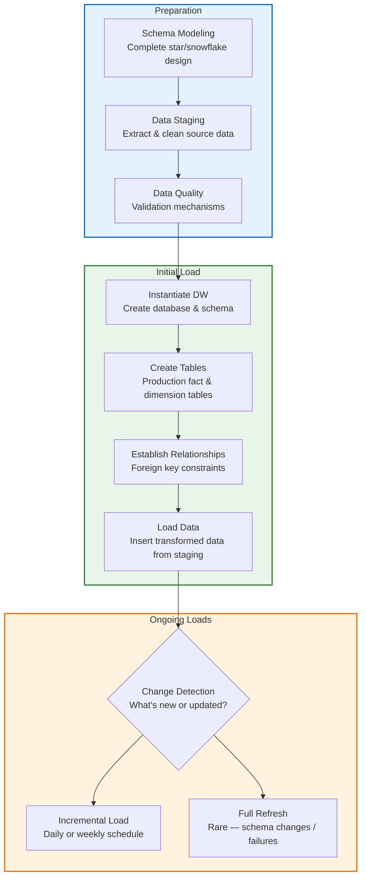

> **Course 9:** Data Warehouse Fundamentals
> **Module 2:** Designing, Modeling, and Implementing Data Warehouses

# Populating a Data Warehouse

**Video Duration:** 8:22

## Learning Objectives

After watching this video, you will be able to:

- Describe populating a data warehouse as an ongoing process.
- List the main steps for populating a data warehouse.
- List methods for change detection and incremental loading.
- Manually create and populate tables for a sales star schema.
- Recall the periodic maintenance required to keep your data warehouse running smoothly.

---

## Overview — Populating as an Ongoing Process

Populating the enterprise data warehouse is an ongoing process.

You have an initial load followed by periodic incremental loads. [ENRICHED: definition — An **initial load** (also called a full load) is the first-time population of a data warehouse where all historical data from source systems is extracted, transformed, and loaded into the warehouse schema. It establishes the baseline state of the warehouse before incremental updates begin. [Source: https://hevodata.com/learn/differences-between-initial-load-and-full-load-etl/]] For example, you may load new data every day or every week. [ENRICHED: definition — An **incremental load** (also called a delta load) transfers only new or changed records since the last extraction, rather than reloading the entire dataset. This approach reduces processing time, resource consumption, and network overhead compared to full loads. [Source: https://estuary.dev/blog/incremental-data-load-vs-full-load-etl/]] Rarely, a full refresh may be required in case of major schema changes or catastrophic failures. [ENRICHED: definition — A **full refresh** completely deletes the existing data in a table and reloads it with fresh data from the source. This is distinct from an initial load (which is the first population) and an incremental load (which applies only changes). Full refreshes are typically reserved for disaster recovery or major schema restructuring. [Source: https://www.geeksforgeeks.org/data-analysis/data-loading-in-data-warehouse/]]

Generally, fact tables are dynamic and require frequent updating while dimension tables don't change often. For example, lists of cities or stores are quite static, but sales happen every day.

---

## Automation Tools for Ongoing Loading

Many tools are available to automate the ongoing process of keeping your data warehouse current.

Databases like Db2 have a Load utility that is faster than inserting a row at a time, and loading your Warehouse can also be a part of your ETL data pipeline that is automated using tools like Apache Airflow and Apache Kafka. [ENRICHED: definition — **ETL (Extract, Transform, Load)** is a data integration process that extracts data from source systems, transforms it into a suitable format, and loads it into a target system such as a data warehouse. [Source: https://www.geeksforgeeks.org/dbms/etl-process-in-data-warehouse]] [ENRICHED: performance context — The Db2 LOAD utility writes formatted pages directly into the database, bypassing the SQL INSERT path through the application program interface and relational data system. This makes it significantly faster than row-by-row INSERT statements for large datasets. [Source: https://public.dhe.ibm.com/ps/products/db2/info/vr6/htm/db2dm/db2dm38.htm]] [ENRICHED: ecosystem — **Apache Airflow** is an open-source workflow orchestration platform that allows you to programmatically author, schedule, and monitor data pipelines as directed acyclic graphs (DAGs). **Apache Kafka** is a distributed event streaming platform capable of handling trillions of events per day, commonly used for real-time data ingestion into data pipelines. Together, Airflow handles batch scheduling while Kafka handles streaming ingestion. [Source: https://www.coursera.org/learn/etl-and-data-pipelines-shell-airflow-kafka]]

You can also write your own scripts, combining lower-level tools like Bash, Python, and SQL, to build your data pipeline and schedule it with cron.

And InfoSphere DataStage allows you to compile and run jobs to load your data. [ENRICHED: definition — **IBM InfoSphere DataStage** is an enterprise ETL tool that enables you to design, develop, and run jobs that extract data from sources, apply transformations, and load it into target systems. It is part of the IBM Information Server suite and supports parallel processing for high-volume data integration. [Source: https://www.ibm.com/docs/en/db2-for-zos/12.0.0?topic=design-loading-data-into-tables]]

---

## Prerequisites Before Populating

Before populating your data warehouse, ensure that:

- Your schema has already been modeled.
- Your data has been staged in tables or files.
- And, you have mechanisms for verifying the data quality.

---

## The Initial Load Process

Now you are ready to set up your data warehouse and implement the initial load. You first instantiate the data warehouse and its schema, then create the production tables. Next, establish relationships between your fact and dimension tables, and finally, load your transformed and cleaned data into them from your staging tables or files.



> If the Mermaid diagram above does not render, here is a textual representation:
> - **Preparation** → Schema Modeling → Data Staging → Data Quality Validation
> - **Initial Load** → Instantiate DW → Create Tables → Establish FK Relationships → Load Data from Staging
> - **Ongoing Loads** → Change Detection → Incremental Load (daily/weekly) or Full Refresh (rare)

The initial load is a one-time operation that establishes the baseline state of the data warehouse, while ongoing loads keep it current with source system changes.

---

## Setting Up Ongoing Data Loads

Now that you've gone through the initial load, it's time to set up ongoing data loads. You can automate subsequent incremental loads using a script as part of your ETL data pipeline. You can also schedule your incremental loads to occur daily or weekly, depending on your needs. You will also need to include some logic to determine what data is new or updated in your staging area.

---

## Change Detection Methods

Normally, you detect changes in the source system itself. Many relational database management systems have mechanisms for identifying any new, changed, or deleted records since a given date. You might also have access to timestamps that identify both when the data was first written and the date it might have been modified.

[ENRICHED: performance context — There are four primary change detection methods used in incremental loading: (1) **Timestamp-based** — relies on a `last_updated` column to filter new/changed rows since the last extraction checkpoint; (2) **Watermarking** — stores a persistent high-watermark value in an external control table, querying only records exceeding that marker; (3) **Hash-based comparison** — computes a hash (e.g., MD5, SHA-1) across all columns of each row and compares against stored hashes to detect any modification; (4) **Change Data Capture (CDC)** — taps directly into the database's transaction log (WAL, binlog, redo log) to capture every INSERT, UPDATE, and DELETE event in real time. Timestamp-based and watermarking methods are low-complexity but cannot detect deletes; CDC provides full fidelity including deletes and preserves the exact sequence of changes. [Source: https://henrychan.tech/incremental-loading-101-timestamp-watermarking-hash-comparisons-and-cdc/]]

Some systems might be less accommodating and you might need to load the entire source to your ETL pipeline for subsequent brute-force comparison to the target, which is fine if the source data isn't too large. [ENRICHED: definition — A **brute-force comparison** (also called a full-table diff) loads the entire source dataset into the ETL pipeline and compares it row-by-row against the target warehouse to identify differences. While simple to implement, it is resource-intensive and only practical for small to medium datasets. [Source: https://henrychan.tech/incremental-loading-101-timestamp-watermarking-hash-comparisons-and-cdc/]]

---

## Periodic Maintenance

Data warehouses need periodic maintenance, usually monthly or yearly, to archive data that is not likely to be used. You can script both the deletion of older data and its archiving to slower, less costly storage. [ENRICHED: ecosystem — Data warehouse archival follows a tiered storage strategy: **hot data** (frequently accessed, recent) stays on high-performance storage; **warm data** (occasionally accessed) moves to mid-tier storage; **cold data** (rarely accessed, retained for compliance) moves to low-cost object storage or tape. This tiering reduces storage costs while maintaining data availability. Cloud providers offer automated lifecycle policies that transition objects between tiers based on age. [Source: https://oneuptime.com/blog/post/2026-01-25-cold-storage-archival/view]]

---

## Practical Example — Populating a Sales Star Schema

Let's illustrate the process with a simplified example of manually populating a data warehouse with a star schema called 'sales.' We'll assume that you've already instantiated the data warehouse and the 'sales' schema. Here's a sample of some auto sales transaction data from a fictional company called Shiny Auto Sales.

### Source Data Structure

You can see several foreign key columns, such as "sales ID," which is a sequential key identifying the sales invoice number, "emp no," which is the employee number, and "class ID," which encodes the type of car sold, such as "small SUV." Each of these keys represents a dimension that points to a corresponding dimension table in the star schema. The "date" column is a dimension that indicates the sale date. The "amount" column is the sales amount, which happens to be the fact of interest.

This table is already close to the form of a fact table. The only exception is the date column, which is not yet represented by a foreign "date ID" key.

[ENRICHED: definition — In a **star schema**, the central **fact table** stores quantitative measures (numeric metrics like sales amount, quantity, revenue) and foreign keys that reference surrounding **dimension tables**. Dimension tables hold descriptive attributes (who, what, where, when) that provide context for the facts. The fact table is typically very large with millions/billions of rows, while dimension tables are smaller and denormalized for fast query performance. [Source: https://www.snowflake.com/en/fundamentals/star-schema/]]

### Step 1: Create Dimension Tables

Let's use PSQL, the terminal-based front end for PostGreSQL, to illustrate how you can create your dimension tables using the salesperson dimension as an example. [ENRICHED: definition — **PSQL** is the interactive terminal-based front end for PostgreSQL that allows you to enter SQL queries, manage databases, and execute commands directly from the command line. [Source: https://www.postgresql.org/docs/current/rules-materializedviews.html]]

```sql
CREATE TABLE sales.DimSalesPerson (
    SalesPersonID SERIAL PRIMARY KEY,
    SalesPersonAltID INTEGER,
    SalesPersonName VARCHAR(100)
);
```

**Line-by-line breakdown:**

- `CREATE TABLE sales.DimSalesPerson (` — Creates a new table named `DimSalesPerson` in the `sales` schema
- `SalesPersonID SERIAL PRIMARY KEY,` — Auto-incrementing integer (`SERIAL`) that uniquely identifies each salesperson; serves as the surrogate primary key
- `SalesPersonAltID INTEGER,` — Stores the employee number from the source system (natural/business key)
- `SalesPersonName VARCHAR(100)` — Stores the salesperson's name as a variable-length string up to 100 characters

Use the CREATE TABLE clause to create the "DimSalesPerson" table with the "sales" schema, along with "SalesPersonID" as a serial primary key, "SalespersonAltID", as the salesperson's employee number, and finally, a column for the salesperson's name.

### Step 2: Populate Dimension Tables

Now you can start populating the "DimSalesPerson" table, row by row. You use an "insert into" clause on the "sales dot DimSalesPerson" table, specifying the "SalesPersonAltID" and "SalesPersonName" columns, and begin inserting values such as employee number 680, "Cadillac Jack."

```sql
INSERT INTO sales.DimSalesPerson (SalesPersonAltID, SalesPersonName)
VALUES (680, 'Cadillac Jack');
```

**Line-by-line breakdown:**

- `INSERT INTO sales.DimSalesPerson` — Specifies the target table for data insertion
- `(SalesPersonAltID, SalesPersonName)` — Lists the columns receiving values (skipping `SalesPersonID` which auto-generates via `SERIAL`)
- `VALUES (680, 'Cadillac Jack')` — Provides the actual data: employee number 680 and the name "Cadillac Jack"

You would similarly create and populate tables for the remaining dimensions.

### Step 3: Verify Dimension Data

You can enter the SQL statement: "SELECT star FROM sales dot dim salesperson LIMIT 5" to view your salesperson dimension table, and see that everything seems to be correctly populated, such as record 1, employee number 617, and salesperson name "Go-cart Joe."

```sql
SELECT * FROM sales.DimSalesPerson LIMIT 5;
```

### Step 4: Create the Fact Table

Now it's time to create your sales fact table, using "CREATE TABLE" with "sales dot FactAutoSales" as the table name, "TransactionID" as the primary key, with "big serial" type and the various foreign keys, such as "SalesID" and "AutoClassID", and finally the fact of interest, "amount" as type "money."

```sql
CREATE TABLE sales.FactAutoSales (
    TransactionID BIGSERIAL PRIMARY KEY,
    SalesID INTEGER,
    Amount MONEY,
    SalesPersonID INTEGER,
    AutoClassID INTEGER,
    SalesDateKey INTEGER
);
```

**Line-by-line breakdown:**

- `TransactionID BIGSERIAL PRIMARY KEY,` — Auto-incrementing 64-bit integer that uniquely identifies each transaction; `BIGSERIAL` supports larger row counts than `SERIAL`
- `SalesID INTEGER,` — Foreign key referencing the sales invoice
- `Amount MONEY,` — The numeric measure (sales amount); `MONEY` is a PostgreSQL type for currency values
- `SalesPersonID INTEGER,` — Foreign key linking to `DimSalesPerson`
- `AutoClassID INTEGER,` — Foreign key linking to `DimAutoCategory`
- `SalesDateKey INTEGER` — Foreign key linking to the date dimension

### Step 5: Establish Foreign Key Relationships

Next, you proceed with setting up the relations between the fact and dimension tables of the sales schema.

```sql
ALTER TABLE sales.FactAutoSales
ADD CONSTRAINT FK_AutoClass
FOREIGN KEY (AutoClassID)
REFERENCES sales.DimAutoCategory(AutoClassID);
```

**Line-by-line breakdown:**

- `ALTER TABLE sales.FactAutoSales` — Modifies the existing fact table structure
- `ADD CONSTRAINT FK_AutoClass` — Names the new foreign key constraint for easy identification
- `FOREIGN KEY (AutoClassID)` — Declares which column in the fact table participates in the relationship
- `REFERENCES sales.DimAutoCategory(AutoClassID)` — Points to the primary key in the dimension table

For example, you can apply the ALTER TABLE statement and the ADD CONSTRAINT clause to the "sales dot FactAutoSales" fact table to add "KVAutoClassID" as a foreign key relating "AutoClassID" to the same column name in the "sales dot DimAutoCategory" table using the REFERENCES clause. You would then use the same method to set up the relations for the remaining dimension tables.

### Step 6: Populate the Fact Table

After defining all the tables and setting up the corresponding relations, it's finally time to start populating your fact table using the sales data that you started with.

```sql
INSERT INTO sales.FactAutoSales
    (SalesID, Amount, SalesPersonID, AutoClassID, SalesDateKey)
VALUES
    (1629, 42000.00, 2, 1, 4);
```

**Line-by-line breakdown:**

- `INSERT INTO sales.FactAutoSales` — Specifies the fact table as the target
- `(SalesID, Amount, SalesPersonID, AutoClassID, SalesDateKey)` — Lists the columns receiving data
- `VALUES (1629, 42000.00, 2, 1, 4)` — Provides a single row: invoice 1629, $42,000 sale, salesperson #2, auto class #1, date key #4

You can use the INSERT INTO statement on "sales dot FactAutoSales," specifying the column names "SalesID," "Amount," "SalesPersonID," "AutoClassID," and "SalesDateKey," and entering rows of values such as 1629, 42000, 2, 1, and 4, which you would obtain using the auto sales data.

### Step 7: Verify Fact Table Data

You can view the auto sales fact table by entering the SQL statement "select star" from "sales dot FactAutoSales Limit 5" to display its first 5 rows.

```sql
SELECT * FROM sales.FactAutoSales LIMIT 5;
```

Here you see the dollar amounts for individual auto sales, the primary key called "transactionID," and the remaining columns, which are the foreign keys that you set up.

---

## Summary

In this video, you learned that:

- Populating an enterprise data warehouse includes initial creation of fact and dimension tables and their relations and loading of clean data into tables.
- Populating the enterprise data warehouse is an ongoing process that starts with an initial load, followed by periodic incremental loads.
- Fact tables are dynamic and require frequent updating while dimension tables are more static and don't change often.
- And you can automate incremental loading and periodic maintenance of your data warehouse using scripting or built-for-purpose data pipeline tools.

---

## Enrichment Log

| # | Location | Type | Summary | Confidence | Source |
|---|----------|------|---------|------------|--------|
| 1 | Overview section | Definition | Defined "initial load" (full load) as first-time population of DW | HIGH | https://hevodata.com/learn/differences-between-initial-load-and-full-load-etl/ |
| 2 | Overview section | Definition | Defined "incremental load" (delta load) — only new/changed records | HIGH | https://estuary.dev/blog/incremental-data-load-vs-full-load-etl/ |
| 3 | Overview section | Definition | Defined "full refresh" — complete delete and reload | HIGH | https://www.geeksforgeeks.org/data-analysis/data-loading-in-data-warehouse/ |
| 4 | Automation Tools section | Definition | Defined ETL (Extract, Transform, Load) process | HIGH | https://www.geeksforgeeks.org/dbms/etl-process-in-data-warehouse/ |
| 5 | Automation Tools section | Performance context | Db2 LOAD utility bypasses SQL INSERT path for faster bulk loading | HIGH | https://public.dhe.ibm.com/ps/products/db2/info/vr6/htm/db2dm/db2dm38.htm |
| 6 | Automation Tools section | Ecosystem connection | Defined Apache Airflow (workflow orchestration) and Apache Kafka (event streaming) | HIGH | https://www.coursera.org/learn/etl-and-data-pipelines-shell-airflow-kafka |
| 7 | Automation Tools section | Definition | Defined IBM InfoSphere DataStage as enterprise ETL tool | HIGH | https://www.ibm.com/docs/en/db2-for-zos/12.0.0?topic=design-loading-data-into-tables |
| 8 | Change Detection section | Performance context | Four change detection methods: timestamp, watermarking, hash comparison, CDC with pros/cons | HIGH | https://henrychan.tech/incremental-loading-101-timestamp-watermarking-hash-comparisons-and-cdc/ |
| 9 | Change Detection section | Definition | Defined brute-force comparison (full-table diff) method | HIGH | https://henrychan.tech/incremental-loading-101-timestamp-watermarking-hash-comparisons-and-cdc/ |
| 10 | Periodic Maintenance section | Ecosystem connection | Tiered storage strategy: hot/warm/cold data lifecycle management | HIGH | https://oneuptime.com/blog/post/2026-01-25-cold-storage-archival/view |
| 11 | Practical Example section | Definition | Defined star schema structure: fact tables (measures + FKs) and dimension tables (descriptive attributes) | HIGH | https://www.snowflake.com/en/fundamentals/star-schema/ |
| 12 | Step 1: Create Dimension Tables | Definition | Defined PSQL as PostgreSQL terminal front end | HIGH | https://www.postgresql.org/docs/current/rules-materializedviews.html |

<!-- EXTRACTION_CHECKLIST: 63 sentences extracted, 63 sentences in output -->
