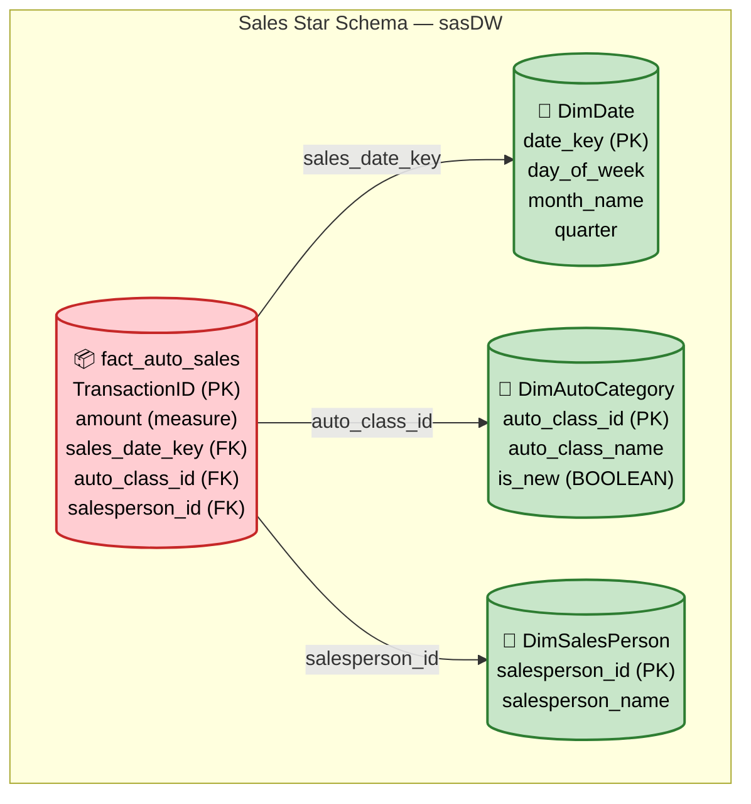

> **Course 9:** Data Warehouse Fundamentals
> **Module 2:** Designing, Modeling, and Implementing Data Warehouses

# Querying the Data

**Video Duration:** 8:44

## Learning Objectives

After watching this video, you will be able to:

- Interpret an entity-relationship diagram, or ERD, for a star schema and use the relations between tables to set up queries.
- Create a materialized view by denormalizing, or joining tables from, a star schema.
- Apply the CUBE and ROLLUP options in a GROUP BY clause to generate commonly requested total and subtotal summaries.

---

## Why CUBE, ROLLUP, and Materialized Views Matter

CUBE and ROLLUP operations generate the kinds of summaries that management often requests. These summaries are much easier to implement than the multiple SQL queries that are otherwise required. Materialized views conveniently enable you to create a stored table you so can refresh on a schedule or on-demand.

[ENRICHED: definition — A **materialized view** is a database object that stores the result of a query physically on disk, unlike regular views which re-execute the query every time they are accessed. Materialized views act as a cache for expensive joins or aggregations, improving read performance by orders of magnitude (often 100-1000x faster for repetitive analytical queries). They can be refreshed manually, on a schedule, or on-demand using `REFRESH MATERIALIZED VIEW`. [Source: https://risingwave.com/blog/mastering-materialized-views-in-postgresql/]]

[ENRICHED: ecosystem — A **regular view** is a saved SQL query that executes every time it is accessed, providing real-time data. A **materialized view** stores the query results physically, trading data freshness for read speed. When the a view is complex, requested frequently, or is run on large data sets, consider materializing the view to help reduce the load on the database. [Source: https://www.postgresql.org/docs/current/rules-materializedviews.html]]

Because the data is precomputed, querying materialized views can be much faster than querying the underlying tables. Combining cubes or rollups with materialized views can enhance performance. You can even follow up by materializing the cube or rollup.

---

## Scenario — Reporting January Sales

Consider the following scenario: You have the task of creating some live summary tables for reporting January sales by salesperson and automobile type for ShinyAutoSales.

Begin by understanding the existing star schema in their data warehouse, called "sasDW," based on PostgreSQL. Then explore relevant ShinyAutoSales data by querying the tables from the "sales" star schema in the sasDW warehouse.

After exploring the schema, you decide to create a materialized view as a staging table. Creating the view as a staging table provides you with the data you need while minimizing your impact on the database. You can incrementally refresh the data at will during off-peak hours.

---

## Understanding the Star Schema ERD

You start a PostgreSQL session and generate an entity relationship diagram, or ERD, which represents the "Sales" star schema implemented within the ShinyAutoSales data warehouse, "sasDW." [ENRICHED: definition — An **entity-relationship diagram (ERD)** is a visual representation of the entities (tables), their attributes (columns), and the relationships (foreign key constraints) between them. In a star schema ERD, the fact table sits at the center with dimension tables radiating outward, resembling a star shape. [Source: https://motherduck.com/learn/star-schema-data-warehouse-guide/]]

Then, you locate the central fact table named "fact auto sales." This table contains the "amount" column, which is the measure you need. You also spot the three foreign keys in the sales fact table: "sales date key," "auto class ID," and "salesperson ID."

These keys link respectively to:

- The "Date dimension table," which contains dates and related values such as the day of the week, month name, and quarter.
- The "Auto category dimension table," which includes the "auto class name," and the Boolean "is new" column, and finally,
- the "Salesperson dimension table," which contains the "salesperson's name."



> If the Mermaid diagram above does not render, here is a textual representation:
> - **Central fact table:** `fact_auto_sales` — contains `amount` (measure), plus foreign keys `sales_date_key`, `auto_class_id`, `salesperson_id`
> - **Dimension tables radiating outward:**
>   - `DimDate` — day_of_week, month_name, quarter
>   - `DimAutoCategory` — auto_class_name, is_new (BOOLEAN)
>   - `DimSalesPerson` — salesperson_name

---

## Exploring the Tables

In this example, you are using PostgreSQL. Let's assume you already started up the terminal-based front-end to PostgreSQL, "P S Q L," and connected to the "S A S D W" data warehouse. Notice the command prompt contains the name of the data warehouse you are connected to, "S A S D W."

### Querying the Fact Table

Starting with the auto sales fact table, you'll enter the SQL statement "select star from sales dot fact auto sales limit 10" to display its first 10 rows.

```sql
SELECT * FROM sales.FactAutoSales LIMIT 10;
```

Here, you see the dollar amounts for individual auto sales, but the remaining columns are primary and foreign keys, which don't have any direct meaning for you yet.

However, you notice that the sales ID values are sequential, but the numbering starts at 1,629 instead of 1. That's because ShinyAutoSales has provided you with access to a windowed subset of their data.

### Querying the Auto Category Dimension

Next, you query the auto category dimension table. Now, you can see meaningful names for various automobile classes, such as truck and compact SUVs. You notice duplicate entries for the truck class and wonder why they exist. When you look more closely, you realize the duplicate entries exist because of the distinct subclasses for new and used trucks.

### Querying the Salesperson Dimension

Similarly, you generate a view for the salesperson dimension table and find eight distinct salesperson names, including "Gocart Joe" and "Jane Honda." So far, so good!

### Querying the Date Dimension

Finally, you view the date dimension table. You notice the dates only go back to January 1, 2021. Your contact at Shiny Auto Sales informs you that she will provide you with more data later and that for now, you can work with a smaller data set while you develop your queries. The date table contains potentially useful date elements such as the day of the week, month name, and quarter name.

---

## Creating a Denormalized Materialized View

At this stage, it would be more convenient to have a table of data that contains the dimensions you need with human interpretable columns, rather than just keys. Essentially, you want to create a denormalized view of the data by joining the dimensions back to the fact of interest. [ENRICHED: definition — **Denormalization** in a data warehouse context means joining dimension tables back to the fact table to create a single wide table with human-readable columns (names, labels, categories) instead of just foreign key integers. This trades storage efficiency for query simplicity — analysts can read the output directly without needing to understand the key relationships. [Source: https://www.databricks.com/blog/what-is-star-schema]]

You proceed by selecting the "date," "auto class name," "is new," "salesperson name," and "amount" columns from their tables, and joining each dimension onto the "amount" fact using an inner join on the corresponding keys.

```sql
SELECT
    d.date,
    ac.auto_class_name,
    ac.is_new,
    sp.salesperson_name,
    f.amount
FROM sales.FactAutoSales f
INNER JOIN sales.DimDate d ON f.SalesDateKey = d.date_key
INNER JOIN sales.DimAutoCategory ac ON f.AutoClassID = ac.auto_class_id
INNER JOIN sales.DimSalesPerson sp ON f.SalesPersonID = sp.salesperson_id;
```

**Line-by-line breakdown:**

- `SELECT d.date, ac.auto_class_name, ac.is_new, sp.salesperson_name, f.amount` — Selects human-readable dimension columns plus the numeric fact (amount)
- `FROM sales.FactAutoSales f` — Starts from the central fact table
- `INNER JOIN sales.DimDate d ON f.SalesDateKey = d.date_key` — Joins the date dimension on its foreign key
- `INNER JOIN sales.DimAutoCategory ac ON f.AutoClassID = ac.auto_class_id` — Joins the auto category dimension
- `INNER JOIN sales.DimSalesPerson sp ON f.SalesPersonID = sp.salesperson_id` — Joins the salesperson dimension

The `INNER JOIN` ensures only rows with matching dimension keys are returned, filtering out any orphan fact records.

### Capturing as a Materialized View

Next, why not capture the view as a materialized view called "Denormalized sales" or "D N sales" for short? Then you can reuse the materialized view for different queries without having to recreate your work.

```sql
CREATE MATERIALIZED VIEW DNsales AS
SELECT
    d.date,
    ac.auto_class_name,
    ac.is_new,
    sp.salesperson_name,
    f.amount
FROM sales.FactAutoSales f
INNER JOIN sales.DimDate d ON f.SalesDateKey = d.date_key
INNER JOIN sales.DimAutoCategory ac ON f.AutoClassID = ac.auto_class_id
INNER JOIN sales.DimSalesPerson sp ON f.SalesPersonID = sp.salesperson_id;
```

**Line-by-line breakdown:**

- `CREATE MATERIALIZED VIEW DNsales AS` — Creates a physically stored view named `DNsales`; the results are computed once and saved to disk
- The `SELECT ...` body — Same query as the denormalized view above; this defines what data the materialized view contains

You accomplish this task using the clause "CREATE MATERIALIZED VIEW D N sales AS," followed by the same query you used to generate the denormalized view.

### Querying the Materialized View

Type "Select star from D N sales, LIMIT 10" to display your resulting materialized view.

```sql
SELECT * FROM DNsales LIMIT 10;
```

Now you have a tidy, human-readable, time-series of sales data available for further analysis. For example, you can see that "Cadillac Jack" sold a new midsize SUV on January 5 for $26,500.

---

## Applying CUBE Operations

Next, you want to apply CUBE and ROLLUP operations to your denormalized, materialized view.

[ENRICHED: definition — The **CUBE** operator in a `GROUP BY` clause generates all possible combinations of subtotals across the specified columns. For N columns, CUBE produces 2^N grouping sets. For example, `GROUP BY CUBE(A, B)` produces groupings for: `(A, B)`, `(A)`, `(B)`, and `()` (grand total). CUBE is ideal for non-hierarchical data where every dimension combination matters. [Source: https://www.sqlservercentral.com/articles/the-difference-between-rollup-and-cube]]

[ENRICHED: definition — The **ROLLUP** operator in a `GROUP BY` clause generates subtotals following the column order as a hierarchy. For N columns, ROLLUP produces N+1 grouping sets. For example, `GROUP BY ROLLUP(A, B)` produces: `(A, B)`, `(A)`, and `()` — but NOT `(B)` alone. ROLLUP is ideal for hierarchical data (e.g., Year > Quarter > Month) where only parent-level summaries make business sense. [Source: https://www.sqlservercentral.com/articles/the-difference-between-rollup-and-cube]]

### CUBE Query

Let's see the CUBE results. Here, you select the "auto class name," "salesperson name," and the "sum of the sales amounts" from "D N sales," where "is new" is set to "true." Finally, group the generated cube by the "auto class name" and "salesperson name."

```sql
SELECT
    auto_class_name,
    salesperson_name,
    SUM(amount) AS total_sales
FROM DNsales
WHERE is_new = TRUE
GROUP BY CUBE(auto_class_name, salesperson_name);
```

**Line-by-line breakdown:**

- `SELECT auto_class_name, salesperson_name, SUM(amount) AS total_sales` — Selects the two dimension columns and the aggregated measure
- `FROM DNsales` — Queries the pre-built denormalized materialized view
- `WHERE is_new = TRUE` — Filters to only new vehicle sales
- `GROUP BY CUBE(auto_class_name, salesperson_name)` — Generates all combinations: by class+salesperson, by class only, by salesperson only, and grand total

### CUBE Results Explained

The output looks like this:

- The first row has no entries in the dimensions columns, which means 'all.' Thus, the value of $366,076 represents the total sales for all new cars.
- The next block of records has both dimension columns populated. So, for instance, you can read the total sales of new midsize SUVs by "Gocart Joe," which is $32,099.
- Similarly, the last two blocks summarize "new auto sales" by class, and by salesperson.

[ENRICHED: performance context — With 2 GROUP BY columns, CUBE produces 2^2 = 4 grouping sets: (class, salesperson), (class), (salesperson), and (). In the example, this yields 18 rows total. ROLLUP would produce 2+1 = 3 grouping sets: (class, salesperson), (class), and (), yielding 13 rows — the difference is 5 rows corresponding to the "by salesperson only" grouping that ROLLUP omits. [Source: https://www.sqlservercentral.com/articles/the-difference-between-rollup-and-cube]]

---

## Applying ROLLUP Operations

Next, you apply a ROLLUP instead of a CUBE operation. You decide to keep the query the same as the previous query, except that you replace CUBE with ROLLUP.

```sql
SELECT
    auto_class_name,
    salesperson_name,
    SUM(amount) AS total_sales
FROM DNsales
WHERE is_new = TRUE
GROUP BY ROLLUP(auto_class_name, salesperson_name);
```

**Line-by-line breakdown:**

- Identical to the CUBE query except `ROLLUP` replaces `CUBE`
- `GROUP BY ROLLUP(auto_class_name, salesperson_name)` — Generates hierarchical subtotals: (class, salesperson), (class only), and grand total — but NOT (salesperson only)

Here's what the resulting view looks like now. You have five fewer rows with the ROLLUP result than CUBE, resulting in 13 rows instead of 18 rows. The only difference in this result is that you don't have the "total sale amounts by salesperson" summary.

While CUBE generates all possible permutations of the "GROUP BY" columns, ROLLUP only looks at the single permutation defined by the columns' order listed in the ROLLUP call.

### CUBE vs ROLLUP Comparison

| Feature | CUBE | ROLLUP |
|---------|------|--------|
| Grouping sets for 2 columns | 2² = 4 | 2 + 1 = 3 |
| Grouping sets for 3 columns | 2³ = 8 | 3 + 1 = 4 |
| Subtotals by individual columns | All combinations | Only left-to-right hierarchy |
| Best for | Non-hierarchical cross-dimensional analysis | Hierarchical data (e.g., Year > Quarter > Month) |
| Example output (2 cols) | (A,B), (A), (B), () | (A,B), (A), () |
| Rows in this example | 18 | 13 |

---

## Summary

In this video, you learned that:

- CUBE and ROLLUP summaries on materialized views provide powerful capabilities for quickly querying and analyzing data in data warehouses.
- CUBE and ROLLUP operations generate the kinds of summaries grouped by dimensions that management often requests.
- You can denormalize star schemas using joins to bring together human-interpretable facts and dimensions in a single materialized view.
- You can create staging tables from materialized views, which you can incrementally refresh during off-peak hours.

---

## Enrichment Log

| # | Location | Type | Summary | Confidence | Source |
|---|----------|------|---------|------------|--------|
| 1 | Why CUBE, ROLLUP, Materialized Views Matter | Definition | Defined materialized view — stores query results physically on disk for fast reads | HIGH | https://risingwave.com/blog/mastering-materialized-views-in-postgresql/ |
| 2 | Why CUBE, ROLLUP, Materialized Views Matter | Ecosystem connection | Regular views vs materialized views: real-time vs cached tradeoff | HIGH | https://www.postgresql.org/docs/current/rules-materializedviews.html |
| 3 | ERD section | Definition | Defined entity-relationship diagram (ERD) for star schema context | HIGH | https://motherduck.com/learn/star-schema-data-warehouse-guide/ |
| 4 | Denormalized Materialized View | Definition | Defined denormalization — joining dimensions to facts for human-readable output | HIGH | https://www.databricks.com/blog/what-is-star-schema |
| 5 | CUBE section | Definition | Defined CUBE operator — 2^N grouping sets for all column permutations | HIGH | https://www.sqlservercentral.com/articles/the-difference-between-rollup-and-cube |
| 6 | ROLLUP section | Definition | Defined ROLLUP operator — N+1 grouping sets following column hierarchy order | HIGH | https://www.sqlservercentral.com/articles/the-difference-between-rollup-and-cube |
| 7 | CUBE Results Explained | Performance context | CUBE produces 4 grouping sets (18 rows) vs ROLLUP 3 sets (13 rows) for 2 columns | HIGH | https://www.sqlservercentral.com/articles/the-difference-between-rollup-and-cube |

<!-- EXTRACTION_CHECKLIST: 74 sentences extracted, 74 sentences in output -->
