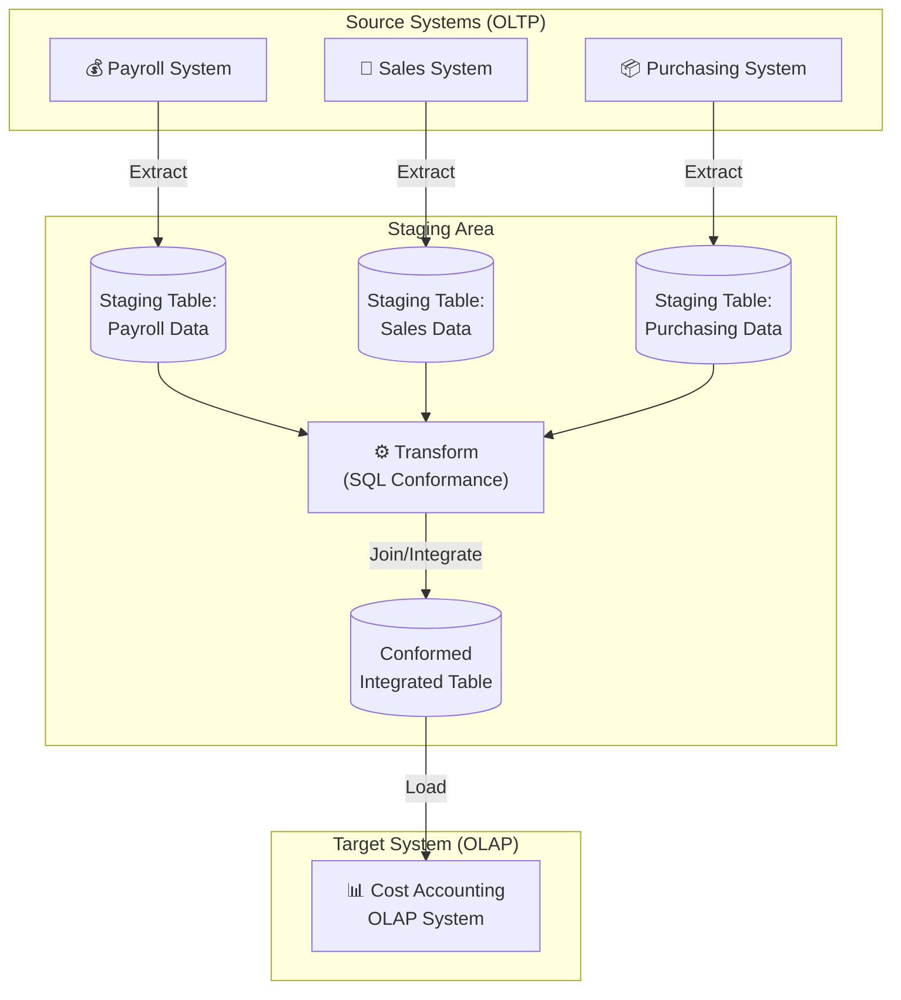

> **Course 9:** Data Warehouse Fundamentals
> **Module 2:** Designing, Modeling, and Implementing Data Warehouses

# Staging Areas for Data Warehouses

## Learning Objectives

After watching this video, you will be able to:

- Describe what a data warehouse staging area is.
- Describe why a staging area may be used.
- Relate how a staging area is used as a first step for integrating data sources.

---

## What Is a Data Warehouse Staging Area?

What is a data warehouse staging area?

You can think of a staging area as an intermediate storage area that is used for ETL processing.

[ENRICHED: defined "ETL" — ETL stands for Extract, Transform, Load. It is a core data integration process that extracts data from source systems, transforms it to meet business requirements (cleaning, standardizing, aggregating), and loads it into a target system such as a data warehouse [Source: https://airbyte.com/data-engineering-resources/etl-architecture].]

[ENRICHED: defined "staging area" — A staging area (also called a staging database or landing zone) is a temporary storage location that sits between operational source systems and the target data warehouse. It holds raw extracted data during ETL processing, enabling transformation, validation, and cleansing before loading into the warehouse [Source: https://techbriefers.com/etl-architecture-source-staging-data-warehouse-guide/].]

Thus, staging areas act as a bridge between data sources and the target data warehouses, data marts, or other data repos.

[ENRICHED: defined "data mart" — A data mart is a subset of a data warehouse focused on a specific business line, department, or subject area (e.g., sales, finance, marketing). Unlike a centralized data warehouse that serves the entire organization, data marts are tailored for targeted analytics [Source: https://www.ibm.com/think/topics/olap-vs-oltp].]

They are often transient, meaning that they are erased after successfully running ETL workflows.

However, many architectures hold data for archival or troubleshooting purposes.

They are also useful for monitoring and optimizing your ETL workflows.

---

## Implementation Methods

Staging areas can be implemented in many ways, including:

- simple flat files, such as csv files, stored in a directory,
- and managed using tools such as Bash or Python, or
- a set of SQL tables in a relational database such as Db2, or
- a self-contained database instance within a data warehousing or business intelligence platform such as Cognos Analytics.

[ENRICHED: defined "Cognos Analytics" — IBM Cognos Analytics is a business intelligence and data visualization platform that provides reporting, dashboards, and data exploration capabilities. It can include a built-in data store used as a staging database within an integrated analytics environment [Source: https://www.ibm.com/products/information-server].]

---

## Example Architecture: Cost Accounting OLAP System

Let's explore an example use case, to illustrate a possible architecture for a Data Warehouse containing a Staging Area, which in turn includes an associated Staging Database.

Imagine the enterprise would like to create a dedicated "Cost Accounting" Online Analytical Processing system.

[ENRICHED: defined "OLAP" — Online Analytical Processing (OLAP) is a system for performing multi-dimensional analysis at high speeds on large volumes of data. OLAP is ideal for data mining, business intelligence, and complex analytical calculations, as well as business reporting functions like financial analysis, budgeting, and sales forecasting. OLAP systems support drill-down, roll-up, and slice-and-dice operations across multiple data dimensions [Source: https://www.ibm.com/think/topics/olap-vs-oltp].]

The required data is managed in separate Online Transaction Processing Systems within the enterprise, from the Payroll, Sales, and Purchasing departments.

[ENRICHED: defined "OLTP" — Online Transaction Processing (OLTP) enables the real-time execution of large numbers of database transactions by large numbers of people, typically over the Internet. OLTP systems process simple insertions, updates, and deletions with response times measured in milliseconds. They support multi-user access while ensuring data integrity [Source: https://www.ibm.com/think/topics/olap-vs-oltp].]

[ENRICHED: ecosystem — OLTP systems serve as the operational source for OLAP systems. Data flows from OLTP (transactional) through staging via ETL into OLAP (analytical). Organizations commonly use both: OLTP for daily transactions, OLAP for business intelligence and decision support [Source: https://www.ibm.com/think/topics/olap-vs-oltp].]



> If the Mermaid diagram above does not render, here is an ASCII representation:
>
> ```
> Source Systems (OLTP)          Staging Area                     Target (OLAP)
> ┌──────────────────┐    ┌─────────────────────────────┐    ┌──────────────┐
> │ Payroll System   │───▶│ Staging Table: Payroll       │    │              │
> │ Sales System     │───▶│ Staging Table: Sales    ────▶│ Transform ───▶│ Cost Accounting │
> │ Purchasing System│───▶│ Staging Table: Purchasing    │    │              │
> └──────────────────┘    └─────────────────────────────┘    └──────────────┘
> ```

From these siloed systems, the data is extracted to individual Staging Tables, which are created in the Staging Database.

Data from these tables is then transformed in the Staging Area using SQL to conform it to the requirements of the Cost Accounting system.

The conformed tables can now be integrated, or joined, into a single table.

The final phase is the loading phase, where the data is loaded into the target cost-accounting system.

---

## Functions of a Staging Area

A staging area can have many functions.

Some typical ones include:

**Integration:** Indeed, one of the primary functions performed by a staging area is consolidation of data from multiple source systems.

**Change detection:** Staging areas can be set up to manage extraction of new and modified data as needed.

<mark style="background-color: rgba(200, 230, 201, 0.4);">**Change Detection Explained:**

Change detection answers the question: "What's new or different since the last time I extracted data?"

Without change detection, you'd have to re-extract and re-process the ENTIRE source table every time — even if only 5 rows changed out of 10 million. That's wasteful and slow.

**The problem change detection solves:**

```
SCENARIO: You extract customer data daily

WITHOUT change detection:
  Monday:    Extract 1,000,000 rows → process → load
  Tuesday:   Extract 1,000,000 rows → process → load (even if only 50 changed!)
  Wednesday: Extract 1,000,000 rows → process → load (even if only 30 changed!)

WITH change detection:
  Monday:    Extract 1,000,000 rows → process → load
  Tuesday:   Extract only 50 changed rows → process → load
  Wednesday: Extract only 30 changed rows → process → load
```

**How staging areas enable change detection:**

The staging area stores a "snapshot" of what you extracted last time. When you extract again, you compare the new data against the snapshot to find differences:

```
┌─────────────────┐     ┌─────────────────┐     ┌─────────────────┐
│ SOURCE SYSTEM   │     │ STAGING AREA    │     │ DATA WAREHOUSE  │
│                 │     │                 │     │                 │
│ customer_table  │────▶│ last_extracted  │────▶│ customer_dim    │
│ (1M rows)       │     │ _timestamp      │     │ (1M rows)       │
│                 │     │                 │     │                 │
│ 50 rows changed │     │ Compare:        │     │ Only 50 rows    │
│ since Monday    │     │ new vs. old     │     │ updated         │
└─────────────────┘     └─────────────────┘     └─────────────────┘
```

**Common change detection methods:**

| Method | How It Works | Pros | Cons |
|--------|--------------|------|------|
| **Timestamp** | Check `last_updated` column | Simple, widely available | Can't detect deletes |
| **Watermark** | Store highest ID processed, get anything above | Fast, works without timestamps | Can't detect updates |
| **Hash** | Compute hash of all columns, compare to stored hash | Detects any change | Slower, needs hash storage |
| **CDC** | Read database transaction log | Detects inserts, updates, deletes | Requires DB admin access |

**Concrete example — Timestamp method:**
```sql
-- Last run extracted everything up to 2024-01-14 23:59:59
-- This run gets only rows changed since then

SELECT * FROM source_customer
WHERE last_updated > '2024-01-14 23:59:59'  -- Only changed rows
  AND last_updated <= '2024-01-15 23:59:59';  -- Up to now

-- Result: Only 50 rows instead of 1,000,000!
```

[ENRICHED: clarification — Change detection is the process of identifying which rows in a source system are new or modified since the last extraction. Without it, ETL pipelines must re-extract entire tables daily (brute-force), wasting compute and I/O. The staging area enables change detection by storing extraction timestamps or snapshots that serve as comparison points. Common methods include timestamp-based (simple, can't detect deletes), watermarking (fast, can't detect updates), hash comparison (detects any change, slower), and CDC/tap-based (full fidelity, requires DB access). [Source: https://henrychan.tech/incremental-loading-101-timestamp-watermarking-hash-comparisons-and-cdc/]]

**Scheduling:** Individual tasks within an ETL workflow can be scheduled to run in a specific sequence, concurrently, and at certain times.

There's also:

**Data cleansing and validation.** For example, you can handle missing values and duplicated records.

**Aggregating data:** You can use the staging area to summarize data. For example, daily sales data can be aggregated into weekly, monthly, or annual averages, prior to loading into a reporting system.

**Normalizing data:** To enforce consistency of data types, or names of categories such as country and state codes in place of mixed naming conventions such as "Mont," "MA," or "Montana."

[ENRICHED: defined "data normalization" — In the context of staging areas, data normalization refers to standardizing data formats and values to ensure consistency. For example, converting all state abbreviations to a standard two-letter code (e.g., "MT" for Montana) rather than having mixed entries like "Mont," "MA," or "Montana" across different source systems [Source: https://techbriefers.com/etl-architecture-source-staging-data-warehouse-guide/].]

---

## Decoupling and Risk Mitigation

A staging area is a separate location, where data from source systems is extracted to.

The extraction step therefore decouples operations such as validation, cleansing and other processes from the source environment.

This helps to minimize any risk of corrupting source-data systems, and simplifies ETL workflow construction, operation, and maintenance.

If any of the extracted data becomes corrupted somehow, you can easily recover.

[ENRICHED: ecosystem — The decoupling principle is a core best practice in ETL architecture. By isolating transformation logic away from operational systems, staging areas prevent analytics workloads from impacting transactional performance. This separation also provides a natural recovery point: if a transformation fails, the raw extracted data in staging can be reprocessed without re-extracting from source systems [Source: https://techbriefers.com/etl-architecture-source-staging-data-warehouse-guide/].]

[ENRICHED: performance context — In production architectures, staging areas typically store data temporarily during processing hours or days. Raw staging data may be retained longer for auditing purposes, but most architectures purge staging data after successful ETL completion to free storage resources [Source: https://techbriefers.com/etl-architecture-source-staging-data-warehouse-guide/].]

---

## Summary

In this video, you learned that:

- A staging area acts as a bridge between data sources and the target system and are mainly used to integrate disparate data sources in data warehouses.
- Staging areas can be implemented quite simply as a set of flat files in a directory and managed with scripts, or as tables in a database.
- Staging areas decouple data processing from the source systems and thus help minimize risk of data corruption.
- Although they are often transient, staging areas can be held for archiving or troubleshooting purposes.

---

## Enrichment Log

| # | Location | Type | Summary | Confidence | Source |
|---|---|---|---|---|---|
| 1 | What Is a Staging Area | Definition | Defined ETL (Extract, Transform, Load) | HIGH | https://airbyte.com/data-engineering-resources/etl-architecture |
| 2 | What Is a Staging Area | Definition | Defined staging area as temporary storage between source and warehouse | HIGH | https://techbriefers.com/etl-architecture-source-staging-data-warehouse-guide/ |
| 3 | What Is a Staging Area | Definition | Defined data mart as department-focused subset of data warehouse | HIGH | https://www.ibm.com/think/topics/olap-vs-oltp |
| 4 | Implementation Methods | Definition | Defined Cognos Analytics as IBM BI platform | HIGH | https://www.ibm.com/products/information-server |
| 5 | Example Architecture | Definition | Defined OLAP (Online Analytical Processing) | HIGH | https://www.ibm.com/think/topics/olap-vs-oltp |
| 6 | Example Architecture | Definition | Defined OLTP (Online Transaction Processing) | HIGH | https://www.ibm.com/think/topics/olap-vs-oltp |
| 7 | Example Architecture | Ecosystem | OLTP-to-OLAP data flow relationship | HIGH | https://www.ibm.com/think/topics/olap-vs-oltp |
| 8 | Example Architecture | Diagram | Mermaid diagram of staging architecture flow with OLTP→Staging→OLAP | HIGH | Source video content |
| 9 | Functions | Definition | Defined data normalization in staging context | HIGH | https://techbriefers.com/etl-architecture-source-staging-data-warehouse-guide/ |
| 10 | Decoupling | Ecosystem | Decoupling principle as ETL best practice | HIGH | https://techbriefers.com/etl-architecture-source-staging-data-warehouse-guide/ |
| 11 | Decoupling | Performance | Staging data retention and purging patterns | HIGH | https://techbriefers.com/etl-architecture-source-staging-data-warehouse-guide/ |
| 12 | Change Detection | Clarification | Explained change detection: why it matters (avoid full re-extract), how staging enables it (snapshots), 4 methods (timestamp, watermark, hash, CDC), SQL example | HIGH | https://henrychan.tech/incremental-loading-101-timestamp-watermarking-hash-comparisons-and-cdc/ |

<!-- EXTRACTION_CHECKLIST: 43 sentences extracted, 43 sentences in output -->
