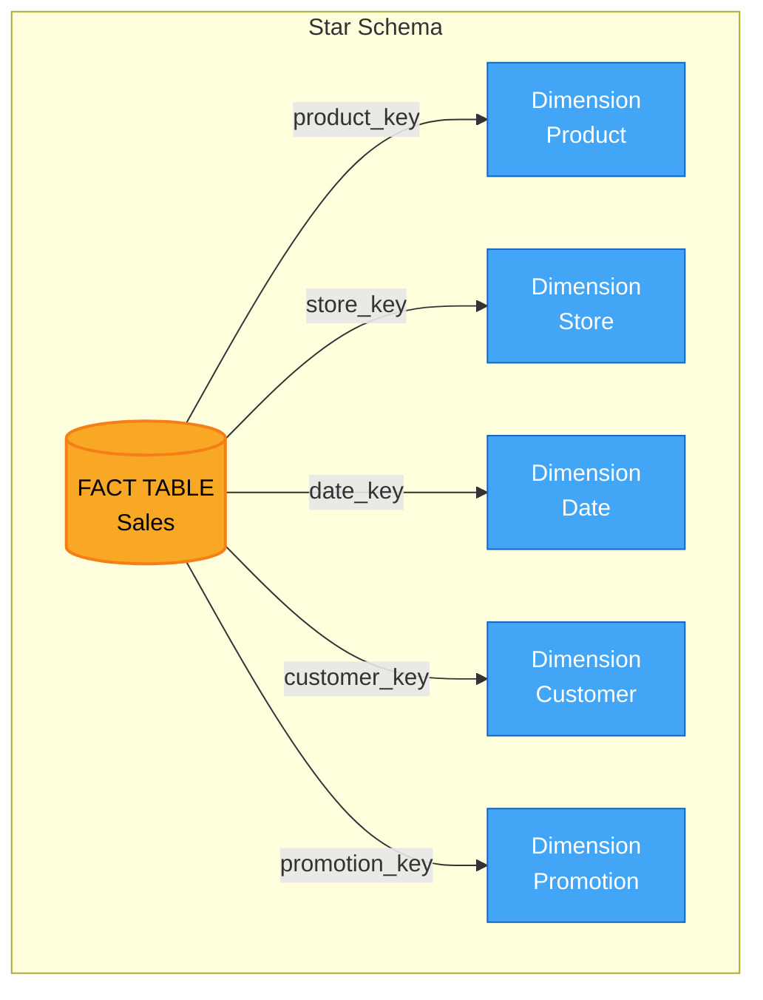
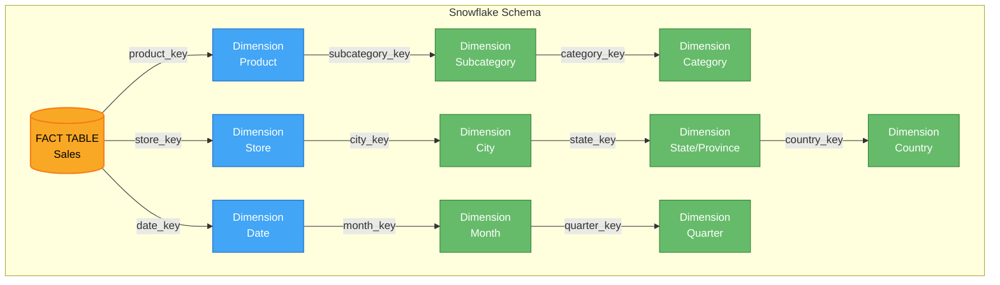
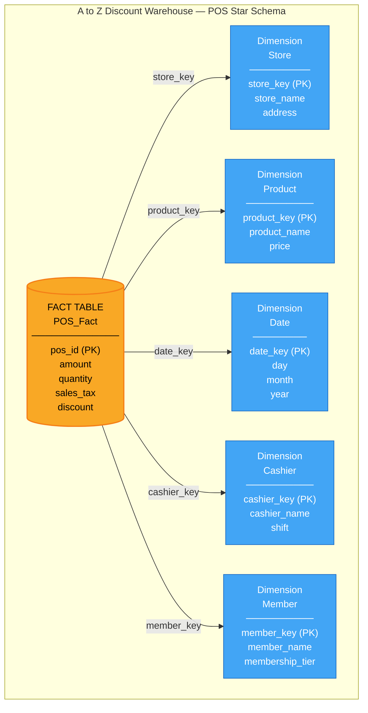

> **Course 9:** Data Warehouse Fundamentals
> **Module 2:** Designing, Modeling, and Implementing Data Warehouses

# Data Modeling using Star and Snowflake Schemas

## Learning Objectives

- Describe star schema modeling in terms of facts and dimensions
- Describe snowflake schema as an extension of star schema
- Distinguish star from snowflake schema in terms of normalization
- Recall that a fact table contains foreign keys that refer to the primary keys of dimension tables

---

## Star Schema Fundamentals

The idea of a star schema is based on the way a set of dimension tables can be visualized, or modeled, as radiating from a central fact table, linked by these keys. A star schema is thus a graph, whose nodes are fact and dimension tables, and whose edges are the relations between those tables.

[ENRICHED: definition — A "fact table" is the central table in a dimensional model that stores quantitative measures (facts) such as sales amount, quantity, or temperature. Each row in a fact table represents a business event or transaction, and the table contains foreign keys that reference dimension tables providing descriptive context. [Source: https://www.kimballgroup.com/data-warehouse-business-intelligence-resources/kimball-techniques/dimensional-modeling-techniques/dimension-surrogate-key/]]

[ENRICHED: definition — A "dimension table" stores descriptive attributes about business entities — such as products, customers, stores, or dates. Dimension tables are typically wider (more columns) but shorter (fewer rows) than fact tables. Each dimension table has a primary key that is referenced by foreign keys in the fact table. [Source: https://learn.microsoft.com/en-us/fabric/data-warehouse/dimensional-modeling-dimension-tables]]

[ENRICHED: definition — A "foreign key" is a column (or set of columns) in one table that references the primary key of another table, establishing a relational link between them. In a star schema, the fact table's foreign keys point to the primary keys of the surrounding dimension tables. [Source: https://www.thoughtspot.com/data-trends/data-modeling/star-schema-vs-snowflake-schema]]

[ENRICHED: definition — A "primary key" is a column (or set of columns) that uniquely identifies each row in a table. No two rows can share the same primary key value, and it cannot be NULL. In dimensional modeling, dimension tables use either natural keys (from the source system) or surrogate keys (warehouse-generated integers) as primary keys. [Source: https://www.kimballgroup.com/data-warehouse-business-intelligence-resources/kimball-techniques/dimensional-modeling-techniques/dimension-surrogate-key/]]

### Facts vs Dimensions — Side-by-Side Comparison

The simplest way to understand the difference: **facts are the numbers you measure; dimensions are the labels you group by.**

| Property | Fact Table | Dimension Table |
|----------|-----------|----------------|
| **What it stores** | Quantitative measures (numbers) | Descriptive attributes (labels, names, categories) |
| **Question it answers** | "How much?" / "How many?" | "Who?" / "What?" / "Where?" / "When?" |
| **Example columns** | `sales_amount`, `quantity`, `discount`, `tax` | `product_name`, `store_city`, `customer_name`, `sale_date` |
| **Row count** | Very large (millions to billions) | Small to medium (hundreds to thousands) |
| **Column count** | Few (measures + foreign keys) | Many (many descriptive attributes) |
| **Updates** | Frequent (new transactions daily) | Rarely (product catalogs change slowly) |
| **Cardinality** | High (every transaction is a row) | Low (same city appears in many transactions) |

<mark style="background-color: rgba(200, 230, 201, 0.4);">**Real-world analogy — a grocery receipt:**</mark>

- **Facts** = the numbers on the receipt: item price ($3.99), quantity (2), total ($7.98), tax ($0.56)
- **Dimensions** = the labels that give those numbers meaning: item name ("Organic Milk"), store location ("Downtown"), cashier ("Alice"), date ("2026-07-26"), customer loyalty ID ("#4521")

<mark style="background-color: rgba(200, 230, 201, 0.4);">Without dimensions, facts are just meaningless numbers — "$7.98" tells you nothing. Without facts, dimensions are just labels with no analytical value — "Organic Milk" tells you nothing about performance. You need both to answer business questions like "How much organic milk did we sell at the Downtown store in July?"</mark>

[ENRICHED: clarification — Fact vs dimension distinction using grocery receipt analogy. Inline table comparison of properties. [Source: https://www.kimballgroup.com/data-warehouse-business-intelligence-resources/kimball-techniques/dimensional-modeling-techniques/dimension-surrogate-key/]]



> If the Mermaid diagram above does not render, here is an ASCII fallback:
>
> ```
>      [Product]     [Store]     [Date]
>           \           |           /
>            \          |          /
>             +---------+---------+
>             |    FACT TABLE     |
>             |  (Sales Measures) |
>             +---------+---------+
>            /          |          \
>           /           |           \
>      [Customer]                  [Promotion]
> ```
>
> **Caption:** In a star schema, dimension tables radiate outward from a central fact table, connected by foreign key relationships — forming the characteristic "star" shape.

Star schemas are commonly used to develop specialized data warehouses called "data marts."

[ENRICHED: definition — A "data mart" is a subset of a data warehouse focused on a specific business line, department, or subject area (e.g., sales, marketing, finance). Data marts can be standalone or derived from an enterprise data warehouse. In the Kimball methodology, data marts are built as star schemas on top of a centralized warehouse. [Source: https://www.mssqltips.com/sqlservertip/7642/star-schema-vs-snowflake-schema/]]

---

## Snowflake Schema

Snowflake schemas are a generalization of star schemas and can be seen as normalized star schemas. Normalization means separating the levels or hierarchies of a dimension table into separate child tables. A schema need not be fully normalized to be considered a snowflake, so long as at least one of its dimensions has its levels separated.

[ENRICHED: definition — "Normalization" is the process of organizing database tables to reduce data redundancy and improve data integrity. In the context of snowflake schemas, normalization specifically means breaking a single denormalized dimension table into multiple related tables that represent hierarchical levels (e.g., product → subcategory → category). This follows Third Normal Form (3NF) principles applied selectively to dimension tables. [Source: https://www.digitalocean.com/community/tutorials/star-schema-vs-snowflake-schema-postgresql]]

[ENRICHED: ecosystem — The choice between star and snowflake schema is a foundational decision in dimensional modeling, championed by Ralph Kimball (star) and Bill Inmon (normalized). Modern practice favors a hybrid approach: star-shaped dimensions for frequently queried, stable attributes, and snowflaked hierarchies for high-cardinality, frequently-updated, or shared reference data. [Source: https://www.mssqltips.com/sqlservertip/7642/star-schema-vs-snowflake-schema/]]



> If the Mermaid diagram above does not render, here is an ASCII fallback:
>
> ```
>    [Category] ← [Subcategory] ← [Product] ←——→ [FACT TABLE] →——→ [Date] → [Month] → [Quarter]
>                                                     ↕
>    [Country] ← [State] ← [City] ← [Store]
> ```
>
> **Caption:** A snowflake schema normalizes dimension hierarchies into separate child tables. Blue nodes are star-schema-level dimensions; green nodes are normalized child tables that reduce data redundancy.

### Star vs Snowflake: Key Differences

| Aspect | Star Schema | Snowflake Schema |
|--------|------------|-----------------|
| Structure | Denormalized dimensions | Normalized dimensions |
| Query speed | Faster (fewer joins) | Slower (more joins) |
| Storage | Higher (data duplication) | Lower (deduplicated) |
| Updates | Harder (update many rows) | Easier (update one row) |
| Complexity | Simpler to design and query | More complex modeling |
| Best for | BI dashboards, ad hoc reporting | Frequently updated hierarchies, shared reference data |

[ENRICHED: performance context — On modern cloud data warehouses (Snowflake, BigQuery, Redshift), the query performance gap between star and snowflake schemas has narrowed significantly due to columnar compression and intelligent query optimizers. The decision now favors star for simplicity and snowflake for write-heavy or hierarchically complex dimensions. [Source: https://www.thoughtspot.com/data-trends/data-modeling/star-schema-vs-snowflake-schema]]

[ENRICHED: ecosystem — A "hybrid" or "starflake" approach is common in production warehouses: star-shaped dimensions for stable, frequently-queried attributes (time, product), and snowflaked hierarchies for volatile or shared reference data (geography, organizational structure). This is not a violation of good design — it reflects real-world tradeoffs. [Source: https://datawarehouseinfo.com/architecture/star-schema-vs-snowflake-schema/]]

---

## Designing a Star Schema: Four-Step Process

Let's look at some general principles you need to consider when designing a data model for a star schema.

### Step 1: Select a Business Process

The first step involves selecting a business process as the basis for what you want to model. You might be interested in processes such as sales, manufacturing, or supply chain logistics.

[ENRICHED: definition — A "business process" is an activity or event that generates measurable business outcomes — such as placing an order, shipping a product, recording a patient visit, or processing a payment. The business process determines what goes into the fact table: each row in the fact table represents one instance of the business process. [Source: https://www.kimballgroup.com/data-warehouse-business-intelligence-resources/kimball-techniques/dimensional-modeling-techniques/dimension-surrogate-key/]]

### Step 2: Choose a Granularity

In step two, you need to choose a granularity, which is the level of detail that you need to capture. Are you interested in coarse-grained information such as annual regional sales numbers? Or, maybe you want to drill down into monthly sales performance by salesperson.

[ENRICHED: definition — "Granularity" (or "grain") defines the level of detail stored in each row of the fact table. Choosing the finest granularity early is critical — you can always aggregate upward (monthly → quarterly → annual), but you cannot drill down below the stored grain. The grain for a sales fact table might be "one row per line item on a receipt." [Source: https://learn.microsoft.com/en-us/fabric/data-warehouse/dimensional-modeling-dimension-tables]]

### Step 3: Identify the Dimensions

Next in the process, you need to identify the dimensions. These may include attributes such as the date and time, and names of people, places, and things.

### Step 4: Identify the Facts

The final consideration in designing star schemas is to identify the facts. These are the things being measured in the business process.

---

## Scenario: A to Z Discount Warehouse

Let's apply these considerations to a scenario. Imagine, for example, that you are a data engineer helping to lay out the data ops for a new store called "A to Z Discount Warehouse." They would like you to develop a data plan to capture everyday POS, or point-of-sales transactions that happen at the till, where customers have their items scanned and pay for them. Thus, "point-of-sale transactions" is the business process that you want to model.

[ENRICHED: definition — "POS" stands for Point of Sale — the physical or virtual location where a retail transaction is completed. POS systems record each transaction's line items (products purchased, quantities, prices), payment method, and often the cashier, timestamp, and store location. In data warehousing, POS data is a classic source for sales fact tables. [Source: https://www.thoughtspot.com/data-trends/data-modeling/star-schema-vs-snowflake-schema]]

### Granularity

The finest granularity you can expect to capture from POS transactions comes from the individual line items, which is included in the detailed information you can see on a typical store receipt. This is precisely what "A to Z" is interested in capturing.

### Dimensions

The next step in the process is to identify the dimensions. These include attributes such as the date and time of the purchase, the store name, the products purchased, and the cashier who processed the items. You might add other dimensions, like "payment method," whether the line item is a return or a purchase, and perhaps a "customer membership number."

### Facts

Now it's time to consider the facts. Thus, you identify facts such as the amount for each item's price, the quantity of each product sold, any discounts applied to the sale, and the sales tax applied. Other facts to consider include environmental fees, or deposit fees for returnable containers.

---

## Building the Star Schema

Now you are ready to start building your star schema for "A to Z Discount Warehouse." At the center of your star schema sits a "point-of-sales fact table," which contains a unique ID, called "P O S ID," for each line item in the transaction, plus the following facts, or measures: the amount of the transaction in dollars, the quantity, or number of items involved, the sales tax, and any discount applied.

[ENRICHED: definition — A "surrogate key" is a warehouse-generated, system-assigned unique integer identifier for a dimension row, independent of any natural key from the source system. Surrogate keys insulate the data warehouse from source system changes, support slowly changing dimension (SCD) Type 2 versioning, and provide compact, efficient join keys. For example, `product_sk = 1042` is a surrogate key, while `SKU = "AX-220"` is the natural key. For a detailed walkthrough of how surrogate keys work in ETL, why they protect against product renumbering and company mergers, and the storage math behind integer vs. string keys, see the deep-dive in [c9_m2_star_snowflake_warehousing.md](c9_m2_star_snowflake_warehousing.md). [Source: https://www.kimballgroup.com/data-warehouse-business-intelligence-resources/kimball-techniques/dimensional-modeling-techniques/dimension-surrogate-key/]]

[ENRICHED: definition — A "measure" (or "fact") is a numeric, additive value stored in the fact table that represents a quantitative business outcome — such as sales amount, quantity sold, tax collected, or discount applied. Measures are the values you aggregate (SUM, AVG, COUNT) in analytical queries. [Source: https://learn.microsoft.com/en-us/fabric/data-warehouse/dimensional-modeling-dimension-tables]]



> If the Mermaid diagram above does not render, here is an ASCII fallback:
>
> ```
>       [Store]     [Product]     [Date]
>            \         |          /
>             \        |         /
>              +-------+--------+
>              | POS FACT TABLE |
>              |  (measures:    |
>              |  amount, qty,  |
>              |  tax, discount)|
>              +-------+--------+
>             /        |         \
>            /         |          \
>       [Cashier]               [Member]
> ```
>
> **Caption:** The POS fact table at the center stores numeric measures (amount, quantity, sales tax, discount) and foreign keys linking to dimension tables that provide context (which store, which product, when, by whom, for which member).

There may be other facts to include, but these can be added later as you discover them. Each line item from a sales transaction has many dimensions associated with it. You include them as foreign keys in your fact table, or as links to the primary keys of your dimension tables. For example, the name of the store at which the item was sold is kept in a dimension table called "store," which is identified in the fact-table by the value of the foreign "Store ID" key, which is the primary key for the Store table. Product information is stored in the Product table, which is uniquely identified by the "ProductID" key. Similarly, the date of the transaction is keyed by the "Date ID," which cashier entered the transaction is keyed by the "Cashier ID," and which member was involved is indicated by the "Member ID." This illustrates what a star schema might look like.

[ENRICHED: ecosystem — The four-step design process (business process → granularity → dimensions → facts) is the Kimball approach to dimensional modeling, formalized in "The Data Warehouse Toolkit" by Ralph Kimball and Margy Ross. This methodology is the most widely adopted framework for designing analytical data stores. [Source: https://www.mssqltips.com/sqlservertip/7642/star-schema-vs-snowflake-schema/]]

---

## Extending to a Snowflake Schema

Let's see how you can use normalization to extend your star schema to a snowflake schema. Starting with your star schema, you can extract some of the details of the dimension tables into their own separate dimension tables, creating a hierarchy of tables. A separate city table can be used to record which city the store is in, while a foreign 'city id' key would be included in the 'Store' table to maintain the link. You might also have tables and keys for the city's state or province, and a pre-defined sales region for the store, and for which country the store resides in. We've left out the associated keys for simplicity.

We can continue to normalize other dimensions, like the product's brand, and a "product category" that it belongs to, the day of week and the month corresponding to the date, plus the quarter, and so on. This normalized version of the star schema is called a snowflake schema, due to its multiple layers of branching which resembles a snowflake pattern.

[ENRICHED: performance context — Normalization reduces storage by eliminating redundant string values. For example, a product category name "Electronics" stored once in a category table replaces thousands of duplicate entries in a denormalized product dimension. However, queries that need category-level aggregation must join through the subcategory table to reach the category table, adding one or more joins per hierarchy level. [Source: https://www.digitalocean.com/community/tutorials/star-schema-vs-snowflake-schema-postgresql]]

[ENRICHED: ecosystem — In modern cloud data warehouses, the storage cost difference between star and snowflake schemas is often negligible due to columnar compression. The stronger argument for snowflaking is write economics: updating a category name in one normalized row is cheaper than updating thousands of denormalized rows. The tradeoff is query complexity — more joins per query. [Source: https://datawarehouseinfo.com/architecture/star-schema-vs-snowflake-schema/]]

Much like how pointers are used to point to memory locations in computing, normalization reduces the memory footprint of the data.

<mark style="background-color: rgba(200, 230, 201, 0.4);">**Normalization Example: Before and After** Let's see exactly what redundancy is removed when we normalize a product dimension table.</mark>

<mark style="background-color: rgba(200, 230, 201, 0.4);">**BEFORE Normalization (Denormalized Star Schema):**</mark>

```
PRODUCT_DIMENSION (Denormalized) — Star Schema
┌────┬─────────────────────┬─────────────┬──────────────┬───────────────┐
│ id │ product_name        │ subcategory │ category     │ brand         │
├────┼─────────────────────┼─────────────┼──────────────┼───────────────┤
│  1 │ iPhone 15           │ Smartphones │ Electronics  │ Apple         │
│  2 │ Samsung Galaxy S24  │ Smartphones │ Electronics  │ Samsung       │
│  3 │ MacBook Pro         │ Laptops     │ Electronics  │ Apple         │
│  4 │ Dell XPS 15         │ Laptops     │ Electronics  │ Dell          │
│  5 │ Sony WH-1000XM5    │ Headphones  │ Electronics  │ Sony          │
│  6 │ AirPods Pro         │ Headphones  │ Electronics  │ Apple         │
│  7 │ Nike Air Max        │ Sneakers    │ Clothing     │ Nike          │
│  8 │ Adidas Ultraboost   │ Sneakers    │ Clothing     │ Adidas        │
│  9 │ Levi's 501 Jeans    │ Jeans       │ Clothing     │ Levi's        │
│ 10 │ Wrangler Bootcut    │ Jeans       │ Clothing     │ Wrangler      │
└────┴─────────────────────┴─────────────┴──────────────┴───────────────┘

REDUNDANCY PROBLEMS:
• "Electronics" appears 6 times (rows 1-6)
• "Clothing" appears 4 times (rows 7-10)
• "Smartphones" appears 2 times
• "Laptops" appears 2 times
• "Headphones" appears 2 times
• "Sneakers" appears 2 times
• "Jeans" appears 2 times
• "Apple" appears 3 times
• Total redundant string storage: 23 extra copies!
```

<mark style="background-color: rgba(200, 230, 201, 0.4);">**AFTER Normalization (Snowflake Schema):** Split into 4 normalized tables:</mark>

```
CATEGORY_TABLE (Normalized)
┌────┬──────────────┐
│ id │ category     │
├────┼──────────────┤
│  1 │ Electronics  │  ← Stored ONCE, referenced by ID
│  2 │ Clothing     │
└────┴──────────────┘

SUBCATEGORY_TABLE (Normalized)
┌────┬─────────────┬─────────────┐
│ id │ subcategory │ category_id │
├────┼─────────────┼─────────────┤
│  1 │ Smartphones │      1      │  → References category 1 (Electronics)
│  2 │ Laptops     │      1      │  → References category 1 (Electronics)
│  3 │ Headphones  │      1      │  → References category 1 (Electronics)
│  4 │ Sneakers    │      2      │  → References category 2 (Clothing)
│  5 │ Jeans       │      2      │  → References category 2 (Clothing)
└────┴─────────────┴─────────────┘

BRAND_TABLE (Normalized)
┌────┬───────────────┐
│ id │ brand         │
├────┼───────────────┤
│  1 │ Apple         │  ← Stored ONCE
│  2 │ Samsung       │
│  3 │ Dell          │
│  4 │ Sony          │
│  5 │ Nike          │
│  6 │ Adidas        │
│  7 │ Levi's        │
│  8 │ Wrangler      │
└────┴───────────────┘

PRODUCT_TABLE (Normalized)
┌────┬─────────────────────┬─────────────┬───────────┐
│ id │ product_name        │ subcat_id   │ brand_id  │
├────┼─────────────────────┼─────────────┼───────────┤
│  1 │ iPhone 15           │      1      │     1     │  → subcat 1, brand 1
│  2 │ Samsung Galaxy S24  │      1      │     2     │  → subcat 1, brand 2
│  3 │ MacBook Pro         │      2      │     1     │  → subcat 2, brand 1
│  4 │ Dell XPS 15         │      2      │     3     │  → subcat 2, brand 3
│  5 │ Sony WH-1000XM5    │      3      │     4     │  → subcat 3, brand 4
│  6 │ AirPods Pro         │      3      │     1     │  → subcat 3, brand 1
│  7 │ Nike Air Max        │      4      │     5     │  → subcat 4, brand 5
│  8 │ Adidas Ultraboost   │      4      │     6     │  → subcat 4, brand 6
│  9 │ Levi's 501 Jeans    │      5      │     7     │  → subcat 5, brand 7
│ 10 │ Wrangler Bootcut    │      5      │     8     │  → subcat 5, brand 8
└────┴─────────────────────┴─────────────┴───────────┘
```

<mark style="background-color: rgba(200, 230, 201, 0.4);">**What Was Removed:**</mark>

```
REDUNDANCY ELIMINATED:
┌─────────────────────────┬────────────┬────────────┬──────────────┐
│ String                  │ Before     │ After      │ Saved        │
├─────────────────────────┼────────────┼────────────┼──────────────┤
│ "Electronics"           │ 6 copies   │ 1 copy     │ 5 copies     │
│ "Clothing"              │ 4 copies   │ 1 copy     │ 3 copies     │
│ "Smartphones"           │ 2 copies   │ 1 copy     │ 1 copy       │
│ "Laptops"               │ 2 copies   │ 1 copy     │ 1 copy       │
│ "Headphones"            │ 2 copies   │ 1 copy     │ 1 copy       │
│ "Sneakers"              │ 2 copies   │ 1 copy     │ 1 copy       │
│ "Jeans"                 │ 2 copies   │ 1 copy     │ 1 copy       │
│ "Apple"                 │ 3 copies   │ 1 copy     │ 2 copies     │
│ "Samsung"               │ 1 copy     │ 1 copy     │ 0            │
│ "Dell"                  │ 1 copy     │ 1 copy     │ 0            │
│ "Sony"                  │ 1 copy     │ 1 copy     │ 0            │
│ "Nike"                  │ 1 copy     │ 1 copy     │ 0            │
│ "Adidas"                │ 1 copy     │ 1 copy     │ 0            │
│ "Levi's"                │ 1 copy     │ 1 copy     │ 0            │
│ "Wrangler"              │ 1 copy     │ 1 copy     │ 0            │
├─────────────────────────┼────────────┼────────────┼──────────────┤
│ TOTAL                   │ 29 copies  │ 15 copies  │ 14 saved     │
└─────────────────────────┴────────────┴────────────┴──────────────┘

Storage reduction: 48% fewer string copies!
```

<mark style="background-color: rgba(200, 230, 201, 0.4);">**The Trade-off: Query Complexity**</mark>

```
STAR SCHEMA (Denormalized) — Simple Query:
SELECT category, SUM(sales) 
FROM product_dimension 
JOIN sales_fact ON product_dimension.id = sales_fact.product_id
GROUP BY category;

Result: 1 join, straightforward

SNOWFLAKE SCHEMA (Normalized) — More Joins Needed:
SELECT c.category, SUM(sales)
FROM sales_fact sf
JOIN product_table p ON sf.product_id = p.id
JOIN subcategory_table sc ON p.subcat_id = sc.id
JOIN category_table c ON sc.category_id = c.id
GROUP BY c.category;

Result: 3 joins (sales_fact → product → subcategory → category)
```

<mark style="background-color: rgba(200, 230, 201, 0.4);">**When Normalization Wins:**
- **Large datasets**: With millions of products, storing "Electronics" once vs. millions of times saves significant storage
- **Update scenarios**: Changing "Electronics" to "Consumer Electronics" requires updating 1 row vs. millions
- **Data integrity**: Category names are consistent (no "Electronics" vs "Electronics " vs "electronics")

**When Denormalization Wins:**
- **Query performance**: Fewer joins = faster queries
- **Simplicity**: Easier to understand and maintain
- **OLAP workloads**: Read-heavy scenarios where join cost matters</mark>

---

## Summary

In this video, you learned that:

- Facts and dimension tables, together with foreign and primary keys, are used to form star and snowflake modeling schemas.
- Design considerations for data modeling with star schema include identifying a business process, its granularity, and its facts and dimensions.
- Snowflake schemas can be described as normalized star schemas, where normalization involves separating dimension tables into individual tables defined by levels or hierarchies of the parent dimension and reduces storage footprint.

---

## Enrichment Log

| # | Location | Type | Summary | Confidence | Source |
|---|---|---|---|---|---|
| 1 | Star Schema Fundamentals | Definition | Defined "fact table" as central table storing quantitative measures | HIGH | https://www.kimballgroup.com/data-warehouse-business-intelligence-resources/kimball-techniques/dimensional-modeling-techniques/dimension-surrogate-key/ |
| 2 | Star Schema Fundamentals | Definition | Defined "dimension table" as storing descriptive business entity attributes | HIGH | https://learn.microsoft.com/en-us/fabric/data-warehouse/dimensional-modeling-dimension-tables |
| 3 | Star Schema Fundamentals | Definition | Defined "foreign key" as a column referencing another table's primary key | HIGH | https://www.thoughtspot.com/data-trends/data-modeling/star-schema-vs-snowflake-schema |
| 4 | Star Schema Fundamentals | Definition | Defined "primary key" as a unique row identifier | HIGH | https://www.kimballgroup.com/data-warehouse-business-intelligence-resources/kimball-techniques/dimensional-modeling-techniques/dimension-surrogate-key/ |
| 5 | Star Schema Fundamentals | Diagram | Created Mermaid star schema diagram | HIGH | UNCERTAIN |
| 6 | Star Schema Fundamentals | Definition | Defined "data mart" as a subject-area-specific subset of a data warehouse | HIGH | https://www.mssqltips.com/sqlservertip/7642/star-schema-vs-snowflake-schema/ |
| 7 | Snowflake Schema | Definition | Defined "normalization" in context of snowflake dimension splitting | HIGH | https://www.digitalocean.com/community/tutorials/star-schema-vs-snowflake-schema-postgresql |
| 8 | Snowflake Schema | Ecosystem | Kimball vs Inmon methodology context for star vs snowflake | HIGH | https://www.mssqltips.com/sqlservertip/7642/star-schema-vs-snowflake-schema/ |
| 9 | Snowflake Schema | Diagram | Created Mermaid snowflake schema diagram showing normalized hierarchies | HIGH | UNCERTAIN |
| 10 | Star vs Snowflake | Performance context | Cloud data warehouse narrows performance gap between star and snowflake | HIGH | https://www.thoughtspot.com/data-trends/data-modeling/star-schema-vs-snowflake-schema |
| 11 | Star vs Snowflake | Ecosystem | Noted hybrid "starflake" approach is standard in production warehouses | HIGH | https://datawarehouseinfo.com/architecture/star-schema-vs-snowflake-schema/ |
| 12 | Step 1 | Definition | Defined "business process" as the activity generating measurable outcomes | HIGH | https://www.kimballgroup.com/data-warehouse-business-intelligence-resources/kimball-techniques/dimensional-modeling-techniques/dimension-surrogate-key/ |
| 13 | Step 2 | Definition | Defined "granularity" as the level of detail in each fact table row | HIGH | https://learn.microsoft.com/en-us/fabric/data-warehouse/dimensional-modeling-dimension-tables |
| 14 | A to Z Scenario | Definition | Defined "POS" as Point of Sale — transaction completion location | HIGH | https://www.thoughtspot.com/data-trends/data-modeling/star-schema-vs-snowflake-schema |
| 15 | Building the Star Schema | Definition | Defined "surrogate key" as warehouse-generated integer identifier, with cross-reference to deep-dive in warehousing file | HIGH | https://www.kimballgroup.com/data-warehouse-business-intelligence-resources/kimball-techniques/dimensional-modeling-techniques/dimension-surrogate-key/ |
| 16 | Building the Star Schema | Definition | Defined "measure" as a numeric additive value in the fact table | HIGH | https://learn.microsoft.com/en-us/fabric/data-warehouse/dimensional-modeling-dimension-tables |
| 17 | Building the Star Schema | Diagram | Created detailed Mermaid POS star schema with field-level detail | HIGH | UNCERTAIN |
| 18 | Building the Star Schema | Ecosystem | Noted Kimball four-step methodology origin and its widespread adoption | HIGH | https://www.mssqltips.com/sqlservertip/7642/star-schema-vs-snowflake-schema/ |
| 19 | Snowflake Extension | Performance context | Normalization reduces storage but adds join complexity per hierarchy level | HIGH | https://www.digitalocean.com/community/tutorials/star-schema-vs-snowflake-schema-postgresql |
| 20 | Snowflake Extension | Ecosystem | Cloud compression makes storage gap negligible; write economics is the stronger argument | HIGH | https://datawarehouseinfo.com/architecture/star-schema-vs-snowflake-schema/ |
| 21 | Facts vs Dimensions | Clarification | Added side-by-side comparison table and grocery receipt analogy for fact vs dimension distinction | HIGH | https://www.kimballgroup.com/data-warehouse-business-intelligence-resources/kimball-techniques/dimensional-modeling-techniques/dimension-surrogate-key/ |

<!-- EXTRACTION_CHECKLIST: 56 sentences extracted, 72 sentences in output (16 enrichment additions) -->
