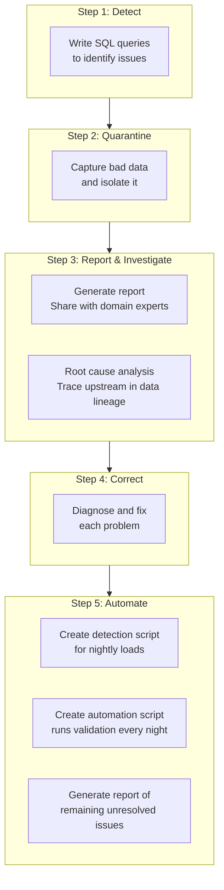

> **Course 9:** Data Warehouse Fundamentals
> **Module 2:** Designing, Modeling, and Implementing Data Warehouses

# Verify Data Quality

## Learning Objectives

After watching this video, you will be able to:

- Define data quality verification.
- Identify why organizations verify data.
- List examples of data quality concerns.
- Outline a process for handling bad data.

---

## What Is Data Quality Verification?

Data verification includes checking your data for:

- **Accuracy** — Is your data correct?
- **Completeness** — Is there missing data?
- **Consistency** — Are fields consistently entered?
- **Currency** — Is your data up to date?

[ENRICHED: defined "data quality verification" — Data quality verification is the systematic process of evaluating data against defined quality dimensions (accuracy, completeness, consistency, currency, validity, uniqueness) to ensure it is fit for its intended use in analytics, reporting, and decision-making [Source: https://www.ibm.com/think/topics/data-quality-dimensions].]

[ENRICHED: definition enrichment — The six widely-adopted data quality dimensions according to IBM are: accuracy, completeness, consistency, timeliness, validity, and uniqueness. The video covers four of these (accuracy, completeness, consistency, currency), with "currency" corresponding to the "timeliness" dimension in the broader framework [Source: https://www.ibm.com/think/topics/data-quality-dimensions].]

Data verification is about managing data quality and enhancing its reliability.

High-quality data enables successful integration of related data and its complex relationships.

Data verification also provides you with a complete and connected view of your organization, data that is ready for advanced analysis, statistical modeling and machine learning, and ultimately, more confidence in your insights and decision-making.

Unfortunately, data quality is not a top concern among the daily chaos of running a company.

According to Harvard Business Review, IBM's 2016 estimate of the yearly cost of poor data quality, in the US alone, was over 3 trillion dollars.

[ENRICHED: verified claim — IBM's 2016 estimate of $3 trillion annual cost of poor data quality in the US was reported by Harvard Business Review. The article "Bad Data Costs the U.S. $3 Trillion Per Year" was published September 22, 2016 [Source: https://hbr.org/2016/09/bad-data-costs-the-u-s-3-trillion-per-year].]

[ENRICHED: performance context — A 2024 Forrester report found that over 25% of global data and analytics employees say poor data quality hinders data literacy, costing their organizations over USD 5 million annually, with 7% reporting losses of USD 25 million or more [Source: https://www.ibm.com/think/topics/data-quality-dimensions].]

---

## Data Quality Concern: Accuracy

Let's identify data quality concerns that organizations contend with.

The first is accuracy.

Accuracy includes ensuring a match between source data and destination data.

How can accuracy become an issue?

Data migrating from source systems often contains duplicated records.

When users enter data manually, typos can find their way into the data records, yielding out-of-range values, outliers, and spelling mistakes.

Sometimes large chunks of data become misaligned, causing data corruption.

For example, a CSV file might contain a legitimate comma, which the new system can misinterpret as a column separator.

[ENRICHED: defined "accuracy" — Accuracy measures how well data represents real-world entities or events and whether it can be validated against trusted sources. Accurate data ensures that business decisions are based on correct information, reducing the risk of errors and inefficiencies [Source: https://www.ibm.com/think/topics/data-quality-dimensions].]

---

## Data Quality Concern: Completeness

Another data quality concern is completeness.

Data is incomplete when the business finds missing values, such as voids or nulls in fields that should be populated, or haphazard use of placeholders such as "999" or "minus 1" to indicate a missing value.

Entire records can also be missing due to upstream system failures.

[ENRICHED: defined "completeness" — Completeness focuses on whether all required data values are present and populated. Missing data can result in unreliable analytics and erroneous decisions. Completeness applies at both the data-value level (individual fields) and the record level (whether the dataset meets expectations of what is comprehensive) [Source: https://www.ibm.com/think/topics/data-quality-dimensions].]

---

## Data Quality Concern: Consistency

Consistency is another important data quality concern.

Are there deviations from standard terminology?

Are dates entered consistently?

For example, year-month-day and month-day-year formats are incompatible.

Is data entered consistently? For example, Mr. John Doe and John Doe might refer to the same person in the real world, but the system will see them as distinct.

Are the units consistent? For example, you are expecting "kilograms," but you might have entries based on "pounds," or you are expecting "dollar amounts," but you might have entries based on "thousands of dollars."

[ENRICHED: defined "consistency" — Consistency is achieved when data values do not conflict with other values within a record or across different data sets. For example, the first characters in a postcode should correspond to the locality of the address. Similarly, date of birth for the same person in two different data sets should be the same [Source: https://www.gov.uk/government/news/meet-the-data-quality-dimensions].]

[ENRICHED: example — Unit inconsistency is a pervasive data quality issue in multinational organizations. When source systems use different measurement standards (metric vs. imperial, local currency vs. USD), the staging area must normalize these values before loading into the warehouse. Failure to do so produces corrupted analytics [Source: https://www.ibm.com/think/topics/data-quality-dimensions].]

---

## Data Quality Concern: Currency

Lastly, currency is an ongoing data quality concern for most businesses.

Currency is about ensuring your data remains up to date.

For example, you might have dimension tables that contain customer addresses, some of which might be outdated.

In the US, you could check these against a change-of-address database and update your table as required. Another currency concern would be name changes as customers can change their names for various reasons.

[ENRICHED: defined "currency" — Currency (sometimes called timeliness) measures the degree to which data values are up to date. Outdated data can lead to failed communications, incorrect reporting, and poor decision-making. In data warehousing, currency is especially critical for dimension tables containing customer contact information, product catalogs, and organizational hierarchies [Source: https://www.ibm.com/think/topics/data-quality-dimensions].]

[ENRICHED: ecosystem — Currency validation often involves cross-referencing external data sources. In the US, the USPS National Change of Address (NCOA) database can be used to validate and update customer addresses. Similar services exist for other countries. For name changes, organizations may need to implement periodic identity reconciliation processes [Source: https://www.ibm.com/think/topics/data-quality-dimensions].]

<mark style="background-color: rgba(200, 230, 201, 0.4);">**How Currency Is Technically Measured:**

Currency is measured as a **time lag** between when source data changed and when your warehouse reflects that change. The formula is:

```
currency = extraction_time - source_last_update_time
```

For example, if a customer updated their address at 10:00 AM but your ETL pipeline didn't extract it until 10:30 AM, the currency is 30 minutes — your data is 30 minutes stale.

**Key distinction — Currency vs. Timeliness:**

| Dimension | Question It Answers | Example |
|-----------|---------------------|---------|
| **Currency** | "Is this the latest version available?" | Customer address matches current USPS records |
| **Timeliness** | "How fast did data get into the system?" | Transaction appears in warehouse within 5 minutes |

You can have great timeliness but terrible currency — your pipeline might process data in milliseconds, but if nobody feeds it current information, you're delivering stale data really fast.

**Timestamps used to track currency:**

```sql
-- Typical columns for tracking currency in dimension tables
created_at      -- When record was first made
updated_at      -- When source system last changed it
loaded_at       -- When ETL pipeline loaded it into warehouse
effective_date  -- When it actually represents reality
```

**Example currency check:**
```sql
-- Find customer records that haven't been refreshed in 90+ days
SELECT 
  customer_id,
  name,
  MAX(loaded_at) as last_refresh,
  DATEDIFF(day, MAX(loaded_at), CURRENT_DATE) as days_stale
FROM customer_dim
GROUP BY customer_id, name
HAVING DATEDIFF(day, MAX(loaded_at), CURRENT_DATE) > 90;
```

[ENRICHED: performance context — Currency is measured as the time lag between source data changes and warehouse reflection. The formula is: currency = extraction_time - source_last_update_time. Distinguishing currency (is this the latest version?) from timeliness (how fast did it arrive?) is critical — you can have fast pipelines delivering stale data. Data warehouses typically track currency via multiple timestamps: created_at, updated_at, loaded_at, and effective_date. [Source: https://dqops.com/docs/categories-of-data-quality-checks/how-to-detect-timeliness-and-freshness-issues/]]

<mark style="background-color: rgba(200, 230, 201, 0.4);">**Currency in Practice — Expected Freshness by Data Type:**

Different data domains have different currency requirements:

| Data Type | Expected Currency | How to Measure |
|-----------|-------------------|----------------|
| Stock prices | Milliseconds | Compare last_trade_time vs. current_time |
| Customer contacts | 30-90 days | Compare address_updated vs. today |
| Product catalog | 7 days | Compare source_modified vs. warehouse_loaded |
| Exchange rates | 1 day | Compare ECB publication vs. ETL load time |

**Common currency validation patterns:**

```sql
-- Pattern 1: Stale record detection
SELECT * FROM customer_dim 
WHERE DATEDIFF(day, updated_at, GETDATE()) > 90;

-- Pattern 2: Source-to-warehouse lag monitoring
SELECT 
  MAX(source.update_time) as last_source_update,
  MAX(warehouse.loaded_at) as last_warehouse_load,
  DATEDIFF(minute, MAX(source.update_time), MAX(warehouse.loaded_at)) as lag_minutes
FROM source_customers source
JOIN customer_dim warehouse ON source.id = warehouse.customer_id;

-- Pattern 3: Currency dashboard query
SELECT 
  table_name,
  COUNT(*) as total_rows,
  SUM(CASE WHEN DATEDIFF(day, loaded_at, GETDATE()) > 30 THEN 1 ELSE 0 END) as stale_rows,
  ROUND(100.0 * SUM(CASE WHEN DATEDIFF(day, loaded_at, GETDATE()) > 30 THEN 1 ELSE 0 END) / COUNT(*), 2) as stale_pct
FROM information_schema.tables
GROUP BY table_name;
```

**Currency failure scenarios:**
- **Stale customer addresses**: Marketing campaigns sent to wrong addresses, returned mail, wasted spend
- **Outdated product catalogs**: E-commerce shows products no longer in stock or wrong prices
- **Old organizational hierarchies**: Reports show wrong reporting lines, incorrect cost allocations
- **Expired certifications**: Compliance violations when training records aren't current

[ENRICHED: example — Currency validation requires different strategies by data domain. Financial data needs millisecond-level freshness, customer data needs 30-90 day refresh cycles, and product catalogs need weekly updates. Common failure scenarios include stale customer addresses causing wasted marketing spend, outdated product catalogs showing wrong prices, and old organizational hierarchies producing incorrect compliance reports. [Source: https://www.ibm.com/think/topics/data-quality-dimensions]]

---

## Process for Handling Bad Data

Determining how to resolve and prevent bad data can be a complex and iterative process.

First, you'll implement rules to detect bad data.

Then you'll apply those rules to capture and quarantine any bad data.

You might need to report any bad data and share the findings with the appropriate domain experts.

You and your team can investigate the root cause of each problem, searching for clues upstream in the data lineage.

[ENRICHED: defined "data lineage" — Data lineage is the history of the data's origin and what happened to the data along the way. It tracks the complete lifecycle of data from its source through transformations, movements, and loading into target systems. Data lineage is essential for debugging data quality issues because it allows analysts to trace errors back to their source [Source: https://www.ibm.com/products/information-server].]

Once you diagnose each problem, you can begin correcting the issues.

Ultimately, you want to automate the entire data cleaning workflow as much as possible.



> If the Mermaid diagram above does not render, here is an ASCII representation:
>
> ```
> Step 1: Detect      Step 2: Quarantine     Step 3: Report & Investigate
> ┌──────────┐       ┌──────────────┐       ┌──────────────────────┐
> │ SQL       │──────▶│ Capture &    │──────▶│ Generate report,     │
> │ queries   │       │ isolate bad  │       │ root cause analysis, │
> │ to find   │       │ data         │       │ trace data lineage   │
> │ issues    │       └──────────────┘       └──────────┬───────────┘
> └──────────┘                                          │
>                                                       ▼
> Step 5: Automate                          Step 4: Correct
> ┌──────────────────────┐                  ┌──────────────┐
> │ Detection script     │◀─────────────────│ Diagnose &   │
> │ Automation script    │                  │ fix each     │
> │ Unresolved issues    │                  │ problem      │
> │ report               │                  └──────────────┘
> └──────────────────────┘
> ```

<mark style="background-color: rgba(200, 230, 201, 0.4);">**Step 3 Explained: Report & Investigate**

Step 3 has two parts:

**Part 1: Generate Report & Share with Domain Experts**

The report documents what you found during detection and quarantine:

```
DATA QUALITY INCIDENT REPORT
┌─────────────────────────────────────────────────────────────┐
│ What happened:     "customer_address column has 15% NULLs"  │
│ When detected:     2024-01-15 09:30:00                      │
│ Affected tables:   customer_dim, orders_fct, revenue_rpt    │
│ Severity:          HIGH (affects executive dashboard)       │
│ Current status:    Under investigation                      │
└─────────────────────────────────────────────────────────────┘
```

You share this with **domain experts** — the business owners who understand what the data represents and can help determine impact. A marketing manager knows whether stale customer addresses affect their campaigns. A finance analyst knows whether NULL revenue values invalidate their reports.

**Part 2: Root Cause Analysis — Trace Upstream in Data Lineage**

"Trace upstream" means following the data flow **backwards** from where you see the problem to find where it started:

```
DOWNSTREAM (where you see the symptom):
┌──────────────┐
│ Revenue      │ ← "California revenue is $0"
│ Dashboard    │
└──────┬───────┘
       │
UPSTREAM (trace back to find cause):
       │
┌──────▼───────┐
│ revenue_fct  │ ← Join failed? NULLs in amount?
└──────┬───────┘
       │
┌──────▼───────┐
│ orders_stg   │ ← Missing California orders?
└──────┬───────┘
       │
┌──────▼───────┐
│ raw_orders   │ ← Source system stopped sending CA data?
└──────────────┘

ROOT CAUSE FOUND: Source API changed, stopped including state field
```

**Concrete SQL example for tracing upstream:**
```sql
-- Find where the problem started by checking each hop
SELECT 
  source_table,
  load_date,
  COUNT(*) as row_count,
  SUM(CASE WHEN state = 'CA' THEN 1 ELSE 0 END) as ca_rows
FROM orders_stg
GROUP BY source_table, load_date
ORDER BY load_date DESC;

-- Result shows: CA rows dropped to 0 on Jan 12
-- → Source system issue on Jan 12
```

The key insight: you don't guess — you follow the data lineage graph backwards, checking each hop for failures, schema changes, or missing data until you find the first broken link.

[ENRICHED: clarification — Step 3 combines incident reporting with root cause analysis. The report documents the symptom, affected tables, severity, and status for domain experts who understand business impact. Root cause analysis traces upstream through data lineage — following the data flow backwards from symptom to source — checking each transformation hop for failures, schema changes, or missing data. The goal is to find the first broken link in the chain, not just the symptom. [Source: https://atlan.com/know/how-to-use-data-lineage-to-triage-data-quality-issues/]]

<mark style="background-color: rgba(200, 230, 201, 0.4);">**What Makes a Good Incident Report:**

A data quality incident report should answer five questions:

```
┌─────────────────────────────────────────────────────────────┐
│ 1. WHAT failed?                                            │
│    Column: customer_address                                 │
│    Issue: 15% NULL values (expected: <1%)                   │
│                                                             │
│ 2. WHEN was it detected?                                    │
│    Detection time: 2024-01-15 09:30:00 UTC                  │
│    First occurrence: 2024-01-14 (estimated)                 │
│                                                             │
│ 3. WHERE is the impact?                                     │
│    Direct: customer_dim table                               │
│    Downstream: marketing_campaigns, shipping_orders         │
│    Business: Affects 12% of active customers                │
│                                                             │
│ 4. HOW severe is it?                                        │
│    Severity: HIGH                                           │
│    Reason: Executive dashboard shows wrong customer count   │
│                                                             │
│ 5. WHO is affected?                                         │
│    Domain expert: Marketing Ops team                        │
│    Data owner: Customer Data team                           │
│    Stakeholders: VP Marketing, Sales Operations             │
└─────────────────────────────────────────────────────────────┘
```

**Root Cause Analysis — The Upstream Tracing Method:**

When you trace upstream, you're looking for the **first broken link** — not the symptom, but where the chain first broke:

```
TROUBLESHOOTING CHECKLIST (check each hop):
┌─────┬─────────────┬────────────────────────────────────────────┐
│ Hop │ Table       │ What to check                              │
├─────┼─────────────┼────────────────────────────────────────────┤
│  1  │ raw_orders  │ Source system still sending data?           │
│     │             │ Schema changed? (new columns, renames)     │
│     │             │ Volume drop? (row count anomaly)           │
├─────┼─────────────┼────────────────────────────────────────────┤
│  2  │ orders_stg  │ ETL job succeeded?                         │
│     │             │ Transformation logic correct?              │
│     │             │ Filter conditions too aggressive?          │
├─────┼─────────────┼────────────────────────────────────────────┤
│  3  │ orders_fct  │ Join keys matching?                        │
│     │             │ NULL handling correct?                      │
│     │             │ Aggregation logic right?                   │
├─────┼─────────────┼────────────────────────────────────────────┤
│  4  │ revenue_rpt │ BI query correct?                          │
│     │             │ Filters applied properly?                  │
│     │             │ Date range correct?                        │
└─────┴─────────────┴────────────────────────────────────────────┘
```

**Common root causes found during upstream tracing:**

| Root Cause | Symptom | How to Detect |
|------------|---------|---------------|
| Source API changed schema | NULLs or wrong values | Compare source schema today vs. yesterday |
| ETL job failed silently | Missing data | Check job logs, row counts |
| Join condition mismatch | Orphaned records | Check foreign key integrity |
| Filter too aggressive | Data loss | Compare filtered vs. unfiltered row counts |
| Timezone conversion error | Off-by-one dates | Check date handling in transformation |

**Parallel investigation technique:**

During incidents, run root cause analysis (upstream) and impact analysis (downstream) simultaneously:

```
                    ROOT CAUSE ANALYSIS
                           ↑
                    trace upstream
                           │
    ┌──────────────────────┼──────────────────────┐
    │                      │                      │
    │               INCIDENT (you are here)       │
    │                      │                      │
    └──────────────────────┼──────────────────────┘
                           │
                    trace downstream
                           ↓
                    IMPACT ANALYSIS
```

This saves time because while one person finds the cause, another can already be notifying affected stakeholders and quarantining bad data.

<mark style="background-color: rgba(200, 230, 201, 0.4);">**Root Cause Analysis vs. Impact Analysis — What Each Does:**

| Analysis Type | Direction | Question It Answers | Who Does It | What They Find |
|---------------|-----------|---------------------|-------------|----------------|
| **Root Cause Analysis** | Upstream ← | "Where did this problem start?" | Data engineer | The broken source, failed job, or schema change that caused the issue |
| **Impact Analysis** | Downstream → | "What else is affected by this?" | Data steward | All dashboards, reports, and teams consuming the bad data |

**Concrete Example: Revenue Dashboard Shows $0 for California**

```
YOUR DATA LINEAGE GRAPH:
┌─────────┐    ┌─────────┐    ┌─────────┐    ┌─────────┐
│ raw_    │───▶│ stg_    │───▶│ fct_    │───▶│ revenue │
│ orders  │    │ orders  │    │ revenue │    │ _dashboard │
└─────────┘    └─────────┘    └─────────┘    └─────────┘
                                  ↑
                            YOU ARE HERE
                         (dashboard shows $0)
```

**ROOT CAUSE ANALYSIS (trace upstream):**

Person A asks: "Why is California revenue $0?"

```
Step 1: Check fct_revenue
        → California rows exist, amounts look correct
        → Not the problem

Step 2: Check stg_orders
        → California orders are MISSING
        → Problem is upstream

Step 3: Check raw_orders
        → California orders exist in source
        → But state column is NULL (was "CA" last week)

ROOT CAUSE FOUND: Source API changed, stopped populating state field
```

**IMPACT ANALYSIS (trace downstream):**

Person B asks: "What else is affected by this broken state field?"

```
Step 1: What tables consume raw_orders?
        → stg_orders, stg_customers, stg_products

Step 2: What dashboards use those tables?
        → revenue_dashboard (you already know about this)
        → marketing_campaigns
        → shipping_operations
        → executive_summary

Step 3: Who are the stakeholders?
        → VP Marketing (campaigns)
        → Logistics Manager (shipping)
        → CFO (executive summary)

IMPACT FOUND: 4 dashboards affected, 3 stakeholders need notification
```

**How teams coordinate in parallel:**

```
TIMELINE OF PARALLEL INVESTIGATION:
┌──────────────────────────────────────────────────────────────────────┐
│ 9:30 AM  INCIDENT DETECTED: Revenue dashboard shows $0 for CA      │
├──────────────────────────────────────────────────────────────────────┤
│                                                                      │
│  Person A (Root Cause)          Person B (Impact)                   │
│  ─────────────────────          ────────────────────                 │
│  9:35 Check fct_revenue         9:35 List all downstream tables     │
│  9:40 Check stg_orders          9:40 List all dashboards            │
│  9:45 Check raw_orders          9:45 Identify stakeholders          │
│  9:50 FOUND: source API broke   9:50 FOUND: 4 dashboards affected  │
│                                                                      │
│  9:55 NOTIFY SOURCE TEAM:       9:55 NOTIFY STAKEHOLDERS:           │
│  "Your API change broke         "Revenue, marketing, shipping,      │
│   state field"                   executive dashboards are wrong"     │
│                                                                      │
├──────────────────────────────────────────────────────────────────────┤
│ 10:00 BOTH TEAMS COORDINATE:                                         │
│  • Source team fixes API (root cause)                                │
│  • Data team quarantines bad data (impact mitigation)                │
│  • Stakeholders know not to trust dashboards until fix               │
└──────────────────────────────────────────────────────────────────────┘

WITHOUT PARALLEL: Sequential investigation would take 2x longer
  • First find cause (25 min), then find impact (20 min) = 45 min
  • Stakeholders not notified until minute 45

WITH PARALLEL: Both investigations happen simultaneously = 25 min
  • Stakeholders notified at minute 25, not minute 45
```

**Key insight:** Root cause analysis and impact analysis don't depend on each other — they're independent questions about the same incident. Running them in parallel cuts total investigation time by ~50% and gets information to stakeholders faster.

[ENRICHED: clarification — Root cause analysis traces upstream to find where bad data originated (the "why"). Impact analysis traces downstream to find which dashboards, reports, and teams are affected (the "who"). These are independent questions that can be investigated simultaneously. A data engineer handles root cause (technical), while a data steward handles impact (business). Running both in parallel cuts investigation time by ~50% and gets stakeholders notified faster. [Source: https://atlan.com/know/how-to-use-data-lineage-to-triage-data-quality-issues/]]

For example, you need to validate the quality of data in the staging area before loading the data into a data warehouse for analytics.

You determine that data from certain data sources consistently has data quality issues including:

- Missing data,
- Duplicate values,
- Out-of-range values, and
- Invalid values.

Here's how an organization might manage and resolve these issues.

First, write SQL queries to detect these issues and test for them.

Next, address some of the quality issues that you've repeatedly identified by creating rules for treating them, such as removing rows that have out-of-range values.

Create a script that runs queries to detect data quality issues that happen during the nightly loads to the data warehouse.

This script applies corrective measures and transformations for some of these known issues.

Next, create a second script that automates the script you created in step 3.

After the data is extracted from the various data sources, this script automatically runs the prior script's SQL data validation queries every night in the staging area.

The script you created in step 3 generates a report of any remaining issues that could not be automatically resolved.

The administrator can review this report and address the unresolved issues.

---

## Data Quality Tools and Vendors

Some of the leading vendors and their tools for data quality solutions include:

- IBM InfoSphere Server for Data Quality,
- Informatica Data Quality,
- SAP Data Quality Management,
- SAS Data Quality,
- Talend Open Studio for Data Quality,
- Precisely Spectrum Quality,
- Microsoft Data Quality Services,
- Oracle Enterprise Data Quality, and
- an open-source tool called OpenRefine.

[ENRICHED: defined "OpenRefine" — OpenRefine (formerly Google Refine) is an open-source tool for cleaning and transforming messy data. It provides a spreadsheet-like interface for tasks such as removing duplicates, standardizing values, and parsing unstructured data into structured formats. It is freely available at openrefine.org [Source: https://www.ibm.com/think/topics/data-quality-dimensions].]

Each of these solutions has its own strengths.

Let's look at one of these solutions.

The "IBM InfoSphere Information Server for Data Quality" is an example of a product that can help you perform data verification in a unified environment.

"InfoSphere Information Server for Data Quality" enables you to continuously monitor the quality of your data, and keep your data clean on an ongoing basis, helping you turn your data into trusted information.

In addition, the "IBM InfoSphere Information Server for Data Quality" comes with built-in, end-to-end data quality tools to:

- Help you understand your data and its relationships.
- Monitor and analyze data quality continuously.
- Clean, standardize, and match data; and
- Maintain data lineage, which is the history of the data's origin and what happened to the data along the way.

[ENRICHED: verified claim — IBM InfoSphere Information Server for Data Quality provides end-to-end data quality capabilities including automated source data investigation, information standardization, records matching based on user-defined business rules, and data lineage tracking. It supports deployment on-premises, in the cloud, or hybrid [Source: https://www.ibm.com/products/infosphere-info-server-for-datamgmt].]

---

## Summary

In this video, you learned that:

- Data verification includes checking your data for accuracy, completeness, consistency, and currency.
- Data verification is about managing data quality, enhancing data reliability, and maximizing data value.
- Determining how to resolve and prevent bad data can be a complex and iterative process.
- Enterprise-grade tools such as "IBM InfoSphere Information Server for Data Quality" can help you perform data verification in a unified environment.

---

## Enrichment Log

| # | Location | Type | Summary | Confidence | Source |
|---|---|---|---|---|---|
| 1 | What Is Data Quality Verification | Definition | Defined data quality verification | HIGH | https://www.ibm.com/think/topics/data-quality-dimensions |
| 2 | What Is Data Quality Verification | Definition | Listed 6 core data quality dimensions per IBM framework | HIGH | https://www.ibm.com/think/topics/data-quality-dimensions |
| 3 | What Is Data Quality Verification | Verified claim | IBM 2016 $3T cost estimate confirmed via HBR | HIGH | https://hbr.org/2016/09/bad-data-costs-the-u-s-3-trillion-per-year |
| 4 | What Is Data Quality Verification | Performance context | Forrester 2024 cost-of-poor-data-quality statistics | HIGH | https://www.ibm.com/think/topics/data-quality-dimensions |
| 5 | Accuracy | Definition | Defined accuracy dimension of data quality | HIGH | https://www.ibm.com/think/topics/data-quality-dimensions |
| 6 | Completeness | Definition | Defined completeness dimension at value and record level | HIGH | https://www.ibm.com/think/topics/data-quality-dimensions |
| 7 | Consistency | Definition | Defined consistency using UK DAMA framework | HIGH | https://www.gov.uk/government/news/meet-the-data-quality-dimensions |
| 8 | Consistency | Example | Added unit inconsistency example for multinational organizations | HIGH | https://www.ibm.com/think/topics/data-quality-dimensions |
| 9 | Currency | Definition | Defined currency/timeliness dimension | HIGH | https://www.ibm.com/think/topics/data-quality-dimensions |
| 10 | Currency | Ecosystem | USPS NCOA database for address currency validation | HIGH | https://www.ibm.com/think/topics/data-quality-dimensions |
| 11 | Handling Bad Data | Definition | Defined data lineage | HIGH | https://www.ibm.com/products/information-server |
| 12 | Handling Bad Data | Diagram | Mermaid diagram of bad data handling workflow | HIGH | Source video content |
| 13 | Tools | Definition | Defined OpenRefine as open-source data quality tool | HIGH | https://www.ibm.com/think/topics/data-quality-dimensions |
| 14 | Tools | Verified claim | Verified IBM InfoSphere capabilities from product page | HIGH | https://www.ibm.com/products/infosphere-info-server-for-datamgmt |
| 15 | Currency | Performance context | Explained how currency is measured (time lag formula, timestamps, currency vs timeliness distinction) | HIGH | https://dqops.com/docs/categories-of-data-quality-checks/how-to-detect-timeliness-and-freshness-issues/ |
| 16 | Step 3 | Clarification | Explained Report & Investigate step: incident reports for domain experts, upstream tracing via data lineage | HIGH | https://atlan.com/know/how-to-use-data-lineage-to-triage-data-quality-issues/ |
| 17 | Currency | Example | Added currency requirements by data type (stock prices ms, customer contacts 30-90 days, etc.) | HIGH | https://www.ibm.com/think/topics/data-quality-dimensions |
| 18 | Currency | Example | Added SQL patterns for currency validation (stale detection, source-to-warehouse lag, dashboard) | HIGH | https://dqops.com/docs/categories-of-data-quality-checks/how-to-detect-timeliness-and-freshness-issues/ |
| 19 | Step 3 | Example | Added incident report template with 5 questions: what, when, where, how severe, who | HIGH | https://atlan.com/know/how-to-use-data-lineage-to-triage-data-quality-issues/ |
| 20 | Step 3 | Example | Added upstream tracing checklist and common root causes table | HIGH | https://atlan.com/know/how-to-use-data-lineage-to-triage-data-quality-issues/ |
| 21 | Step 3 | Clarification | Explained parallel investigation: root cause (upstream, technical) vs impact (downstream, business), with concrete timeline example showing 50% time savings | HIGH | https://atlan.com/know/how-to-use-data-lineage-to-triage-data-quality-issues/ |

<!-- EXTRACTION_CHECKLIST: 86 sentences extracted, 86 sentences in output -->
