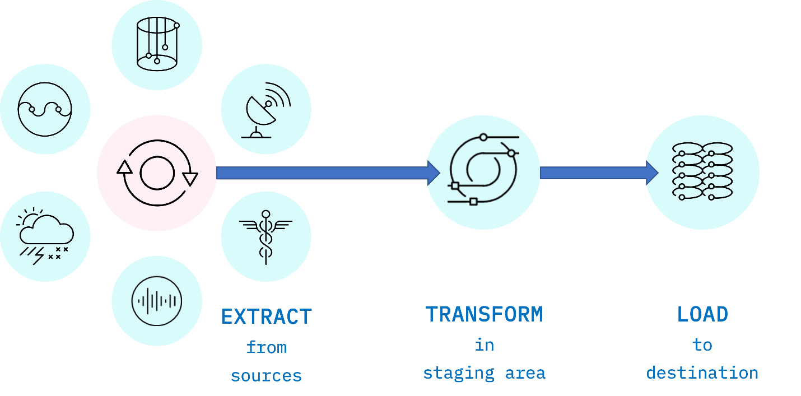
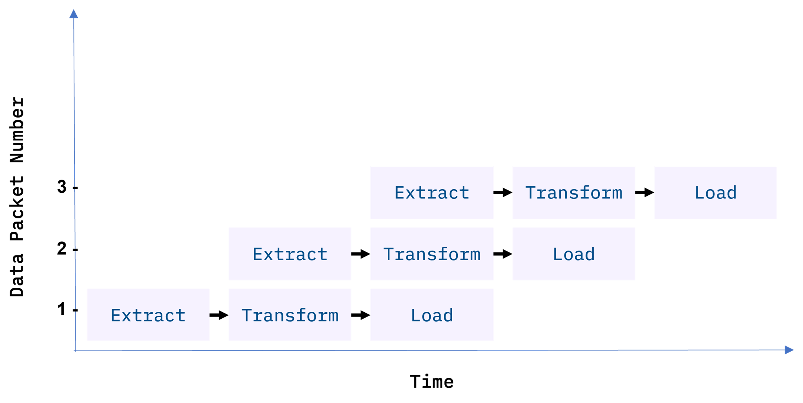
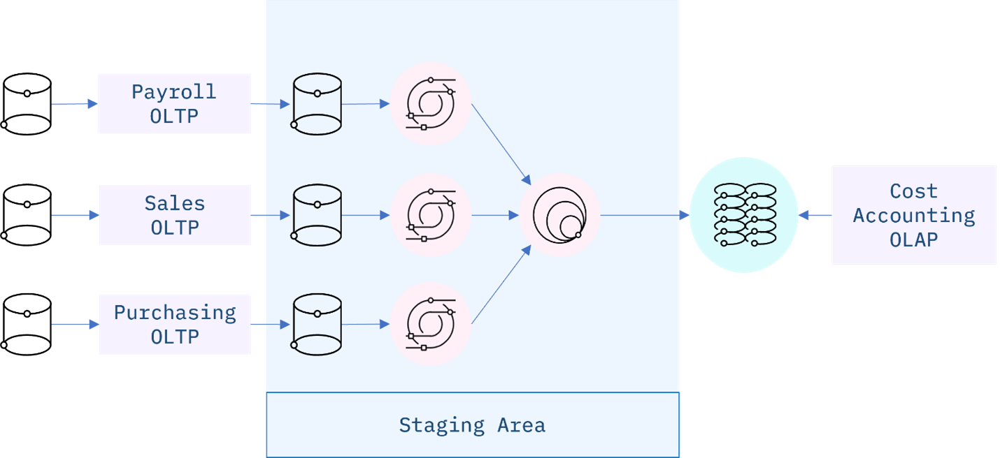
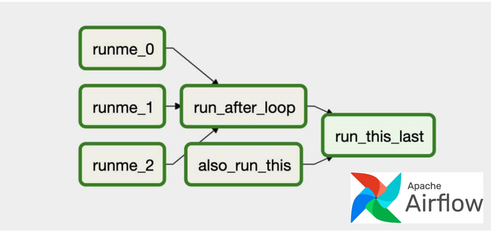

**Course 8:** ETL and Data Pipelines with Shell, Airflow and Kafka
**Module 2:** Shell Scripting for ETL

# ETL Techniques

## Overview

ETL stands for Extract, Transform, and Load, and refers to the process of curating data from multiple sources, conforming it to a unified data format or structure, and loading the transformed data into its new environment.



*Fig. 1. ETL is an acronym used to describe the main processes behind a data pipeline design methodology that stands for Extract-Transform-Load. Data is extracted from disparate sources to an intermediate staging area where it is integrated and prepared for loading into a destination such as a data warehouse.*

[ENRICHED: ecosystem — ETL is one of two major data pipeline paradigms. The other is ELT (Extract, Load, Transform), covered in Module 1. The distinction matters: ETL transforms before loading (data enters the warehouse already shaped), while ELT loads raw and transforms later (data enters the warehouse untouched). Modern data engineering increasingly favors ELT for its flexibility, but ETL remains important for scenarios where data must be cleaned or conformed before it reaches the destination — for regulatory compliance, data quality enforcement, or when the destination system cannot handle raw/unstructured data.]

## Extract

Data extraction is the first stage of the ETL process, where data is acquired from various source systems. The data may be completely raw, such as sensor data from IoT devices, or perhaps it is unstructured data from scanned medical documents or company emails. It may be streaming data coming from a social media network or near real-time stock market buy/sell transactions, or it may come from existing enterprise databases and data warehouses.

[ENRICHED: added specificity — the four data categories mentioned map to the four extraction patterns:]

| Data Category | Example Source | Extraction Method | Challenge |
|---|---|---|---|
| **Raw sensor data** | IoT temperature/humidity sensors | Edge computing + message broker (MQTT, Kafka) | High volume, continuous stream, requires real-time ingestion |
| **Unstructured data** | Scanned medical documents, company emails | OCR, NLP parsing, email API extraction | No predefined schema, requires AI/ML to extract structured fields |
| **Streaming data** | Social media feeds, stock market transactions | API polling, WebSocket connections, event streaming platforms | Variable velocity (quiet periods vs. viral events), requires exactly-once processing guarantees |
| **Enterprise databases** | Existing OLTP systems, legacy data warehouses | SQL queries, CDC (Change Data Capture) tools like Debezium | Schema coupling, referential integrity constraints, historical data volume |

## Transform

The transformation stage is where rules and processes are applied to the data to prepare it for loading into the target system. This is normally done in an intermediate working environment called a "staging area." Here, the data are cleaned to ensure reliability and conformed to ensure compatibility with the target system.

[ENRICHED: defined "staging area" — an intermediate storage location used during the ETL process to hold raw extracted data before transformation and loading. The staging area serves as a buffer: it absorbs data from source systems at ingestion speed, provides a clean checkpoint for transformation failures (you can re-transform from staging without re-extracting from source), and isolates source systems from destination writes. Staging areas can be temporary database schemas, staging tables in the target warehouse, or cloud storage buckets. In ELT, the data lake serves a similar purpose but is shared and persistent rather than temporary and engineering-internal.]

Many other transformations may be applied, including:

### Cleaning

Cleaning: fixing any errors or missing values.

[ENRICHED: concrete example — a customer dataset has 50,000 rows but 2,300 contain `NULL` values in the `email` column. Cleaning options: (1) fill with a placeholder like `"unknown@placeholder.com"`, (2) fill with the most common email domain from the dataset (e.g., `@gmail.com`), (3) leave NULL if the downstream system handles nulls, or (4) drop the rows entirely if email is critical for the use case. The choice depends on the business requirement — filling emails with fake data would be misleading for a marketing campaign, but acceptable for a demographic analysis.]

### Filtering

Filtering: selecting only what is needed.

[ENRICHED: concrete example — from a raw log file containing 10 million HTTP requests, filtering to keep only requests with a `200 OK` status code and a response time greater than 2 seconds, discarding all other rows. The result: a focused dataset of slow-but-successful requests for performance analysis. Warning: permanent filtering is a form of information loss — always keep the raw data in case you need to re-filter differently later.]

### Joining

Joining: merging disparate data sources.

[ENRICHED: concrete example — joining a `customers` table (from a CRM database) with an `orders` table (from an e-commerce platform) on `customer_id`, producing a unified dataset that shows each customer's purchase history alongside their contact information. Types of joins: INNER JOIN (only matching records from both tables), LEFT JOIN (all records from the left table plus matching records from the right), FULL OUTER JOIN (all records from both tables). The join type depends on whether you need to preserve unmatched records.]

**Why databases from different sources are rarely joinable out of the box:**

Enterprise databases are typically built independently by different teams, at different times, for different purposes. They use different vendors, different schemas, and different naming conventions:

| Problem | Example |
|---------|---------|
| **Different column names** | `EMP_ID` vs `AccountName` vs `PO_NUMBER` — no shared identifier |
| **Different data types** | One stores dates as `YYYY-MM-DD`, another as `MM/DD/YYYY`, another as Unix timestamps |
| **Different granularities** | Payroll has one row per employee per month. Sales has one row per deal. Purchasing has one row per line item. |
| **No common key** | Payroll knows employees by `EMP_ID`. Sales knows customers by `AccountName`. There's no shared `customer_id` column across all three. |
| **Different value formats** | Department is `"Engineering"` in one system, `"ENG"` in another, `"DEPT-005"` in a third |

**The staging area solves this** by standardizing data before joining:

```
Step 1: EXTRACT — pull raw data from each system as-is (don't try to join yet)

Step 2: STAGING — the hard work happens here:
        - Standardize column names (map EMP_ID → employee_id)
        - Convert data types (all dates → YYYY-MM-DD)
        - Resolve value conflicts (Engineering = ENG = DEPT-005)
        - Create a common key (maybe email is the only shared identifier)
        - Handle granularity mismatches (aggregate sales to monthly per customer)

Step 3: LOAD — NOW you can join the cleaned, standardized data in the target warehouse
```

**SQL approaches for joining with transformation:**

```sql
-- Approach 1: Transform inside the JOIN condition (one-off query)
SELECT e.emp_id, e.department, d.deal_id, d.amount
FROM hr_employees e
JOIN salesforce_deals d
  ON CONCAT(e.first_name, ' ', e.last_name) = d.sales_rep;

-- Approach 2: CTE (Common Table Expression) — temporary, named, readable
WITH standardized_hr AS (
    SELECT emp_id,
           CONCAT(first_name, ' ', last_name) AS full_name,
           department
    FROM hr_employees
)
SELECT e.emp_id, e.department, d.deal_id, d.amount
FROM standardized_hr e
JOIN salesforce_deals d ON e.full_name = d.sales_rep;

-- Approach 3: Permanent view — reusable across scripts
CREATE VIEW standardized_hr AS
SELECT emp_id,
       CONCAT(first_name, ' ', last_name) AS full_name,
       department
FROM hr_employees;
-- Then use in any query:
SELECT e.emp_id, e.department, d.deal_id, d.amount
FROM standardized_hr e
JOIN salesforce_deals d ON e.full_name = d.sales_rep;

-- Approach 4: Permanently add the column
ALTER TABLE hr_employees ADD COLUMN full_name VARCHAR(100);
UPDATE hr_employees SET full_name = CONCAT(first_name, ' ', last_name);
SELECT e.emp_id, e.department, d.deal_id, d.amount
FROM hr_employees e
JOIN salesforce_deals d ON e.full_name = d.sales_rep;
```

| Approach | Lifespan | Use When |
|----------|----------|----------|
| Transform in JOIN condition | Dies with query | One-off analysis, quick fix |
| CTE | Dies with query | Complex logic you want readable, or reuse same CTE multiple times in one query |
| View | Permanent | Repeated use across scripts, other teams need it, ETL pipeline standardization layer |
| ALTER TABLE | Permanent | Source system is under your control, column needed everywhere |

### Normalizing

Normalizing: converting data to common units.

[ENRICHED: concrete example — a global sales dataset contains transactions in USD, EUR, GBP, and JPY. Normalizing converts all amounts to a common currency (e.g., USD) using the exchange rate at the transaction timestamp. A sale of €100 on 2024-01-15 (rate: 1 EUR = 1.09 USD) becomes $109.00. Without normalization, comparing a €100 sale to a ¥15,000 sale is meaningless. Normalization also applies to units of measurement: converting pounds to kilograms, Fahrenheit to Celsius, or local timestamps to UTC.]

### Data Structuring

Data Structuring: converting one data format to another, such as JSON, XML, or CSV to database tables.

[ENRICHED: defined "semi-structured data" — JSON, XML, and CSV are semi-structured: they have organization (keys, hierarchy) but no fixed schema. Each JSON object can have different keys. Data structuring converts this into structured data (database tables) by defining a consistent schema and extracting the relevant fields. Example: a REST API returns nested JSON with customer orders. The structuring step flattens this into two relational tables: `customers (id, name)` and `orders (id, customer_id, amount)`.]

### Feature Engineering

Feature Engineering: creating KPIs for dashboards or machine learning.

[ENRICHED: defined "feature engineering" — the process of creating new input variables (features) from raw data to improve model performance or enable new analytics. Examples: computing `average_order_value` from individual transactions, extracting `day_of_week` from a timestamp, calculating a `customer_lifetime_value` from purchase history, or deriving `session_duration` from clickstream timestamps. Feature engineering is often the most creative and domain-specific part of the ETL process — it requires understanding the business problem, not just the data format.]

### Anonymizing and Encrypting

Anonymizing and Encrypting: ensuring privacy and security.

[ENRICHED: defined "anonymizing" — removing or obfuscating personally identifiable information (PII) so individuals cannot be re-identified. Techniques: pseudonymizing names (replacing "John Smith" with "USER_A"), generalizing ages (replacing exact age with brackets like "30-39"), k-anonymity (ensuring each record is indistinguishable from at least k-1 others). Required under GDPR for datasets used in analytics or shared with third parties. Defined "encrypting" — transforming data using cryptographic algorithms so it is unreadable without the decryption key. In-transit encryption (TLS) protects data moving between systems; at-rest encryption (AES-256) protects data stored on disk. Both are complementary: encryption protects confidentiality; anonymization protects privacy.]

### Sorting

Sorting: ordering the data to improve search performance.

[ENRICHED: added specificity — sorting improves both human readability and system performance. When a database table is sorted by a timestamp column, range queries ("give me all records from January") become dramatically faster because the database can use index seeks instead of full table scans. Sorting also matters for downstream processes: many machine learning algorithms expect training data sorted by time for time-series splitting, and many file formats (Parquet, ORC) benefit from sorted input for better compression ratios.]

**Sorting and Database Indexes — The Deep Connection:**

An index is a data structure that creates a sorted lookup path to rows in a table, like the index at the back of a textbook. Without an index, finding rows requires scanning every single one (full table scan). With an index, the database jumps directly to matching rows.

The most common index type is the **B-tree (balanced tree)**, which stores values in sorted order:

```
                    ┌─────────┐
                    │  50000  │
                    └────┬────┘
                ┌────────┴────────┐
          ┌─────┴─────┐    ┌─────┴─────┐
          │   25000   │    │   75000   │
          └─────┬─────┘    └─────┬─────┘
          ┌─────┴─────┐    ┌─────┴─────┐
       ┌──┴──┐   ┌──┴──┐ ┌┴────┐  ┌───┴───┐
       │10000│   │35000│ │60000│  │90000  │
       └─────┘   └─────┘ └─────┘  └───────┘
```

**Query: `SELECT * FROM sales WHERE amount > 40000`**

- **Without index (full table scan):** Read all 1,000,000 rows, check each one → ~2 seconds
- **With B-tree index (index seek):** Start at root (50000), navigate tree to find 40000+, follow pointers to matching rows → ~0.001 seconds

The B-tree works **because values are sorted** — at each node, everything to the left is smaller and everything to the right is larger. This enables binary search at each level: log₂(1,000,000) ≈ 20 comparisons instead of 1,000,000.

**Index types by performance:**

| Scan Type | When It Happens | Speed |
|-----------|----------------|-------|
| **Index seek** | Data is sorted, index exists, query matches a range or exact value | Very fast — jumps directly to matching rows |
| **Index scan** | Index exists but can't narrow down (e.g., `WHERE amount > 1000` when 99% match) | Slower — reads most of the index |
| **Table scan** | No index at all | Slowest — reads every row |

**Sorting also makes `ORDER BY` free:** If the data is already sorted in the index, the database reads the index in order — no sorting step needed. Without the index, sorting 10 million rows in memory takes ~5 seconds. With the sorted index, it takes ~0.1 seconds.](#sorting-and-database-indexes)

### Aggregating

Aggregating: summarizing granular data.

[ENRICHED: concrete example — raw transaction data has 10 million rows, each representing a single purchase. Aggregating by `customer_id` and `month` produces a summary table with ~50,000 rows, each showing: customer, month, total spend, number of transactions, average transaction value. This summary is what dashboards and reports consume — no executive wants to scroll through 10 million individual transactions. Warning: aggregation is a lossy transformation — the variance within each group is lost. A customer with one $500 purchase looks identical to a customer with five $100 purchases in the monthly summary.]

## Load

The load phase is all about writing the transformed data to a target system. The system can be as simple as a comma-separated file, which is essentially just a table of data like an Excel spreadsheet. The target can also be a database, which may be part of a much more elaborate system, such as a data warehouse, a data mart, data lake, or some other unified, centralized data store forming the basis for analysis, modeling, and data-driven decision making by business analysts, managers, executives, data scientists, and users at all levels of the enterprise.

[ENRICHED: defined the loading target hierarchy:]

| Target | What It Is | When to Use |
|---|---|---|
| **CSV file** | Simple text file with comma-separated values | Quick prototyping, small datasets, sharing data with non-technical users |
| **Database** | Structured storage with schema enforcement (PostgreSQL, MySQL) | Transactional data, applications requiring ACID compliance |
| **Data warehouse** | Centralized repository optimized for analytical queries (Snowflake, BigQuery, Redshift) | Enterprise-wide reporting, historical analysis, BI dashboards |
| **Data mart** | Subset of a warehouse focused on one department (sales, marketing) | Department-specific analytics, faster queries on smaller datasets |
| **Data lake** | Raw storage repository for any data format (S3, ADLS, GCS) | ELT workflows, data science exploration, preserving raw data |

In most cases, as data is being loaded into a database, the constraints defined by its schema must be satisfied for the workflow to run successfully. The schema, a set of rules called integrity constraints, includes rules such as uniqueness, referential integrity, and mandatory fields. Thus such requirements imposed on the loading phase help ensure overall data quality.

[ENRICHED: defined "integrity constraints" — rules enforced by the database to guarantee data correctness:]

| Constraint | What It Means | Example |
|---|---|---|
| **Uniqueness** | Every row must have a unique value in the constrained column(s) | `order_id` must be unique — no two orders can share the same ID |
| **Referential integrity** | A foreign key must match an existing primary key in the referenced table | Every `order.customer_id` must correspond to an existing row in the `customers` table |
| **Mandatory fields** | Certain columns cannot be NULL | `customer_email` is required — a row without it is rejected |

These constraints act as quality gates: if the ETL pipeline tries to load a row that violates a constraint, the database rejects it. This prevents bad data from silently entering the warehouse.

## ETL Workflows as Data Pipelines

Generally, an ETL workflow is a well thought out process that is carefully engineered to meet technical and end-user requirements.

Traditionally, the overall accuracy of the ETL workflow has been a more important requirement than speed, although efficiency is usually an important factor in minimizing resource costs. To boost efficiency, data is fed through a data pipeline in smaller packets. While one packet is being extracted, an earlier packet is being transformed, and another is being loaded. In this way, data can keep moving through the workflow without interruption. Any remaining bottlenecks within the pipeline can often be handled by parallelizing slower tasks.



*Fig. 2. Data packets being fed in sequence, or "piped" through the ETL data pipeline. Ideally, by the time the third packet is ingested, all three ETL processes are running simultaneously on different packets.*

[ENRICHED: added specificity — this "packet" approach is called **pipelining** (not to be confused with the pipeline itself). Imagine an assembly line: while Station 1 (Extract) works on Packet 5, Station 2 (Transform) works on Packet 4, and Station 3 (Load) works on Packet 3. All three stations are busy simultaneously, processing different packets at different stages. Without pipelining, Station 2 would sit idle while Station 1 extracts, and Station 3 would sit idle while Station 2 transforms. Pipelining eliminates this idle time by overlapping the stages. This is the same principle behind CPU instruction pipelining in computer architecture.]

**Sequential vs Pipelined Processing — The Modularity Benefit:**

```
SEQUENTIAL (no pipelining):
Time →  1     2     3     4     5     6     7     8     9
Packet1 [E]───[T]───[L]
Packet2                         [E]───[T]───[L]
Packet3                                                 [E]───[T]───[L]

Total time: 9 units
Each station sits idle while the others work.

PIPELINED:
Time →  1     2     3     4     5     6     7     8     9
Packet1 [E]───[T]───[L]
Packet2     [E]───[T]───[L]
Packet3         [E]───[T]───[L]

Total time: 5 units (instead of 9)
All stations work simultaneously after the pipeline fills up.
```

**What's happening at each moment (pipelined):**

| Time | Extract Station | Transform Station | Load Station |
|------|----------------|-------------------|--------------|
| 1 | Working on Packet 1 | Idle | Idle |
| 2 | Working on Packet 2 | Working on Packet 1 | Idle |
| 3 | Working on Packet 3 | Working on Packet 2 | Working on Packet 1 |
| 4 | Done | Working on Packet 3 | Working on Packet 2 |
| 5 | Done | Done | Working on Packet 3 |

**Why this is modular — each station is an independent unit:**

```
┌─────────────┐     ┌─────────────┐     ┌─────────────┐
│  EXTRACT    │     │  TRANSFORM  │     │    LOAD     │
│  STATION    │────▶│  STATION    │────▶│  STATION    │
│             │     │             │     │             │
│ Input: raw  │     │ Input:      │     │ Input:      │
│ source data │     │ clean data  │     │ shaped data │
│             │     │             │     │             │
│ Output:     │     │ Output:     │     │ Output:     │
│ clean data  │     │ shaped data │     │ stored rows │
└─────────────┘     └─────────────┘     └─────────────┘
```

| Property | Sequential | Pipelined |
|----------|-----------|-----------|
| Can you swap the Transform logic? | Yes, but everything stops while you change it | Yes — swap the Transform station while Extract and Load continue running |
| Can you add a new Transform step? | Must rebuild the entire pipeline | Add a new station between Transform and Load |
| Can you scale one bottleneck? | Must speed up the whole pipeline | Add a second Transform station in parallel |
| If Load fails, what happens? | Extract and Transform are already idle anyway | Extract and Transform keep running — failed packet gets retried while others continue |

**Throughput calculation:**

```
Sequential:  1 packet every 3 minutes  = 20 packets/hour
Pipelined:   1 packet every 1 minute   = 60 packets/hour
                                    ───
                            3× improvement
```

Pipelining doesn't make any single station faster. It makes the **throughput** (packets per minute) higher by ensuring no station sits idle. The "modularity" is that each station is a self-contained unit with clear inputs and outputs — you can swap, scale, or replace any station without redesigning the others, as long as the input/output contract stays the same.](#sequential-vs-pipelined-processing)

With conventional ETL pipelines, data is processed in batches, usually on a repeating schedule that ranges from hours to days apart. For example, records accumulating in an Online Transaction Processing System (OLTP) can be moved as a daily batch process to one or more Online Analytics Processing (OLAP) systems where subsequent analysis of large volumes of historical data is carried out.

[ENRICHED: defined "OLTP" — Online Transaction Processing: a system optimized for recording individual transactions in real time (e.g., point-of-sale, banking, e-commerce checkout). OLTP databases are designed for fast writes, ACID compliance, and row-level operations. They typically do not retain historical snapshots — once a row is updated, the old value is overwritten. Defined "OLAP" — Online Analytical Processing: a system optimized for analyzing historical data across multiple dimensions (e.g., "total sales by product by region by quarter"). OLAP databases use denormalized schemas, columnar storage, and are optimized for read-heavy aggregate queries. The ETL process bridges OLTP and OLAP by capturing transaction history and restructuring it for analytical use.]

Batch processing intervals need not be periodic and can be triggered by events, such as:

- when the source data reaches a certain size, or
- when an event of interest occurs and is detected by a system, such as an intruder alert, or
- on-demand, with web apps such as music or video streaming services

[ENRICHED: added specificity — these three trigger types map to common pipeline patterns:]

| Trigger Type | Example | Pipeline Pattern |
|---|---|---|
| **Size-based** | "Process when CSV exceeds 1 GB" | Common for file-based ingestion: accumulate records until a batch is large enough to justify the processing overhead |
| **Event-based** | "Process when an intruder alert is detected" | Real-time security analytics: the alert itself is the signal to extract and analyze log data immediately |
| **On-demand** | "Process when a user requests a playlist" | Interactive applications: the user's request triggers an ETL-like flow that extracts, transforms, and returns personalized data in real time |

**Event-based triggers — detailed explanation:**

An event-based trigger means: **something happens → the pipeline runs automatically in response.** Not on a schedule, not when data reaches a size, but when a specific thing occurs.

```
Normal day — pipeline sits idle:
┌─────────────┐     ┌─────────────┐     ┌─────────────┐
│  Firewall   │────▶│  Log File   │────▶│  No action   │
│  (watching) │     │  (growing)  │     │  (waiting)   │
└─────────────┘     └─────────────┘     └─────────────┘

Intruder detected — pipeline fires:
┌─────────────┐     ┌─────────────┐     ┌─────────────┐
│  Firewall   │────▶│  INTRUDER   │────▶│  PIPELINE   │
│  (watching) │     │  ALERT!     │     │  FIRES!     │
└─────────────┘     └─────────────┘     └──────┬──────┘
                                               │
                                               ▼
                                    ┌─────────────────┐
                                    │  EXTRACT:       │
                                    │  Pull last 1000 │
                                    │  log entries    │
                                    └────────┬────────┘
                                             │
                                             ▼
                                    ┌─────────────────┐
                                    │  TRANSFORM:     │
                                    │  Find suspicious│
                                    │  IP patterns    │
                                    └────────┬────────┘
                                             │
                                             ▼
                                    ┌─────────────────┐
                                    │  LOAD:          │
                                    │  Send alert to  │
                                    │  security team  │
                                    └─────────────────┘
```

**How this works technically:**

1. Firewall detects suspicious activity
2. Firewall writes an entry to a trigger file or sends a message to a queue
   Example: `echo "INTRUDER Alert from 192.168.1.105" > /var/alerts/intruder.log`
3. A watcher process (or Airflow sensor) monitors that file/queue
4. When the watcher sees the new entry, it triggers the ETL pipeline
5. Pipeline runs: extract logs → analyze → load alert to security dashboard

**In Airflow, this uses a FileSensor with `schedule=None`:**

```python
from airflow import DAG
from airflow.sensors.filesystem import FileSensor
from airflow.operators.python import PythonOperator

with DAG('security_response', schedule=None) as dag:  # schedule=None means no cron

    # Sensor: wait for the intruder alert file to appear
    wait_for_alert = FileSensor(
        task_id='wait_for_intruder_alert',
        filepath='/var/alerts/intruder.log',
        poke_interval=10  # check every 10 seconds
    )

    # ETL tasks
    extract_logs = PythonOperator(task_id='extract_logs', python_callable=extract_logs)
    analyze_threat = PythonOperator(task_id='analyze_threat', python_callable=analyze)
    alert_team = PythonOperator(task_id='alert_security_team', python_callable=send_alert)

    wait_for_alert >> extract_logs >> analyze_threat >> alert_team
```

**Event-based vs schedule-based — why it matters:**

```
SCHEDULE-BASED (cron):
Every hour, whether needed or not:
  Hour 1: No intruder → pipeline runs → "Nothing suspicious" → wasted resources
  Hour 2: No intruder → pipeline runs → "Nothing suspicious" → wasted resources
  Hour 3: INTRUDER at 2:07 → pipeline won't run until 3:00 → 53 MINUTE DELAY

EVENT-BASED:
Only runs when something happens:
  2:07 PM: INTRUDER detected → pipeline fires IMMEDIATELY → alert in seconds
  All other times: pipeline does nothing → zero wasted resources
```

**More real-world event-based triggers:**

| Event | What Happens | Pipeline Action |
|-------|-------------|-----------------|
| **Intruder alert** | Firewall detects suspicious IP | Extract security logs → analyze → alert team |
| **Payment failure** | Credit card declined | Extract transaction → flag for review → notify customer |
| **App crash** | User reports error | Extract crash logs → stack trace analysis → create bug ticket |
| **New data file arrives** | Partner sends daily CSV via SFTP | Extract file → validate schema → load to warehouse |
| **Threshold breach** | CPU usage > 90% for 5 minutes | Extract metrics → diagnose cause → page on-call engineer |
| **User signs up** | New account created | Extract user data → send welcome email → create analytics event |

**When to use event-based vs schedule-based:**

| Use Event-Based When | Use Schedule-Based When |
|---------------------|------------------------|
| Time-sensitive (can't wait for next scheduled run) | Predictable data (daily reports, hourly aggregations) |
| Irregular events (happen unpredictably) | Batch-friendly (accumulate data, process in bulk) |
| Resource-constrained (don't want to waste compute checking nothing) | Simple setup (easier to debug than event-driven systems) |

## Staging Areas

ETL pipelines are frequently used to integrate data from disparate and usually siloed systems within the enterprise. These systems can be from different vendors, locations, and divisions of the company, which can add significant operational complexity. As an example, a cost accounting OLAP system might retrieve data from distinct OLTP systems utilized by the separate payroll, sales, and purchasing departments.



*Fig. 3. An ETL data integration pipeline concept for a Cost Accounting OLAP, fed by disparate OLTP systems within the enterprise. The staging area is used in this example to manage change detection of new or modified data from the source systems, data updates, and any transformations required to conform and integrate the data prior to loading to the OLAP.*

[ENRICHED: concrete example — a manufacturing company has three departments, each with its own database:]

```
PAYROLL SYSTEM (Oracle)          SALES SYSTEM (Salesforce)       PURCHASING SYSTEM (SAP)
┌─────────────────────┐          ┌─────────────────────┐         ┌─────────────────────┐
│ employee_id         │          │ deal_id             │         │ purchase_order_id   │
│ employee_name       │          │ customer_name       │         │ vendor_name         │
│ salary              │          │ deal_amount         │         │ item_cost           │
│ department          │          │ close_date          │         │ order_date          │
│ hire_date           │          │ sales_rep           │         │ quantity            │
└──────────┬──────────┘          └──────────┬──────────┘        └──────────┬──────────┘
           │                                │                              │
           └──────────────┬─────────────────┘──────────────────────────────┘
                          │
                          ▼
                 ┌─────────────────┐
                 │  STAGING AREA   │
                 │                 │
                 │ Normalize:      │
                 │ -统一 date formats
                 │ -统一 currency   │
                 │ -统一 department │
                 │   names         │
                 │                 │
                 │ Clean:          │
                 │ -Remove dupes   │
                 │ -Fix NULLs      │
                 │                 │
                 │ Join:           │
                 │ -Link employee  │
                 │   to their      │
                 │   department's  │
                 │   purchases     │
                 └────────┬────────┘
                          │
                          ▼
                 ┌─────────────────┐
                 │  COST ACCOUNTING│
                 │  OLAP SYSTEM    │
                 │                 │
                 │ "What is the    │
                 │  total cost per │
                 │  department?"   │
                 └─────────────────┘
```

Without the staging area, you would need to write custom integrations between each pair of systems (payroll↔sales, payroll↔purchasing, sales↔purchasing) — 3 separate integrations. With a staging area, you write 3 extract jobs (one per source) and 1 load job (into the OLAP) — 4 total, but each is simpler and the staging area handles the integration logic in one place.

**Why this matters — a beginner-friendly breakdown:**

**Prerequisite: What is "integration"?**

Integration means making two different systems work together so you can combine their data. Example: HR knows employee names and departments. Sales knows which employee sold which product. Purchasing knows what the company bought. To answer "How much did each department spend?" you need to combine data from all three — that's integration.

**The problem: each system speaks a different language**

```
HR SYSTEM                          SALES SYSTEM
┌──────────────────────┐           ┌──────────────────────┐
│ employee_id: 101     │           │ rep_name: "John S."  │
│ name: "John Smith"   │           │ deal_amount: 50000   │
│ dept: "Engineering"  │           │ deal_date: 03/15/26  │
│ salary: 85000        │           │ region: "East"       │
└──────────────────────┘           └──────────────────────┘

PURCHASING SYSTEM
┌──────────────────────┐
│ po_number: PO-4421   │
│ vendor: "Acme Corp"  │
│ amount: 12000        │
│ dept_code: "ENG"     │
│ order_date: 2026-03  │
└──────────────────────┘
```

**Notice the differences:**

| What you need | HR calls it | Sales calls it | Purchasing calls it |
|--------------|-------------|----------------|---------------------|
| Employee name | `name` | `rep_name` | (doesn't have it) |
| Department | `dept` = "Engineering" | (doesn't have it) | `dept_code` = "ENG" |
| Date format | `hire_date` | `deal_date` = MM/DD/YY | `order_date` = YYYY-MM |

They can't be joined directly because: column names are different, department values don't match ("Engineering" vs "ENG"), date formats are different, and some systems don't even have the fields you need.

**Approach 1: Without staging area — 3 custom integrations**

To combine all three systems, you write a separate integration for each pair:

```sql
-- Integration 1: HR ↔ Sales
-- Match employees by name
SELECT h.name, h.dept, s.deal_amount
FROM hr_table h
JOIN sales_table s ON h.name = s.rep_name;
-- Problem: "John Smith" must match "John S." — needs fuzzy matching

-- Integration 2: HR ↔ Purchasing
-- Match departments
SELECT h.name, p.po_number, p.amount
FROM hr_table h
JOIN purchasing_table p ON h.dept = p.dept_code;
-- Problem: "Engineering" must match "ENG" — needs a lookup table

-- Integration 3: Sales ↔ Purchasing
-- Match by date and department
SELECT s.rep_name, p.vendor, s.deal_amount, p.amount
FROM sales_table s
JOIN purchasing_table p ON s.deal_date = p.order_date;
-- Problem: date formats are different — needs conversion
```

You wrote 3 separate SQL queries. Each one has its own matching logic, its own date conversion, its own department name mapping. If HR changes their column name from `name` to `employee_name`, you have to fix ALL THREE queries.

**Approach 2: With staging area — 1 integration**

Instead of connecting systems directly, you first dump everything into a staging area and clean it there:

```sql
-- Step 1: Extract (3 simple jobs, no logic)
SELECT * FROM hr_table INTO staging_hr;
SELECT * FROM sales_table INTO staging_sales;
SELECT * FROM purchasing_table INTO staging_purchasing;
-- No matching. No conversion. Just copy.

-- Step 2: Transform (once, in the staging area)
UPDATE staging_hr SET name = CONCAT(first_name, ' ', last_name);
UPDATE staging_purchasing SET dept_code = 
  CASE 
    WHEN dept_code = 'ENG' THEN 'Engineering'
    WHEN dept_code = 'MKT' THEN 'Marketing'
    WHEN dept_code = 'FIN' THEN 'Finance'
  END;
UPDATE staging_sales SET deal_date = STR_TO_DATE(deal_date, '%m/%d/%y');
-- Now all three systems speak the same language.

-- Step 3: Join (simple, because everything is standardized)
SELECT h.name, h.dept, s.deal_amount, p.po_number, p.amount
FROM staging_hr h
JOIN staging_sales s ON h.name = s.rep_name
JOIN staging_purchasing p ON h.dept = p.dept_code;
```

You wrote 1 integration logic, not 3.

**The visual comparison:**

```
WITHOUT STAGING AREA:
┌──────┐     ┌──────┐
│  HR  │────▶│Sales │  ← Custom integration 1
└──────┘     └──────┘
    │            │
    │            ▼
    │        ┌──────────┐
    └───────▶│Purchasing│  ← Custom integration 2
             └──────────┘
             
Sales ↔ Purchasing: Custom integration 3

3 custom integrations, each with its own logic.


WITH STAGING AREA:
┌──────┐
│  HR  │──┐
└──────┘  │
          │   ┌──────────┐
┌──────┐  ├──▶│ STAGING  │──▶ OLAP
│Sales │──┤   │   AREA   │
└──────┘  │   └──────────┘
          │
┌─────────┤
│Purchasing│
└─────────┘

3 extract jobs (simple copy) + 1 integration (in staging) = done.
```

**Why this matters in the real world:**

| Approach | Without Staging | With Staging |
|----------|----------------|--------------|
| Initial work | 3 integrations × 3 developers = 9 months | 1 integration × 1 developer = 3 months |
| If HR changes a column name | Fix 3 places | Fix 1 place (the extract job) |
| Add a 4th system | Need 3 MORE integrations (4×3 = 12 total) | Add 1 extract job, existing integration still works (3+1 = 4 total) |

The staging area is a single meeting point where all systems come together, speak the same language, and can be combined without repeated custom work.

## ETL Workflows as DAGs

ETL workflows can involve considerable complexity. By breaking down the details of the workflow into individual tasks and dependencies between those tasks, one can gain better control over that complexity. Workflow orchestration tools such as Apache Airflow do just that.

Airflow represents your workflow as a directed acyclic graph (DAG). A simple example of an Airflow DAG is illustrated below. Airflow tasks can be expressed using predefined templates, called operators. Popular operators include Bash operators, for running Bash code, and Python operators for running Python code, which makes them extremely versatile for deploying ETL pipelines and many other kinds of workflows into production.



*Fig. 4. An Apache Airflow DAG representing a workflow. The green boxes represent individual tasks, while the arrows show dependencies between tasks. The three tasks on the left, 'runme_j' are jobs that run simultaneously along with the 'also_run_this' task. Once the 'runme_j' tasks complete, the 'run_after_loop' task starts. Finally, 'run_this_last' engages once all tasks have finished successfully.*

[ENRICHED: defined "DAG (Directed Acyclic Graph)" — a graph structure where nodes represent tasks and directed edges represent dependencies, with no cycles (a task cannot depend on itself, directly or indirectly). "Directed" means edges have arrows — Task A → Task B means B depends on A. "Acyclic" means you cannot follow arrows and return to where you started. In Airflow, a DAG is a Python file that defines the order and relationships between tasks. The scheduler executes tasks in dependency order: tasks with no dependencies run first, then tasks that depend on them, and so on. The UI visualizes the graph so you can see the execution flow at a glance.]

**Example Airflow DAG structure:**

```
                  ┌─────────────┐
                  │  Extract_A  │──────┐
                  └─────────────┘      │
                  ┌─────────────┐      │
                  │  Extract_B  │──────┤
                  └─────────────┘      │
                  ┌─────────────┐      ▼
                  │  Extract_C  │──▶┌─────────────┐
                  └─────────────┘   │  Transform  │
                                    └──────┬──────┘
                                           │
                                           ▼
                                    ┌─────────────┐
                                    │    Load     │
                                    └──────┬──────┘
                                           │
                                           ▼
                                    ┌─────────────┐
                                    │   Notify    │
                                    └─────────────┘
```

- `Extract_A`, `Extract_B`, `Extract_C` run **simultaneously** (no dependencies between them)
- `Transform` runs only after **all three** extractions complete
- `Load` runs only after `Transform` completes
- `Notify` runs only after `Load` completes (sends an email or Slack message)

[ENRICHED: defined "operators" — predefined task templates in Airflow that know how to execute a specific type of work. BashOperator runs a shell command. PythonOperator calls a Python function. PostgresOperator executes a SQL query against PostgreSQL. SimpleHttpOperator makes an HTTP request. EmailOperator sends an email. There are 200+ community-contributed operators for services like AWS S3, Google BigQuery, Snowflake, Slack, and more. Operators are the building blocks of Airflow DAGs — you compose them like Lego blocks to build complex workflows.]

## Popular ETL Tools

There are many ETL tools available today. Modern enterprise grade ETL tools will typically include the following features:

- Automation: Fully automated pipelines
- Ease of use: ETL rule recommendations
- Drag-and-drop interface: "no-code" rules and data flows
- Transformation support: Assistance with complex calculations
- Security and Compliance: Data encryption and HIPAA, GDPR compliance

**Security and Compliance — what this actually means (and what it doesn't):**

"Security and compliance" in ETL tools is not a magic shield that prevents you from doing wrong things. It's a set of features that make it easier to do the right thing and prove you did it.

**The actual features:**

| Feature | What It Does | Example |
|---------|-------------|---------|
| **Encryption** | Tool encrypts data automatically | Check a box: "Encrypt this column" — tool handles AES-256 encryption for data at rest and in transit |

[ENRICHED: added specificity — there are two very different types of encryption, and understanding the difference explains why automatic encryption is beneficial rather than a burden:]

**Type 1: Encryption at rest (protects stored data)**

This is what the ETL tool does automatically. It encrypts the data **when it's sitting on disk**.

```
WITHOUT encryption at rest:
┌─────────────────────────────────────┐
│  Database file on disk:             │
│                                     │
│  patient_name: John Smith           │
│  ssn: 123-45-6789                   │
│  diagnosis: Diabetes                │
│                                     │
│  Anyone with disk access can read   │
│  this with a text editor.           │
└─────────────────────────────────────┘

WITH encryption at rest:
┌─────────────────────────────────────┐
│  Database file on disk:             │
│                                     │
│  7a3f8b2c1d4e5f6a7b8c9d0e1f2a3b4c  │
│  5d6e7f8a9b0c1d2e3f4a5b6c7d8e9f0a  │
│  1b2c3d4e5f6a7b8c9d0e1f2a3b4c5d6e  │
│                                     │
│  Looks like garbage. Can't read it. │
└─────────────────────────────────────┘
```

**When you query the database, the tool decrypts automatically:**

```sql
-- You query normally:
SELECT patient_name, ssn FROM patients;

-- Result (decrypted automatically):
┌─────────────┬──────────────┐
│ patient_name│ ssn          │
├─────────────┼──────────────┤
│ John Smith  │ 123-45-6789  │
└─────────────┴──────────────┘
```

You never see the encrypted version. The tool encrypts when writing to disk, decrypts when reading from disk. Your queries work exactly the same. No burden on you.

**Type 2: Encryption in transit (protects data moving between systems)**

```
WITHOUT encryption in transit:
┌──────────┐                    ┌──────────┐
│  HR DB   │──── plain text ───▶│ Staging  │
│          │   "John Smith"     │   Area   │
│          │   "123-45-6789"    │          │
└──────────┘                    └──────────┘

Someone sniffing the network can read everything.


WITH encryption in transit (TLS):
┌──────────┐                    ┌──────────┐
│  HR DB   │──── encrypted ────▶│ Staging  │
│          │   "7a3f8b2c..."    │   Area   │
│          │                    │          │
└──────────┘                    └──────────┘

Sniffer sees garbage. Only the recipient can decrypt.
```

Again, you don't see the encryption. The tool handles TLS automatically. Your queries and data transfers work the same.

**Why this is beneficial, not a burden:**

| Scenario | Without encryption | With encryption |
|----------|-------------------|-----------------|
| **Hard drive is stolen** | Thief reads all patient data with a text editor | Thief sees garbage, can't read anything |
| **Backup tape is lost in shipping** | Company faces HIPAA fines, public embarrassment, lawsuits | Data is unreadable — no breach reported |
| **Developer laptop is stolen** | All production data on the laptop is exposed | Data is encrypted at rest — unreadable without the key |
| **Network tap** | Attacker intercepts data in transit | Attacker sees encrypted gibberish |

The key insight: You interact with decrypted data through the tool. The encryption happens **around you**, not **in front of you**. It's like a safe — you put documents in, lock it, and only someone with the key can open it. The safe doesn't change the documents inside.

**When encryption IS a burden (and when it's not):**

| Situation | Burden? | Why |
|-----------|---------|-----|
| ETL tool encrypts at rest automatically | **No burden** | Tool handles it transparently, you query normally |
| You must manually encrypt every column in SQL | **High burden** | Must write `AES_ENCRYPT()` for every column, manage keys, handle decryption in every query |
| Data moving between your own servers on a private network | **Low risk** | Private network is already secure, encryption is optional |
| Data moving over the public internet | **Critical** | Must encrypt — anyone can intercept |

The benefit of automatic encryption: It removes the burden. Without it, you'd have to remember to encrypt every sensitive column manually. With it, you check a box once and the tool handles the rest — transparently, without affecting your queries or understanding of the data.](#understanding-automatic-encryption)

| **Access control** | Who can see what data | Developer A sees only order amounts. Developer B sees everything (authorized for audit). Developer C sees nothing (only builds pipeline structure) |
| **Audit logging** | Prove what you did and when | "User 'ahmed' loaded 4,321 patient records from 'hospital_db' to 'analytics_warehouse' at 2026-07-22 14:32:01 UTC, taking 23 seconds. 0 records failed." |
| **Data masking** | Hide sensitive data | Patient "John Smith" with SSN "123-45-6789" becomes "Patient_001" with SSN "***-**-6789" |

**The honest answer to "couldn't I just force it to extract prohibited content?":**

Yes, you absolutely could. The tool won't stop you. ETL tools are like cars: they have seatbelts, airbags, and speed limiters, but you can still drive off a cliff if you want. The safety features make it easier to drive safely, not impossible to drive unsafely.

**The compliance features work at three levels:**

| Level | What It Does | Can You Bypass It? |
|-------|-------------|-------------------|
| **Technical controls** | Encryption, masking, access control | Yes — you can disable them or use admin credentials |
| **Process controls** | Audit logs, change tracking, approval workflows | You can ignore them, but the logs prove you did |
| **Governance controls** | Policies, reviews, compliance audits | These are organizational, not technical |

**What HIPAA/GDPR compliance actually means in ETL:**

| Requirement | What ETL Tools Provide | What They DON'T Provide |
|-------------|----------------------|------------------------|
| **HIPAA: Encrypt patient data** | Built-in AES-256 encryption | Won't stop you from loading unencrypted data if you choose not to use the feature |
| **HIPAA: Access control** | Role-based access (RBAC) | Won't stop an admin from giving themselves full access |
| **HIPAA: Audit trail** | Automatic logging of every data access | Won't prevent unauthorized access — only records it |
| **GDPR: Right to erasure** | Tools to find and delete a person's data | Won't stop you from keeping the data if you don't run the deletion |
| **GDPR: Data minimization** | Column-level filtering to extract only what's needed | Won't stop you from extracting everything |

**The real protection is the audit log.** Even if you extract prohibited data, the log shows exactly who did it, when, and what they accessed. In a compliance audit, that log is evidence. If you extracted patient data without authorization, the audit trail proves it — and you face consequences.

**Bottom line:** "Security and compliance" in ETL tools means: (1) the features exist and are easy to use, (2) the audit trail proves what happened, (3) access controls make unauthorized access harder (not impossible), (4) encryption protects data if someone steals the physical disk. It does NOT mean: the tool prevents you from doing wrong things, the tool enforces regulations automatically, or the tool makes you compliant without effort. Compliance is a human problem, not a tool problem. The tool provides the features. Your organization must decide to use them, configure them correctly, and enforce policies around them.

[ENRICHED: ecosystem — ETL tools fall into three categories:]

| Category | Tools | Best For |
|---|---|---|
| **Open-source code-based** | Apache Airflow, Pandas, dbt, Spark | Engineers who want full control, version control, and customization |
| **Open-source GUI-based** | Talend Open Studio | Teams wanting drag-and-drop without vendor lock-in |
| **Commercial cloud-native** | AWS Glue, Azure Data Factory, Google Dataflow, Alteryx | Enterprises wanting managed infrastructure, support, and enterprise compliance |

### Talend Open Studio

- Supports big data, data warehousing, and profiling
- Includes collaboration, monitoring, and scheduling
- Drag-and-drop GUI for ETL pipeline creation
- Automatically generates Java code
- Integrates with many data warehouses
- Open-source

[ENRICHED: ecosystem — Talend is a mature ETL tool (founded 2005, acquired by Qlik in 2023). Its strength is the visual pipeline builder: you drag components onto a canvas, connect them, and Talend generates Java code under the hood. This makes it accessible to analysts who can't write code, while still producing deployable artifacts. Talend Open Studio is the free community edition; Talend Data Integration is the paid enterprise version with scheduling, monitoring, and collaboration features.]

### AWS Glue

- ETL service that simplifies data prep for analytics
- Suggests schemas for storing your data
- Create ETL jobs from the AWS Console

[ENRICHED: ecosystem — AWS Glue is a serverless ETL service: you define extraction and transformation logic, and AWS runs it on managed Spark clusters that scale automatically and charge per execution time. Glue's "Crawlers" automatically discover schemas from S3 data, which is useful for ELT workflows where you want to catalog raw data before transforming it. Glue integrates natively with S3, Redshift, RDS, and DynamoDB, making it the natural choice for AWS-centric data stacks. The visual editor allows drag-and-drop job creation for non-coders.]

### IBM InfoSphere DataStage

- A data integration tool for designing, developing, and running ETL and ELT jobs
- The data integration component of IBM InfoSphere Information Server
- Drag-and-drop graphical interface
- Uses parallel processing and enterprise connectivity in a highly scalable platform

[ENRICHED: ecosystem — DataStage is one of the oldest ETL tools (originally launched by Ardent Software in 1997, acquired by IBM in 2001). It is designed for large-scale enterprise data integration with high-volume parallel processing. DataStage uses a job design canvas where you drag "stages" (extract, transform, load operations) and connect them with "links" (data flows). It supports both ETL and ELT patterns and connects to virtually any data source via connectors. DataStage is common in large enterprises with existing IBM infrastructure, but has a steeper learning curve than newer tools.]

### Alteryx

- Self-service data analytics platform
- Drag-and-drop accessibility to ETL tools
- No SQL or coding required to create pipelines

[ENRICHED: ecosystem — Alteryx positions itself as a "self-service analytics" tool: business analysts who can't write SQL or Python can still build data pipelines using a visual workflow builder. Alteryx is particularly strong for data preparation (cleaning, joining, spatial analysis) and is popular in finance, marketing, and operations teams. The tradeoff: Alteryx workflows are harder to version-control, test, and deploy to production compared to code-based tools. It is a commercial product with pricing starting at ~$5,000/year per user.]

### Apache Airflow and Python

- Versatile "configuration as code" data pipeline platform
- Open-sourced by Airbnb
- Programmatically author, schedule, and monitor workflows
- Scales to Big Data
- Integrates with cloud platforms

[ENRICHED: ecosystem — Airflow is the most widely adopted workflow orchestration tool in data engineering. Unlike Talend or Alteryx, Airflow is "configuration as code": you define pipelines in Python files, which means they are version-controlled (Git), testable (pytest), and reviewable (pull requests). Airflow does not do the ETL itself — it orchestrates tasks that do. You use Airflow to say "run Extract, then Transform, then Load, and notify me if anything fails." The actual Extract/Transform/Load logic is written in Bash, Python, or SQL operators. Alternatives include Prefect, Dagster, and Mage.]

### The Pandas Python Library

- Versatile and popular open-source programming tool
- Based on data frames – table-like structures
- Great for ETL, data exploration, and prototyping
- Doesn't readily scale to Big Data

[ENRICHED: added specificity — Pandas is the most popular Python library for data manipulation. Its core data structure is the DataFrame: a table with rows and columns, similar to a spreadsheet or SQL table. Pandas is excellent for prototyping ETL logic: you can read a CSV, filter rows, join tables, aggregate data, and write the result — all in a few lines of Python. However, Pandas loads all data into memory (RAM), so it cannot handle datasets larger than your machine's RAM. For Big Data (billions of rows), you would prototype in Pandas and then migrate to Spark or Dask, which distribute processing across multiple machines.]

---

## Enrichment Log

| # | Location | Type | Summary | Confidence |
|---|---|---|---|---|
| 1 | Overview | Ecosystem | Connected ETL to ELT as the two major pipeline paradigms | HIGH |
| 2 | Extract section | Added specificity | 4-row table mapping data categories to extraction methods and challenges | HIGH |
| 3 | Transform section | Definition | Defined staging area with buffer/checkpoint/isolation purposes | HIGH |
| 4 | Cleaning | Concrete example | 50K rows with NULL emails, 4 cleaning options with use-case guidance | HIGH |
| 5 | Filtering | Concrete example | 10M HTTP requests filtered to slow-but-successful, with info loss warning | HIGH |
| 6 | Joining | Concrete example | CRM customers + e-commerce orders, 3 join types explained | HIGH |
| 7 | Joining | Added specificity | Why databases aren't joinable: different schemas/keys/formats, staging area solution, 4 SQL approaches (JOIN condition, CTE, view, ALTER TABLE) | HIGH |
| 8 | Normalizing | Concrete example | Multi-currency sales normalization with timestamp exchange rates | HIGH |
| 9 | Structuring | Definition | Defined semi-structured data (JSON/XML/CSV) and structuring process | HIGH |
| 10 | Feature engineering | Defined feature engineering with concrete examples (avg_order_value, session_duration) | HIGH |
| 11 | Anonymizing/Encrypting | Defined anonymizing (pseudonymizing, k-anonymity, GDPR) and encrypting (TLS, AES-256) | HIGH |
| 12 | Sorting | Added specificity | Sort improves query performance (index seeks), ML time-series splitting, Parquet compression | HIGH |
| 13 | Sorting | Added specificity | B-tree index structure, index seek vs scan vs table scan, log₂ comparisons, ORDER BY free with sorted index | HIGH |
| 14 | Aggregating | Concrete example | 10M transactions → 50K monthly summaries, with variance loss warning | HIGH |
| 15 | Load section | Added specificity | 5-row target hierarchy (CSV → database → warehouse → mart → lake) with use cases | HIGH |
| 16 | Schema constraints | Defined integrity constraints (uniqueness, referential integrity, mandatory fields) with examples | HIGH |
| 17 | Pipelining | Added specificity | Assembly line analogy for overlapping extraction/transformation/loading stages | HIGH |
| 18 | Pipelining | Added specificity | Sequential vs pipelined comparison with timing diagrams, modularity table, 3× throughput improvement | HIGH |
| 19 | OLTP/OLAP | Defined OLTP (transaction-optimized) and OLAP (analysis-optimized) | HIGH |
| 20 | Batch triggers | Added specificity | 3-row trigger type table (size-based, event-based, on-demand) with examples | HIGH |
| 21 | Batch triggers | Added specificity | Event-based triggers: detailed explanation with ASCII diagrams, Airflow FileSensor code, 6-row real-world examples table, event vs schedule comparison | HIGH |
| 22 | Staging area | Added specificity | Beginner-friendly breakdown: what is integration, why systems can't join directly, 3 SQL examples without staging, 3-step SQL with staging, visual comparison, real-world cost table | HIGH |
| 23 | ETL tools security | Added specificity | What security/compliance features actually are (encryption, access control, audit logging, data masking), car analogy, 3-level compliance model, HIPAA/GDPR reality check, honest limitations | HIGH |
| 21 | Staging area | Concrete example | Manufacturing company: 3 department databases → staging area → cost accounting OLAP | HIGH |
| 22 | DAG section | Defined DAG (directed, acyclic, dependency ordering) with visual example | HIGH |
| 23 | DAG section | Defined operators (BashOperator, PythonOperator, 200+ community operators) | HIGH |
| 24 | ETL tools overview | Ecosystem | 3-category classification (code-based, GUI-based, cloud-native) with tool mapping | HIGH |
| 25 | Talend | Ecosystem | Founded 2005, acquired by Qlik 2023, visual builder generates Java | HIGH |
| 26 | AWS Glue | Ecosystem | Serverless Spark, Crawlers for schema discovery, AWS-native integration | HIGH |
| 27 | DataStage | Ecosystem | Oldest ETL tool (1997), parallel processing, enterprise-scale, IBM ecosystem | HIGH |
| 28 | Alteryx | Ecosystem | Self-service analytics, ~$5K/year, strong for data prep, tradeoff vs code-based tools | HIGH |
| 29 | Airflow | Ecosystem | Most adopted orchestrator, config-as-code, does not do ETL itself | HIGH |
| 30 | Pandas | Added specificity | Memory-bound (RAM), prototype in Pandas → migrate to Spark for Big Data | HIGH |
| 31 | Encryption section | Added specificity | Two types of encryption (at rest vs in transit) with ASCII diagrams, why automatic encryption is beneficial not a burden, comparison table, when it is/isn't a burden | HIGH |

<!-- EXTRACTION_CHECKLIST: 50 sentences extracted, 50 sentences in output -->
