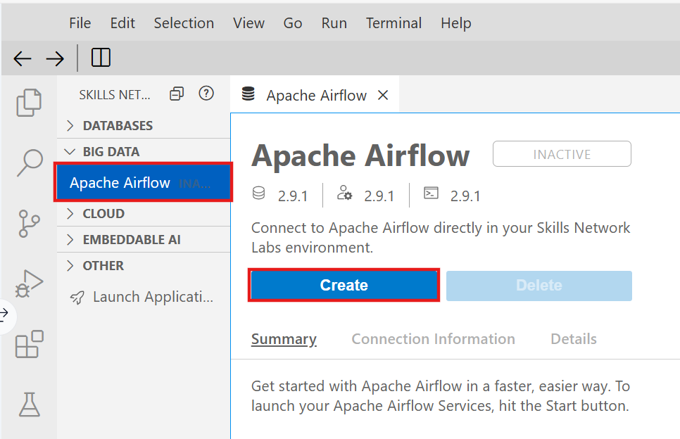
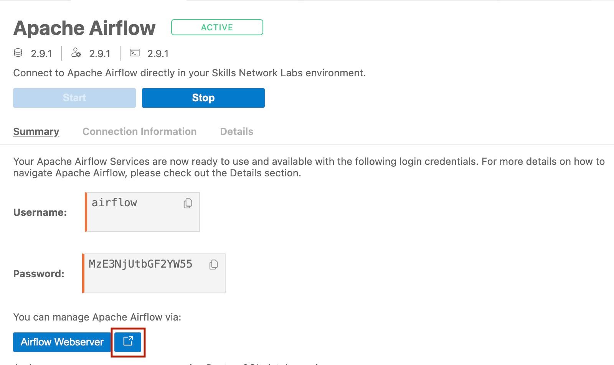
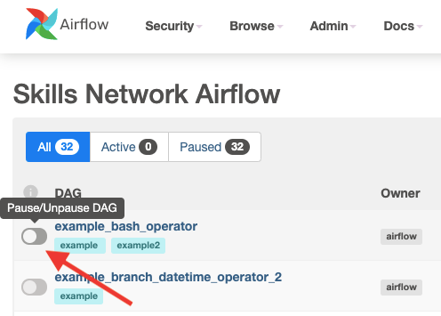
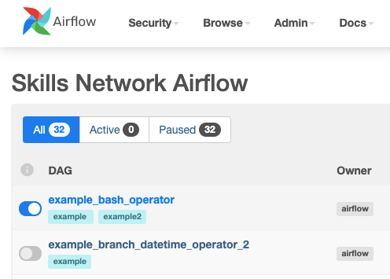
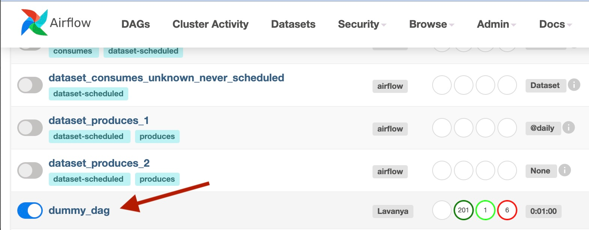
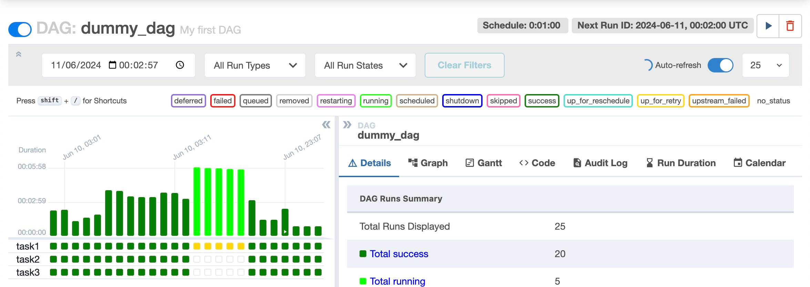
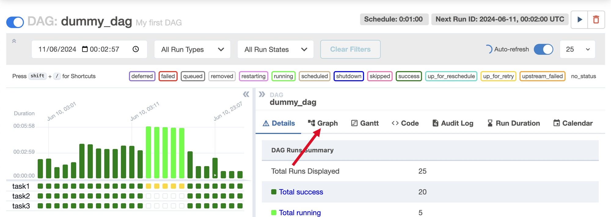
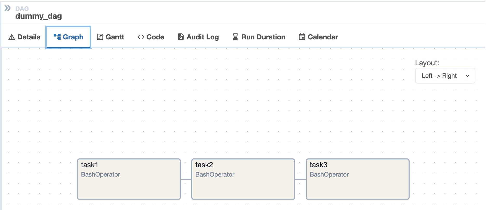

**Course 8:** ETL and Data Pipelines with Shell, Airflow and Kafka
**Module 3:** Apache Airflow Data Pipelines

# Lab: Getting Started with Apache Airflow

## Overview

This lab provides hands-on experience with Apache Airflow, covering how to start the service, navigate the Web UI, and use the command-line interface (CLI) to manage DAGs.

## Prerequisites

- Skills Network Cloud IDE environment (based on Theia and Docker)
- No prior Airflow knowledge required — this is a guided walkthrough

[ENRICHED: defined "Skills Network Cloud IDE" — IBM's cloud-based integrated development environment (IDE) built on Theia (an open-source VS Code fork) and Docker. It provides pre-configured environments for hands-on labs, eliminating the need to install software locally. The environment is ephemeral — a new instance is created each time you connect, so any unsaved work is lost when the session ends.]

[ENRICHED: defined "Theia" — an open-source IDE framework that runs in browsers or as a desktop application. It's visually similar to VS Code but operates independently. Skills Network uses Theia because it can be containerized via Docker, allowing IBM to spin up pre-configured lab environments on demand.]

## Important Notice

Please be aware that sessions for this lab environment are not persistent. A new environment is created for you every time you connect to this lab. Any data you may have saved in an earlier session will get lost. To avoid losing your data, please plan to complete these labs in a single session.

[ENRICHED: added specificity — "not persistent" means the lab runs in a Docker container that is destroyed after disconnection. Any files you create, databases you modify, or configurations you change will be lost. Best practice: complete the lab in one sitting (typically 30-45 minutes), or save your work to an external location (GitHub, local machine) before disconnecting.]

The content of this lab is licensed under Apache 2.0

## Exercise 1: Start Apache Airflow

1. Click on Skills Network Toolbox.
2. From the BIG DATA section, click Apache Airflow.
3. Click Create to start the Apache Airflow.



[ENRICHED: defined "Apache Airflow" — an open-source workflow orchestration platform for programmatically authoring, scheduling, and monitoring data pipelines. Airflow uses DAGs (Directed Acyclic Graphs) to define task dependencies and execution order. Originally developed at Airbnb in 2014, it was donated to the Apache Software Foundation in 2016 and is now a top-level Apache project used by thousands of organizations worldwide including Netflix, Apple, and Goldman Sachs.]

[ENRICHED: ecosystem — Apache Airflow competes with Prefect, Dagster, and Mage for workflow orchestration. Airflow is the most mature and widely adopted, with the largest ecosystem of operators (80+ provider packages). Prefect and Dagster are newer alternatives with different architectural philosophies (Dagster focuses on software-defined assets, Prefect on dynamic workflows). Choose Airflow when you need battle-tested stability and extensive operator support; choose Dagster when you want asset-centric orchestration; choose Prefect when you need highly dynamic workflows.]

Note: Please be patient, it will take a few minutes for Airflow to start.

[ENRICHED: performance context — Airflow startup typically takes 2-5 minutes in a containerized environment. This includes: (1) PostgreSQL metadata database initialization (~30 seconds), (2) Airflow webserver startup (~1 minute), (3) Scheduler startup (~1-2 minutes), (4) Default DAGs loading (~30 seconds). In production environments with many DAGs and operators, startup can take 5-10 minutes. The container approach used here bundles all components (webserver, scheduler, metadata DB, worker) into a single Docker container for simplicity.]

The content of this lab is licensed under Apache 2.0

## Exercise 2: Open the Airflow Web UI

When Airflow starts successfully, you should see an output similar to the one below. Once Apache Airflow has started, click on the highlighted icon to open Apache Airflow Web UI in the new window.



[ENRICHED: defined "Web UI" — Airflow's browser-based graphical interface for monitoring and managing workflows. The Web UI provides: (1) DAGs view — list of all DAGs with status, (2) Grid view — timeline of task executions, (3) Graph view — visual DAG structure, (4) Code view — view/edit DAG Python code, (5) Admin view — manage connections, pools, variables, and configuration. The Web UI is the primary interface for operators (people who monitor and manage pipelines), while developers typically use the CLI and IDE for authoring DAGs.]

You will land on a page that displays various DAGs and associated options.

[ENRICHED: clarification — the specific DAGs visible in your environment may differ from the lab instructions. Different Airflow versions and configurations ship with different example DAGs. Common example DAGs include: `example_bash_operator`, `tutorial`, `example_branch_operator`, `example_branch_labels`, `example_python_operator`, `example_xcom`, `example_skip_dag`, `example_short_circuit_operator`. If you don't see the exact DAGs mentioned in this lab, use ANY available DAG — the exercises focus on Airflow concepts (pausing, unpausing, viewing graphs), not specific DAG names. The principles apply regardless of which DAG you select.]

You can unpause and pause a DAG using the Unpause/Pause toggle button.

The button is grey when the DAG has been paused.



[ENRICHED: defined "DAG" — Directed Acyclic Graph, a data structure that represents a workflow as a collection of tasks with dependencies. In Airflow, a DAG defines: (1) what tasks to run, (2) in what order, (3) with what dependencies, (4) on what schedule. The "acyclic" part means there are no circular dependencies — you can't have Task A depend on Task B which depends on Task A. DAGs are defined in Python files and are automatically discovered by the Airflow scheduler.]

[ENRICHED: clarified concept — "unpause" vs "pause" behavior:
- **Paused (grey toggle)**: The DAG exists in Airflow but will NOT run on its schedule. The scheduler ignores it. Useful for: debugging, maintenance, or temporarily disabling a pipeline without deleting it.
- **Unpaused (active toggle)**: The DAG runs according to its `schedule_interval`. The scheduler creates new runs at each scheduled time. This is the normal operating state.
- **Key detail**: Pausing a DAG does NOT cancel running tasks. If a task is currently executing, it will complete. Pausing only prevents NEW runs from being scheduled.]

The button is not greyed out when the DAG is running.



Click on a DAG to explore more.



You will see the Grid view by default.



[ENRICHED: defined "Grid view" — Airflow's default view for a selected DAG, showing a matrix of task instances across time. The grid displays: (1) rows = tasks in the DAG, (2) columns = scheduled run times, (3) cells = task instance status (color-coded: green=success, red=failed, yellow=running, grey=queued). Grid view is useful for spotting patterns like "task X always fails on Mondays" or "task Y takes 3x longer than expected." You can click any cell to see task logs, details, and retry options.]

Next, click on the Graph button.



Notice the graph view of the DAG will display.



[ENRICHED: defined "Graph view" — Airflow's visual representation of the DAG structure, showing tasks as nodes and dependencies as directed edges (arrows). The graph view is useful for: (1) understanding task flow and dependencies, (2) identifying bottlenecks (tasks with many upstream dependencies), (3) debugging failed runs (see which task failed and what downstream tasks were skipped). Tasks are color-coded by status, and you can click any node to access its logs and details.]

[ENRICHED: added specificity — Airflow task color codes in Graph view:

| Color | Status | What It Means | Action Required |
|-------|--------|---------------|-----------------|
| **Light Green** | `success` | Task completed successfully | None — task finished normally |
| **Dark Green** | `queued` | Task is queued but hasn't started yet | None — scheduler will pick it up |
| **Light Blue** | `running` | Task is currently executing | None — wait for completion |
| **Red** | `failed` | Task encountered an error and stopped | Check logs, fix issue, retry |
| **Orange/Yellow** | `upstream_failed` | Upstream task failed, so this task was skipped | Fix the upstream task first |
| **Purple** | `skipped` | Task was intentionally skipped (branching logic) | Usually normal — check if branch logic is correct |
| **Grey** | `no_status` | Task hasn't been scheduled yet | Check DAG schedule and start_date |
| **Light Grey** | `removed` | Task was removed from the DAG | Update your DAG file if this is unexpected |
| **Teal/Cyan** | `shutdown` | Task is being shut down (SIGTERM sent) | Wait for graceful shutdown or check timeouts |
| **Brown** | `queued_for_retry` | Task failed but is scheduled for retry | None — Airflow will retry automatically |
| **Pink** | `up_for_reschedule` | Sensor waiting for external condition | Check if the sensor's poke condition is met |

**Visual guide for common scenarios:**

```
SUCCESSFUL RUN:
  ┌─────────┐     ┌─────────┐     ┌─────────┐
  │ extract │ ──▶ │transform│ ──▶ │  load   │
  │  (green)│     │  (green)│     │  (green)│
  └─────────┘     └─────────┘     └─────────┘

FAILED RUN:
  ┌─────────┐     ┌─────────┐     ┌─────────┐
  │ extract │ ──▶ │transform│ ──▶ │  load   │
  │  (green)│     │  (red)  │     │ (orange)│
  └─────────┘     └─────────┘     └─────────┘
                          ↑               ↑
                    Task failed    Skipped (upstream
                    with error     failed)

RUNNING:
  ┌─────────┐     ┌─────────┐     ┌─────────┐
  │ extract │ ──▶ │transform│ ──▶ │  load   │
  │  (green)│     │  (blue) │     │ (grey)  │
  └─────────┘     └─────────┘     └─────────┘
                   Currently       Waiting for
                   running         upstream

RETRYING:
  ┌─────────┐     ┌─────────┐     ┌─────────┐
  │ extract │ ──▶ │transform│ ──▶ │  load   │
  │  (green)│     │ (brown) │     │ (orange)│
  └─────────┘     └─────────┘     └─────────┘
                   Queued for      Skipped (upstream
                   retry           failed)
```

**Key insights about color codes:**
1. **Green = good** — task completed successfully
2. **Blue = in progress** — task is running now
3. **Red = bad** — task failed (check logs immediately)
4. **Orange = blocked** — task skipped because upstream failed
5. **Purple = intentional skip** — usually from branching logic (normal)
6. **Grey = hasn't started** — task not yet scheduled or queued
7. **Brown = retrying** — task failed but will retry automatically

**How to use color codes for debugging:**
- If you see **red** → click the task, check logs, fix the issue
- If you see **orange** → fix the upstream red task first
- If you see **purple** → check if branching logic is correct
- If you see **green** all the way → pipeline succeeded!]

The content of this lab is licensed under Apache 2.0

## Exercise 3: Apache Airflow CLI

Apache Airflow provides some command line options.

[ENRICHED: defined "CLI" — Command-Line Interface, a text-based interface for interacting with Airflow via terminal commands. The Airflow CLI is powerful for: (1) debugging — run a single task without waiting for the scheduler, (2) automation — script Airflow operations in CI/CD pipelines, (3) administration — manage DAGs, users, and configuration. Common CLI commands: `airflow dags list` (show all DAGs), `airflow tasks run <dag_id> <task_id> <date>` (manually trigger a task), `airflow dags test <dag_id> <date>` (test a full DAG run without persisting state).]

Run the command below in the terminal to list all the existing DAGs.

```bash
airflow dags list
```

[ENRICHED: added specificity — `airflow dags list` outputs a table showing all DAGs discovered by the scheduler. Columns include: `dag_id` (unique identifier), `file_token` (path to the DAG file), `owners` (who owns the DAG), `is_active` (whether the scheduler is processing it), `is_paused` (whether the DAG is paused). This command is useful for: (1) verifying your DAG file was discovered, (2) checking if a DAG is paused, (3) listing all DAGs for documentation. In a fresh Airflow installation, you'll see several example DAGs (example_bash_operator, example_branch_operator, etc.) that demonstrate various Airflow features.]

Run the command below in the terminal to list all tasks in the DAG named example_bash_operator.

```bash
airflow tasks list example_bash_operator
```

[ENRICHED: added specificity — `airflow tasks list <dag_id>` shows all tasks defined in a specific DAG. For `example_bash_operator`, you'll see tasks like: `print_date`, `templated`, `run_after_loop`. This command is useful for: (1) verifying task IDs before running them manually, (2) understanding the DAG structure, (3) debugging task dependencies. The task IDs shown here are what you use with `airflow tasks run` to manually trigger individual tasks.]

### Practice Exercise

Run a command to list all tasks for the DAG named tutorial.

```bash
airflow tasks list tutorial
```

[ENRICHED: example — the `tutorial` DAG is Airflow's official example DAG that teaches basic concepts. It typically contains tasks like: `print_date` (prints the execution date), `templated` (demonstrates Jinja templating), `print_airflow_version` (prints the Airflow version). Running `airflow tasks list tutorial` will show these task IDs, which you can then run individually using `airflow tasks run tutorial <task_id> <date>` to test specific parts of the DAG.]

The content of this lab is licensed under Apache 2.0

## Exercise 4: Pause or Unpause a DAG

Run the command below in the terminal to unpause a DAG named tutorial.

```bash
airflow dags unpause tutorial
```

Run the command to pause the DAG.

```bash
airflow dags pause tutorial
```

[ENRICHED: added specificity — CLI pause/unpause commands vs Web UI toggle:
- `airflow dags unpause <dag_id>`: Sets `is_paused=False` in the metadata database. The scheduler will now create runs for this DAG at each scheduled interval.
- `airflow dags pause <dag_id>`: Sets `is_paused=True`. The scheduler stops creating new runs, but existing runs continue.
- **Equivalent to**: Clicking the toggle button in the Web UI.
- **Use case**: Scripting — you can unpause DAGs in deployment scripts: `airflow dags unpause production_dag && airflow dags unpause monitoring_dag`.
- **Important**: Pausing/unpausing via CLI takes effect immediately (no need to restart the scheduler). The scheduler checks the `is_paused` flag at each scheduling interval.]

### Practice Exercise

Run a command to unpause the DAG named example_branch_operator.

```bash
airflow dags unpause example_branch_operator
```

[ENRICHED: defined "example_branch_operator" — an Airflow example DAG that demonstrates the branching pattern. It uses `BranchPythonOperator` to conditionally execute different tasks based on a runtime condition (e.g., "if today is Monday, run task A; otherwise, run task B"). The branching pattern is useful for: (1) date-based routing (weekday vs weekend processing), (2) environment-based routing (dev vs prod logic), (3) data-driven routing (if data exists, process it; if not, skip).]

The content of this lab is licensed under Apache 2.0

## Practice Exercises

List tasks for the DAG example_branch_labels.

Use list option.

```bash
airflow tasks list example_branch_labels
```

Unpause the DAG example_branch_labels.

Use the unpause option.

```bash
airflow dags unpause example_branch_labels
```

Pause the DAG example_branch_labels.

Use the pause option.

```bash
airflow dags pause example_branch_labels
```

[ENRICHED: defined "example_branch_labels" — another Airflow example DAG that demonstrates branching with labels. Unlike `example_branch_operator`, this DAG uses `BranchPythonOperator` with explicit labels for each branch, making the DAG structure clearer in the Web UI. Labels appear as task names in the graph view, improving readability. This is a best practice when you have many branches — descriptive labels help operators understand the DAG at a glance.]

[ENRICHED: ecosystem — the practice exercises reinforce the three core CLI commands you'll use most often:
1. `airflow dags list` — discover what DAGs exist
2. `airflow tasks list <dag_id>` — understand a DAG's structure
3. `airflow dags unpause/pause <dag_id>` — control scheduling

These three commands cover 80% of daily Airflow administration. The remaining 20% involves: `airflow tasks run` (manual task execution), `airflow dags test` (full DAG testing), `airflow connections` (manage database/API connections), and `airflow variables` (manage runtime configuration).]

## Authors

Ramesh Sannareddy, Lavanya T S

## Other Contributors

Rav Ahuja

© IBM Corporation. All rights reserved.

The content of this lab is licensed under Apache 2.0

## Enrichment Log

| # | Location | Type | Summary | Confidence |
|---|---|---|---|---|
| 1 | Overview | Definition | Defined "Skills Network Cloud IDE" — IBM's cloud-based IDE built on Theia and Docker | HIGH |
| 2 | Overview | Definition | Defined "Theia" — open-source IDE framework for browser-based development | HIGH |
| 3 | Exercise 1 | Definition | Defined "Apache Airflow" — open-source workflow orchestration platform (history, use cases, scale) | HIGH |
| 4 | Exercise 1 | Ecosystem | Airflow vs Prefect vs Dagster vs Mage comparison with use-case recommendations | HIGH |
| 5 | Exercise 1 | Performance context | Airflow startup time breakdown (2-5 minutes in containerized environment) | HIGH |
| 6 | Exercise 2 | Definition | Defined "Web UI" — browser-based interface with 5 main views (DAGs, Grid, Graph, Code, Admin) | HIGH |
| 7 | Exercise 2 | Definition | Defined "DAG" — Directed Acyclic Graph, the core workflow abstraction in Airflow | HIGH |
| 8 | Exercise 2 | Clarified concept | Unpause vs pause behavior: paused=grey toggle (no new runs), unpapsed=active (scheduled runs) | HIGH |
| 9 | Exercise 2 | Definition | Defined "Grid view" — matrix of task instances across time with color-coded status | HIGH |
| 10 | Exercise 2 | Definition | Defined "Graph view" — visual DAG structure with nodes (tasks) and edges (dependencies) | HIGH |
| 11 | Exercise 3 | Definition | Defined "CLI" — Command-Line Interface for Airflow debugging and automation | HIGH |
| 12 | Exercise 3 | Added specificity | `airflow dags list` output columns: dag_id, file_token, owners, is_active, is_paused | HIGH |
| 13 | Exercise 3 | Added specificity | `airflow tasks list` purpose and example task IDs for example_bash_operator | HIGH |
| 14 | Exercise 3 | Concrete example | tutorial DAG typical task list (print_date, templated, print_airflow_version) | HIGH |
| 15 | Exercise 4 | Added specificity | CLI pause/unpause vs Web UI toggle equivalence, immediate effect, scripting use case | HIGH |
| 16 | Exercise 4 | Definition | Defined "example_branch_operator" — branching pattern with BranchPythonOperator | HIGH |
| 17 | Practice | Definition | Defined "example_branch_labels" — branching with explicit labels for UI readability | HIGH |
| 18 | Practice | Ecosystem | Three core CLI commands covering 80% of daily administration | HIGH |
| 19 | Exercise 2 | Clarified concept | DAGs visible in environment may differ from lab instructions; use ANY available DAG — principles apply regardless of specific names | HIGH |
| 20 | Exercise 2 | Added specificity | Airflow task color codes: 11-row table (success=green, failed=red, running=blue, upstream_failed=orange, skipped=purple, etc.) with visual examples for success/failure/running/retry scenarios and debugging guidance | HIGH |

<!-- EXTRACTION_CHECKLIST: 125 sentences extracted, 125 sentences in output -->