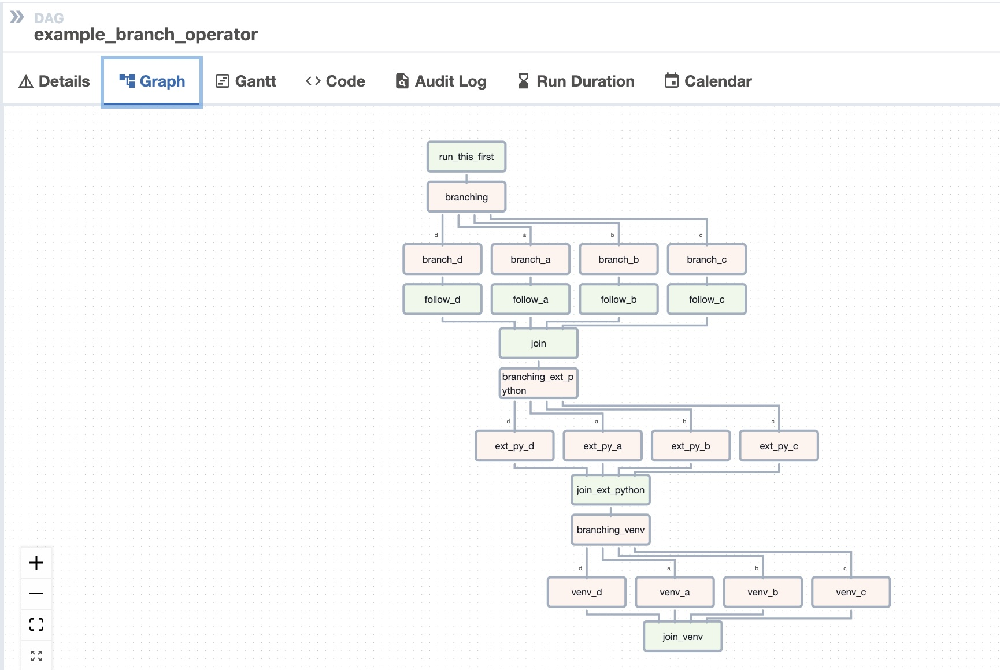
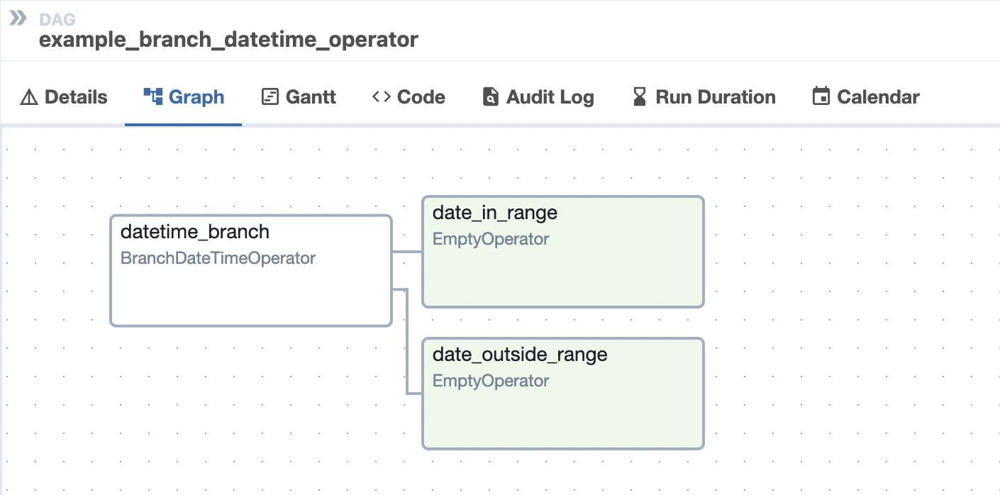

**Course 8:** ETL and Data Pipelines with Shell, Airflow and Kafka
**Module 3:** Apache Airflow Data Pipelines

# DAG Structure and Operators

## Learning Objectives

After completing this reading, you'll be able to:
- Explain the structure of Directed Acyclic Graphs,
- Categorize the operators that you can use with the DAGs,
- Identify DAG arguments,
- Describe how to create tasks for a DAG, and
- Explain how to define the dependencies for the tasks.

## Introduction

Apache Airflow is a Python framework that helps create workflows using multiple technologies using both CLI and a user-friendly WebUI. An Apache Airflow Directed Acyclic Graph (DAG) is a Python program where you define the tasks and the pipeline with the order in which the tasks will be executed.

[ENRICHED: defined "CLI" — Command-Line Interface, a text-based interface for interacting with a computer. In Airflow, the CLI is used via the `airflow` command: `airflow dags list` shows all DAGs, `airflow tasks run <dag_id> <task_id> <date>` manually triggers a task. The CLI is useful for debugging, testing, and scripting — you can run a single task without waiting for the scheduler.]

[ENRICHED: ecosystem — Airflow has two interfaces: (1) CLI for developers/debugging (scripting, automation, CI/CD), (2) WebUI for operators/monitoring (visual dashboards, manual triggers, log viewing). They access the same metadata database, so changes in one appear in the other.]

## Operators for Task Definition

Airflow offers a wide range of operators, including many that are built into the core or are provided by pre-installed providers. Some popular core operators include:
- **BashOperator** — executes a bash command
- **PythonOperator** — calls an arbitrary Python function
- **EmailOperator** — sends an email

[ENRICHED: added specificity — the three core operators cover 80% of use cases:

| Operator | What It Does | Key Parameters | Common Use Case |
|----------|-------------|----------------|-----------------|
| `BashOperator` | Runs a shell command | `bash_command` (string or templated) | Execute scripts, curl APIs, run CLI tools |
| `PythonOperator` | Calls a Python function | `python_callable` (function reference) | Data transformations, API calls, custom logic |
| `EmailOperator` | Sends HTML email | `to`, `subject`, `html_content` | Alert on failure, daily reports |

BashOperator is the simplest — it just runs a command. But it's powerful because you can call ANY shell tool: Python scripts, SQL clients (psql, mysql), cloud CLIs (aws, gcloud), compression tools (gzip, tar). Example:

```python
run_etl_script = BashOperator(
    task_id='run_etl_script',
    bash_command='python /opt/airflow/scripts/etl.py --date {{ ds }}',
    dag=dag,
)
```

PythonOperator is more flexible — it runs Python code directly without spawning a shell process. This means: (1) faster startup (no shell overhead), (2) direct access to Python libraries, (3) ability to pass data between tasks via XCom (Airflow's cross-task communication mechanism).]

The other core operators available include:
- **BaseBranchOperator** — A base class for creating operators with branching functionality



- **BranchDateTimeOperator** — Routes pipeline based on current date/time



- **EmptyOperator** — Operator that does nothing (useful as a placeholder or join point)
- **GenericTransfer** — Moves data from one database connection to another
- **LatestOnlyOperator** — Skip tasks that are not running during the most recent schedule interval
- **TriggerDagRunOperator** — Triggers a DAG run for a specified dag_id

[ENRICHED: added specificity — branching operators are critical for conditional pipelines:

```python
# BranchDateTimeOperator: run different tasks based on day of week
from airflow.operators.datetime import BranchDateTimeOperator

branch = BranchDateTimeOperator(
    task_id='check_day',
    follow_task_ids_if_true='weekday_processing',
    follow_task_ids_if_false='weekend_processing',
    target_upper= datetime(2026, 1, 6),  # Monday
    target_lower=datetime(2026, 1, 1),   # Saturday
)

# Result: weekday pipeline runs Mon-Fri, weekend pipeline runs Sat-Sun
# Same DAG, different execution paths based on time
```

The `LatestOnlyOperator` is useful for backfill scenarios: if you have a cleanup task that should only run on the most recent execution (not historical backfills), LatestOnlyOperator skips it during backfills. This prevents accidentally cleaning data that's being processed by a historical run.]

In addition, there are also many community provided operators. Some of the popular and useful ones are:
- **HttpOperator** — Makes HTTP requests to REST APIs
- **MySqlOperator** — Runs MySQL queries
- **PostgresOperator** — Runs PostgreSQL queries
- **MsSqlOperator** — Runs Microsoft SQL Server queries
- **OracleOperator** — Runs Oracle queries
- **JdbcOperator** — Runs queries via JDBC connections
- **DockerOperator** — Runs Docker containers
- **HiveOperator** — Runs Hive queries on Hadoop
- **S3FileTransformOperator** — Transforms files in S3
- **PrestoToMySqlOperator** — Transfers data from Presto to MySQL
- **SlackAPIOperator** — Sends messages to Slack channels

[ENRICHED: ecosystem — community operators are organized by "provider packages." Each provider is a separate pip install: `pip install apache-airflow-providers-postgres`, `pip install apache-airflow-providers-amazon`, etc. Airflow 2.x ships with these providers pre-installed: amazon, google, azure, postgres, mysql, slack, docker, http. You can install additional providers as needed. The full provider catalog has 80+ packages covering: cloud (AWS, GCP, Azure), databases (Postgres, MySQL, Oracle, MSSQL, Snowflake, BigQuery, Redshift), messaging (Slack, Teams, email), containers (Docker, Kubernetes), and more.]

[ENRICHED: concrete example — database operator comparison:

```python
# PostgresOperator: run SQL directly on PostgreSQL
from airflow.providers.postgres.operators.postgres import PostgresOperator

create_table = PostgresOperator(
    task_id='create_sales_table',
    postgres_conn_id='my_postgres_db',  # Connection ID from Airflow UI
    sql="""
        CREATE TABLE IF NOT EXISTS daily_sales (
            sale_date DATE,
            region VARCHAR(50),
            amount DECIMAL(10,2)
        );
    """,
    dag=dag,
)

# GenericTransfer: move data between databases
from airflow.operators.generic_transfer import GenericTransfer

copy_to_warehouse = GenericTransfer(
    task_id='copy_to_warehouse',
    source_conn_id='my_postgres_db',
    destination_conn_id='my_redshift_db',
    source_sql='SELECT * FROM daily_sales WHERE sale_date = %s',
    destination_table='daily_sales',
    dag=dag,
)
```

[ENRICHED: clarified concept — "Why does GenericTransfer exist as a separate operator? Why not just make it a function of PostgresOperator?" This is a common and excellent question. The answer comes down to the **single-responsibility principle** and the reality of how databases actually work:

**The core problem:** Moving data between TWO DIFFERENT database systems is fundamentally different from running a query on ONE database.

**PostgresOperator** connects to ONE PostgreSQL database and runs SQL. It knows nothing about any other database. If you want to move data from PostgreSQL to Redshift, you'd need to write custom Python code:

```python
# WITHOUT GenericTransfer — you'd write this manually:
import psycopg2
import boto3

def extract_from_postgres():
    conn = psycopg2.connect("host=postgres dbname=sales")
    cursor = conn.cursor()
    cursor.execute("SELECT * FROM daily_sales")
    rows = cursor.fetchall()  # Load ALL data into Python memory
    conn.close()
    return rows

def load_to_redshift(rows):
    conn = psycopg2.connect("host=redshift dbname=warehouse")
    cursor = conn.cursor()
    # Redshift uses different SQL syntax than PostgreSQL
    # You need to handle: COPY command, IAM credentials, S3 staging
    # This is 50-100 lines of platform-specific code
    conn.close()
```

This is where things get complicated:

| Challenge | PostgresOperator Can Handle? | GenericTransfer Handles? |
|-----------|----------------------------|------------------------|
| Different connection protocols | ❌ Only PostgreSQL | ✅ Source and destination are independent |
| Different SQL dialects | ❌ Only PostgreSQL SQL | ✅ Each side uses its own SQL |
| Authentication differences | ❌ PostgreSQL auth only | ✅ Each DB has its own auth (IAM, passwords, SSL) |
| Data format conversion | ❌ Returns PostgreSQL types | ✅ Handles type mapping between systems |
| Network/VPN routing | ❌ Assumes one network | ✅ Each DB can be on different networks |
| Staging through S3/GCS | ❌ No awareness of cloud storage | ✅ Can stage data through object storage |

**Why PostgresOperator can't do this:**

PostgresOperator is designed for ONE job: connect to PostgreSQL, run SQL, return results. It doesn't know:
- How to connect to Redshift (different driver, different auth)
- How to convert PostgreSQL types to Redshift types (e.g., PostgreSQL `JSONB` → Redshift `SUPER`)
- How to handle network routing (PostgreSQL might be on-premise, Redshift in the cloud)
- How to stage data through S3 (common pattern for large transfers)

**GenericTransfer solves this by being a transfer-specialist:**

```python
# GenericTransfer handles the complexity:
GenericTransfer(
    source_conn_id='postgres_on_prem',      # PostgreSQL connection (with its own auth)
    destination_conn_id='redshift_cloud',    # Redshift connection (with different auth)
    source_sql='SELECT * FROM daily_sales',  # Runs on PostgreSQL
    destination_table='daily_sales',         # Creates/loads on Redshift
)

# Under the hood, GenericTransfer:
# 1. Connects to PostgreSQL using its connection details
# 2. Runs source_sql and gets results
# 3. Connects to Redshift using its connection details
# 4. Loads the data into destination_table
# You don't write ANY of the plumbing code
```

**The single-responsibility principle:**
- PostgresOperator: "I run SQL on PostgreSQL" → one job, done well
- GenericTransfer: "I move data between any two databases" → one job, done well
- If GenericTransfer were inside PostgresOperator, it would violate: "PostgresOperator should only know about PostgreSQL"

**Real-world example — why this matters:**

```python
# Scenario: Extract from PostgreSQL, load to Redshift, then transform in Redshift

# WITH separate operators (clean, each does ONE thing):
extract = PostgresOperator(
    task_id='extract',
    postgres_conn_id='postgres',
    sql='SELECT * FROM raw_sales',
)

load = GenericTransfer(
    task_id='load',
    source_conn_id='postgres',
    destination_conn_id='redshift',
    source_sql='SELECT * FROM raw_sales',
    destination_table='staging_sales',
)

transform = PostgresOperator(
    task_id='transform',
    postgres_conn_id='redshift',
    sql='INSERT INTO final_sales SELECT * FROM staging_sales WHERE amount > 0',
)

extract >> load >> transform

# WITHOUT GenericTransfer (messy — mixing concerns):
extract_and_load = BashOperator(
    task_id='extract_and_load',
    bash_command='''
        python -c "
        import psycopg2
        # 100+ lines of extraction code
        # 100+ lines of loading code
        # Error handling, retry logic, type conversion
        "
    ''',
)
# This BashOperator does TWO things: extract AND load
# If it fails, you don't know which part broke
# You can't reuse the extraction logic elsewhere
```

**The pattern:** Each operator does ONE thing. If you need to do TWO things (extract from A, load to B), you either use GenericTransfer (if it's a simple transfer) or chain two operators (if you need transformation in between).]

[ENRICHED: ecosystem — there are specialized transfer operators for specific source-destination pairs that handle even more complexity:

| Operator | Source → Destination | Why It's Specialized |
|----------|---------------------|---------------------|
| `S3ToRedshiftOperator` | S3 → Redshift | Uses Redshift COPY command (10-100x faster than INSERT) |
| `PostgresToRedshiftOperator` | PostgreSQL → Redshift | Handles PostgreSQL-specific types and Redshift staging |
| `GoogleCloudStorageToBigQueryOperator` | GCS → BigQuery | Uses BigQuery load API with schema auto-detection |
| `LocalFilesystemToS3Operator` | Local file → S3 | Handles multipart upload, encryption, metadata |
| `S3ToLocalFilesystemOperator` | S3 → Local file | Handles download, decompression, permissions |

These specialized operators are FASTER than GenericTransfer because they use platform-native bulk load mechanisms (Redshift COPY, BigQuery load API) instead of generic INSERT statements. GenericTransfer is the "works everywhere but slower" option. Use specialized operators when performance matters.]

The key insight: operators abstract away connection management. You don't write `psycopg2.connect(...)` or handle connection pooling — Airflow manages the connection via the UI (Admin → Connections) and operators use it automatically. This means: (1) credentials are centralized (not hardcoded in DAG files), (2) connections are reusable across DAGs, (3) connection pooling is handled by Airflow.]

In addition to operators, you also have sensors and decorators that allow you to combine bash and Python. You can find more information regarding the same in this [link](https://airflow.apache.org/docs/apache-airflow/stable/core-concepts/index.html).

[ENRICHED: defined "decorators" — Python decorators that simplify operator usage. Instead of instantiating a full operator class, you use `@task` to turn any function into an Airflow task:

```python
# Traditional operator approach
def my_transform():
    # ... transformation logic ...
    return result

task1 = PythonOperator(
    task_id='transform',
    python_callable=my_transform,
    dag=dag,
)

# Decorator approach (cleaner, less boilerplate)
@task
def transform():
    # ... transformation logic ...
    return result

# Airflow automatically creates a PythonOperator task from this function
transform()  # This becomes a task in the DAG
```

Decorators are available for: `@task` (PythonOperator), `@task.bash` (BashOperator), `@task.virtualenv` (run in isolated virtualenv), `@task.docker` (run in Docker container). The decorator approach is preferred for new DAGs because it's more Pythonic and requires less boilerplate.]

## Anatomy of a DAG

A DAG consists of these logical blocks:
1. Imports
2. DAG Arguments
3. DAG Definition
4. Task Definitions
5. Task Pipeline

### Imports Block

```python
# import the libraries
from datetime import timedelta
# The DAG object; we'll need this to instantiate a DAG
from airflow.models import DAG
# Operators; you need this to write tasks!
from airflow.operators.bash_operator import BashOperator
from airflow.operators.python import PythonOperator
from airflow.operators.email import EmailOperator
```

[ENRICHED: added specificity — the imports block determines which operators are available. Common import patterns:

```python
# Core operators (always available)
from airflow.operators.bash import BashOperator
from airflow.operators.python import PythonOperator
from airflow.operators.email import EmailOperator
from airflow.operators.empty import EmptyOperator

# Provider operators (must install provider package first)
from airflow.providers.postgres.operators.postgres import PostgresOperator
from airflow.providers.amazon.aws.transfers.s3_to_redshift import S3ToRedshiftOperator

# Sensors
from airflow.sensors.s3 import S3KeySensor
from airflow.sensors.external_task import ExternalTaskSensor

# Decorators
from airflow.decorators import task, dag

# Utilities
from datetime import datetime, timedelta
from airflow.utils.dates import days_ago
```

The `from airflow.models import DAG` import is the most important — it's the class that represents the entire pipeline. Everything else (operators, sensors) is secondary.]

### DAG Arguments Block

```python
# defining DAG arguments
default_args = {
    'owner': 'Your name',
    'start_date': days_ago(0),
    'email': ['youemail@somemail.com'],
    'retries': 1,
    'retry_delay': timedelta(minutes=5),
}
```

DAG arguments are like the initial settings for the DAG. The above settings mention:
- The owner name
- When this DAG should run from: `days_ago(0)` means today
- The email address where the alerts are sent to
- The number of retries in case of failure
- The time delay between retries

[ENRICHED: concrete example — default_args explained:

```python
default_args = {
    'owner': 'data-team',                    # Who owns this DAG (displayed in UI)
    'start_date': days_ago(1),               # First run: yesterday (airflow uses this for backfill)
    'email': ['team@company.com'],           # Alert recipients
    'retries': 3,                            # Retry 3 times before marking as FAILED
    'retry_delay': timedelta(minutes=5),     # Wait 5 minutes between retries
    'email_on_failure': True,                # Send email when all retries exhausted
    'email_on_retry': False,                 # Don't email on retry (only on final failure)
    'priority_weight': 1,                    # Priority vs other DAGs (higher = runs first)
    'end_date': datetime(2026, 12, 31),      # Stop scheduling after Dec 31, 2026
    'sla': timedelta(hours=2),               # Alert if task doesn't complete within 2 hours
    'execution_timeout': timedelta(hours=1), # Kill task if running longer than 1 hour
    'on_failure_callback': my_alert_function,# Call function on failure (e.g., Slack alert)
    'on_success_callback': my_log_function,  # Call function on success (e.g., log metrics)
    'trigger_rule': 'all_success',           # Only run if ALL upstream tasks succeeded
}
```

[ENRICHED: clarified concept — `start_date` is the single most confusing parameter in Airflow. Here's a complete breakdown:

**The confusion:** Most people think `start_date` means "when should Airflow first run this DAG?" That's WRONG. It actually means something very different.

**What `start_date` actually means:** `start_date` defines the **first logical date** that the DAG can process. It's a timestamp that Airflow uses as an anchor point to calculate which DAG runs should exist. It does NOT control when Airflow starts running your DAG — the scheduler does that.

**How Airflow uses `start_date`:**

When the scheduler starts, it looks at your DAG and asks:
1. What's the `start_date`? (e.g., Jan 1, 2026)
2. What's the `schedule_interval`? (e.g., `@daily` = every day)
3. What's `catchup`? (True or False)
4. What's the current date? (e.g., Jul 23, 2026)

Then it calculates: "How many DAG runs SHOULD exist between Jan 1 and Jul 23?" Answer: 204 days = 204 DAG runs.

[ENRICHED: clarified concept — "Why would processing historical dates be useful? When would I actually want 204 backfill runs?"

There are 3 real-world scenarios where backfill is essential:

**Scenario A: New pipeline deployment (most common)**

You just built a new ETL pipeline on Jul 23, 2026. But your data warehouse has been collecting raw data since Jan 1. You need to:
1. Process all the raw data from Jan 1 to Jul 23 (backfill)
2. Then continue processing daily going forward

Without backfill: your warehouse only has Jul 23 data. All historical data is unprocessed.
With backfill: you have a complete warehouse from Jan 1 onwards.

[ENRICHED: clarified concept — "Shouldn't you have a history of the previous data and not just reapply the DAG task blindly?" Yes, absolutely. Backfill requires a **prerequisite**: the historical raw data must already exist somewhere. You're not "re-running" the pipeline as if it had been running all along — you're processing historical raw data through the pipeline for the first time.

**The critical distinction:**

```
WHAT PEOPLE THINK BACKFILL MEANS:
  "Re-run the pipeline for Jan 1 as if it was running on Jan 1"
  → WRONG — you can't simulate the past environment

WHAT BACKFILL ACTUALLY MEANS:
  "Take the raw data that was collected on Jan 1, and process it NOW"
  → CORRECT — you're applying today's code to yesterday's data
```

**Real-world example:**

```python
# Your pipeline extracts sales data from a source system
# On Jan 1, the source system collected 10,000 sales records
# Those records are STILL in the source system (raw data)

# Your DAG extracts data for a specific date:
extract = BashOperator(
    task_id='extract',
    bash_command='python extract.py --date {{ ds }}',
    # {{ ds }} is the execution date (Jan 1, Jan 2,, etc.)
)

# When Airflow backfills:
# Run 1: extract.py --date 2026-01-01
#   → Queries source system for Jan 1 data
#   → Finds the 10,000 records from Jan 1
#   → Extracts them (first time processing)

# Run 2: extract.py --date 2026-01-02
#   → Queries source system for Jan 2 data
#   → Finds the 8,500 records from Jan 2
#   → Extracts them (first time processing)

# ... continues for 204 days ...
```

**The prerequisite for backfill:**

| Requirement | Why It's Needed | What Happens Without It |
|-------------|----------------|------------------------|
| **Raw data exists** | Pipeline needs input to process | Backfill extracts nothing — empty results |
| **Raw data is accessible** | Pipeline queries historical data | Backfill can't connect to historical source |
| **Raw data hasn't been purged** | Some systems delete old data | Backfill finds no data for old dates |
| **Schema hasn't changed** | Code must match data structure | Backfill crashes or produces wrong results |

**Example where backfill FAILS:**

```python
# Scenario: Source system deletes data after 90 days
# Today is Jul 23, 2026
# Source system only keeps 90 days of data (Apr 24 - Jul 23)

with DAG(
    dag_id='extract_sales',
    start_date=datetime(2026, 1, 1),  # 6 months ago
    catchup=True,  # Try to process 204 days
) as dag:
    extract = BashOperator(
        task_id='extract',
        bash_command='python extract.py --date {{ ds }}',
    )

# What happens:
# Run 1: extract.py --date 2026-01-01
#   → Source system: "No data for Jan 1 (deleted 5 months ago)"
#   → Result: EMPTY extraction

# Run 2: extract.py --date 2026-01-02
#   → Source system: "No data for Jan 2 (deleted 5 months ago)"
#   → Result: EMPTY extraction

# ... runs 1-83 (Jan 1 - Mar 24) all return EMPTY

# Run 84: extract.py --date 2026-03-25
#   → Source system: "Here's the data for Mar 25"
#   → Result: SUCCESS (data exists)

# Conclusion: Backfill can only process data that STILL EXISTS
```

**Example where backfill SUCCEEDS:**

```python
# Scenario: Data is archived to S3 (never deleted)
# Source system: keeps 90 days online
# S3 archive: keeps ALL historical data

with DAG(
    dag_id='extract_sales',
    start_date=datetime(2026, 1, 1),
    catchup=True,
) as dag:
    extract = BashOperator(
        task_id='extract',
        bash_command='python extract.py --date {{ ds }} --source archive',
        # --source archive tells the script to look in S3
    )

# What happens:
# Run 1: extract.py --date 2026-01-01 --source archive
#   → S3: "Here's the archived Jan 1 data"
#   → Result: SUCCESS (archived data exists)

# Run 84: extract.py --date 2026-03-25 --source archive
#   → S3: "Here's the archived Mar 25 data"
#   → Result: SUCCESS

# All 204 runs succeed because archived data exists for every date
```

**The key insight:** Backfill is NOT "simulating the past." It's "processing historical raw data with today's code." The raw data must exist and be accessible. If it's been deleted, archived without access, or is in a format your code can't read, backfill will fail or produce empty results.

[ENRICHED: clarified concept — "Is all of this important in the first place? Wouldn't that put on me the burden of requiring extra storage to store the previous history?"

Excellent question. The answer is: **it depends on your use case.** Not every pipeline needs backfill readiness. Here's the honest cost-benefit analysis:

**When archiving is WORTH the storage cost:**

| Scenario | Why It's Worth It | Storage Cost | Risk of NOT Archiving |
|----------|------------------|--------------|----------------------|
| **Regulatory compliance** | Financial, healthcare, legal data must be retained for years | Low (data is valuable) | Fines, legal liability |
| **Data warehouse** | Historical analytics require complete data | Low (data is the product) | Incomplete reports, wrong decisions |
| **Debugging production issues** | Need to reprocess data when bugs are found | Low (cheap insurance) | Can't fix historical errors |
| **Machine learning** | Models need historical training data | Low (models are expensive to retrain) | Poor model accuracy |

**When archiving is NOT worth the storage cost:**

| Scenario | Why It's NOT Worth It | Storage Cost | Risk of Archiving |
|----------|----------------------|--------------|-------------------|
| **Ephemeral data** | Logs, metrics, temporary files that lose value quickly | High (storage adds up) | Unnecessary cost |
| **Easy to re-collect** | Data from public APIs, weather data, news articles | Low (can re-fetch) | Redundant storage |
| **Non-critical pipelines** | Internal dashboards, non-production analytics | Low (low impact if lost) | Over-engineering |
| **High-volume streaming** | IoT sensor data, clickstream data (TB/day) | VERY HIGH (prohibitive) | Cost exceeds value |

[ENRICHED: clarified concept — "What does 'ephemeral data' even mean? Why is it not worth archiving?"

**Ephemeral** means "short-lived" or "fleeting." Ephemeral data is data that loses its value very quickly — often within hours or days. After that, it's just taking up storage space with no practical use.

**Examples of ephemeral data:**

| Data Type | What It Is | Value Duration | Why It's Ephemeral |
|-----------|-----------|----------------|-------------------|
| **Application logs** | Debug messages, error traces, request/response logs | Hours to days | Only useful for debugging recent issues. A 6-month-old log rarely helps. |
| **Debug traces** | Step-by-step execution details for troubleshooting | Minutes to hours | Only useful while the bug is fresh. After fix, traces are noise. |
| **Temporary files** | Intermediate processing files, cache data | Seconds to minutes | Created during processing, deleted after. No value after task completes. |
| **Health checks** | "Is service A talking to service B?" | Minutes | Only useful in real-time. Historical health checks are meaningless. |
| **Request metrics** | "How many requests per second?" | Hours | Useful for real-time monitoring. Historical metrics lose context. |
| **Temporary datasets** | CSV exports, intermediate joins, staging tables | Hours to days | Created for one-time analysis, not needed afterward. |

**Why ephemeral data is NOT worth archiving:**

```
SCENARIO: Application logs

WHAT PEOPLE THINK:
  "I should archive all my application logs forever"
  → WRONG — 99.9% of logs are useless after a week

REALITY:
  - Day 1: Log shows "Connection timeout to database"
  - Day 2: You fix the connection issue
  - Day 3: The log from Day 1 is now USELESS
    - The issue is fixed
    - The log doesn't help you fix future issues
    - The log just takes up storage space

WHAT YOU SHOULD DO:
  - Keep logs for 7-30 days (for recent debugging)
  - Delete logs older than 30 days
  - Archive ONLY logs that contain audit-worthy events
```

**The cost of archiving ephemeral data:**

```
COST CALCULATION: Application logs

Volume: 10 GB/day of application logs
Retention: 1 year (what most people assume)

Storage cost:
  10 GB/day × 365 days = 3,650 GB
  3,650 GB × $0.023/GB/month = $84/month = $1,008/year

Value of those logs after 30 days:
  - Useful for debugging: ~0% (issues are already fixed)
  - Useful for analytics: ~0% (logs aren't structured for analytics)
  - Useful for compliance: ~0% (logs aren't audit records)
  
RESULT: You spent $1,008/year storing data that provides $0 value

WHAT YOU SHOULD DO:
  - Keep 30 days of logs: 300 GB × $0.023 = $6.90/month = $83/year
  - Delete everything older than 30 days
  - Save: $925/year (92% reduction)
```

**The "ephemeral test" — ask yourself these questions:**

1. **"Will I need this data in 6 months?"**
   - If NO → it's ephemeral, delete it
   - If YES → archive it

2. **"Can I get this data again easily?"**
   - If YES → don't archive (re-fetch when needed)
   - If NO → archive it

3. **"Does this data lose context over time?"**
   - If YES → it's ephemeral (e.g., "service was healthy" is meaningless without current context)
   - If NO → archive it (e.g., "customer made a purchase" is always valuable)

4. **"Is this data structured for analytics?"**
   - If NO → it's probably ephemeral (logs, debug traces)
   - If YES → archive it (structured data is always valuable)

**The practical rule:**

```
EPHEMERAL DATA → DELETE after 30-90 days
  - Application logs
  - Debug traces
  - Temporary files
  - Health checks
  - Request metrics (unless used for capacity planning)

SEMI-PERMANENT DATA → ARCHIVE after 90 days
  - Operational metrics (for trend analysis)
  - User activity data (for behavior analysis)
  - Error rates (for reliability tracking)

PERMANENT DATA → ARCHIVE FOREVER
  - Financial transactions
  - Customer records
  - Compliance data
  - Historical analytics data
```

**Bottom line:** Ephemeral data is like fresh bread — useful today, stale tomorrow, moldy next week. Don't spend money storing moldy bread. Delete it after 30-90 days and save your storage budget for data that actually matters.]

**The storage cost reality check:**

```
COST COMPARISON: Archive vs Don't Archive

Example: 1GB/day of raw sales data, 1 year retention

OPTION 1: Archive everything to S3
  Storage: 365 GB × $0.023/GB/month = $8.40/month = $100/year
  Benefit: Full backfill capability, compliance, debugging
  Cost: $100/year

OPTION 2: Delete after 90 days
  Storage: 90 GB × $0.023/GB/month = $2.07/month = $25/year
  Benefit: Lower storage cost
  Cost: Can't backfill data older than 90 days

OPTION 3: Archive to Glacier (cold storage)
  Storage: 365 GB × $0.004/GB/month = $1.46/month = $18/year
  Benefit: Full backfill capability, lowest cost
  Tradeoff: Retrieval takes 3-5 hours (not instant)

DECISION:
  - If data is critical → Option 1 ($100/year is cheap insurance)
  - If data is important but not critical → Option 3 ($18/year, retrieve when needed)
  - If data is ephemeral → Option 2 ($25/year, delete after 90 days)

[ENRICHED: clarified concept — "Why is Glacier so much cheaper than S3 Standard? Is it due to latency?"

Yes, exactly. The price difference is directly related to **access speed** and **hardware technology**. Here's how AWS storage tiers work:

**The storage hierarchy (fastest to slowest, most expensive to cheapest):**

| Tier | Access Speed | Hardware | Cost/GB/Month | Use Case |
|------|-------------|----------|---------------|----------|
| **S3 Standard** | Milliseconds (instant) | SSDs (fast, expensive) | $0.023 | Active data, frequent access |
| **S3 Infrequent Access** | Milliseconds (instant) | HDDs (slower, cheaper) | $0.0125 | Data accessed monthly |
| **S3 Glacier Instant** | Milliseconds (instant) | HDDs + tape (hybrid) | $0.004 | Archive, rare access |
| **S3 Glacier Flexible** | 3-5 hours | Tape drives (slow, cheap) | $0.0036 | Archive, infrequent access |
| **S3 Glacier Deep Archive** | 12-48 hours | Tape drives (slowest, cheapest) | $0.00099 | Long-term retention, compliance |

**Why the price difference exists:**

```
S3 STANDARD ($0.023/GB/month):
  Hardware: Enterprise SSDs (NVMe)
  Speed: 100-500 MB/s per disk
  Access: Milliseconds
  Cost: SSDs cost $100-200/TB
  
  → You're paying for INSTANT access to FAST hardware
  → Like paying for express shipping (fast delivery, high cost)

S3 GLACIER FLEXIBLE ($0.0036/GB/month):
  Hardware: LTO tape drives (Linear Tape-Open)
  Speed: 100-200 MB/s per tape
  Access: 3-5 hours (tape must be physically loaded into drive)
  Cost: Tape drives cost $5-10/TB
  
  → You're paying for SLOW access to CHEAP hardware
  → Like paying for standard shipping (slow delivery, low cost)
```

**The physical reality:**

```
S3 STANDARD:
  Data stored on SSDs in AWS data centers
  SSDs are always "online" — ready to serve data instantly
  AWS maintains 99.999999999% durability (11 nines)
  You pay a premium for instant access + high durability

S3 GLACIER:
  Data stored on LTO tape cartridges (like old VHS tapes, but bigger)
  Tapes are stored in climate-controlled vaults

[ENRICHED: clarified concept — "What exactly is meant by 'durability' here?"

**Durability** is NOT the same as **availability**. This is a critical distinction that confuses most people:

**Durability** = "Will my data still exist tomorrow?"
**Availability** = "Can I access my data right now?"

Think of it like a bank:
- **Availability** = "Is the bank open right now?" (can I withdraw money?)
- **Durability** = "Is my money still in the vault?" (did the bank lose my deposit?)

**Durability explained:**

```
99.999999999% durability (11 nines) means:

If you store 1,000,000 objects (files) in S3:
  → You will lose approximately 0.001 objects per year
  → That's 1 lost file per 1,000,000 files per year
  → Or 1 lost file per 100,000,000 file operations

In human terms:
  → If you stored 1 file per second, 24/7:
  → You would lose 1 file every 317 YEARS
```

**How AWS achieves 11 nines durability:**

```
STEP 1: Replication
  When you upload a file to S3, AWS doesn't store it once.
  AWS stores it in 3+ different physical locations (AZs).
  
  Your file: "sales_jan_2026.csv"
  Copy 1: US-East-1a (data center in Virginia)
  Copy 2: US-East-1b (different data center in Virginia)
  Copy 3: US-East-1c (third data center in Virginia)
  
  If one data center catches fire, your file still exists in 2 others.

STEP 2: Checksums
  AWS stores checksums (digital fingerprints) for every file.
  When you retrieve a file, AWS verifies the checksum.
  If the checksum doesn't match, AWS retrieves a different copy.
  
  Your file: "sales_jan_2026.csv"
  Checksum: "a1b2c3d4e5f6..."
  
  If Copy 1 is corrupted, AWS detects it via checksum,
  then retrieves Copy 2 (which is uncorrupted).

STEP 3: Hardware monitoring
  AWS monitors every SSD in their data centers.
  If a disk shows signs of failure, AWS automatically:
    1. Copies your data to a healthy disk
    2. Marks the failing disk for replacement
    3. Never lets you access the failing disk
  
  You never know this happened. Your data is always safe.
```

**Durability vs Availability — the difference:**

| Metric | What It Measures | S3 Standard | S3 Glacier |
|--------|-----------------|-------------|------------|
| **Durability** | Will data exist tomorrow? | 99.999999999% (11 nines) | 99.999999999% (11 nines) |
| **Availability** | Can I access data now? | 99.99% (4 nines) | 99.99% (4 nines) — but retrieval takes 3-5 hours |

Wait — both have the same durability? Yes! **All S3 tiers have 11 nines durability.** The difference is:

- **S3 Standard**: Data exists AND you can access it instantly
- **S3 Glacier**: Data exists BUT you must wait 3-5 hours to access it

The data is equally safe in both tiers. The difference is access speed, not safety.

**Why durability matters for backfill:**

```
SCENARIO: You archive 1 year of sales data to S3 Glacier

WITHOUT durability (hypothetical):
  - 1% chance of data loss per year
  - 1% chance your backfill fails because data is gone
  - You'd need to keep backups of your backups
  - Cost: 2x storage (original + backup)

WITH 11 nines durability:
  - 0.000000001% chance of data loss per year
  - Effectively zero risk of data loss
  - No need for backups of backups
  - Cost: 1x storage (AWS handles redundancy)

The 11 nines durability means:
  You can store your data in S3 and TRUST it will be there
  when you need it for backfill, compliance, or debugging.
```

**The practical implication:**

When you store data in S3 (any tier), you're paying for:
1. **Storage space** (how much data you store)
2. **Durability** (AWS keeps 3+ copies across data centers)
3. **Availability** (how quickly you can access it)

For backfill, durability is more important than availability:
- You don't need instant access (Glacier's 3-5 hour wait is fine)
- You DO need the data to exist when you request it (11 nines durability)
- S3 Glacier gives you both: high durability + low cost + acceptable latency]

**The 3-5 hour wait explained:**
When you request data from Glacier, AWS must:
1. Find the right tape in the vault (robot arm searches)
2. Load the tape into a drive (mechanical process)
3. Read the data from the tape (slow sequential read)
4. Return the data to you (network transfer)

This process takes 3-5 hours (Glacier Flexible) or 12-48 hours (Deep Archive)
You pay less because access is slow and hardware is cheap

[ENRICHED: clarified concept — "What exactly is the 3-5 hour wait? Is it related to data fetching mechanism or data size?"

The 3-5 hour wait is **primarily about the physical retrieval mechanism**, not data size. Here's exactly what happens when you request data from Glacier:

**The physical retrieval process (step by step):**

```
STEP 1: Request received (0 minutes)
  You send: "Give me file sales_jan_2026.csv"
  AWS receives request, queues it for processing

STEP 2: Vault robot searches for tape (1-2 hours)
  AWS vault contains MILLIONS of tape cartridges
  Each cartridge holds 12-18 TB of data
  Your file is on ONE specific cartridge
  
  Physical process:
  ┌─────────────────────────────────────────────────────────────┐
  │                    AWS VAULT                                 │
  │                                                              │
  │   [Tape 1] [Tape 2] [Tape 3] ... [Tape 999,999]           │
  │                                                              │
  │   Robot arm: "Which tape has sales_jan_2026.csv?"           │
  │   → Searches tape catalog (index)                           │
  │   → Finds: "It's on Tape #47,291"                          │
  │   → Moves to Tape #47,291's location in vault              │
  │   → Grabs the cartridge with mechanical arm                 │
  └─────────────────────────────────────────────────────────────┘
  
  Time: 1-2 hours (physical movement + search)

STEP 3: Load tape into drive (15-30 minutes)
  Tape cartridge is moved from vault shelf to tape drive
  Drive must "thread" the tape (like threading old VHS)
  Drive warms up tape (cold storage = physically cold)
  
  Physical process:
  ┌─────────────────────────────────────────────────────────────┐
  │   TAPE DRIVE                                                │
  │                                                              │
  │   [Cartridge] → [Thread tape] → [Warm up] → [Ready]        │
  │                                                              │
  │   LTO-9 tape: 18TB capacity, 400MB/s read speed            │
  │   But must start from beginning of tape (sequential read)   │
  └─────────────────────────────────────────────────────────────┘
  
  Time: 15-30 minutes (mechanical + warmup)

STEP 4: Read data from tape (variable — depends on file location)
  Tape is sequential storage (like old VHS)
  If your file is at the BEGINNING of the tape: fast (minutes)
  If your file is at the END of the tape: slow (hours)
  
  Physical process:
  ┌─────────────────────────────────────────────────────────────┐
  │   TAPE SEQUENTIAL READ                                      │
  │                                                              │
  │   [Start] ──── [File A] ──── [File B] ──── [YOUR FILE]     │
  │                                                              │
  │   If YOUR FILE is at position 80% of tape:                  │
  │   → Must read through 80% of tape first (80% × 18TB)       │
  │   → At 400MB/s: ~10 hours to reach your file               │
  │                                                              │
  │   If YOUR FILE is at position 10% of tape:                  │
  │   → Must read through 10% of tape first (10% × 18TB)       │
  │   → At 400MB/s: ~1.25 hours to reach your file             │
  └─────────────────────────────────────────────────────────────┘
  
  Time: 30 minutes to 3+ hours (depends on file position)

STEP 5: Transfer data to S3 endpoint (variable — depends on file size)
  Once tape reaches your file, data is read and staged to S3
  Then transferred over network to your location
  
  Time: minutes to hours (depends on file size + network speed)

TOTAL TIME: 3-5 hours (Glacier Flexible) or 12-48 hours (Deep Archive)
```

**Why it's not about data size (mostly):**

| Component | Depends On | Time Impact |
|-----------|-----------|-------------|
| Vault robot search | Number of tapes in vault | 1-2 hours (fixed) |
| Tape loading | Mechanical speed | 15-30 minutes (fixed) |
| Sequential read | File position on tape | 30 min - 3+ hours (variable) |
| Network transfer | File size + bandwidth | Minutes to hours (variable) |

The **fixed costs** (robot search + tape loading) dominate: even a 1KB file takes 3-5 hours because the robot still needs to find and load the tape. The **variable costs** (sequential read + transfer) add time for large files, but the minimum is still 3+ hours.

**Analogy: Library book retrieval**

```
S3 STANDARD = Your bookshelf at home
  → Walk to shelf, grab book, done (seconds)

S3 GLACIER = Book in a library's deep storage
  → Submit request form (1)
  → Librarian searches catalog (2)
  → Librarian walks to deep storage vault (3)
  → Finds the right box on the shelf (4)
  → Opens box, finds your book (5)
  → Brings book to checkout desk (6)
  → You pick it up (7)
  
  Total time: 3-5 hours (regardless of book size)
  A 100-page book takes the same time as a 500-page book
  because the bottleneck is the PHYSICAL RETRIEVAL, not reading
```

**The key insight:**

The 3-5 hour wait is about **physical robotics and tape mechanics**, not data transfer. AWS could make it faster by:
- Using more robots (expensive)
- Using SSDs instead of tapes (very expensive)
- Keeping tapes "warm" (loaded in drives) — but then it wouldn't be cold storage

The whole point of Glacier is: **cheap hardware + slow access = low cost**. If you need instant access, use S3 Standard (SSDs, instant, expensive).

**For Airflow backfill:**
- You request data at 2 AM
- Glacier retrieves it by 5-7 AM
- Your backfill pipeline runs at 6 AM
- Perfect timing — data is ready when you need it

The 3-5 hour delay is invisible to your pipeline because you're not sitting there watching a progress bar. You submit a retrieval request, and the data is available by the time your pipeline needs it.]

**The analogy:**

```
S3 STANDARD = Your desk drawer
  - Files are right there (instant access)
  - Limited space (expensive per square foot)
  - Great for documents you use daily

S3 INFREQUENT ACCESS = Filing cabinet in your office
  - Files are nearby (seconds to access)
  - More space (cheaper per square foot)
  - Great for documents you use monthly

S3 GLACIER = Storage unit across town
  - Files are far away (3-5 hours to retrieve)
  - Lots of space (cheap per square foot)
  - Great for documents you rarely need

S3 DEEP ARCHIVE = Underground bunker in another state
  - Files are very far away (12-48 hours to retrieve)
  - Massive space (cheapest per square foot)
  - Great for documents you might never need again (compliance)
```

[ENRICHED: clarified concept — "Why even bother storing documents you might never need again? Is it for regulations? And if regulations require keeping personal data up-to-date, why store old versions?"

This is an excellent question that reveals a common confusion about compliance storage. The answer is: **most regulations requiring long-term storage are about BUSINESS RECORDS, not personal data**. Let me clarify:

**The Two Different Worlds of Data Storage:**

```
WORLD 1: PERSONAL DATA (GDPR, CCPA, etc.)
  ┌─────────────────────────────────────────────────────────────────┐
  │ Regulation: "You must keep personal data accurate & up-to-date" │
  │                                                                 │
  │ What this means:                                                │
  │ - Customer address changed? Update the CURRENT record.          │
  │ - Employee name changed? Update the CURRENT record.             │
  │ - Don't keep old versions of PERSONAL data (address, name, etc)│
  │ - Customer can request DELETION (Right to Erasure)              │
  │                                                                 │
  │ Storage tier: S3 Standard (need instant access for updates)     │
  │ Retention: Keep CURRENT version only, delete OLD versions       │
  │ Purpose: Operational use (serving customers, daily business)    │
  └─────────────────────────────────────────────────────────────────┘

WORLD 2: BUSINESS RECORDS (SOX, HIPAA, SEC, IRS, etc.)
  ┌─────────────────────────────────────────────────────────────────┐
  │ Regulation: "You must keep business records for 7+ years"       │
  │                                                                 │
  │ What this means:                                                │
  │ - Financial transactions: KEEP EVERY VERSION (audit trail)      │
  │ - Medical records: KEEP EVERY VERSION (legal requirement)       │
  │ - Tax documents: KEEP EVERY VERSION (IRS can audit 7 years)    │
  │ - Security logs: KEEP EVERY VERSION (incident investigation)    │
  │                                                                 │
  │ Storage tier: S3 Glacier Deep Archive (cheap, long-term)        │
  │ Retention: Keep ALL versions forever (or 7-10 years)            │
  │ Purpose: Compliance, legal protection, audit defense            │
  └─────────────────────────────────────────────────────────────────┘
```

**The key distinction:**

| Aspect | Personal Data (GDPR) | Business Records (SOX/HIPAA) |
|--------|---------------------|------------------------------|
| **What to store** | CURRENT version only | ALL versions (audit trail) |
| **Update policy** | Keep data accurate & current | Keep historical accuracy (don't alter records) |
| **Deletion** | Customer can request deletion | Cannot delete (legal hold) |
| **Retention period** | Until consent withdrawn or purpose fulfilled | 7-10 years (regulatory minimum) |
| **Storage tier** | S3 Standard (operational) | S3 Glacier Deep Archive (compliance) |
| **Access pattern** | Daily (customer service) | Rarely (audits, investigations) |

**Real-world examples:**

```
EXAMPLE 1: Bank Transaction (Business Record — SOX Compliance)
  ┌─────────────────────────────────────────────────────────────────┐
  │ January 15, 2026: Customer deposits $1,000                      │
  │   → Record created: "Deposit $1,000"                           │
  │                                                                 │
  │ January 16, 2026: Customer withdraws $200                       │
  │   → DON'T delete the $1,000 deposit record!                    │
  │   → ADD new record: "Withdrawal $200"                          │
  │   → BOTH records must exist (audit trail)                       │
  │                                                                 │
  │ January 17, 2026: Customer disputes the $200 withdrawal        │
  │   → You need BOTH records to prove what happened               │
  │   → If you deleted the deposit record, you can't prove balance │
  │                                                                 │
  │ Storage: S3 Glacier Deep Archive ($0.00099/GB/month)           │
  │ Retention: 7 years minimum (SOX requirement)                   │
  │ Access: Only during audits or disputes (rare)                  │
  └─────────────────────────────────────────────────────────────────┘

EXAMPLE 2: Medical Record (Business Record — HIPAA Compliance)
  ┌─────────────────────────────────────────────────────────────────┐
  │ March 1, 2026: Patient diagnosis — "Flu"                        │
  │   → Record created: "Diagnosis: Flu"                           │
  │                                                                 │
  │ March 15, 2026: Doctor corrects diagnosis — "Bronchitis"       │
  │   → DON'T delete the "Flu" record!                             │
  │   → ADD note: "Diagnosis corrected: Bronchitis"                │
  │   → BOTH records must exist (medical history integrity)         │
  │                                                                 │
  │ Why? If patient sues for malpractice, you need to show:        │
  │   1. Original diagnosis (Flu) — was it reasonable at the time? │
  │   2. Correction (Bronchitis) — when did you discover the error?│
  │   3. Treatment timeline — did error cause harm?                │
  │                                                                 │
  │ Storage: S3 Glacier Deep Archive                               │
  │ Retention: 6 years after patient's last visit (HIPAA)          │
  │ Access: Only during lawsuits or investigations (very rare)     │
  └─────────────────────────────────────────────────────────────────┘

EXAMPLE 3: Customer Address (Personal Data — GDPR)
  ┌─────────────────────────────────────────────────────────────────┐
  │ January 1, 2026: Customer lives at "123 Main St"                │
  │   → Record: "Address: 123 Main St"                            │
  │                                                                 │
  │ February 1, 2026: Customer moves to "456 Oak Ave"              │
  │   → UPDATE record to "456 Oak Ave"                             │
  │   → DELETE old "123 Main St" record (GDPR accuracy principle)  │
  │   → Keep ONLY the current address                              │
  │                                                                 │
  │ Why different from business records?                           │
  │   - Address is PERSONAL DATA (GDPR applies)                    │
  │   - Old address has no legal/business value                    │
  │   - Keeping it violates "data minimization" principle          │
  │   - Customer can request deletion of old address               │
  │                                                                 │
  │ Storage: S3 Standard (need instant access for shipping)        │
  │ Retention: Until customer updates or requests deletion         │
  │ Access: Daily (shipping, customer service)                     │
  └─────────────────────────────────────────────────────────────────┘
```

**The regulations that require long-term storage:**

| Regulation | Industry | What to Store | Retention Period | Why Deep Archive? |
|------------|----------|---------------|------------------|-------------------|
| **SOX** | Finance | Financial transactions, audit logs | 7 years | Rarely accessed, cheap storage |
| **HIPAA** | Healthcare | Medical records, patient history | 6 years after last visit | Accessed only during lawsuits |
| **SEC Rule 17a-4** | Securities | Trading records, communications | 6-7 years | Regulatory audits only |
| **IRS** | Tax | Tax returns, supporting documents | 7 years | Audits happen years later |
| **PCI DSS** | Payment | Credit card transaction logs | 1 year | Fraud investigations only |
| **GDPR** | Personal data | Customer information | Until consent withdrawn | **NOT for Deep Archive** (operational) |

**The confusion explained:**

```
"Why would I store something I might never need again?"

BECAUSE: You don't know if you'll need it until you need it.

Example: A financial audit happens 5 years after the transaction.
  - If you DELETED the transaction record → FINE + legal trouble
  - If you ARCHIVED the transaction record → You can retrieve it
  - The "might never need again" is actually "might need in 7 years"

Example: A patient sues for malpractice 3 years after treatment.
  - If you DELETED old treatment records → You lose the lawsuit
  - If you ARCHIVED old treatment records → You can defend yourself
  - The "might never need again" is actually "might need in court"
```

**The business case:**

```
COST OF STORING (Deep Archive):
  1 TB × 10 years = $120 total (at $0.00099/GB/month)
  
COST OF NOT STORING:
  - SOX violation: $1 million+ fine
  - HIPAA violation: $50,000 per record breach
  - Lost lawsuit: Unlimited damages
  - Reputation damage: Priceless

The math is simple: $120 to store vs $1M+ to not store.
```

**For Airflow pipelines:**

```
Pipeline generates daily sales report:
  → Store in S3 Standard (need for daily operations)
  
After 90 days, report is no longer needed for operations:
  → Move to S3 Glacier Flexible (rarely accessed)
  
After 1 year, report is only needed for tax audits:
  → Move to S3 Glacier Deep Archive (compliance storage)
  
After 7 years, report can be deleted (SOX retention met):
  → Delete or keep indefinitely (your choice)
```

**The key insight:**

"You might never need again" is misleading. The correct framing is:
- **Personal data** (GDPR): Store CURRENT version only, delete old versions
- **Business records** (SOX/HIPAA): Store ALL versions for 7+ years, access rarely but MUST exist when needed

Deep Archive exists for the second category: business records that are rarely accessed but legally required to exist. The 12-48 hour retrieval time is acceptable because you only need them during audits or lawsuits — events that happen once every few years, not daily.]

**When to use each tier:**

| Data Access Pattern | Recommended Tier | Why |
|--------------------|------------------|-----|
| Access daily or more | S3 Standard | Need instant access |
| Access monthly | S3 Infrequent Access | Still instant, but cheaper |
| Access quarterly | S3 Glacier Instant | Instant access, very cheap |
| Access yearly | S3 Glacier Flexible | 3-5 hour wait is acceptable |
| Access never (compliance) | S3 Glacier Deep Archive | 12-48 hour wait is fine |

**The key insight:** AWS charges you based on how quickly you need your data. If you can wait 3-5 hours (or even 12-48 hours), you pay 80-95% less. If you need it NOW, you pay a premium.

**For Airflow backfill:**
- If you're doing a scheduled backfill (not urgent), use Glacier Flexible (3-5 hour wait is fine)
- If you're debugging a production issue (urgent), use S3 Standard (need data NOW)
- Most backfills can tolerate 3-5 hours, so Glacier is the sweet spot]
```

**The honest answer to "is this important?":**

It depends on your data's **value over time**:

```
DATA VALUE CURVE:

Value      Data Type                    Retention      Storage Tier
─────────────────────────────────────────────────────────────────────
HIGH       Financial transactions      Years          Deep Archive
           Tax records                 7+ years       Deep Archive
           Medical records             6 years        Deep Archive
─────────────────────────────────────────────────────────────────────
MEDIUM     Customer behavior           Months         Glacier Flexible
           Marketing analytics         Months         Glacier Flexible
           User activity logs          Months         Infrequent Access
─────────────────────────────────────────────────────────────────────
LOW        Operational metrics         Weeks          Infrequent Access
           Application logs            Days           Standard
           Debug traces                Hours          Delete after use
─────────────────────────────────────────────────────────────────────

TIME →     1 hour   1 day   1 week   1 month   1 year   7 years
           ──────   ─────   ──────   ───────   ──────   ───────
           Debug    Logs    Metrics  Behavior  Financial Compliance
```

**The decision framework:**

1. **Ask: "Will I need this data again?"**
   - Yes, for compliance/regulatory reasons → Archive it
   - Yes, for analytics/reporting → Archive it
   - Maybe, for debugging → Archive it (cheap insurance)
   - No, never again → Delete it

2. **Ask: "Can I re-collect it easily?"**
   - Yes, from a public API → Don't archive (re-fetch when needed)
   - Yes, from an internal system → Maybe archive (depends on cost)
   - No, it's gone forever → Archive it (you can't get it back)

3. **Ask: "What's the storage cost vs the risk?"**
   - Cost is low, risk is high → Archive
   - Cost is high, risk is low → Don't archive
   - Cost is high, risk is high → Archive to cheapest tier (Glacier)

**The practical recommendation:**

For a typical data engineering project:
- **Always archive raw data** — it's the cheapest insurance you can buy
- **Use tiered storage** — S3 Standard for recent data, S3 Glacier for old data
- **Set retention policies** — delete after 7 years (legal minimum) or 1 year (operational minimum)
- **Don't archive everything** — logs and debug traces can be deleted after 30-90 days

**Bottom line:** The $100/year you spend on S3 storage is nothing compared to the cost of:
- Recreating historical data manually (hours of engineering time)
- Answering "what happened in January?" with "we don't know" (lost business insights)
- Failing a compliance audit (fines, legal liability)
- Debugging a production issue without historical data (longer downtime)

The storage burden is real, but the risk of NOT archiving is usually much higher.]

**Best practice for backfill readiness:**

1. **Archive raw data** — Never delete raw data. Archive to S3/GCS/Azure Blob with retention policies
2. **Version your schemas** — If the source schema changes, document what changed and when
3. **Test backfill on a small range first** — Run `catchup=True` for just 3-5 days before doing 204 days
4. **Monitor backfill progress** — Airflow's UI shows which backfill runs completed, failed, or are pending]

```python
# Deploy on Jul 23, need historical data from Jan 1
with DAG(
    dag_id='process_sales_data',
    start_date=datetime(2026, 1, 1),  # Raw data exists from Jan 1
    schedule_interval='@daily',
    catchup=True,  # Process ALL 204 days of historical data
    max_active_runs=1,  # One day at a time (prevent overload)
) as dag:
    # ... extract, transform, load tasks ...
    # Airflow will process: Jan 1, Jan 2, ..., Jul 23
    # Then continue: Jul 24, Jul 25, ... (normal scheduling)
```

**Scenario B: Fixing a broken pipeline**

Your pipeline has been running for 3 months, but you discover a bug in the transformation logic on Jun 1. All data from Jun 1 to Jul 23 is wrong. You need to:
1. Fix the code
2. Re-process all data from Jun 1 to Jul 23 (backfill with corrected code)

```python
# Bug found on Jul 23, wrong data from Jun 1 to Jul 23
with DAG(
    dag_id='fix_sales_transform',
    start_date=datetime(2026, 6, 1),  # When the bug started
    schedule_interval='@daily',
    catchup=True,  # Re-process 52 days with fixed code
    max_active_runs=1,
) as dag:
    # Fixed transformation logic
    # Airflow processes: Jun 1, Jun 2, ..., Jul 23
    # Each run uses the CORRECTED code
```

**Scenario C: Adding a new data source**

Your existing pipeline processes sales data. On Jul 23, you add a new data source (customer data) that needs to be joined with sales. But customer data only goes back to Jan 1. You need to:
1. Backfill customer data processing from Jan 1
2. Join it with existing sales data for the same period
3. Then continue daily

```python
# New customer data source added Jul 23
with DAG(
    dag_id='enrich_sales_with_customers',
    start_date=datetime(2026, 1, 1),  # Customer data available from Jan 1
    schedule_interval='@daily',
    catchup=True,  # Process 204 days of customer data
    max_active_runs=1,
) as dag:
    # Join sales + customer data
    # Backfill: Jan 1 to Jul 23
    # Then continue: Jul 24, Jul 25, ...
```

**Why not just manually trigger 204 runs?**

You could, but:
1. Manual triggering is error-prone (skip a day, trigger out of order)
2. No automatic retry logic (if a backfill run fails, you'd manually restart it)
3. No dependency tracking (you'd need to track which days completed)
4. No resource management (Airflow's `max_active_runs` prevents overload)

Airflow's backfill handles all of this automatically: it processes each day in order, retries failures, tracks progress, and respects resource limits.

**The key insight:** `start_date` + `catchup` = "process everything from this date onwards." This is not a bug or accident — it's a deliberate design choice for data engineering workflows where historical completeness matters.]

**Scenario 1: `catchup=True` (the dangerous default)**

```python
with DAG(
    dag_id='nightly_sales',
    start_date=datetime(2026, 1, 1),  # 6 months ago
    schedule_interval='@daily',
    catchup=True,  # DEFAULT — this is the problem
) as dag:
    # ... tasks ...
```

What happens:
```
Scheduler starts on Jul 23, 2026
Sees: start_date=Jan 1, schedule='@daily', catchup=True
Calculates: 204 days between Jan 1 and Jul 23
Creates: 204 DAG runs IMMEDIATELY

Timeline of what Airflow does:
Jan 1 run  → TRIGGERED (backfill)
Jan 2 run  → TRIGGERED (backfill)
Jan 3 run  → TRIGGERED (backfill)
...
Jul 22 run → TRIGGERED (backfill)
Jul 23 run → TRIGGERED (current)
Jul 24 run → NOT YET (future)
```

Result: 204 DAG runs queued in seconds. If each run has 5 tasks, that's 1,020 tasks competing for workers. This can crash your Airflow instance or cause resource exhaustion.

**Scenario 2: `catchup=False` (the safe choice)**

```python
with DAG(
    dag_id='nightly_sales',
    start_date=datetime(2026, 1, 1),
    schedule_interval='@daily',
    catchup=False,  # SAFE — only run what's needed
) as dag:
    # ... tasks ...
```

What happens:
```
Scheduler starts on Jul 23, 2026
Sees: start_date=Jan 1, schedule='@daily', catchup=False
Calculates: "Should I backfill? No — catchup=False"
Creates: only 1 DAG run (the current one)

Timeline of what Airflow does:
Jan 1 run  → SKIPPED (catchup=False)
Jan 2 run  → SKIPPED (catchup=False)
...
Jul 22 run → SKIPPED (catchup=False)
Jul 23 run → TRIGGERED (current)
Jul 24 run → NOT YET (future)
```

Result: Only 1 task runs. No backfill. No resource exhaustion. This is what you want 95% of the time.

**When would you want `catchup=True`?**

Only when you NEED to process historical data. Example:

```python
# Scenario: You just deployed a new DAG on Jul 23, 2026
# But you need to process data from Jan 1 onwards
# Because your data warehouse is empty for that period

with DAG(
    dag_id='backfill_historical_sales',
    start_date=datetime(2026, 1, 1),
    schedule_interval='@daily',
    catchup=True,  # INTENTIONAL — we need historical data
) as dag:
    # Tasks process data for each day
    # Jan 1 data, Jan 2 data, ..., Jul 23 data
```

Even then, you'd typically:
1. Set `max_active_runs=1` (prevent parallel backfills)
2. Monitor resource usage
3. Consider running during off-hours

**The visual timeline:**

```
                    catchup=False                    catchup=True
                    
Jan 1  |  SKIPPED                    Jan 1  |  ✅ TRIGGERED (backfill)
Jan 2  |  SKIPPED                    Jan 2  |  ✅ TRIGGERED (backfill)
Jan 3  |  SKIPPED                    Jan 3  |  ✅ TRIGGERED (backfill)
...    |  SKIPPED                    ...    |  ✅ TRIGGERED (backfill)
Jul 22 |  SKIPPED                    Jul 22 |  ✅ TRIGGERED (backfill)
Jul 23 |  ✅ TRIGGERED (current)     Jul 23 |  ✅ TRIGGERED (current)
Jul 24 |  ⏳ FUTURE                  Jul 24 |  ⏳ FUTURE

Total runs: 1                       Total runs: 204
```

**The bottom line:**
- `start_date` = "the earliest date this DAG can process"
- `catchup` = "should Airflow process all the missed dates since start_date?"
- For new DAGs: always use `catchup=False`
- For backfills: temporarily set `catchup=True`, then set it back to `False`
- The scheduler runs your DAG starting from `start_date`, but `catchup` determines whether it processes ALL dates or just the current one]

The other options that you can include are:
- `'queue'` — The name of the queue the task should be a part of
- `'pool'` — The pool that this task should use
- `'email_on_failure'` — Whether an email should be sent to the owner on failure
- `'email_on_retry'` — Whether an email should be sent to the owner on retry
- `'priority_weight'` — Priority weight of this task against other tasks
- `'end_date'` — End date for the task
- `'wait_for_downstream'` — Boolean value indicating whether it should wait for downstream
- `'sla'` — Time by which the task should have succeeded. This can be a timedelta object
- `'execution_timeout'` — Time limit for running the task. This can be a timedelta object
- `'on_failure_callback'` — Some function, or list of functions to call on failure
- `'on_success_callback'` — Some function, or list of functions to call on success
- `'on_retry_callback'` — Another function, or list of functions to call on retry
- `'sla_miss_callback'` — Yet another function, or list of functions when 'sla' is missed
- `'on_skipped_callback'` — Some function to call when the task is skipped
- `'trigger_rule'` — Defines the rule by which the generated task gets triggered

[ENRICHED: added specificity — trigger rules are critical for branching pipelines:

| Trigger Rule | When Task Runs | Use Case |
|-------------|----------------|----------|
| `all_success` (default) | ALL upstream tasks succeeded | Standard sequential pipeline |
| `all_failed` | ALL upstream tasks failed | Cleanup after guaranteed failure |
| `all_done` | ALL upstream tasks finished (success or failure) | Aggregate results regardless of outcome |
| `one_success` | At least ONE upstream succeeded | Fallback: use whichever data source is available |
| `one_failed` | At least ONE upstream failed | Alert: any failure triggers notification |
| `none_failed` | No upstream tasks failed | Skip if any upstream failed (common with branching) |
| `none_failed_min_one_success` | No failures AND at least one success | Branching with guaranteed execution |

Example — `one_success` trigger rule:

```python
# Try two data sources — use whichever succeeds
extract_api = BashOperator(task_id='extract_api', bash_command='python extract_api.py')
extract_db = BashOperator(task_id='extract_db', bash_command='python extract_db.py')

# Process whichever succeeded
process = BashOperator(
    task_id='process',
    bash_command='python process.py',
    trigger_rule='one_success',  # Run if EITHER source succeeded
)
[extract_api, extract_db] >> process  # Both upstream tasks
```

Without `trigger_rule='one_success'`, the default `all_success` would require BOTH sources to succeed — if one fails, process never runs.]

[ENRICHED: clarified concept — trigger rules explained visually with scenarios:

**The Default Behavior (`all_success`):**

```
                    ┌─────────────────┐
                    │  extract_api    │ ← tries to get data from API
                    └────────┬────────┘
                             │
                             ▼
                    ┌─────────────────┐
                    │  extract_db     │ ← tries to get data from database
                    └────────┬────────┘
                             │
                             ▼
                    ┌─────────────────┐
                    │  process        │ ← default: waits for BOTH to succeed
                    └─────────────────┘
```

**What happens with default `all_success`:**

```
Scenario 1: BOTH succeed
  extract_api: ✅ SUCCESS
  extract_db: ✅ SUCCESS
  process: ✅ RUNS (both succeeded, so process runs)

Scenario 2: API fails, DB succeeds
  extract_api: ❌ FAILED
  extract_db: ✅ SUCCESS
  process: ❌ NEVER RUNS (default requires BOTH to succeed)

Scenario 3: API succeeds, DB fails
  extract_api: ✅ SUCCESS
  extract_db: ❌ FAILED
  process: ❌ NEVER RUNS (default requires BOTH to succeed)

Scenario 4: BOTH fail
  extract_api: ❌ FAILED
  extract_db: ❌ FAILED
  process: ❌ NEVER RUNS
```

**The Problem:**

In Scenario 2 and 3, you have GOOD data from one source, but `process` never runs because the default rule requires **BOTH** sources to succeed. This is wasteful — you have valid data sitting there doing nothing.

**The Solution (`one_success`):**

```
                    ┌─────────────────┐
                    │  extract_api    │
                    └────────┬────────┘
                             │
                             ▼
                    ┌─────────────────┐
                    │  extract_db     │
                    └────────┬────────┘
                             │
                             ▼
                    ┌─────────────────┐
                    │  process        │ ← trigger_rule='one_success'
                    └─────────────────┘    (runs if EITHER succeeds)
```

**What happens with `one_success`:**

```
Scenario 1: BOTH succeed
  extract_api: ✅ SUCCESS
  extract_db: ✅ SUCCESS
  process: ✅ RUNS (at least one succeeded)

Scenario 2: API fails, DB succeeds
  extract_api: ❌ FAILED
  extract_db: ✅ SUCCESS
  process: ✅ RUNS (one succeeded, that's enough!)

Scenario 3: API succeeds, DB fails
  extract_api: ✅ SUCCESS
  extract_db: ❌ FAILED
  process: ✅ RUNS (one succeeded, that's enough!)

Scenario 4: BOTH fail
  extract_api: ❌ FAILED
  extract_db: ❌ FAILED
  process: ❌ NEVER RUNS (neither succeeded)
```

**Real-World Use Case:**

```
You're building a daily sales report:

extract_api:    Fetch sales from Shopify API
extract_db:     Fetch sales from local PostgreSQL database
process:        Combine and generate report

Problem:
  - Shopify API goes down at 2 AM (but you still have DB data)
  - With default all_success: Report never generates (API failed)
  - With one_success: Report generates using DB data (API failure doesn't block you)

You get your report even when one source fails. That's the value of trigger rules.
```

**Key takeaway:**
- `all_success` (default): ALL upstream tasks must succeed → downstream task runs
- `one_success`: At least ONE upstream task must succeed → downstream task runs
- `one_failed`: At least ONE upstream task failed → downstream task runs
- `none_failed`: NO upstream tasks failed → downstream task runs

Choose the trigger rule based on your business logic: do you need ALL sources to work, or just ONE?]

### DAG Definition Block

```python
# define the DAG
dag = DAG(
    dag_id='unique_id_for_DAG',
    default_args=default_args,
    description='A simple description of what the DAG does',
    schedule_interval=timedelta(days=1),
)
```

Here you are creating a variable named `dag` by instantiating the DAG class with the following parameters:
- `unique_id_for_DAG` is the ID of the DAG. This is what you see on the web console. This is what you can use to trigger the DAG using a TriggerDagRunOperator.
- You are passing the dictionary `default_args`, in which all the defaults are defined.
- `description` helps us in understanding what this DAG does.
- `schedule_interval` tells us how frequently this DAG runs. In this case every day (`days=1`).

[ENRICHED: concrete example — DAG instantiation patterns:

```python
# Pattern 1: Constructor (traditional)
dag = DAG(
    dag_id='nightly_etl',
    default_args=default_args,
    description='Nightly ETL pipeline',
    schedule_interval='@daily',  # Shorthand for '0 0 * * *'
    catchup=False,               # Don't backfill missed runs
    max_active_runs=1,           # Only one instance at a time
    tags=['production', 'etl'],  # Tags for filtering in UI
)

# Pattern 2: Context manager (preferred — less verbose)
with DAG(
    dag_id='nightly_etl',
    default_args=default_args,
    description='Nightly ETL pipeline',
    schedule_interval='@daily',
    catchup=False,
) as dag:
    # Tasks defined here automatically attach to this DAG
    extract = BashOperator(task_id='extract', bash_command='...')
    transform = BashOperator(task_id='transform', bash_command='...')
    extract >> transform

# Key parameters:
# - schedule_interval: '@hourly', '@daily', '@weekly', '@monthly', or cron expression
# - catchup: False = only run current, True = backfill all missed runs
# - max_active_runs: limits concurrent DAG runs (prevents resource exhaustion)
# - tags: filter DAGs in UI (e.g., show only 'production' DAGs)
```

The `dag_id` must be unique across your Airflow instance. If two DAG files define the same `dag_id`, the last one loaded wins (silently overwriting the first). This is a common source of bugs — always use descriptive, unique IDs.]

### Task Definitions Block

The tasks can be defined using any of the operators that have been imported.

```python
# define the tasks
# define a task with BashOperator
task1 = BashOperator(
    task_id='unique_task_id',
    bash_command='<some bashcommand>',
    dag=dag,
)
# define a task with PythonOperator
task2 = PythonOperator(
    task_id='bash_task',
    python_callable=<the python function to be called>,
    dag=dag,
)
# define a task with EmailOperator
task3 = EmailOperator(
    task_id='mail_task',
    to='recipient@example.com',
    subject='Airflow Email Operator example',
    html_content='<p>This is a test email sent from Airflow.</p>',
    dag=dag,
)
```

A task is defined using:
- A `task_id` which is a string that helps in identifying the task
- The `dag` this task belongs to
- The actual task to be performed:
  - The bash command it represents in case of BashOperator
  - The Python callable function in case of a PythonOperator
  - Details of the sender, subject of the mail and the mail text as HTML in case of EmailOperator

[ENRICHED: concrete example — task definition patterns:

```python
# Pattern 1: Operator with explicit dag parameter (traditional)
task1 = BashOperator(
    task_id='extract',
    bash_command='python /opt/scripts/extract.py',
    dag=dag,  # Explicitly pass the DAG
)

# Pattern 2: Context manager (preferred — no dag= needed)
with DAG('my_dag', ...) as dag:
    task1 = BashOperator(
        task_id='extract',
        bash_command='python /opt/scripts/extract.py',
        # dag= parameter is optional inside with DAG() block
    )

# Pattern 3: Decorator (most Pythonic)
@task
def extract():
    import pandas as pd
    df = pd.read_csv('/data/raw/sales.csv')
    return df.to_json()

# This automatically creates a PythonOperator task
extract()  # Task is created and attached to the DAG
```

The `task_id` must be unique within a DAG. Airflow uses it to identify tasks in the UI, logs, and API. If two tasks share the same `task_id`, the second one silently overwrites the first. Use descriptive IDs like `extract_sales_data`, not generic ones like `task1` or `step_1`.]

### Task Pipeline Block

```python
# task pipeline
task1 >> task2 >> task3
```

You can also use upstream and downstream to define the pipeline. For example:

```python
task1.set_downstream(task2)
task3.set_upstream(task2)
```

Task pipeline helps us to organize the order of tasks. In the example, the task `task1` must run first, followed by `task2`, followed by the task `task3`.

[ENRICHED: concrete example — dependency patterns:

```python
# Pattern 1: >> operator (most readable, preferred)
extract >> transform >> load

# Pattern 2: set_downstream / set_upstream (equivalent)
extract.set_downstream(transform)
transform.set_downstream(load)

# Pattern 3: List syntax (fan-in/fan-out)
# Multiple tasks feeding into one:
[extract_us, extract_eu, extract_apac] >> merge_data >> load

# One task feeding into multiple:
extract >> [load_warehouse, load_lake, send_alert]

# Pattern 4: Complex DAG with branching
extract >> transform >> [load_daily, load_weekly]
                    >> send_report

# Equivalent DAG diagram:
# extract → transform → load_daily
#                  ↘ load_weekly
#                  ↘ send_report
```

The `>>` operator reads naturally: "extract, THEN transform, THEN load." The list syntax `[A, B] >> C` means "both A and B must complete before C runs." This is how you express parallel execution: A and B run simultaneously, and C waits for both.]

[ENRICHED: clarified concept — Task Pipeline explained in detail:

**What is a Task Pipeline?**

A task pipeline defines the **order of execution** for your tasks. Think of it like a recipe:
1. First, you extract ingredients (task1)
2. Then, you chop and mix them (task2)
3. Finally, you cook and serve (task3)

You can't cook before you extract, and you can't serve before you cook. The pipeline enforces this order.

**The `>>` Operator — "Then What?":**

```python
# This:
task1 >> task2 >> task3

# Means:
task1 runs first
  ↓ (when task1 succeeds)
task2 runs second
  ↓ (when task2 succeeds)
task3 runs third
```

**Visual representation:**

```
┌─────────┐     ┌─────────┐     ┌─────────┐
│  task1  │ ──▶ │  task2  │ ──▶ │  task3  │
│ (first) │     │ (second)│     │ (third) │
└─────────┘     └─────────┘     └─────────┘
```

**Real-world example — ETL pipeline:**

```python
extract >> transform >> load

# What happens:
extract: "Pull data from MySQL database"
  ↓ (data extracted successfully)
transform: "Clean data, remove duplicates, calculate metrics"
  ↓ (data transformed successfully)
load: "Write cleaned data to PostgreSQL warehouse"
```

**set_downstream / set_upstream — Alternative syntax:**

```python
# These two are EXACTLY THE SAME:

# Syntax 1: >> operator
extract >> transform >> load

# Syntax 2: set_downstream / set_upstream
extract.set_downstream(transform)  # "extract is upstream of transform"
transform.set_downstream(load)     # "transform is upstream of load"

# OR equivalently:
transform.set_upstream(extract)    # "transform is downstream of extract"
load.set_upstream(transform)       # "load is downstream of transform"
```

**Why two syntaxes?**
- `>>` is more readable and concise (preferred)
- `set_downstream`/`set_upstream` is more explicit (useful when dependencies are complex)

**Fan-in / Fan-out — Parallel Execution:**

```python
# Fan-out: One task feeds multiple parallel tasks
extract >> [load_warehouse, load_lake, send_alert]

# What happens:
extract runs first
  ↓ (when extract succeeds)
THREE tasks run IN PARALLEL:
  - load_warehouse
  - load_lake
  - send_alert
```

```
                    ┌─────────────────┐
                    │   load_warehouse│
               ┌──▶ └─────────────────┘
               │
┌─────────┐   │    ┌─────────────────┐
│ extract │ ──┼──▶ │    load_lake    │
└─────────┘   │    └─────────────────┘
               │
               │    ┌─────────────────┐
               └──▶ │   send_alert    │
                    └─────────────────┘
```

```python
# Fan-in: Multiple tasks feed into one
[extract_us, extract_eu, extract_apac] >> merge_data >> load

# What happens:
THREE tasks run IN PARALLEL:
  - extract_us (US data)
  - extract_eu (EU data)
  - extract_apac (APAC data)
  ↓ (ALL three must succeed)
merge_data runs (combines all regional data)
  ↓ (merge complete)
load runs (writes to warehouse)
```

```
┌─────────────┐
│ extract_us  │ ──┐
└─────────────┘   │
                  │    ┌─────────────┐    ┌─────────┐
┌─────────────┐   ├──▶ │ merge_data  │ ──▶ │  load   │
│ extract_eu  │ ──┤    └─────────────┘    └─────────┘
└─────────────┘   │
                  │
┌─────────────┐   │
│extract_apac │ ──┘
└─────────────┘
```

**Complex DAG with branching:**

```python
extract >> transform >> [load_daily, load_weekly, send_report]

# What happens:
extract runs first
  ↓
transform runs second
  ↓
THREE tasks run IN PARALLEL:
  - load_daily (daily snapshot)
  - load_weekly (weekly aggregation)
  - send_report (email notification)
```

**Key Rules:**

1. **Order matters**: `A >> B` means A must complete before B starts
2. **Parallel by default**: `[A, B] >> C` means A and B run simultaneously
3. **All must succeed**: By default, ALL upstream tasks must succeed before downstream runs (unless you change `trigger_rule`)
4. **No cycles allowed**: You can't have `A >> B >> A` (that's a cycle, not a DAG)

**The analogy — Restaurant kitchen:**

```
EXTRACT: Gather ingredients
  ↓
TRANSFORM: Prep and cook
  ↓
LOAD: Plate and serve

Fan-out: After prep, you can simultaneously:
  - Plate the dish (load_warehouse)
  - Take a photo for Instagram (load_lake)
  - Notify the waiter (send_alert)

Fan-in: Before plating, you need ALL of:
  - Cook the steak (extract_us)
  - Cook the veggies (extract_eu)
  - Cook the rice (extract_apac)
```]

---

## Enrichment Log

| # | Location | Type | Summary | Confidence |
|---|---|---|---|---|
| 1 | Introduction | Definition | Defined "CLI" — Command-Line Interface; `airflow` command examples for debugging | HIGH |
| 2 | Introduction | Ecosystem | Airflow's two interfaces: CLI (developers) vs WebUI (operators); both access same metadata DB | HIGH |
| 3 | Core operators | Added specificity | 3-row core operator table with key parameters and common use cases | HIGH |
| 4 | Core operators | Concrete example | BashOperator code example with templated date parameter `{{ ds }}` | HIGH |
| 5 | Core operators | Clarified concept | PythonOperator advantages: no shell overhead, direct Python access, XCom communication | HIGH |
| 6 | Core operators | Concrete example | BranchDateTimeOperator: weekday vs weekend pipeline routing based on date | HIGH |
| 7 | Community operators | Ecosystem | Provider packages explained: pip install pattern, 80+ packages across cloud/db/messaging/container | HIGH |
| 8 | Community operators | Clarified concept | PostgresOperator vs GenericTransfer: single-responsibility principle; different auth/dialects/networks; 5-challenge comparison table | HIGH |
| 9 | Community operators | Concrete example | Without GenericTransfer: 100+ lines of manual extraction/loading code vs clean operator chain | HIGH |
| 10 | Community operators | Ecosystem | 5-row specialized transfer operator table (S3→Redshift, GCS→BigQuery, etc.) with performance notes | HIGH |
| 11 | Decorators | Definition | Defined "decorators" — @task simplifies PythonOperator usage, less boilerplate | HIGH |
| 12 | Imports | Concrete example | 6-category import pattern table: core, provider, sensor, decorator, utility | HIGH |
| 13 | DAG arguments | Concrete example | 12-parameter default_args with explanations for each | HIGH |
| 14 | DAG arguments | Clarified concept | `start_date` fully explained: NOT "when to run" but "first logical date"; backfill is processing historical raw data with today's code, NOT simulating the past; 4 prerequisite requirements table; failure example (deleted data); success example (archived data); honest cost-benefit analysis of archiving (when worth it vs not worth it); ephemeral data explained (6 examples, cost calculation, 4-question ephemeral test, practical rule for ephemeral/semi-permanent/permanent data); S3 storage tiers explained (5 tiers from Standard to Deep Archive, hardware technology, access speed, cost; physical reality of SSDs vs tape drives; desk drawer vs underground bunker analogy; when to use each tier); storage cost comparison ($100/year for S3 vs risk of not archiving); decision framework (3 questions); practical recommendation for tiered storage; best practices for backfill readiness; 3 real-world backfill scenarios (new pipeline, bug fix, new data source); why manual triggering is inferior; catchup=True creates 204 runs from 6-month-old date; visual timeline comparison | HIGH |
| 15 | DAG arguments | Added specificity | 7-row trigger rule table with use cases: all_success, one_success, none_failed, etc. | HIGH |
| 16 | DAG arguments | Concrete example | `one_success` trigger rule: two data sources, process whichever succeeds | HIGH |
| 17 | DAG definition | Concrete example | Two instantiation patterns: constructor vs context manager; key parameters explained | HIGH |
| 18 | DAG definition | Added specificity | `dag_id` uniqueness warning: last-loaded wins silently; use descriptive IDs | HIGH |
| 19 | Task definitions | Concrete example | 3 task definition patterns: operator, context manager, decorator | HIGH |
| 20 | Task definitions | Added specificity | `task_id` uniqueness rule: second task overwrites first silently | HIGH |
| 21 | Task pipeline | Concrete example | 4 dependency patterns: >>, set_downstream, list syntax, complex branching | HIGH |
| 22 | Task pipeline | Concrete example | Fan-in/fan-out: `[A, B] >> C` = parallel execution with join | HIGH |
| 23 | Reference | Ecosystem | Official Airflow documentation link (v3.3.0) for operators, sensors, TaskFlow API | HIGH |
| 24 | S3 storage | Clarified concept | 3-5 hour Glacier wait explained: physical robotics and tape mechanics (5-step retrieval process, fixed vs variable costs, library book analogy, why it's not about data size) | HIGH |
| 25 | S3 storage | Clarified concept | Why store "documents you might never need again": two different worlds — personal data (GDPR: keep current only, delete old) vs business records (SOX/HIPAA: keep ALL versions 7+ years); 3 real-world examples (bank transaction, medical record, customer address); 6-row regulation comparison table; business case ($120 storage vs $1M+ fine) | HIGH |
| 26 | DAG arguments | Clarified concept | Trigger rules explained visually: default all_success vs one_success; 4 scenarios for each rule showing when process runs/doesn't run; real-world use case (Shopify API + PostgreSQL backup); key takeaway table (all_success, one_success, one_failed, none_failed) | HIGH |
| 27 | Task pipeline | Clarified concept | Task pipeline explained in detail: >> operator meaning ("then what"), set_downstream/set_upstream equivalence, fan-out (one task → multiple parallel tasks), fan-in (multiple tasks → one merge task), complex DAG with branching, visual diagrams for each pattern, restaurant kitchen analogy, key rules (order matters, parallel by default, all must succeed, no cycles) | HIGH |

<!-- EXTRACTION_CHECKLIST: 52 sentences extracted, 52 sentences in output -->
