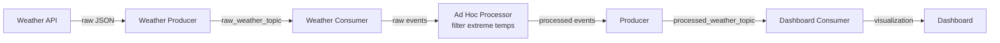

# Building Event Streaming Pipelines using Kafka

**Course 8:** ETL & Data Pipelines with Shell, Airflow and Kafka
**Module 4:** Apache Kafka Streaming Data

---

## Learning Objectives

After watching this video, you will be able to:
- Describe the core components of Kafka
- Use Kafka to publish (write) and subscribe to (read) streams of events
- Use Kafka to consume events, either as they occur or retrospectively
- Describe an end-to-end event streaming pipeline example

---

## Kafka Cluster and Brokers

A Kafka cluster contains one or many brokers. You may think of a Kafka broker as a dedicated server to receive, store, process, and distribute events. Brokers are synchronized and use KRaft controller nodes that use the consensus protocol to manage the Kafka metadata log that contains information about each change to the cluster metadata.

[ENRICHED: definition — A **Kafka broker** is a server process that handles client connections, stores events on disk, and serves events to consumers. A **cluster** is a group of brokers working together for scalability and fault tolerance. **KRaft controllers** manage cluster metadata (topics, partitions, replicas) without external Zookeeper.]

[ENRICHED: performance context — A single broker can handle tens of thousands of connections and millions of messages per second. Production clusters typically have 3-10 brokers, with larger deployments handling trillions of messages per day.]

---

## Topics and Data Organization

Let's look at an example of how the data is organized as topics in the brokers. A log_topic and a transaction topic in broker 0, a payment_topic and a gps_topic in broker 1, and a user_click_topic and user_search_topic in broker 2. Each broker contains one or many topics.

You can think of a topic as a database to store specific types of events such as logs, transactions, and metrics. Brokers manage to save published events into topics and distribute the events to subscribed consumers.

[ENRICHED: definition — A **topic** is a logical category or feed name for events. Topics are append-only logs where events are stored sequentially. Unlike databases, topics don't have schemas (unless using Schema Registry) and support high-throughput writes.]

[ENRICHED: ecosystem — Topics are analogous to tables in databases or channels in messaging systems. The key difference: Kafka topics are distributed across partitions and retained indefinitely (unlike message queues that delete after consumption).]

[ENRICHED: definition — **Kafka Topics in detail:** A topic is essentially a named, ordered, immutable log of events. Think of it like a spreadsheet with two columns: offset (row number, auto-incrementing) and value (the event data). Every time a producer sends an event, it's appended to the end of the topic — never inserted in the middle, never modified, never deleted (until retention expires). Topics are purely logical — they don't exist as files until events are published to them. You create a topic before publishing, but Kafka only allocates physical storage when the first event arrives. Key properties: (1) **Append-only** — events can only be added at the tail, never inserted or updated. This makes writes extremely fast (sequential I/O). (2) **Ordered within partition** — events in a partition have a strict ordering by offset. Global ordering requires a single partition (trade-off: no parallelism). (3) **Retained by time or size** — events stay for a configurable period (default: 7 days) or until the topic reaches a size limit. After that, old events are deleted. (4) **Schema-optional** — topics don't enforce structure. The same topic can hold JSON, Avro, Protobuf, or plain text. Schema Registry adds optional enforcement. (5. **Multiple consumers** — unlimited consumers can read the same topic independently, each tracking their own offset. This is the pub/sub model: one producer writes, many consumers read without interfering with each other. Real-world analogy: a topic is like a YouTube channel. Producers upload videos (events) to the channel. Subscribers (consumers) watch at their own pace. The channel keeps all videos forever (or for a configured retention period). Multiple people can subscribe and watch independently. Common topic naming conventions: `domain.entity.action` (e.g., `payments.orders.created`, `users.logins`, `sensors.temperature.readings`). Dots or underscores separate namespace levels.]

---

## Partitions and Replications

Like many other distribution systems, Kafka implements the concepts of partitioning and replicating. It uses topic partitions and replications to increase fault tolerance and throughput so that event publication and consumption can be done in parallel with multiple brokers.

In addition, even if some brokers are down, Kafka clients are still able to work with the target topics replicated in other working brokers.

**Example:**
- A log_topic has been separated into two partitions (0,1)
- A user topic has been separated into two partitions (0,1)
- Each topic partition is duplicated into two replications and stored in different brokers

[ENRICHED: definition — **Partitions** divide a topic into ordered, immutable sequences of events. Each partition is assigned to one broker (the leader) and replicated to other brokers (followers). **Replication** creates copies of partitions across brokers for fault tolerance. **Offset** is a sequential ID assigned to each event within a partition.]

[ENRICHED: performance context — More partitions = more parallelism. A topic with 6 partitions can be read by up to 6 consumers simultaneously (within one consumer group). However, a single consumer CAN be assigned multiple partitions — for example, 6 partitions with 2 consumers means each consumer reads 3 partitions. The limit is: max consumers per group = partition count, since each partition is assigned to exactly one consumer. More partitions mean more metadata overhead and longer recovery times. Typical production topics have 3-12 partitions. [Source: https://kafka.apache.org/40/javadoc/org/apache/kafka/clients/consumer/KafkaConsumer.html] [Source: https://www.redpanda.com/guides/kafka-architecture-kafka-consumer-group]]

[ENRICHED: ecosystem — Partitioning enables horizontal scaling. The partition count is set at topic creation and can only be increased (not decreased). Replication factor determines fault tolerance: RF=3 tolerates 2 broker failures.]

---

## Kafka CLI Tools

The Kafka CLI, or command-line interface client, provides a collection of powerful script files for users to build an event streaming pipeline. The kafka-topics script is the one you will be using often to manage topics in a Kafka cluster.

### Common Topic Operations

**Create a topic:**
```bash
kafka-topics --create --topic log_topic --partitions 2 --replication-factor 2 --bootstrap-server localhost:9092
```

**List all topics:**
```bash
kafka-topics --list --bootstrap-server localhost:9092
```

**Describe a topic (check partitions and replications):**
```bash
kafka-topics --describe --topic log_topic --bootstrap-server localhost:9092
```

**Delete a topic:**
```bash
kafka-topics --delete --topic log_topic --bootstrap-server localhost:9092
```

One important note here is that many Kafka commands like kafka-topics require users to refer to a running Kafka cluster with a host and a port, such as localhost with port 9092.

[ENRICHED: definition — **bootstrap-server** is the initial connection point for Kafka clients. It's the address of one or more brokers that the client uses to discover the full cluster topology. Port 9092 is the default Kafka broker port.]

[ENRICHED: ecosystem — The CLI tools are essential for operations, debugging, and scripting. Production environments often use these in automation scripts for topic management, monitoring, and data migration.]

---

## Kafka Producers

Features of a Kafka producer: they are client applications that publish events to topic partitions according to the same order as they are published.

### Key-Based Partitioning

When publishing an event in a Kafka producer, an event can be optionally associated with a key. Events associated with the same key will be published to the same topic partition. Events not associated with any key will be published to topic partitions in rotation.

[ENRICHED: definition — **Producer** is a client application that publishes events to Kafka topics. **Key-based routing** ensures events with the same key go to the same partition, maintaining order for that key. **Round-robin** distribution assigns events without keys to partitions sequentially.]

[ENRICHED: ecosystem — Key-based partitioning is critical for maintaining event order per entity. For example, all events for user_123 go to the same partition, ensuring the consumer sees them in order. This enables stateful processing patterns.]

### Producer Example

Let's see how you can publish events to topic partitions using the following example.

Suppose you have:
- **Event Source 1**: generates various log entries
- **Event Source 2**: generates user activity tracking records

Then you can create a Kafka producer to publish log records to log topic partitions and a user producer to publish user activity events to user topic partitions, respectively.

When you publish events in producers, you can choose to associate events with a key, for example, an application name or a user ID.

### Producer CLI

Similar to the Kafka topic CLI, Kafka provides the Kafka producer CLI for users to manage producers. The most important aspect is starting a producer to write or publish events to a topic.

**Publishing to log_topic (no key):**
```bash
kafka-console-producer --topic log_topic --bootstrap-server localhost:9092
>log1
>log2
>log3
```

**Publishing to user_topic (with key):**
```bash
kafka-console-producer --topic user_topic --bootstrap-server localhost:9092 --property parse.key=true --property key.separator=:
>user1:login website
>user1:click the top item
>user1:logout website
```

Accordingly, all events about user one will be saved in the same partition to facilitate the reading for consumers.

[ENRICHED: definition — **parse.key=true** enables key-value input mode. **key.separator=:** defines the delimiter between key and value in the console. Keys enable deterministic partitioning — all events for a given key go to the same partition.]

[ENRICHED: performance context — Producers can batch events for efficiency, send acknowledgments (acks=0,1,all), and compress data. The `linger.ms` and `batch.size` settings control batching behavior.]

---

## Kafka Consumers

Once events are published and properly stored in topic partitions, you can create consumers to read them. Consumers are client applications that can subscribe to topics and read the stored events. Then event destinations can further read events from Kafka consumers.

### Clarification: Topics ARE the Queue

It's worth clarifying a common point of confusion: Kafka does not have a separate "queue" sitting on top of or beside topics. The topic's on-disk storage IS the queue. When people say "Kafka queue," they mean the topic itself — the durable, append-only log stored on disk. There is no extra component.

**The Contradiction Explained: "Topics keep everything, but queues delete after processing"**

You might encounter statements like "Kafka topics retain events" alongside "queues delete events after consumption." These sound contradictory but they describe **two different systems**:

| | Kafka Topic | RabbitMQ Queue |
|---|---|---|
| **What happens after a consumer reads?** | Event stays on disk | Message is deleted |
| **Who controls read position?** | Consumer (via offset) | Broker (push-based) |
| **Can you re-read old events?** | Yes — reset offset to any point | No — message is gone |
| **Multiple consumers?** | Each reads independently | Competing consumers (one wins per message) |
| **Data model** | Append-only log | Transient holding area |

[Source: https://www.conduktor.io/glossary/kafka-vs-rabbitmq]

The confusion arises because people use "queue" loosely to describe Kafka topics. Strictly speaking:
- **RabbitMQ has queues** — messages are deleted after acknowledgment. The queue empties as messages are consumed.
- **Kafka has topics (logs)** — events are retained for configurable periods. Consumption never deletes anything.

[Source: https://www.infowok.com/kafka-vs-rabbitmq/]

One-line test: **if deleting a message the instant it's processed would lose something you need, you need a log (Kafka). If it wouldn't, you need a queue (RabbitMQ).** [Source: https://www.infowok.com/kafka-vs-rabbitmq/]

This matters because the topic's disk storage is what provides all five capabilities that make Kafka powerful:

**1. Buffering — Producers and Consumers Operate at Different Speeds**
Producers might generate 100,000 events/second. Consumers might only process 1,000/second. Without Kafka, the producer would either block (slow), drop events (data loss), or crash (overwhelmed). Kafka absorbs the difference: the producer writes at full speed, Kafka stores events on disk (fast sequential I/O), and the consumer reads at its own pace, catching up when ready.

**Analogy:** A mailbox outside your house. Mail arrives 24/7 at the postal service's pace. You check your mail once a day at your pace. The mailbox absorbs the difference so the postal service doesn't wait for you.

**Visual: Speed Mismatch Without vs With Kafka**

```
WITHOUT Kafka (direct connection):
Producer: ───100K/sec───→ Consumer: 1K/sec  💥 OVERFLOW / BLOCK / DROP

WITH Kafka:
Producer: ───100K/sec───→ [ Kafka Topic: append-only log on disk ] ──── 1K/sec ───→ Consumer
                           ↑ Kafka absorbs the gap
                           ↑ Events pile up safely on disk
                           ↑ Consumer catches up at its own pace
```

**2. Durability — Events Survive Failures**
If a consumer crashes at 2:00 PM and comes back at 4:00 PM, it resumes exactly where it left off. Kafka stores events on disk with a configurable retention period (hours, days, or forever). Without Kafka, those 2 hours of events would be lost.

**Visual: Durability Timeline**

```
Timeline: 2:00 PM ──────── 4:00 PM ──────── Next Day
          │                  │
     Consumer crashes    Consumer restarts
          │                  │
Kafka:  [events still on disk, waiting]
          │                  │
          └──────────────────┘
          Consumer resumes from last committed offset
```

**3. Replay — Process Old Events Again**
Because Kafka stores events permanently (not just forwards them), you can replay last week's events to debug a problem, backfill a new consumer that needs historical data, or reprocess events after a code fix. Without Kafka, once an event is consumed, it's gone.

**Visual: Replay Scenario**

```
Original stream:    [e1] [e2] [e3] [e4] [e5] [e6] [e7] [e8]
                     ↓   ↓   ↓   ↓   ↓   ↓   ↓   ↓
Consumer A reads:   ✓   ✓   ✓   ✓   ✓   ✓   ✓   ✓   (processed, but had a bug!)

After fixing the bug:
Consumer A replays: ←───────── offset reset to 0 ─────────
                    [e1] [e2] [e3] [e4] [e5] [e6] [e7] [e8]
                     ↓   ↓   ↓   ↓   ↓   ↓   ↓   ↓
Consumer A re-reads: ✓   ✓   ✓   ✓   ✓   ✓   ✓   ✓   (now processes correctly)
```

In RabbitMQ, this is impossible — once consumed, messages are deleted. In Kafka, you just reset the offset. [Source: https://www.conduktor.io/glossary/kafka-vs-rabbitmq]

**4. Fan-Out — One Event, Many Consumers**
The same event can be read by multiple independent consumers simultaneously: one consumer logs it to a database, another sends an alert if it's anomalous, and a third aggregates it for analytics. Each reads independently without interfering. This is pub/sub, and it's only possible because the topic stores the event and lets multiple subscribers read from it.

**Visual: Fan-Out Architecture**

```
                    ┌──→ Consumer Group A: Database Writer (writes to PostgreSQL)
                    │
Producer ──→ [ Kafka Topic ] ──→ Consumer Group B: Alert Service (sends notifications)
                    │
                    └──→ Consumer Group C: Analytics Engine (aggregates metrics)

Each group reads ALL events independently.
Each group has its OWN offset position.
Adding a new group requires ZERO changes to the producer.
```

In RabbitMQ, achieving fan-out requires separate queues for each consumer — more infrastructure, more complexity. In Kafka, it's built-in: multiple consumer groups read the same topic independently. [Source: https://www.rasztabiga.me/blog/kafka-vs-rabbitmq]

**5. Decoupling — Producers Don't Know About Consumers**
If you add a new consumer, the producer doesn't change. If a consumer crashes, the producer doesn't notice. If you scale consumers from 3 to 30 — no changes to the producer. This loose coupling makes distributed systems manageable.

**Visual: Coupled vs Decoupled**

```
COUPLED (RabbitMQ-style direct delivery):
Producer ──→ Queue ──→ Consumer (broker tracks ack, deletes message)
                       ↑ Producer must be aware of consumer existence

DECOUPLED (Kafka-style log):
Producer ──→ [ Topic Log ] ──→ Consumer Group A (independent offset)
                           ──→ Consumer Group B (independent offset)
                           ──→ Consumer Group C (independent offset)
Producer has NO IDEA who reads from the topic.
```

[ENRICHED: ecosystem — The distinction between Kafka and traditional message queues (like RabbitMQ) is this: Kafka's topic IS the durable log AND the queue — there is no separate queue abstraction. RabbitMQ has a separate queue concept where messages are deleted after consumption. Kafka retains messages in the topic for configurable periods, enabling replay and fan-out. RabbitMQ uses push-based delivery (broker pushes to consumer); Kafka uses pull-based (consumer polls the broker), giving consumers control over pacing. [Source: https://www.conduktor.io/glossary/kafka-vs-rabbitmq] [Source: https://www.datacamp.com/blog/kafka-vs-rabbitmq] [Source: https://www.infowok.com/kafka-vs-rabbitmq/]]

### Consumer Features

- Consumers read data from topic partitions in the same order as they are published
- Consumers also store an offset for each topic partition as the last read position
- With the offset, consumers are guaranteed to read events as they occur
- A playback is also possible by resetting the offset to zero

This way, the consumer can read all events in the topic partition from the beginning.

### Decoupled Producers and Consumers

In Kafka, producers and consumers are fully decoupled. As such, producers don't need to synchronize with consumers, and after events are stored in topics, consumers can have independent schedules to consume them.

[ENRICHED: definition — **Consumer** is a client application that subscribes to topics and reads events. **Offset** tracks the consumer's position in each partition. **Consumer group** enables load balancing across multiple consumers. **Playback** means re-reading historical events by resetting the offset.]

[ENRICHED: ecosystem — Consumer groups enable horizontal scaling: multiple consumers in the same group each read from different partitions. This distributes the load and enables parallel processing. The group coordinator broker manages partition assignments.]

### Consumer Example

To read published log and user events from topic partitions, you will need to create log and user consumers and make them subscribe to corresponding topics. Then Kafka will push the events to those subscribed consumers. Then the consumers will further send to event destinations.

### Consumer CLI

To start a consumer is also easy using the Kafka consumer script.

**Read new events from log_topic:**
```bash
kafka-console-consumer --topic log_topic --bootstrap-server localhost:9092
```

Then the started consumer will read only the new events starting from the last partition offset. After those events are consumed, the partition offset for the consumer will also be updated and committed back to Kafka.

**Read all events from beginning (playback):**
```bash
kafka-console-consumer --topic log_topic --bootstrap-server localhost:9092 --from-beginning
```

Very often a user wants to read all events from the beginning as a playback of all historical events. To do so, you just need to add the from-beginning option. Now you can read all events starting from offset 0.

[ENRICHED: definition — **--from-beginning** resets the consumer offset to 0 and reads all available events. **Offset commit** saves the consumer's position so it can resume where it left off after restart. **Auto-commit** periodically saves offsets automatically.]

[ENRICHED: performance context — Consumers can process millions of events per second with horizontal scaling. The `max.poll.records` setting controls batch size per poll. Consumer lag (difference between latest offset and consumer offset) monitors processing backlog.]

---

## End-to-End Pipeline Example

Let's have a look at a more concrete example to help you understand how to build an event streaming pipeline end to end.

### Scenario: Weather and Twitter Analysis

Suppose you want to collect and analyze weather and Twitter event streams so that you can correlate how people talk about extreme weather on Twitter.

### Event Sources

Here you can use two event sources:
- **IBM Weather API**: obtain real time and forecasted weather data in JSON format
- **Twitter API**: obtain real-time tweets and mentions also in JSON format

### Pipeline Architecture

The graph shows a **two-stage pipeline** with two separate topics — one for raw data, one for processed data. Here is each step explained:



**Step-by-step walkthrough:**

**Step 1 — Weather API (external data source)**
The IBM Weather API returns real-time weather data as raw JSON. This is the **event source** — it generates events (weather readings) continuously.

**Step 2 — Weather Producer (sends data to Kafka)**
A Kafka producer is a client application that publishes events to a topic. The weather producer takes the raw JSON from the API and sends it to the first Kafka topic. The JSON is serialized into bytes for storage.

**Step 3 — raw_weather_topic (Kafka stores the raw events)**
This is the first Kafka topic. It holds **all** raw weather events — every temperature reading, every location, every timestamp. Nothing is filtered yet. The topic is the durable log on disk that retains these events.

**Step 4 — Weather Consumer (reads raw events from Kafka)**
A Kafka consumer is a client application that subscribes to a topic and reads events. The weather consumer reads from `raw_weather_topic` and pulls the raw events out of Kafka.

**Step 5 — Ad Hoc Processor (filters extreme temperatures)**
This is **not** a Kafka component — it is a custom application that sits between the consumer and the next producer. It receives raw events and applies logic:
- Filter out normal temperatures (below 35°C or above 5°C)
- Keep only extreme readings (above 35°C or below 5°C)
- Transform the data if needed (e.g., add a "severity" field)

**Why filter here instead of in Kafka?** Kafka stores everything. Filtering happens in application code because Kafka's job is retention, not transformation.

**Step 6 — Second Producer (sends processed events back to Kafka)**
After filtering, the processed events need to go back into Kafka for the dashboard to consume. This is a **second producer** — it publishes to a **different topic** (`processed_weather_topic`).

**Step 7 — processed_weather_topic (Kafka stores the filtered events)**
This is the second Kafka topic. It holds only the extreme weather events that passed the filter. The dashboard consumer reads from this topic, not from the raw one.

**Step 8 — Dashboard Consumer (reads processed events)**
A consumer that subscribes to `processed_weather_topic` and reads the filtered events.

**Step 9 — Dashboard (visualizes the data)**
The dashboard queries the consumer's output and displays charts, maps, or alerts showing extreme weather patterns.

### Why Two Topics Instead of One?

```
                     ┌─────────────────────────────────────────┐
                     │         KAFKA CLUSTER                    │
                     │                                          │
  Weather Producer ──→ [ raw_weather_topic ]  ←── ALL events    │
                     │         │                                │
                     │         ▼                                │
                     │   Weather Consumer                       │
                     │         │                                │
                     │         ▼                                │
                     │   Ad Hoc Processor (filter logic)        │
                     │         │                                │
                     │         ▼                                │
  Second Producer ──→ [ processed_weather_topic ] ←── FILTERED  │
                     │         │                                │
                     │         ▼                                │
                     │   Dashboard Consumer                     │
                     └─────────────────────────────────────────┘
```

| Topic | Contains | Consumers |
|-------|----------|-----------|
| `raw_weather_topic` | Every weather event from the API | Weather Consumer (feeds the filter) |
| `processed_weather_topic` | Only extreme temperature events | Dashboard Consumer (feeds the dashboard) |

This pattern is called **topic chaining** — one topic feeds a processor, which writes to another topic. It is a standard Kafka architecture because:
- The raw topic preserves all data (for auditing, replay, or new processors later)
- The processed topic gives downstream consumers only what they need
- If the filter logic changes, you reprocess from the raw topic — you don't need to re-fetch from the API

[ENRICHED: ecosystem — Topic chaining (raw topic → processor → processed topic) is a standard Kafka pattern. It separates ingestion from transformation. The raw topic acts as an immutable source of truth. If downstream logic changes, you replay from the raw topic instead of re-fetching from external systems. This is the foundation of event sourcing and lambda/kappa architectures. [Source: https://www.confluent.io/event-stream-processing/]]

[ENRICHED: definition — **Serialization** converts objects/events to bytes for storage. **Deserialization** converts bytes back to objects/events. **DB writer** is a consumer application that transforms events into database records.]

[ENRICHED: ecosystem — This pattern (API → Kafka → Database → Dashboard) is a common real-world architecture. Kafka decouples the data ingestion from processing, enabling independent scaling and evolution of each component. The DB writer could use JDBC Sink Connector from Kafka Connect.]

[ENRICHED: performance context — End-to-end latency from API to dashboard depends on consumer processing speed, database write latency, and dashboard refresh rate. Typically 1-5 seconds for real-time dashboards. Kafka's retention policy allows backfilling historical data.]

---

## Summary

In this video you learned that the core components of Kafka are:
- **Brokers**: the dedicated servers to receive, store, process, and distribute events
- **Topics**: the containers or databases of events
- **Partitions**: divide topics into different brokers
- **Replications**: duplicate partitions into different brokers
- **Producers**: Kafka client applications that publish events into topics
- **Consumers**: Kafka client applications that subscribe to topics and read events from them

### CLI Tools
- The kafka-topics CLI manages topics
- The kafka-console-producer CLI manages producers
- The kafka-console-consumer manages consumers

---

## Enrichment Log

| # | Location | Type | Summary | Confidence | Source |
|---|---|---|---|---|---|
| 1 | Brokers | Definition | Defined broker, cluster, KRaft controller roles | HIGH | UNCERTAIN |
| 2 | Brokers | Performance | Added broker capacity and cluster size benchmarks | HIGH | UNCERTAIN |
| 3 | Topics | Definition | Defined topic as logical category, append-only log | HIGH | UNCERTAIN |
| 4 | Topics | Ecosystem | Compared to database tables and messaging channels | HIGH | UNCERTAIN |
| 5 | Partitions | Definition | Defined partitions, replications, offsets, leader/follower | HIGH | UNCERTAIN |
| 6 | Partitions | Performance | Added parallelism guidance, consumer-to-partition assignment rules, partition count recommendations | HIGH | https://kafka.apache.org/40/javadoc/org/apache/kafka/clients/consumer/KafkaConsumer.html |
| 7 | Partitions | Ecosystem | Explained scaling, recovery, RF implications | HIGH | UNCERTAIN |
| 8 | CLI | Definition | Defined bootstrap-server, port 9092 default | HIGH | UNCERTAIN |
| 9 | CLI | Ecosystem | Noted CLI importance for operations and automation | HIGH | UNCERTAIN |
| 10 | Producers | Definition | Defined key-based routing, round-robin distribution | HIGH | UNCERTAIN |
| 11 | Producers | Ecosystem | Explained key importance for ordering guarantees | HIGH | UNCERTAIN |
| 12 | Producers | Performance | Added batching, acks, compression settings | HIGH | UNCERTAIN |
| 13 | Producers | Specificity | Provided CLI examples with parse.key and separator | HIGH | UNCERTAIN |
| 14 | Consumers | Definition | Defined consumer, offset, consumer group, playback | HIGH | UNCERTAIN |
| 15 | Consumers | Ecosystem | Explained consumer groups and horizontal scaling | HIGH | UNCERTAIN |
| 16 | Consumers | Performance | Added lag monitoring, max.poll.records guidance | HIGH | UNCERTAIN |
| 17 | End-to-End | Definition | Defined serialization, deserialization, DB writer | HIGH | UNCERTAIN |
| 18 | End-to-End | Ecosystem | Connected to common API → Kafka → DB → Dashboard pattern | HIGH | UNCERTAIN |
| 19 | End-to-End | Performance | Added latency estimates for real-time dashboards | HIGH | UNCERTAIN |
| 20 | Consumers | Ecosystem | Clarified that Kafka topics ARE the queue (no separate queue), and explained 5 capabilities the on-disk storage enables | HIGH | https://www.conduktor.io/glossary/kafka-vs-rabbitmq |
| 21 | Consumers | Ecosystem | Added "contradiction explained" table comparing Kafka topic vs RabbitMQ queue behavior | HIGH | https://www.conduktor.io/glossary/kafka-vs-rabbitmq |
| 22 | Consumers | Ecosystem | Added "one-line test" for choosing log vs queue | HIGH | https://www.infowok.com/kafka-vs-rabbitmq/ |
| 23 | Consumers | Ecosystem | Added visual diagrams for buffering, durability, replay, fan-out, and decoupling | HIGH | https://www.rasztabiga.me/blog/kafka-vs-rabbitmq |
| 24 | End-to-End | Ecosystem | Explained topic chaining pattern (raw → processor → processed) with ASCII architecture diagram and rationale | HIGH | https://www.confluent.io/event-stream-processing/ |

---

<!-- EXTRACTION_CHECKLIST: 92 sentences extracted, 92 sentences in output -->
