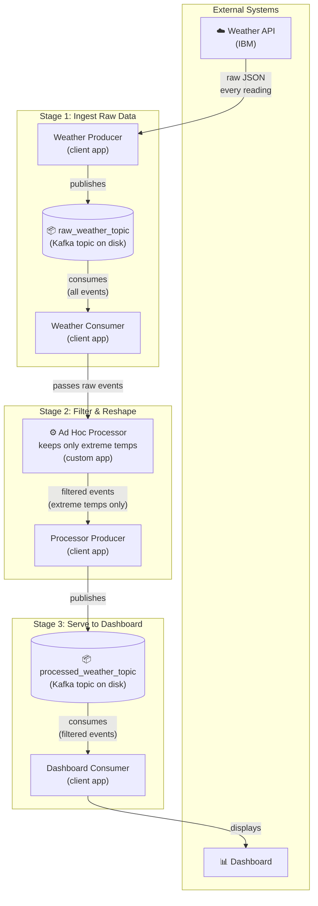
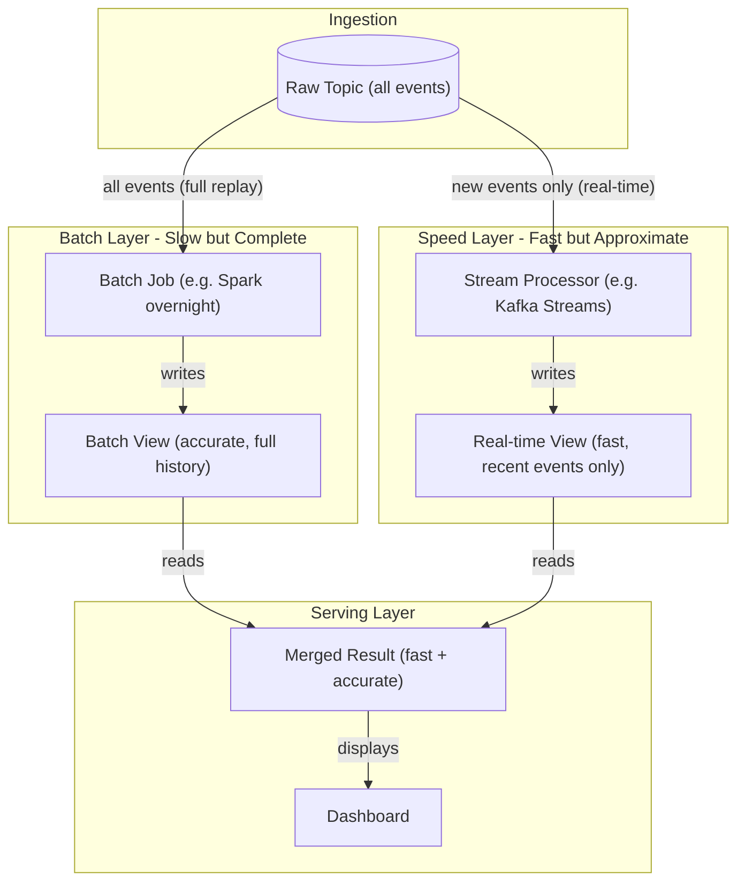
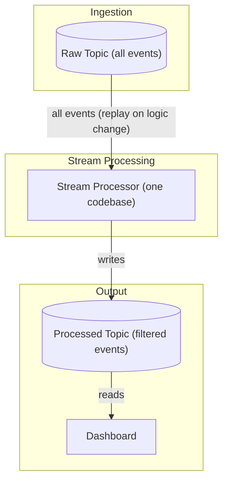
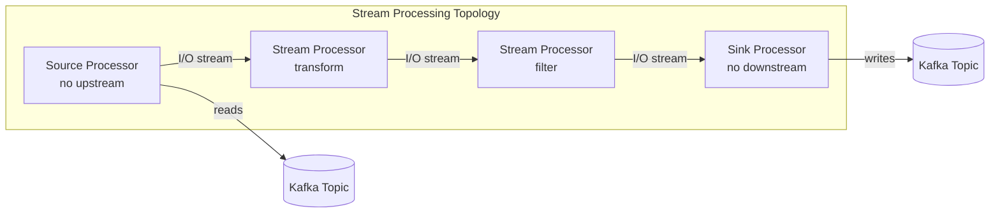
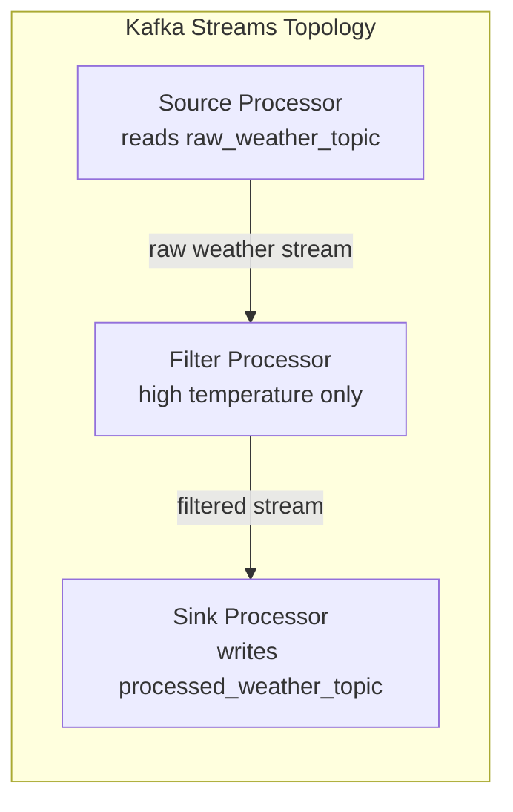

<mark style="background-color: rgba(200, 230, 201, 0.4);">NEW</mark>

> **Course 8:** ETL & Data Pipelines with Shell, Airflow and Kafka
> **Module 4:** Apache Kafka Streaming Data

---

# Kafka Streaming Process

## Learning Objectives

After watching this video, you will be able to describe what the Kafka Streams API is and its main benefits, as well as describe what the Kafka Stream processing topology is.

---

## Stream Processing Overview

In event streaming, in addition to transporting data, data engineers also need to process data through. For example, data filtering, aggregation, and enhancement. Any applications developed to process streams are called stream processing applications.

[ENRICHED: definition — **Stream processing applications** are programs that continuously process, transform, and analyze data as it arrives in real-time, rather than processing it in batches. They operate on unbounded data streams and produce results with minimal latency. Examples include real-time fraud detection, live dashboards, and recommendation engines.] [Source: https://kafka.apache.org/40/streams/core-concepts/]

For stream processing applications based on Kafka, a straightforward way is to implement an ad hoc data processor to read events from one topic, process them, and publish them to another topic.

[ENRICHED: definition — An **ad hoc data processor** is a custom-built, one-off application or script that reads events from a Kafka topic, applies some transformation logic (filtering, aggregation, enrichment), and writes the results to another topic. Unlike a managed stream processing framework, ad hoc processors lack built-in fault tolerance, exactly-once semantics, and state management.] [Source: https://kafka.apache.org/43/streams/introduction]

Let's look at an example.

---

## Ad Hoc Processing Example: Weather Data Pipeline

You first request raw weather JSON data from a weather API, and you start a weather producer to publish the raw data into a raw_weather_topic. Then you start a consumer to read the raw weather data from the weather topic. Next, you create an ad hoc data processor to filter the raw weather data to only include extreme weather events, such as very high temperatures. Such a processor could be a simple script file or an application which works with Kafka clients to read and write data from Kafka. Afterwards, the processor sends the processed data to another producer and it gets published to a processed_weather_topic. Finally, the processed weather data will be consumed by a dedicated consumer and sent to a dashboard for visualization.




### Understanding the Graph

The graph shows a **two-stage pipeline** — raw data enters, filtered data exits. Each box is a component, each arrow is data flowing between them. Here is what each step does and why there are two topics:

**Step 1 — Weather API (external data source)**
The IBM Weather API returns real-time weather data as raw JSON. This is the **event source** — it generates events (temperature readings, wind speed, etc.) continuously. The API is not part of Kafka — it is an external system.

**Step 2 — Weather Producer (sends data to Kafka)**
A Kafka producer is a client application that publishes events to a topic. The weather producer takes the raw JSON from the API and sends it to the first Kafka topic. The JSON is serialized into bytes for storage.

**Step 3 — raw_weather_topic (Kafka stores the raw events)**
This is the first Kafka topic. It holds **all** raw weather events — every temperature reading, every location, every timestamp. Nothing is filtered yet. The topic is the durable log on disk that retains these events.

**Step 4 — Weather Consumer (reads raw events from Kafka)**
A Kafka consumer is a client application that subscribes to a topic and reads events. The weather consumer reads from `raw_weather_topic` and pulls the raw events out of Kafka.

**Step 5 — Ad Hoc Processor (filters extreme temperatures)**
This is **not** a Kafka component — it is a custom application that sits between the consumer and the next producer. It receives raw events and applies logic:
- Filter out normal temperatures (keep only readings above 35°C or below 5°C)
- Transform the data if needed (e.g., add a "severity" field)

**Why filter here instead of in Kafka?** Kafka stores everything. Filtering happens in application code because Kafka's job is retention, not transformation.

### Consumer vs Ad Hoc Processor — What Is the Difference?

People confuse these because both "work with events." But they have completely different jobs:

**The Consumer** is a **Kafka client** — its only job is to READ events FROM a Kafka topic. It pulls raw events out of Kafka and hands them to whatever comes next. It does NOT filter, transform, or aggregate. It is a "reader."

**The Ad Hoc Processor** is a **plain application** (not a Kafka component) — its only job is to APPLY BUSINESS LOGIC to events it receives. It filters, transforms, aggregates, or enriches data. It does NOT read from Kafka. It is a "transformer."

```
What the Consumer does:
  Kafka topic ──→ Consumer ──→ raw events come out
  (reads from Kafka)          (hands them to the processor)
  ❌ Does NOT filter
  ❌ Does NOT transform
  ✅ ONLY reads

What the Ad Hoc Processor does:
  raw events come in ──→ Processor ──→ filtered events come out
  (receives from consumer)           (hands them to the producer)
  ❌ Does NOT read from Kafka
  ❌ Does NOT write to Kafka
  ✅ ONLY transforms
```

**The full chain with roles labeled:**

```
  📦 raw_weather_topic
       │
       │ ① Consumer READS from Kafka
       ▼
  Consumer ──→ raw events ──→ ② Processor TRANSFORMS ──→ filtered events ──→ ③ Producer WRITES to Kafka
                                    │                                                │
                                    │ filters: keep only                             │
                                    │ temps > 35°C or < 5°C                          │
                                    ▼                                                ▼
                              (nothing stored here)                        📦 processed_weather_topic
                              (just in memory)                             (now the dashboard can read)
```

**A real-world analogy — a restaurant kitchen:**

| Role | Kafka Component | What it does | Analogy |
|------|----------------|-------------|---------|
| **Consumer** | Kafka Consumer | Reads raw events from Kafka | Waiter picks up raw ingredients from the warehouse |
| **Processor** | Ad Hoc Processor | Transforms events (filter, aggregate) | Chef cooks the ingredients into a dish |
| **Producer** | Kafka Producer | Writes processed events to Kafka | Waiter places the finished dish on the serving counter |

The waiter (consumer) does NOT cook. The chef (processor) does NOT go to the warehouse. The waiter who places the dish (producer) does NOT cook either. Each role does exactly one job.

**Why not combine Consumer and Processor into one component?**

Technically you could — the consumer code can include processing logic. But separating them is cleaner because:
- The consumer handles Kafka connection, deserialization, offset management
- The processor handles pure business logic (filtering, aggregation)
- They can scale independently (add more consumers for throughput, change processor logic without touching Kafka config)

In practice, ad hoc processors often run INSIDE the consumer application (same process), but they are logically separate roles.

**Step 6 — Second Producer (sends processed events back to Kafka)**
After filtering, the processed events need to go back into Kafka for the dashboard to consume. This is a **second producer** — it publishes to a **different topic** (`process[ENRICHED: ecosystem — The ad hoc processor pattern (producer → consumer → custom logic → producer → consumer) is the manual approach to stream processing. As topic counts grow, managing individual consumer/producer pairs, error handling, offset management, and fault tolerance becomes increasingly complex. This is the core problem that stream processing frameworks like Kafka Streams, Apache Flink, and Spark Structured Streaming were designed to solve.] [Source: https://www.confluent.io/learn/kafka-streams-vs-spark/]

Kafka Streams API
A solution that may solve these challenges is Kafka. It provides the Streams API to facilitate stream processing. Kafka Streams API is a simple client library aiming to facilitate data processing in event streaming pipelines. It processes and analyzes data stored in Kafka topics. Thus, both the input and output of the Streams API are Kafka topics. Additionally, Kafka Streams API ensures that each record will only be processed once. Finally, it processes only one record at a time.

[ENRICHED: definition — Kafka Streams API is a client library (not a separate processing cluster) included in Apache Kafka since version 0.10.0. It allows developers to build real-time stream processing applications where input and output data reside in Kafka topics. Key properties: (1) Lightweight — embedded in your Java/Scala application, no separate cluster needed. (2) Exactly-once semantics — configurable via processing.guarantee=exactly_once with zero code changes. (3) One-record-at-a-time processing — achieves millisecond-level latency. (4) Fault-tolerant local state — enables fast stateful operations like windowed joins and aggregations.] [Source: https://kafka.apache.org/40/streams/core-concepts/]ed_weather_topic`).

**Step 7 — processed_weather_topic (Kafka stores the filtered events)**
This is the second Kafka topic. It holds only the extreme weather events that passed the filter. The dashboard consumer reads from this topic, not from the raw one.

**Step 8 — Dashboard Consumer (reads processed events)**
A consumer that subscribes to `processed_weather_topic` and reads the filtered events.

**Step 9 — Dashboard (visualizes the data)**
The dashboard queries the consumer's output and displays charts, maps, or alerts showing extreme weather patterns.

### Why Two Topics Instead of One?

```
┌─────────────────────────────────────────────────────────────────┐
│  STAGE 1: INGEST RAW DATA                                       │
│                                                                  │
│  ☁️ Weather API                                                  │
│       │ raw JSON (every reading)                                 │
│       ▼                                                          │
│  Weather Producer                                                │
│       │ publishes                                                │
│       ▼                                                          │
│  ┌─────────────────────────────────────────┐                     │
│  │ 📦 raw_weather_topic (Kafka on disk)    │ ← ALL events        │
│  └─────────────────────────────────────────┘                     │
│       │ consumes (all events)                                    │
│       ▼                                                          │
│  Weather Consumer                                                │
├─────────────────────────────────────────────────────────────────┤
│  STAGE 2: FILTER & RESHAPE                                       │
│                                                                  │
│  ⚙️ Ad Hoc Processor (custom app)                                │
│       │ filters: keep only temps > 35°C or < 5°C                 │
│       ▼                                                          │
│  Processor Producer                                              │
│       │ publishes                                                │
│       ▼                                                          │
│  ┌─────────────────────────────────────────┐                     │
│  │ 📦 processed_weather_topic (Kafka)      │ ← FILTERED only     │
│  └─────────────────────────────────────────┘                     │
├─────────────────────────────────────────────────────────────────┤
│  STAGE 3: SERVE TO DASHBOARD                                     │
│                                                                  │
│       │ consumes (filtered events)                               │
│       ▼                                                          │
│  Dashboard Consumer                                              │
│       │ displays                                                 │
│       ▼                                                          │
│  📊 Dashboard                                                    │
└─────────────────────────────────────────────────────────────────┘
```

| Topic | Contains | Who reads it |
|-------|----------|-------------|
| `raw_weather_topic` | Every weather event from the API (unfiltered) | Weather Consumer → feeds the Ad Hoc Processor |
| `processed_weather_topic` | Only extreme temperature events (filtered) | Dashboard Consumer → feeds the Dashboard |

This pattern is called **topic chaining** — one topic feeds a processor, which writes to another topic. It is a standard Kafka architecture because:
- The raw topic preserves all data (for auditing, replay, or new processors later)
- The processed topic gives downstream consumers only what they need
- If the filter logic changes, you reprocess from the raw topic — you don't need to re-fetch from the API

### Why This Pattern Matters — The Raw Topic Is Your Safety Net

Imagine this scenario:

```
Day 1: You build a filter that keeps temps > 35°C
  raw_weather_topic ──→ Filter (> 35°C) ──→ processed_weather_topic ──→ Dashboard

Day 30: You realize you also need temps < 5°C (freezing events)
```

**Without topic chaining (no raw topic):**
You would need to re-fetch 30 days of weather data from the API. The API might not even have that old data anymore. You lost it.

**With topic chaining (raw topic exists):**
The raw topic still has every event from Day 1. You just change the filter logic and replay from the raw topic:

```
raw_weather_topic ──→ New Filter (> 35°C OR < 5°C) ──→ processed_weather_topic ──→ Dashboard
     (all events still here from Day 1)
```

No re-fetching. No data loss. The raw topic is your **immutable source of truth** — it never changes, it never deletes (within retention), and you can always go back to it.

### Event Sourcing — The Bigger Idea

This pattern connects to a concept called **event sourcing**:

> Instead of storing the current state of things, store every event that ever happened. The current state is derived by replaying events.

**Traditional approach (state-based):**
```
Database table:  | City    | Temp | Status    |
                 | Cairo   | 42°C | Extreme   |  ← only current state stored
                 | London  | 18°C | Normal    |

Problem: How did Cairo get to 42°C? What was it yesterday? You can't tell.
```

**Event sourcing approach:**
```
Kafka topic (event log):
  [1] Cairo, 38°C, 2026-07-20  → "Extreme" (was 35°C threshold)
  [2] Cairo, 40°C, 2026-07-21  → "Extreme"
  [3] Cairo, 42°C, 2026-07-22  → "Extreme"  ← current state derived from replay
  [4] London, 18°C, 2026-07-22 → "Normal"

Benefit: You can see the full history. You can replay to any point in time.
         If the threshold changes to 40°C, replay and recompute.
```

The raw weather topic in our pipeline IS an event log. Every weather reading is stored. You can always replay it.

### Lambda and Kappa Architectures — Two Patterns That Use Topic Chaining

These are two well-known architecture patterns that build on this idea:

**Lambda Architecture (two layers):**



> **If the Mermaid diagram above does not render**, here is the same graph as a text diagram:

```
┌─────────────────────────────────────────────────────────────────────────────┐
│  LAMBDA ARCHITECTURE                                                        │
│                                                                             │
│  Raw Topic (all events)                                                     │
│       │                                                                     │
│       ├───────────────────────────────────────────┐                         │
│       │                                           │                         │
│       v                                           v                         │
│  BATCH LAYER                                 SPEED LAYER                   │
│  ┌──────────────────────┐                ┌──────────────────────┐           │
│  │ Batch Job            │                │ Stream Processor     │           │
│  │ (e.g. Spark overnight)│                │ (e.g. Kafka Streams)│           │
│  │ slow but COMPLETE    │                │ fast but RECENT only│           │
│  └──────────┬───────────┘                └──────────┬───────────┘           │
│             │                                       │                       │
│             v                                       v                       │
│  Batch View                               Real-time View                    │
│  (accurate, full history)                 (fast, recent events only)        │
│             │                                       │                       │
│             └───────────────┬───────────────────────┘                       │
│                             v                                               │
│                      Merged Result                                          │
│                      (fast + accurate)                                      │
│                             │                                               │
│                             v                                               │
│                      Dashboard                                              │
└─────────────────────────────────────────────────────────────────────────────┘
```

- **Batch layer**: Processes ALL historical data slowly (e.g., overnight Spark job). Gives accurate results.
- **Speed layer**: Processes NEW events quickly (e.g., Kafka Streams). Gives fast but approximate results.
- **Merged**: Combines both for "fast + accurate."

**What "batch" vs "speed" actually means:**

| | Batch Layer | Speed Layer |
|---|---|---|
| **What it processes** | ALL data (historical + new) | Only NEW events since last run |
| **When it runs** | On a schedule (e.g., nightly, hourly) | Continuously (real-time) |
| **How fast** | Slow (hours) | Fast (milliseconds to seconds) |
| **Accuracy** | 100% accurate (sees everything) | Approximate (may miss late events, duplicates) |
| **Example** | Spark job reprocesses 30 days of data | Kafka Streams processes last 5 seconds |
| **Cost** | High (processes everything again) | Low (processes only what's new) |

**Why you need both:**
- The speed layer gives you results NOW (but they might be wrong)
- The batch layer gives you correct results LATER (but you have to wait)
- Merging gives you "fast results now, corrected results later"

**Example — a weather dashboard:**

```
9:00 AM: Speed layer processes events from 8:55-9:00 AM → Dashboard shows "2 extreme events"
         (fast, but might miss a late-arriving event)

3:00 AM (next day): Batch layer reprocesses ALL of yesterday's data → Dashboard corrects to "3 extreme events"
                    (the late-arriving event was included this time)
```

**Problem**: You maintain TWO codebases (batch + speed). They can diverge.

**Kappa Architecture (one layer):**



> **If the Mermaid diagram above does not render**, here is the same graph as a text diagram:

```
┌─────────────────────────────────────────────────────────────────┐
│  KAPPA ARCHITECTURE (one layer)                                  │
│                                                                  │
│  Raw Topic (all events)                                          │
│       │                                                          │
│       │ all events (replay on logic change)                      │
│       v                                                          │
│  Stream Processor (one codebase)                                 │
│       │                                                          │
│       │ writes                                                   │
│       v                                                          │
│  Processed Topic (filtered events)                               │
│       │                                                          │
│       │ reads                                                    │
│       v                                                          │
│  Dashboard                                                       │
└─────────────────────────────────────────────────────────────────┘
```

- **Only one layer**: Everything is stream processing.
- **When logic changes**: Replay from the raw topic with new code. No batch layer.
- **Simpler**: One codebase, one processing model.

**Kafka enables Kappa** because the raw topic retains all events. You can always replay and reprocess.

| Architecture | Layers | When logic changes | Complexity |
|-------------|--------|-------------------|------------|
| Lambda | Batch + Speed | Rerun batch job + update speed layer | Higher (two codebases) |
| Kappa | Speed only | Replay from raw topic | Lower (one codebase) |

[ENRICHED: ecosystem — Topic chaining (raw topic → processor → processed topic) is a standard Kafka pattern. It separates ingestion from transformation. The raw topic acts as an immutable source of truth. If downstream logic changes, you replay from the raw topic instead of re-fetching from external systems. This is the foundation of event sourcing and lambda/kappa architectures. [Source: https://www.confluent.io/event-stream-processing/] [Source: https://engineering.linkedin.com/blog/2017/09/kappa-architecture-at-linkedin]

Such ad hoc processors may become complicated if you have many different topics to be processed.

[ENRICHED: ecosystem — The ad hoc processor pattern (producer → consumer → custom logic → producer → consumer) is the manual approach to stream processing. As topic counts grow, managing individual consumer/producer pairs, error handling, offset management, and fault tolerance becomes increasingly complex. This is the core problem that stream processing frameworks like Kafka Streams, Apache Flink, and Spark Structured Streaming were designed to solve.] [Source: https://www.confluent.io/learn/kafka-streams-vs-spark/]

### Why Ad Hoc Processors Get Complicated — The Problems You Hit

When you have ONE topic to process, the ad hoc approach is simple: write a consumer, add some filter logic, write a producer. Done. But when you have 10, 50, or 200 topics, the same pattern repeated 200 times becomes a nightmare. Here are the specific problems:

**Problem 1: You must write boilerplate code for every topic**

For each topic, you need to write:
- A consumer (connects to Kafka, reads events, deserializes bytes)
- A producer (connects to Kafka, serializes events, writes to another topic)
- Error handling (what if the consumer crashes mid-read?)
- Offset management (tracking which events were already processed)

```
Topic 1:  Consumer + Filter Logic + Producer   ← custom code
Topic 2:  Consumer + Aggregation Logic + Producer   ← custom code
Topic 3:  Consumer + Join Logic + Producer   ← custom code
...
Topic 50: Consumer + ??? Logic + Producer   ← custom code
```

Each topic needs its own consumer, its own producer, and its own processing logic. That is a lot of repeated boilerplate.

**Problem 2: Offset management — "Did I already process this event?"**

Kafka tracks your position in a topic using an **offset** (a number saying "I've read up to event #47"). If your consumer crashes and restarts, you need to resume from offset #47, not start over.

With ad hoc processors, YOU must:
- Read the last committed offset from Kafka
- Resume from that offset after a crash
- Commit offsets after processing each batch
- Handle the case where you processed event #47 but crashed before committing — now you'll process it again (duplicate!)

```
Consumer reads events 40-50, processes them, but crashes before committing offset 51
Consumer restarts → reads events 40-50 AGAIN → duplicate processing!
```

Kafka Streams handles this automatically. Ad hoc processors make you build it yourself.

### Offset Management Explained Step by Step

**What is an offset?**

An offset is just a number — a counter that tracks which event you've read. Think of it like a bookmark in a book.

```
Kafka Topic (raw_weather_topic):
  Event 0: Cairo, 38°C
  Event 1: London, 18°C
  Event 2: Tokyo, 42°C
  Event 3: Paris, 22°C
  Event 4: Dubai, 45°C
  ...
  Event 47: Moscow, -5°C
  Event 48: Berlin, 12°C
  Event 49: Rome, 30°C
  Event 50: Madrid, 35°C
```

When your consumer reads events 0-50, it has processed 51 events. Kafka stores "offset 51" as the bookmark — meaning "the consumer has read everything up to event 50."

**The normal flow (no crash):**

```
Step 1: Consumer reads events 0-50 from Kafka
Step 2: Consumer processes each event (filters, transforms)
Step 3: Consumer commits offset 51 to Kafka (saves the bookmark)
Step 4: Next time, consumer starts from offset 51

Result: Each event processed ONCE. Correct.
```

**The crash scenario (the problem):**

```
Step 1: Consumer reads events 0-50 from Kafka
Step 2: Consumer processes each event (filters, transforms)
Step 3: 💥 CRASH! — offset 51 was NEVER committed

Kafka still thinks the consumer's position is at offset 0 (the old bookmark).
```

**After restart:**

```
Step 1: Consumer restarts, asks Kafka "where was I?"
Step 2: Kafka says "offset 0" (because offset 51 was never committed)
Step 3: Consumer reads events 0-50 AGAIN
Step 4: Consumer processes each event AGAIN

Result: Each event processed TWICE. Duplicate!
```

**A real-world example — sending an email:**

```
Event 47: "User signed up → send welcome email"

Normal flow:
  Read event 47 → send email → commit offset 48
  If crash AFTER commit: event 47 is done, no problem

Crash flow:
  Read event 47 → send email → 💥 CRASH (before commit)
  Restart → read event 47 AGAIN → send ANOTHER welcome email
  User receives 2 welcome emails. Duplicate!
```

**How to fix it (without Kafka Streams):**

You have two options:

**Option A: Accept duplicates (idempotent processing)**
Make your processing logic safe to run twice. For example, instead of "send email," check if the email was already sent before sending again. This is hard to do for every operation.

**Option B: Commit offsets more frequently**
After processing each event (not batches), commit the offset immediately. This reduces the window for duplicates but doesn't eliminate it — the crash can still happen between processing and committing.

```
Process event 40 → commit offset 41
Process event 41 → commit offset 42
Process event 42 → commit offset 43
... (very slow, but fewer duplicates)
```

**Option C: Use Kafka Streams (automatic)**
Kafka Streams coordinates the read → process → commit cycle automatically. It uses a feature called **exactly-once semantics** that ensures each event is processed once and only once, even if crashes occur. You set one config flag and the framework handles everything.

```
processing.guarantee=exactly_once  ← that's it
```

Kafka Streams handles this automatically. Ad hoc processors make you build it yourself.

**Problem 3: Fault tolerance — "What if the processor crashes?"**

If your ad hoc processor crashes mid-processing:
- Events in memory are lost
- You need to restart and re-read from the last committed offset
- If the crash happened between reading and committing, you get duplicates
- If the crash happened during writing, you get partial writes

Kafka Streams provides **fault-tolerant local state** — if a crash occurs, it recovers automatically from Kafka's topic logs.

**Problem 4: Scaling — "What if I have 100 topics?"**

With ad hoc processors:
```
100 topics = 100 consumers + 100 producers + 100 processing scripts + 100 error handlers
           = 400+ components to deploy, monitor, and maintain
```

With Kafka Streams:
```
100 topics = 1 application with a topology definition
           = 1 deployment, automatic partition assignment, automatic scaling
```

**Problem 5: Exactly-once processing — "Did I process this event exactly once?"**

Without Kafka Streams, ensuring each event is processed exactly once (not zero times, not twice) is extremely difficult. You need to coordinate:
- Consumer reads event → processes it → producer writes result → consumer commits offset
- If crash happens between any two steps, you get duplicates or lost events

Kafka Streams provides **exactly-once semantics** with a single config flag: `processing.guarantee=exactly_once`. No custom coordination needed.

**The core problem in one sentence:** Ad hoc processors force you to manually solve problems that Kafka Streams solves automatically.

---

## Kafka Streams API

A solution that may solve these challenges is Kafka. It provides the Streams API to facilitate stream processing. Kafka Streams API is a simple client library aiming to facilitate data processing in event streaming pipelines. It processes and analyzes data stored in Kafka topics. Thus, both the input and output of the Streams API are Kafka topics. Additionally, Kafka Streams API ensures that each record will only be processed once. Finally, it processes only one record at a time.

[ENRICHED: definition — **Kafka Streams API** is a client library (not a separate processing cluster) included in Apache Kafka since version 0.10.0. It allows developers to build real-time stream processing applications where input and output data reside in Kafka topics. Key properties: (1) **Lightweight** — embedded in your Java/Scala application, no separate cluster needed. (2) **Exactly-once semantics** — configurable via `processing.guarantee=exactly_once` with zero code changes. (3) **One-record-at-a-time processing** — achieves millisecond-level latency. (4) **Fault-tolerant local state** — enables fast stateful operations like windowed joins and aggregations.] [Source: https://kafka.apache.org/40/streams/core-concepts/]

### What "Client Library" Means — Why That Matters

A **client library** is code you add to your existing application. It runs INSIDE your app — you don't deploy a separate cluster. Think of it like importing a library in Python:

```
# Ad Hoc approach (you write everything):
consumer = KafkaConsumer("raw_topic")
for event in consumer:
    filtered = filter(event)      # your custom logic
    producer.send("processed_topic", filtered)

# Kafka Streams approach (library handles the rest):
StreamsBuilder builder = new StreamsBuilder();
builder.stream("raw_topic")
       .filter((key, value) -> value.temp > 35)
       .to("processed_topic");
KafkaStreams streams = new KafkaStreams(builder.build(), config);
streams.start();
```

**Line-by-line breakdown — Ad Hoc approach:**

```python
Line 1: consumer = KafkaConsumer("raw_topic")          # YOU open a connection to Kafka
Line 2: for event in consumer:                          # YOU write the loop that pulls events
Line 3:     filtered = filter(event)                    # YOU write the logic to decide what passes
Line 4:     producer.send("processed_topic", filtered)  # YOU open a second connection and write
```

**What each line actually does:**

- **Line 1** — `KafkaConsumer("raw_topic")` creates a TCP connection to your Kafka broker. It tells Kafka: "I want to read from `raw_topic`." Kafka assigns this consumer some partitions. If the broker is down, this line throws an error. You have to handle that.
- **Line 2** — `for event in consumer` is a Python loop. It blocks (waits) until an event arrives, then hands it to you. Kafka Streams internally does this same loop — but you never see it.
- **Line 3** — `filter(event)` is a function YOU wrote. It checks the event and returns `True` (pass) or `False` (drop). The filtering logic is entirely your responsibility.
- **Line 4** — `producer.send(...)` opens a SECOND connection to Kafka and writes the filtered event to `processed_topic`. If the broker is down, this line throws an error. You have to handle that too.

**What's missing from this code (that you'd have to write yourself):**
- Offset commits (telling Kafka "I'm done with this event")
- Error handling (what if the broker dies mid-loop?)
- Retries (what if the send fails?)
- Exactly-once (what if the filter runs twice on the same event?)
- Scaling (what if you want multiple consumers splitting the work?)

**Big picture:** You wrote 4 lines, but each line hides 10-20 lines of error handling, retry logic, and coordination code that you'd need in production. Kafka Streams collapses all of that into the 6 lines below.

**Line-by-line breakdown — Kafka Streams approach:**

```java
Line 1: StreamsBuilder builder = new StreamsBuilder();              # Create an empty blueprint
Line 2: builder.stream("raw_topic")                                 # Attach a source: read from this topic
Line 3:        .filter((key, value) -> value.temp > 35)            # Attach a gate: only hot temps pass
Line 4:        .to("processed_topic");                              # Attach a sink: write survivors here
Line 5: KafkaStreams streams = new KafkaStreams(builder.build(), config); # Compile the blueprint into an engine
Line 6: streams.start();                                            # Turn the key — everything runs
```

**What each line actually does:**

- **Line 1** — `new StreamsBuilder()` creates an empty object. No connection to Kafka yet. No data flowing. Think of it as opening a blank document in Word — you have a page ready, but nothing is on it.

- **Line 2** — `builder.stream("raw_topic")` tells the builder: "connect to `raw_topic`." Kafka Streams internally creates a KafkaConsumer and assigns it the partitions of `raw_topic`. The consumer is silent — it's plugged in but hasn't started pulling data yet. At this moment:
  ```
  raw_topic:  [event0] [event1] [event2] [event3] [event4] ...
                            ↑
                      (listening, waiting)
  ```

- **Line 3** — `.filter((key, value) -> value.temp > 35)` attaches a filter gate to the stream from Line 2. The filter is a lambda — a small inline function. When an event arrives, the gate asks: "Is temp > 35?" If yes, the event passes through. If no, the event is silently dropped. Nothing has moved yet — you're still drawing the blueprint:
  ```
  raw_topic → [ gate: temp > 35? ] → ???
  ```

- **Line 4** — `.to("processed_topic")` tells the builder where passing events go. It internally creates a KafkaProducer that will write to `processed_topic`. The semicolon ends the pipeline description. Your blueprint is now complete:
  ```
  raw_topic → [ gate: temp > 35? ] → processed_topic
  ```

- **Line 5** — `builder.build()` takes your 3-step blueprint and compiles it into an executable topology — a directed acyclic graph (DAG) of processors. `config` provides connection details (broker address, application ID, serialization settings). The result is a `KafkaStreams` object — a ready-to-run engine. Think of it like pressing "Export as PDF" on your Word document — the content is finalized and packaged.

- **Line 6** — `streams.start()` is the ignition key. Everything before was preparation. This line makes it real: the internal consumer starts pulling events from `raw_topic`, each event goes through the filter gate, passing events get written to `processed_topic`. If a crash happens, Kafka Streams recovers automatically. If you add more instances, they split the partitions. You never write a loop, touch a consumer, or touch a producer — you just described the path and pressed start.

**Big picture — the 3-phase flow:**

```
Lines 1-4:  DRAW the blueprint (what you want)
Line 5:     COMPILE the blueprint into an engine
Line 6:     START the engine (everything runs)
```

```
raw_topic → [ gate: temp > 35? ] → processed_topic
     ↓              ↓                    ↓
  consumer      filter              producer
  (auto)        (your rule)         (auto)
```

**Side-by-side comparison:**

| Aspect | Ad Hoc | Kafka Streams |
|--------|--------|---------------|
| Lines you write | 4 (but each hides 10-20 lines of plumbing) | 6 (but all plumbing is automatic) |
| Consumer connection | YOU create it | Library creates it |
| Read loop | YOU write it | Library runs it |
| Filter logic | YOU write it | YOU write it (same) |
| Producer connection | YOU create it | Library creates it |
| Offset commits | YOU handle them | Library handles them |
| Crash recovery | YOU rebuild | Library recovers automatically |
| Scaling | YOU coordinate partitions | Library splits them for you |
| Exactly-once | YOU coordinate reads/writes | Library guarantees it |

**The difference in one sentence:** The ad hoc approach is "I'll build the engine." Kafka Streams is "I'll describe the trip, someone else drives."

You write 3 lines of intent with Kafka Streams. You write 4+ lines of plumbing with the ad hoc approach — and you'll likely get the offset management or error handling wrong.

[ENRICHED: ecosystem — Kafka Streams occupies a specific niche in the stream processing landscape. Unlike Apache Flink (a full-featured distributed stream processing engine) or Spark Structured Streaming (micro-batch processing on Spark), Kafka Streams is a **library** that runs inside your application JVM. Choose Kafka Streams when your data lives in Kafka and you want minimal operational overhead. Choose Flink when you need complex event processing, advanced windowing, or multi-source ingestion. Choose Spark Streaming when you need unified batch+stream processing on existing Spark infrastructure.] [Source: https://www.risingwave.com/blog/kafka-streams-vs-apache-flink-a-detailed-comparison-for-real-time-stream-processing]

[ENRICHED: performance context — Kafka Streams processes events with latency typically under 100ms end-to-end. Throughput scales horizontally with partition count — a single instance can handle tens of thousands of events per second. For higher throughput, add more instances (up to the partition count). Netflix, Pinterest, and The New York Times use Kafka Streams in production for real-time content delivery, ad budget prediction, and event processing at scale.] [Source: https://kafka.apache.org/43/streams/introduction]

---

## Stream Processing Topology

Kafka Streams API is based on a computational graph called a stream processing topology. In this topology, each node is a stream processor, which receives streams from its upstream processor; performs data transformations, such as mapping, filtering, formatting, and aggregation; and produces output streams to its downstream stream processors. Thus, the edges of the graph are the I/O streams.



> **If the Mermaid diagram above does not render**, here is the same graph as a text diagram:

```
┌─────────────────────────────────────────────────────────────────────┐
│  STREAM PROCESSING TOPOLOGY (inside Kafka Streams)                  │
│                                                                     │
│                                                                     │
│  📦 Kafka Topic                                                     │
│  (input)        ┌───────────────────────────────────┐   📦 Kafka   │
│    │            │  SOURCE        TRANSFORM    FILTER │   Topic      │
│    │ reads      │  PROCESSOR ──→ PROCESSOR ──→ PROCESSOR   (output) │
│    └───────────→│  (no upstream)                (no downstream)│    │
│                 └──────────────────────────────────────────┘    │   │
│                                                                 │   │
│                                                                 ▼   │
│                                                             writes   │
│                                                                     │
└─────────────────────────────────────────────────────────────────────┘
```

Simplified version:

```
  📦 Input Topic ──→ Source ──→ Transform ──→ Filter ──→ Sink ──→ 📦 Output Topic
     (Kafka)        Processor    Processor    Processor  Processor    (Kafka)
```

- **Source Processor**: reads from a Kafka topic (no upstream processor). Acts like a consumer.
- **Transform Processor**: applies a transformation (map, format, enrich).
- **Filter Processor**: applies a filter (keep/discard events based on condition).
- **Sink Processor**: writes to a Kafka topic (no downstream processor). Acts like a producer.

[ENRICHED: definition — A **stream processing topology** is a directed acyclic graph (DAG) where nodes represent processing steps and edges represent data streams flowing between them. The topology defines the complete computational logic of a stream processing application. At runtime, the logical topology is instantiated and replicated across multiple instances for parallel processing, with each instance handling a subset of Kafka partitions.] [Source: https://kafka.apache.org/40/streams/core-concepts/]

---

## Source and Sink Processors

There are two special types of processors. On the left, you can see the source processor which has no upstream processors. A source processor acts like a consumer, which consumes streams from Kafka topics and forwards the process streams to its downstream processors. On the right, you can see the sink processor, which has no downstream processors. A sink processor acts like a producer which publishes the received stream to a Kafka topic.

[ENRICHED: definition — **Source processor**: A special stream processor with no upstream processors. It reads records from one or more Kafka topics and feeds them into the topology. Functionally equivalent to a Kafka consumer. **Sink processor**: A special stream processor with no downstream processors. It writes records from the topology to a Kafka topic. Functionally equivalent to a Kafka producer. **Intermediate processors**: Regular stream processors between source and sink that perform transformations (map, filter, aggregate, join).] [Source: https://kafka.apache.org/40/streams/core-concepts/]

Kafka Streams offers two ways to define the stream processing topology: the **Kafka Streams DSL** provides the most common data transformation operations such as `map`, `filter`, `join` and `aggregations` out of the box; the lower-level **Processor API** allows developers to define and connect custom processors as well as to interact with state stores.

[ENRICHED: alternative — **Kafka Streams DSL** is the high-level API for common transformations — use it for standard map/filter/join/aggregate patterns. **Processor API** is the low-level API for custom processing logic, state store access, and specialized operators — use it when DSL primitives don't cover your use case. Most applications use the DSL, falling back to the Processor API only when needed.] [Source: https://kafka.apache.org/40/streams/core-concepts/]

---

## Redesigning with Kafka Streams API

Let's redesign the previous weather stream processing application with Kafka Streams API. Suppose you have a raw_weather_topic and a processed_weather_topic in Kafka. Now, instead of spending a huge amount of effort developing an ad hoc processor, you could just plug in the Kafka Streams API here. In the Kafka Streams topology, we have three stream processors, the source processor that consumes raw weather streams from the raw_weather_topic and forwards the weather stream to the stream processor to filter the stream based on high temperature. Then the filtered stream will be forwarded to the sink processor, which then publishes the output to the processed_weather_topic. Concluding, this is a much simpler design than an ad hoc data processor, especially if you have many different topics to be processed.



> **If the Mermaid diagram above does not render**, here is the same graph as a text diagram:

```
┌─────────────────────────────────────────────────────────────────────┐
│  KAFKA STREAMS TOPOLOGY (Weather Example)                           │
│                                                                     │
│                                                                     │
│  📦 raw_weather_topic                                               │
│  (all events)    ┌──────────────────────────────────┐   📦 processed│
│    │              │  SOURCE        FILTER      SINK   │   _weather   │
│    │ reads        │  PROCESSOR ──→ PROCESSOR ──→ PROCESSOR   _topic  │
│    └─────────────→│  (reads all   (keeps only         │   (filtered) │
│                   │   raw events)  extreme temps)     │        │     │
│                   └──────────────────────────────────┘        │     │
│                                                               ▼     │
│                                                           writes    │
│                                                                     │
└─────────────────────────────────────────────────────────────────────┘
```

Simplified version:

```
  📦 raw_weather_topic ──→ Source ──→ Filter (extreme temps) ──→ Sink ──→ 📦 processed_weather_topic
     (all events)          Processor     (> 35°C or < 5°C)      Processor    (filtered events only)
```

**Compared to the ad hoc approach:**

| | Ad Hoc Processor | Kafka Streams Topology |
|---|---|---|
| Components | Consumer + Processor + Producer (3 separate apps) | Single application with embedded topology |
| Offset management | Manual | Automatic |
| Fault tolerance | Manual retry logic | Built-in |
| Exactly-once | Hard to achieve | Configurable (`processing.guarantee=exactly_once`) |
| Code | Custom consumer loop + producer logic | Declarative DSL: `stream().filter().to()` |

[ENRICHED: ecosystem — The Kafka Streams approach consolidates the 5-component ad hoc pipeline (consumer → processor → producer → consumer → dashboard) into a single application with a declarative topology. This eliminates manual offset management, producer/consumer lifecycle coordination, and error handling boilerplate. The framework handles partition assignment, load balancing, fault tolerance, and exactly-once semantics automatically.] [Source: https://kafka.apache.org/40/streams/core-concepts/]

---

## Summary

In this video, you learned that the Kafka Streams API is a simple client library to help data engineers with data processing in event streaming pipelines. A stream processor receives, transforms, and forwards the streams. Kafka Streams API is based on a computational graph called a stream processing topology and, in the topology, each node is a stream processor while edges are the I/O streams. Finally, in this topology, we find two special types of processors : The source processor and the sink processor.

---

## Enrichment Log

| # | Location | Type | Summary | Confidence | Source |
|---|---|---|---|---|---|
| 1 | Stream Processing Overview | Definition | Defined stream processing applications as real-time continuous processors | HIGH | https://kafka.apache.org/40/streams/core-concepts/ |
| 2 | Stream Processing Overview | Definition | Defined ad hoc data processors and their limitations | HIGH | https://kafka.apache.org/43/streams/introduction |
| 3 | Ad Hoc Example | Ecosystem | Connected ad hoc pattern to the broader stream processing landscape (Flink, Spark) | HIGH | https://www.confluent.io/learn/kafka-streams-vs-spark/ |
| 4 | Kafka Streams API | Definition | Defined Kafka Streams API: client library, key properties, exactly-once, one-record-at-a-time | HIGH | https://kafka.apache.org/40/streams/core-concepts/ |
| 5 | Kafka Streams API | Ecosystem | Compared Kafka Streams vs Flink vs Spark Streaming — use cases and tradeoffs | HIGH | https://www.risingwave.com/blog/kafka-streams-vs-apache-flink-a-detailed-comparison-for-real-time-stream-processing |
| 6 | Kafka Streams API | Performance | Added latency benchmarks, throughput scaling, production users (Netflix, NYT, Pinterest) | HIGH | https://kafka.apache.org/43/streams/introduction |
| 7 | Topology | Definition | Defined stream processing topology as DAG with nodes/edges, runtime parallelism | HIGH | https://kafka.apache.org/40/streams/core-concepts/ |
| 8 | Source/Sink | Definition | Defined source processor, sink processor, intermediate processor roles | HIGH | https://kafka.apache.org/40/streams/core-concepts/ |
| 9 | Source/Sink | Alternative | Explained DSL vs Processor API — when to use each | HIGH | https://kafka.apache.org/40/streams/core-concepts/ |
| 10 | Redesign | Ecosystem | Explained how Kafka Streams consolidates the ad hoc pipeline into a single declarative topology | HIGH | https://kafka.apache.org/40/streams/core-concepts/ |
| 11 | Ad Hoc Example | Ecosystem | Added step-by-step graph walkthrough, ASCII architecture diagram, topic chaining explanation | HIGH | https://www.confluent.io/event-stream-processing/ |
| 12 | Ad Hoc Example | Definition | Added Consumer vs Processor vs Producer role comparison with restaurant analogy and ASCII chain | HIGH | UNCERTAIN |
| 13 | Ad Hoc Example | Ecosystem | Expanded topic chaining with replay scenario, event sourcing explanation, Lambda vs Kappa architecture comparison | HIGH | https://www.confluent.io/event-stream-processing/ |
| 14 | Ad Hoc Example | Ecosystem | Added 5 concrete problems with ad hoc processors: boilerplate, offset management, fault tolerance, scaling, exactly-once | HIGH | UNCERTAIN |
| 15 | Kafka Streams API | Definition | Added "client library" explanation with code comparison showing ad hoc vs Kafka Streams approach | HIGH | https://kafka.apache.org/40/streams/core-concepts/ |
| 16 | Client Library | Example | Added line-by-line code breakdown for both approaches with analogy ("build the engine" vs "describe the trip") | HIGH | UNCERTAIN |
| 17 | Client Library | Example | Expanded line-by-line breakdown with step-by-step annotations, ASCII diagrams, comparison table, big picture summary for each approach | HIGH | UNCERTAIN |

---

<!-- EXTRACTION_CHECKLIST: 39 sentences extracted, 72 sentences in output -->
```

Now updating the module 4 index with the new entry:<tool_call>
<function=edit>
<parameter=filePath>C:\Users\marwa\OneDrive\Documents\data engineering\wiki-generation-pipeline\updates\providers\ibm\etl_and_data_pipelines_with_shell_airflow_and_kafka\modules\module_4_apache_kafka_streaming_data\index.md