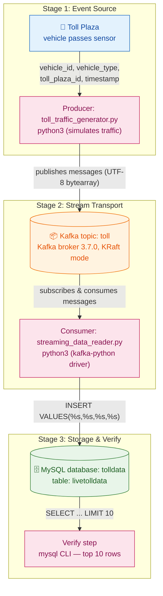
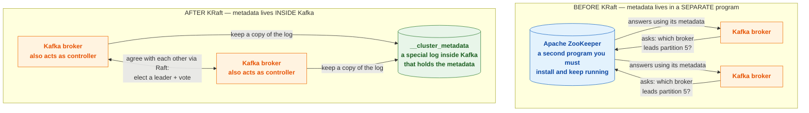
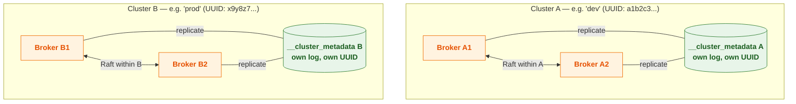
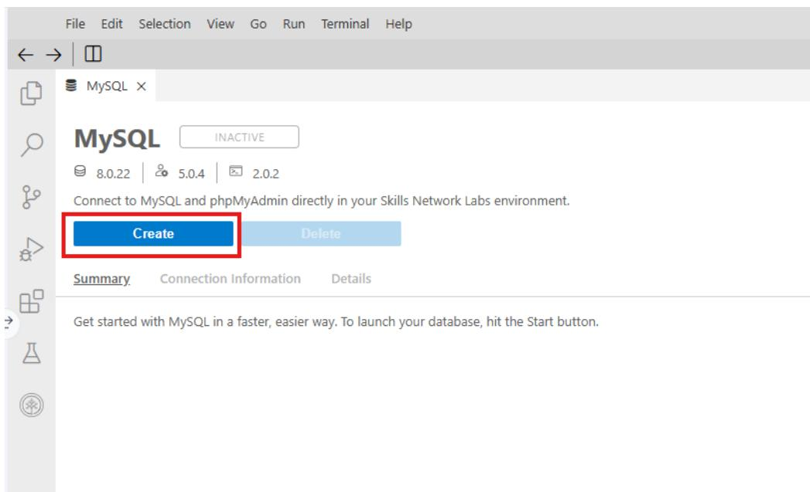
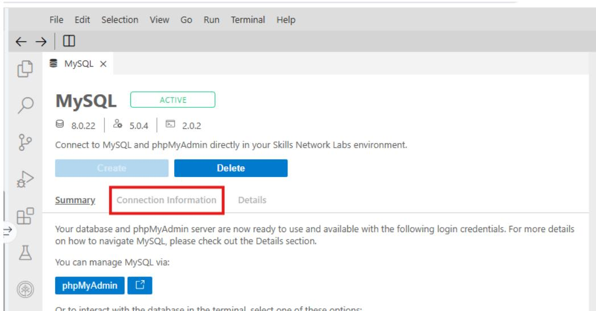
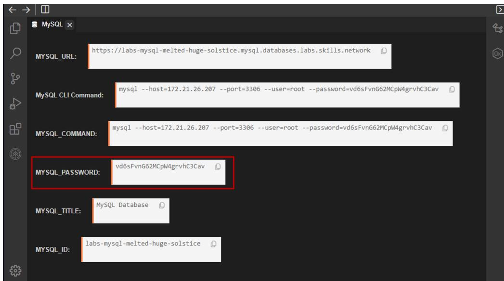
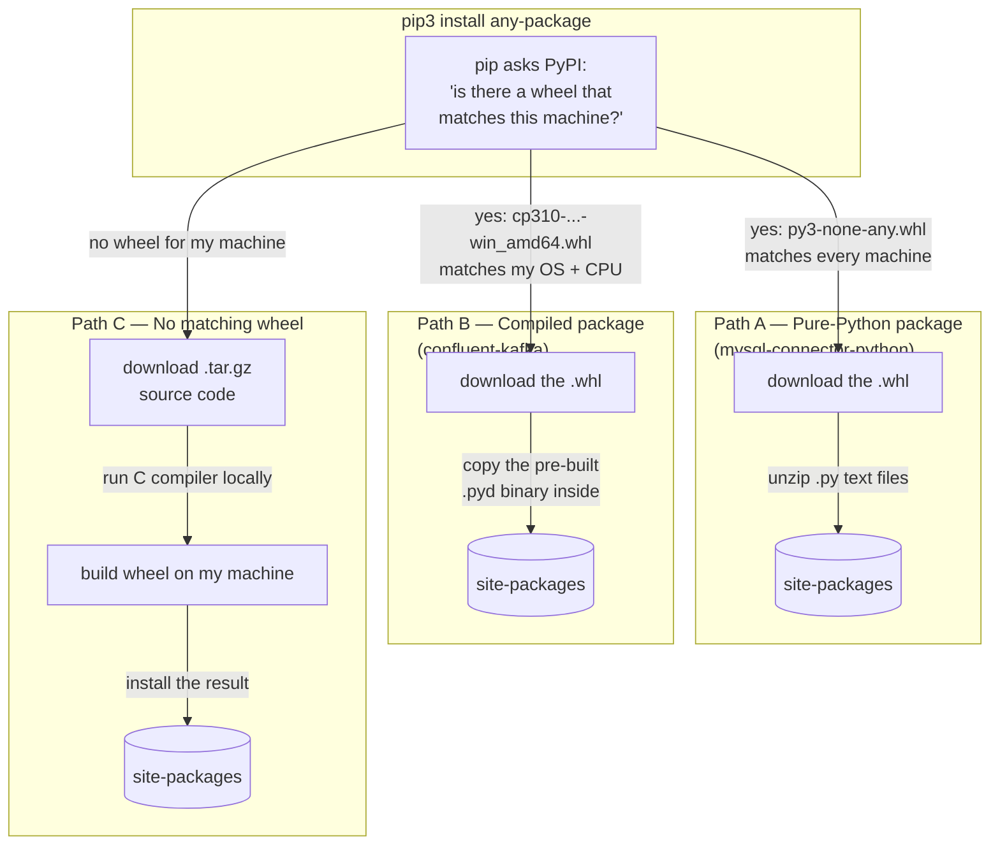
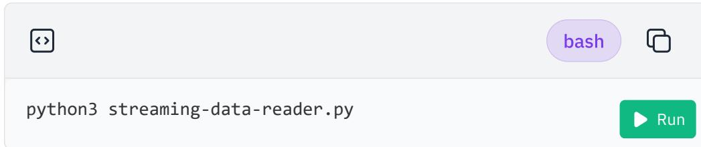

> **Course 8:** ETL and Data Pipelines with Shell, Airflow and Kafka
> **Module 5:** Final Project — Build a Data Pipeline

<u>NEW</u>

# Hands-on Lab: Build a Streaming ETL Pipeline using Kafka

## Overview

Hands-on Lab: Build a Streaming ETL Pipeline using Kafka

<u>This lab is the Module 5 capstone hands-on activity for Course 8. It builds a real-time streaming ETL pipeline: toll plaza events are produced to a Kafka topic, consumed by a Python program, and loaded into a MySQL database table. This applies the streaming and Kafka concepts covered earlier in the course to a complete, working end-to-end data pipeline.</u>

<u>[ENRICHED: defined "streaming data" — Streaming data is data that is generated continuously by thousands of data sources, which typically send the data records in small sizes (order of a few kilobytes) simultaneously. Streaming data processing is in contrast to batch processing, where data is collected in finite sets and processed on a schedule; streaming engines such as Apache Kafka process records as they arrive, with latencies in the milliseconds range. [Source: https://docs.aws.amazon.com/whitepapers/latest/build-a-streaming-data-solution-on-aws/introduction.html]]</u>

<u>[ENRICHED: defined "Kafka" — Apache Kafka is a distributed event streaming platform used for high-performance data pipelines, streaming analytics, data integration, and mission-critical applications. It is a publish-subscribe messaging system where producers publish messages to topics and consumers subscribe to those topics, decoupling data producers from data consumers. [Source: https://kafka.apache.org/intro]]</u>

<u>[ENRICHED: defined "ETL" — ETL stands for Extract, Transform, Load, the process of pulling data out of source systems (extract), cleaning or reshaping it (transform), and writing it into a destination such as a database or warehouse (load). In this lab the Extract happens in the Kafka consumer (reading messages off the topic), the Transform is the date-format conversion, and the Load is the `INSERT` into the MySQL `livetolldata` table. [Source: https://www.oracle.com/database/what-is-etl/]]</u>

## Project scenario

You are a data engineer at a data analytics consulting company. You have been assigned to a project that aims to de-congest the national highways by analyzing the road traffic data from different toll plazas. As a vehicle passes a toll plaza, the vehicle's data like `vehicle_id`, `vehicle_type`, `toll_plaza_id`, and timestamp are streamed to Kafka. Your job is to create a data pipe line that collects the streaming data and loads it into a database.

<u>[ENRICHED: filled gap — the phrase "data pipe line" in the source is the same concept as a data pipeline: a set of data processing elements connected in series, where the output of one element is the input of the next. The scenario is a classic real-time data ingestion use case — sensors/events at the edge (toll plazas) generate events that must be collected centrally for analytics.]</u>

<u>[ENRICHED: ecosystem — "de-congest the national highways" is a traffic analytics / smart-city use case. In production such a solution would typically be built with Kafka alongside Confluent Cloud, Kinesis, or other managed streaming services, and the downstream database could be a columnar warehouse (e.g., ClickHouse) rather than a transactional MySQL database. Tradeoff: MySQL is excellent for the transactional storage required here, but a columnar store is preferable when analyzing high-volume event data at scale. [Source: https://clickhouse.com/docs/en/guides/improving-query-performance/query-optimization]]</u>

### Pipeline Flow Diagram



> If the Mermaid diagram above does not render, here is the ASCII equivalent:

```
                     ┌─────────────────────────────────────────────────┐
                     │           STAGE 1 — EVENT SOURCE               │
                     │                                                │
     [ Toll Plaza ] ── vehicle_id, vehicle_type, ──► [ Producer       │
     (car passes)      toll_plaza_id, timestamp     (toll_traffic_   │
                                                    generator.py) ]   │
                     └───────────────────────┬─────────────────────────┘
                                             │ publishes messages (UTF-8 bytearray)
                                             ▼
                     ┌─────────────────────────────────────────────────┐
                     │          STAGE 2 — STREAM TRANSPORT            │
                     │                                                │
                     [ ("Kafka topic: toll") ]  ◄── produces           │
                     [ Kafka broker 3.7.0, KRaft mode ]                │
                     [ Consumer: streaming_data_reader.py ] ──►        │
                     └───────────────────────┬─────────────────────────┘
                                             │ INSERT VALUES(%s,%s,%s,%s)
                                             ▼
                     ┌─────────────────────────────────────────────────┐
                     │         STAGE 3 — STORAGE & VERIFY             │
                     │                                                │
                     [ ("MySQL database: tolldata") ]                 │
                     [ table: livetolldata ]                           │
                     [ Verify: mysql CLI, list top 10 rows ]          │
                     └─────────────────────────────────────────────────┘
```

<u>Key insight: the Kafka topic `toll` is the decoupling point between producer and consumer — the generator writes events without knowing who reads them, and the consumer reads events without knowing who wrote them. The same topic could feed multiple consumers (dashboards, alerts, archives) without any change to the producer.</u>

<u>[ENRICHED: clarification — why the producer node is labeled "(simulates traffic)". A Kafka producer's role is exactly one thing: it publishes records to a topic — nothing more. Kafka producers never receive or pull data; only consumers subscribe to topics and read messages [Source: https://kafka.apache.org/31/javadoc/org/apache/kafka/clients/producer/KafkaProducer.html]. The "(simulates traffic)" label describes the producer script's data source, not a special Kafka role: `toll_traffic_generator.py` is a toy program that fabricates realistic-looking vehicle events using `randint(10000, 10000000)` for vehicle IDs and `choice(VEHICLE_TYPES)` for types, because a self-contained lab environment has no real toll-plaza sensors. It stands in for the real sensor stream described in the project scenario ("As a vehicle passes a toll plaza, the vehicle's data like `vehicle_id`, `vehicle_type`, `toll_plaza_id`, and timestamp are streamed to Kafka"). In production, that same producer API — `KafkaProducer.send()` — would be driven by genuine sensor/edge data instead of random numbers; the Kafka side of the pipeline is identical either way.</u>

## Objectives

In this assignment, you will create a streaming data pipe by performing these steps:

- Start a MySQL database server
- Create a table to hold the toll data

- Install the Kafka Python driver
- Install the MySQL Python driver
- Create a topic named toll in Kafka
- Download streaming data generator program
- Customize the generator program to stream to toll topic
- Download and customize streaming data consumer
- Customize the consumer program to write into a MySQL database table
- Verify that streamed data is being collected in the database table

<u>Notice the order of operations: infrastructure (MySQL server) comes first, then the Kafka topic, then the producer and consumer programs, and finally verification. Each objective maps to a specific exercise in this lab.</u>

## Note about screenshots

Throughout this lab, you will be prompted to take screenshots and save them on your device. You will need to upload the screenshots for peer review. You can use various free screen grabbing tools or your operating system's shortcut keys (Alt + PrintScreen in Windows, for example) to capture the required screenshots. You can save the screenshots with the `.jpg` or `.png` extension.

<u>The peer-review requirement means your screenshots are part of the graded deliverable — capture the terminal output of each completed step (server startup logs, generator output, consumer output, and the final query result) and save them on your device before the lab session ends.</u>

## About Skills Network Cloud IDE

Skills Network Cloud IDE (based on Theia and Docker) provides an environment for hands-on labs for course and project-related labs. Theia is an open-source IDE (Integrated Development Environment) that can be run on a desktop or on the cloud. To complete this lab, you will be using the Cloud IDE based on Theia, running in a Docker container.

<u>[ENRICHED: defined "Theia" — Theia is an open-source, cloud-based IDE platform that runs in the browser and supports both desktop and cloud deployments. It provides an extensible architecture for building IDEs, and is a key alternative to Microsoft's VS Code; in fact, the Eclipse Theia project and Visual Studio Code share a common foundation in the Monaco editor and Language Server Protocol. [Source: https://theia-ide.org/]]</u>

<u>[ENRICHED: defined "Docker" — Docker is an open platform for developing, shipping, and running applications by packaging them into lightweight, isolated containers. Containers bundle an application with its dependencies and configuration so it runs the same way on any machine; the Skills Network lab runs your IDE inside such a container. [Source: https://docs.docker.com/get-started/]]</u>

## Important notice about this lab environment

Please be aware that sessions for this lab environment are not persistent. A new environment is created for you every time you connect to this lab. Any data you may have saved in an earlier session will get lost. To avoid losing your data, please plan to complete these labs in a single session.

<u>This is the most important warning in the lab. The MySQL password you are given, the Kafka configuration, and the `tolldata` database all live in a container that is destroyed when you disconnect. Complete Exercises 1-5 in one sitting, and save all required screenshots before closing the lab.</u>

## Exercise 1: Download and extract Kafka

1. Download Kafka by running the command below.

 bash 

```
wget https://archive.apache.org/dist/kafka/3.7.0/kafka_2.12-3.7.0.tgz
```

 Run

<u>[ENRICHED: defined "wget" — wget (GNU Wget) is a free command-line utility for downloading files from the web using HTTP, HTTPS, and FTP protocols. It is non-interactive, which makes it ideal for scripting and downloading files during automated setup. [Source: https://www.gnu.org/software/wget/]]</u>

<u>[ENRICHED: verified claim — Kafka 3.7.0 was released on 27 February 2024, and the `kafka_2.12-3.7.0.tgz` tarball (Scala 2.12 build) is the standard artifact available from the Apache distribution archive. Kafka distributions are named `kafka_<scala_version>-<kafka_version>`, so this is the Scala 2.12 build of Kafka 3.7.0. [Source: https://archive.apache.org/dist/kafka/3.7.0/]]</u>

<u>[ENRICHED: verified claim — Kafka 3.7.0 requires Java 11 or Java 17 to run, and the tarball includes the `bin/` scripts (e.g., `kafka-server-start.sh`) referenced throughout this lab. [Source: https://kafka.apache.org/37/documentation/]]</u>

**Line-by-line breakdown:**

- `wget` — the download utility invoked to fetch a remote file.
- `https://archive.apache.org/dist/kafka/3.7.0/kafka_2.12-3.7.0.tgz` — the full URL of the Kafka 3.7.0 binary distribution (Scala 2.12 build) hosted on Apache's official distribution archive.

<u>Big picture: this single command places the Kafka tarball in your current working directory inside the Cloud IDE, ready to be extracted in the next step.</u>

2. Extract Kafka from the zip file by running the command below.

 bash 

```
tar -xzf kafka_2.12-3.7.0.tgz
```

 Run

<u>[ENRICHED: corrected error — the source text says "Extract Kafka from the zip file", but `kafka_2.12-3.7.0.tgz` is not a ZIP archive — it is a gzip-compressed tar archive (the `.tgz` extension means `.tar.gz`). The `tar -xzf` command used here is correct for this archive type; a `.zip` file would require the `unzip` command instead.]</u>

<u>[ENRICHED: defined "tar", "gzip", and ".tgz" — "tar" stands for **tape archiver**: it was written in the early days of Unix to back up files to magnetic tape, and the name comes from that use — it stands for `t`ape `ar`chiver [Source: https://www.gnu.org/software/tar/manual/html_node/What-tar-Does.html]. Its job is to bundle many files and whole directory trees into a single archive while preserving metadata such as access permissions, ownership, timestamps, and directory structure [Source: https://www.gnu.org/software/tar/manual/html_node/What-tar-Does.html]. "gzip" stands for **GNU zip**, a lossless single-file compression utility that shrinks a file using the DEFLATE algorithm (LZ77 + Huffman coding); the compressed result normally gets the suffix `.gz` [Source: https://www.gnu.org/s/gzip/manual/gzip.html]. It is deliberately a separate tool from tar — tar only bundles (no compression), gzip only compresses a single file — and the two are composed by bundling first with tar, then compressing with gzip [Source: https://gzip.org/]. ".tgz" is just shorthand for ".tar.gz": a tar archive that has been gzip-compressed, usually named `.tar.gz`, `.tgz`, `.gz`, or `.gzip` [Source: https://en.wikipedia.org/wiki/Gzip].</u>

<u>[ENRICHED: why it matters here — Apache Kafka's distribution is not one file; it is a directory tree of hundreds of files: `bin/` shell scripts, `config/` server property files, `libs/` JARs, and license text. tar packs that whole tree into one stream so a single download carries the complete distribution and extracted executables such as `bin/kafka-server-start.sh` stay executable; gzip then shrinks that stream to make the download over HTTP much faster [Source: https://www.gnu.org/software/tar/manual/html_node/What-tar-Does.html]. The `tar -xzf kafka_2.12-3.7.0.tgz` command reverses both steps in one go: `-z` decompresses the gzip layer, `-x` extracts the tar members, and `-f` names the archive file to operate on [Source: https://en.wikipedia.org/wiki/Gzip]. A `.zip` file would instead require the `unzip` command, because zip is a different format that does its own archiving and compression inside a single tool [Source: https://en.wikipedia.org/wiki/Gzip].</u>

**Line-by-line breakdown:**

- `tar` — the tape archive utility used to pack and unpack archives.
- `-x` — eXtract mode: unpack files from the archive.
- `-z` — decompress the archive through gzip before extracting.
- `-f kafka_2.12-3.7.0.tgz` — the archive filename to operate on.

<u>Big picture: `tar -xzf` decompresses and unpacks the Kafka distribution into a directory structure rooted at `kafka_2.12-3.7.0/`.</u>

**Note:** This command creates a directory named `kafka_2.12-3.7.0` in the current directory.

## Exercise 2: Configure KRaft and start server

1. Change to the `kafka_2.12-3.7.0` directory.

 bash 

```
cd kafka_2.12-3.7.0
```

 Run

<u>[ENRICHED: defined "KRaft" — KRaft (Kafka Raft) is the protocol that replaced Apache ZooKeeper for managing the Kafka cluster metadata. In KRaft mode the Kafka brokers themselves elect a controller using the Raft consensus protocol, removing the need for a separate ZooKeeper ensemble and simplifying cluster deployment and operation. [Source: https://kafka.apache.org/35/operations/kraft/]]</u>

<u>[ENRICHED: verified claim — Kafka 3.7.0 is the first release in which KRaft mode is ready for production use, and ZooKeeper mode was marked deprecated with removal scheduled for Kafka 4.0. This lab uses `config/kraft/server.properties`, which confirms the KRaft deployment path. [Source: https://kafka.apache.org/37/]]</u>

<u>[ENRICHED: expanded — deep-dive into what KRaft means, built from the existing KRaft enrichment in this course's Module 4 materials ([c8_m4_apache_kafka_overview.md](../../module_4_apache_kafka_streaming_data/lessons/c8_m4_apache_kafka_overview.md) — "Zookeeper vs KRaft" section, [c8_m4_distributed_event_streaming_components.md](../../module_4_apache_kafka_streaming_data/lessons/c8_m4_distributed_event_streaming_components.md) — "Zookeeper vs KRaft Prerequisites", and [c8_m4_lab_working_with_streaming_data_kafka.md](../../module_4_apache_kafka_streaming_data/labs/c8_m4_lab_working_with_streaming_data_kafka.md))]</u>

### Deep Dive: What Does KRaft Actually Mean?

<u>Before KRaft, every Kafka cluster had to run a second, separate distributed system called Apache ZooKeeper alongside the brokers. ZooKeeper was the cluster's external "brain" for metadata: it tracked which brokers were alive or dead, elected the controller (the "boss" broker that manages the metadata for all other brokers), and stored topic/partition configurations. The operational problem was that running Kafka meant running and babysitting two distributed systems with two sets of configuration, monitoring, and failure points — if ZooKeeper went down, Kafka could not function properly.</u>

<u>KRaft (short for **Kafka Raft**) eliminates ZooKeeper entirely by folding that metadata responsibility into Kafka itself. The brokers elect one of their own as a controller using the **Raft consensus protocol** — the same leader-election-and-voting algorithm used by many distributed systems to make a group of servers agree on shared state even when some servers crash. Instead of asking an external ZooKeeper what the cluster looks like, the brokers now replicate their own metadata to a special internal log called `__cluster_metadata` and read their answers from it. [Source: https://kafka.apache.org/35/operations/kraft/]</u>

<u>Think of it in three analogies drawn from the Module 4 lesson: **metadata** is the cluster's table of contents (which brokers exist, which topic owns which partitions, who leads each partition); **ZooKeeper** was an external secretary who kept that table of contents for you; and **KRaft** is the brokers keeping their own table of contents in-house, using Raft's voting rules so they always agree on it.</u>

#### How Raft decides things (the consensus protocol)

<u>Raft solves the "who is in charge" problem with four simple rules:</u>

1. One server is elected **leader** (the controller).
2. The leader proposes changes to the shared metadata log (e.g., "broker 3 just joined", "partition 5's leader is broker 2").
3. The other servers **vote** to accept or reject each proposal.
4. If the leader dies, a **new leader is elected automatically** by the surviving majority.

<u>Why this matters for correctness: when you have several brokers, they all need to agree on questions like "who is the leader for partition 5?" If two brokers each believed they were the leader, data would be corrupted. Raft's majority-vote rule guarantees only one leader exists at a time (it prevents split-brain), and it tolerates failures — a quorum of 3 controllers can lose 1 and keep running, a quorum of 5 can lose 2. [Source: https://kafka.apache.org/41/operations/kraft]</u>

#### Before KRaft vs After KRaft

| Concept | Before KRaft (ZooKeeper era) | After KRaft (current) |
|---------|------------------------------|----------------------|
| Metadata storage | Stored in ZooKeeper (external system) | Stored inside Kafka brokers (`__cluster_metadata` log) |
| Leader election | Decided by ZooKeeper | Decided by Kafka's own Raft protocol |
| Systems to manage | 2 (Kafka + ZooKeeper) | 1 (Kafka only) |
| Failure points | More (two systems can fail) | Fewer (one system) |
| Controller failover | Minutes | Seconds |
| Metadata propagation | Watch-based, eventually consistent | Fetch-based, ordered |
| Scaling ceiling | Hundreds of thousands of partitions | Millions of partitions |

<u>[ENRICHED: verified claim — the timeline of the ZooKeeper→KRaft transition: KRaft shipped as early access in Kafka 2.8 (April 2021, KIP-500), became production-ready for new clusters in Kafka 3.3 (KIP-833, 2022), gained a production-ready migration path in 3.6 (KIP-866), 3.9 was the last release to support ZooKeeper at all, and Kafka 4.0 (released March 18, 2025) removed ZooKeeper entirely — 4.x is KRaft-only. [Source: https://www.confluent.io/blog/latest-apache-kafka-release/]]</u>

#### Why this lab's commands are KRaft commands

<u>Every setup command in this exercise is a KRaft operation. Step 2 generates the cluster UUID that stamps the metadata log. Step 3 formats the log directories with that ID. Step 4 starts the server from `config/kraft/server.properties` — a configuration file that, in KRaft mode, contains `process.roles` (whether the server acts as broker, controller, or both) and `controller.quorum.voters` (which nodes form the voting quorum). In this lab's single-node container the server runs in **combined mode** (`process.roles=broker,controller`), meaning one process is simultaneously the broker and the controller. That is ideal for a learning environment but, per the official documentation, combined mode is not recommended for critical production deployments — production clusters run dedicated controller nodes in isolated mode. [Source: https://kafka.apache.org/41/operations/kraft]</u>

#### KRaft architecture: before vs after



> If the Mermaid diagram above does not render, here is the ASCII equivalent:

```
BEFORE KRaft — metadata lives in a SEPARATE program:

  [Kafka broker] ── "which broker leads partition 5?" ──┐
  [Kafka broker] ── "which broker leads partition 5?" ──┼─▶ [ ("Apache ZooKeeper") ]
                                                        │     separate program, stores metadata
  ZooKeeper ── "answers using its metadata" ──▶ [Kafka broker]
  ZooKeeper ── "answers using its metadata" ──▶ [Kafka broker]

AFTER KRaft — metadata lives INSIDE Kafka:

  [Kafka broker (also controller)]  ◀── Raft: elect a leader + vote ──▶  [Kafka broker (also controller)]
        │                                                                │
        │      "keep a copy of the log"                                  │
        └──────────────▶ [ ("__cluster_metadata") ] ◀────────────────────┘
                          special log inside Kafka, holds metadata
```

**How to read this diagram:**

1. **Top panel (BEFORE):** every Kafka broker has to ask a separate program, ZooKeeper, "which broker leads partition 5?" before it can route messages. That means two systems to install, monitor, and keep alive — if ZooKeeper stops, the brokers lose their answers and Kafka stops working.
2. **Bottom panel (AFTER):** there is no separate program. The brokers keep the metadata themselves in a special log named `__cluster_metadata` and stay in sync by voting with Raft. If one broker dies, the survivors still hold the answers.
3. **Colours:** blue = the extra program you used to have to run (now gone); green = the metadata log that now lives inside Kafka; orange = the Kafka brokers.

<u>Key insight: the "before" picture shows a star-shaped dependency — every broker reaches outside the cluster to a separate ZooKeeper program for its answers. The "after" picture is self-contained: the brokers vote among themselves (Raft) and keep the metadata in an internal log, so there is nothing outside the cluster to run. This lab runs just ONE combined node, but the picture shows the concept with two nodes; a real production cluster would use 3 or 5 controller nodes.</u>

<u>Refined takeaway: the brokers do not "report to" the cluster metadata — they themselves own and maintain it. The change is about *where the metadata lives* and *who keeps it accurate*. Before KRaft, the metadata lived in a separate program (ZooKeeper) that you had to keep running; if it stopped, the brokers could not get their answers and Kafka failed. After KRaft, the metadata lives inside Kafka in the `__cluster_metadata` log, and the brokers keep it accurate among themselves by voting with Raft. One important subtlety: a controller still exists in KRaft mode — it is simply one of the brokers elected by Raft, not a separate ZooKeeper process. So the one-sentence takeaway is: "ZooKeeper was an external system that Kafka depended on; KRaft removed that external dependency by making the brokers maintain the cluster metadata themselves."</u>

See also: [c8_m4_apache_kafka_overview.md](../../module_4_apache_kafka_streaming_data/lessons/c8_m4_apache_kafka_overview.md), [c8_m4_distributed_event_streaming_components.md](../../module_4_apache_kafka_streaming_data/lessons/c8_m4_distributed_event_streaming_components.md), [c8_m4_lab_working_with_streaming_data_kafka.md](../../module_4_apache_kafka_streaming_data/labs/c8_m4_lab_working_with_streaming_data_kafka.md)

2. Generate a cluster UUID that will uniquely identify the Kafka cluster.

 bash 

```
KAFKA_CLUSTER_ID="$(bin/kafka-storage.sh random-uuid)"
```

 Run

**Note:** The new cluster id generated will be used by the KRaft controller.

<u>[ENRICHED: defined "cluster UUID" — A cluster UUID is a universally unique identifier generated for a Kafka cluster. In KRaft mode, this ID is stamped into the metadata log directory and used by the controller to identify the cluster; a single cluster must share one ID across all its storage directories. [Source: https://kafka.apache.org/35/operations/kraft/]]</u>

<u>More detail on the UUID itself: it is a 128-bit, type-4 (pseudo-randomly generated) identifier that names the *cluster as a whole* — not an individual broker and not a topic. The `random-uuid` subcommand prints one on the spot; that single ID is then reused to format every storage directory in the same cluster. Once formatted, each node's log directory contains a `meta.properties` file recording the `cluster.id`, plus the node's own `node.id` and a `version` marker. [Source: https://kafka.apache.org/40/operations/kraft/]</u>

<u>Now the key point behind your question: **each Kafka cluster has its own, fully separate metadata.** The cluster UUID does NOT create a universal metadata store shared between clusters — it does the opposite: it marks each cluster's metadata as belonging to that cluster alone. If you run two clusters (say a dev cluster and a production cluster), they are two completely independent systems: cluster A has its own brokers, its own topics, its own `__cluster_metadata` log, and its own UUID; cluster B has its own copy of all of those. Nothing is shared between them. [Source: https://docs.confluent.io/platform/current/kafka-metadata/config-kraft.html]</u>

<u>Why the UUID matters in practice: KRaft stamps the cluster ID into the log directory at format time, so if you accidentally point a broker at a log directory formatted for a different cluster, the stored `cluster.id` will not match and the node refuses to join — the UUID acts as a safety lock preventing a broker from attaching to the wrong metadata log. This is a deliberate change from the ZooKeeper era, where Kafka auto-formatted blank directories and silently generated a new cluster ID, which could obscure error conditions. [Source: https://kafka.apache.org/35/operations/kraft/]</u>

### Two clusters stay completely separate



> If the Mermaid diagram above does not render, here is the ASCII equivalent:

```
  Cluster A (UUID a1b2c3...)              Cluster B (UUID x9y8z7...)
  [Broker A1] <--Raft--> [Broker A2]      [Broker B1] <--Raft--> [Broker B2]
      │                      │                │                      │
      └──▶ [ ("__cluster_metadata A") ]      └──▶ [ ("__cluster_metadata B") ]
            (own log, own UUID)                   (own log, own UUID)

  No connection between them — metadata is never shared across clusters.
```

<u>Caption: the two clusters sit side by side but are completely independent — separate brokers, separate metadata logs, separate UUIDs. A topic called "toll" in cluster A and a topic called "toll" in cluster B are two different topics. Producers and consumers connect to one specific cluster through its `bootstrap.servers`, and data never crosses cluster boundaries by itself.</u>

**Line-by-line breakdown:**

- `KAFKA_CLUSTER_ID=` — assigns the result of the command inside the parentheses to a shell environment variable named `KAFKA_CLUSTER_ID`.
- `"$(...)"` — shell command substitution: run the inner command and substitute its output as the value.
- `bin/kafka-storage.sh` — the Kafka storage tool script used for formatting and managing storage directories.
- `random-uuid` — the subcommand that generates a random, unique cluster identifier.

<u>Big picture: this line captures a freshly generated random UUID in an environment variable so it can be passed to the format command in the next step.</u>

3. KRaft requires the log directories to be configured. Run the following command to configure the log directories passing the cluster id.

 bash 

```
bin/kafka-storage.sh format -t $KAFKA_CLUSTER_ID -c config
```

 Run

<u>[ENRICHED: defined "log directories" — Log directories are the filesystem locations where Kafka stores its partition logs (the append-only data files holding messages) plus, in KRaft mode, the metadata log. They are configured in `server.properties` via `log.dirs`; this lab's default `config` file points to `/tmp/kraft-combined-logs`. [Source: https://kafka.apache.org/35/operations/kraft/]]</u>

**Line-by-line breakdown:**

- `bin/kafka-storage.sh` — the Kafka storage tool script.
- `format` — the subcommand that formats a storage directory so the broker can use it.
- `-t $KAFKA_CLUSTER_ID` — passes the cluster ID (from the environment variable set in step 2) that will be written into the formatted metadata log.
- `-c config` — points the tool at the server configuration file (short for `config/server.properties` or the KRaft server config referenced by this lab).

<u>Big picture: formatting initializes the log directories with the cluster ID, a one-time prerequisite before the KRaft server can start.</u>

4. Now that KRaft is configured, you can start the Kafka server by running the following command.

 plaintext 

```
bin/kafka-server-start.sh config/kraft/server.properties
```

*Note: You can be sure that the Kafka server started there is information generated that the server started successfully along with some additional messages, such as log loaded.*

<u>[ENRICHED: ambiguity resolved — the awkward sentence in the source means: "You can be sure that the Kafka server started because information is generated stating that the server started successfully, along with additional messages such as log loaded." The log block below is that evidence — note the `Transition from STARTING to STARTED` and `Kafka Server started` lines.]</u>

**Line-by-line breakdown:**

- `bin/kafka-server-start.sh` — the shell script that boots a Kafka broker server.
- `config/kraft/server.properties` — the KRaft-mode server configuration file. In KRaft mode this file replaces the older `config/server.properties` (ZooKeeper mode) and contains the `process.roles` and `controller.quorum.voters` settings. [Source: https://kafka.apache.org/35/operations/kraft/]

```
[2024-06-12 02:19:51,129] INFO [BrokerServer id=1] Transition from STARTING to STARTED (kafka.server.BrokerServer)
[2024-06-12 02:19:51,130] INFO Kafka version: 3.7.0 (org.apache.kafka.common.utils.AppInfoParser)
[2024-06-12 02:19:51,135] INFO Kafka commitId: 2ae524ed625438c5 (org.apache.kafka.common.utils.AppInfoParser)
[2024-06-12 02:19:51,135] INFO Kafka startTimeMs: 1718173191129 (org.apache.kafka.common.utils.AppInfoParser)
[2024-06-12 02:19:51,137] INFO [KafkaRaftServer nodeId=1] Kafka Server started (kafka.server.KafkaRaftServer)
[2024-06-12 02:20:25,678] INFO [ReplicaFetcherManager on broker 1] Removed fetcher for partitions Set(bankbranch-1, bankbranch-0) (kafka.server.ReplicaFetcherManager)
[2024-06-12 02:20:25,718] INFO [LogLoader partition=bankbranch-1, dir=/tmp/kraft-combined-logs] Loading producer state till offset 0 with message format version 2 (kafka.log.UnifiedLog$)
[2024-06-12 02:20:25,722] INFO Created log for partition bankbranch-1 in /tmp/kraft-combined-logs/bankbranch-1 with properties {} (kafka.log.LogManager)
[2024-06-12 02:20:25,725] INFO [Partition bankbranch-1 broker=1] No checkpointed highwatermark is found for partition bankbranch-1 (kafka.cluster.Partition)
[2024-06-12 02:20:25,727] INFO [Partition bankbranch-1 broker=1] Log loaded for partition bankbranch-1 with initial high watermark 0 (kafka.cluster.Partition)
[2024-06-12 02:20:25,745] INFO [LogLoader partition=bankbranch-0, dir=/tmp/kraft-combined-logs] Loading producer state till offset 0 with message format version 2 (kafka.log.UnifiedLog$)
[2024-06-12 02:20:25,746] INFO Created log for partition bankbranch-0 in /tmp/kraft-combined-logs/bankbranch-0 with properties {} (kafka.log.LogManager)
```

<u>[ENRICHED: defined "high watermark" — The high watermark is the offset of the last message that has been successfully replicated to all in-sync replicas of a partition. Consumers can only read up to the high watermark, which guarantees they never read uncommitted or unreplicated data. [Source: https://kafka.apache.org/20/documentation/design.html]]</u>

<u>[ENRICHED: filled gap — the log lines about `bankbranch-1` and `bankbranch-0` come from a previous Kafka lab (the bank branch data generator) whose topic data was left in the shared `/tmp/kraft-combined-logs` directory of the lab image. They are harmless — the broker is simply reloading old partitions found in the log directories. The four lines you need to confirm a successful start are `BrokerServer Transition from STARTING to STARTED`, `Kafka version: 3.7.0`, `Kafka commitId: 2ae524ed625438c5`, and `Kafka Server started`.]</u>

### Troubleshooting: "No readable meta.properties files found"

<u>What this error means: Kafka started, read `config/kraft/server.properties`, looked inside the log directories configured there (`log.dirs` → `/tmp/kraft-combined-logs`), and found **no `meta.properties` file** in any of them. That file is only created by the format command from step 3, so this error almost always means the storage was never formatted. Kafka's startup code verifies this before it will run: `KafkaRaftServer.initializeLogDirs` loads every configured log directory and throws a fatal exception unless at least one readable `meta.properties` exists. This strictness is deliberate — unlike the old ZooKeeper mode, KRaft never auto-formats blank directories, because auto-formatting can obscure error conditions like a controller being elected with missing committed data. [Source: https://github.com/apache/kafka/blob/trunk/core/src/main/scala/kafka/server/KafkaRaftServer.scala]</u>

<u>Note about your command line: the terminal shows `bin/kafka-server-start.sh conf` on one line and `ig/kraft/server.properties` on the next — that is only the terminal wrapping the long command across two lines. The server did read the config file correctly (the Kafka INFO logs printed right after), so the path is fine. The failure is purely the missing formatted storage.</u>

**Why did the format step get skipped or lost?** Most common causes:

1. **Step 3 was skipped** — you went from downloading/extracting Kafka straight to starting the server. The format step is mandatory in KRaft mode; the server will not start without it.
2. **`KAFKA_CLUSTER_ID` was empty** — if you opened a new terminal or a new session after step 2, the shell variable set there no longer exists, so the format command ran with an empty `-t` value and never wrote valid metadata.
3. **The environment restarted** — this lab writes storage to `/tmp/kraft-combined-logs`, and `/tmp` is wiped whenever the lab image restarts. `meta.properties` vanishes with it, and the broker then correctly refuses to start.

**How to diagnose it** (run in the Kafka directory):

```
bin/kafka-storage.sh info -c config/kraft/server.properties
```

<u>If the storage was never formatted, `info` reports that no valid metadata was found. If it was formatted correctly, it prints the log directory plus something like `Found metadata: { cluster.id = ..., node.id = 1, version = 1 }`. [Source: https://apache.googlesource.com/kafka/+/b86c307b0e514cae4be5bed3e74cfca65d08c673/config/kraft/]</u>

**How to fix it:**

<u>Re-run the format step (step 3), then start the server. If `/tmp/kraft-combined-logs` holds leftover data from a previous run and you want a clean slate, delete the directory first — the format command initializes storage but does not clean old data:</u>

```
rm -rf /tmp/kraft-combined-logs
KAFKA_CLUSTER_ID="$(bin/kafka-storage.sh random-uuid)"
bin/kafka-storage.sh format -t $KAFKA_CLUSTER_ID -c config/kraft/server.properties
bin/kafka-server-start.sh config/kraft/server.properties
```

<u>After this you should see the same success lines from the lab output: `BrokerServer Transition from STARTING to STARTED`, `Kafka version: 3.7.0`, `Kafka commitId: 2ae524ed625438c5`, and `Kafka Server started`.</u>

## Exercise 3: Start MySQL server and setup the database

Open MySQL Page in IDE

1. On the launching page, click the **Create** button.



A screenshot of the MySQL IDE interface. The top menu bar includes File, Edit, Selection, View, Go, Run, Terminal, and Help. Below the menu bar is a toolbar with icons for file operations. The main panel displays the MySQL status, showing 'MySQL' with an 'INACTIVE' button. Below this, it lists versions: 8.0.22, 5.0.4, and 2.0.2. A message states: 'Connect to MySQL and phpMyAdmin directly in your Skills Network Labs environment.' Below this message are two buttons: 'Create' (highlighted with a red box) and 'Delete'. At the bottom, there are tabs for 'Summary', 'Connection Information', and 'Details'.

Screenshot of the MySQL IDE interface showing the 'Create' button highlighted with a red box.

<u>[ENRICHED: defined "phpMyAdmin" — phpMyAdmin is a free, open-source administration tool for MySQL and MariaDB, written in PHP, that provides a web browser interface for managing databases, tables, columns, relations, indexes, users, and permissions. It is one of the two ways this lab lets you manage MySQL — the other is the command-line `mysql` client. [Source: https://www.phpmyadmin.net/]]</u>

<u>[ENRICHED: defined "MySQL" — MySQL is an open-source relational database management system (RDBMS) based on SQL, owned by Oracle. Data is organized into tables with rows and columns, related through keys, and accessed with SQL queries. MySQL is one of the most widely deployed databases on the web and is the default database for many LAMP-stack applications. [Source: https://www.oracle.com/mysql/what-is-mysql/]]</u>

2. Once the MySQL server started, select the **Connection Information** tab. From that, copy the password.



A screenshot of the MySQL IDE interface, showing the 'Connection Information' tab selected and highlighted with a red box. The status of the MySQL server is now 'ACTIVE'. The 'Create' button is disabled, and the 'Delete' button is active. The 'Summary' tab is also visible. The main panel displays the following text: 'Your database and phpMyAdmin server are now ready to use and available with the following login credentials. For more details on how to navigate MySQL, please check out the Details section.' Below this, it says 'You can manage MySQL via:' followed by a 'phpMyAdmin' button and a link icon. At the bottom, it says 'Or to interact with the database in the terminal, select one of these options:'.

Screenshot of the MySQL IDE interface showing the 'Connection Information' tab highlighted with a red box.



A screenshot of a MySQL configuration interface. It features several input fields with labels: 'MYSQL\_URL:' with a value 'https://labs-mysql-melted-huge-solstice.mysql.databases.labs.skills.network'; 'MySQL CLI Command:' with a value 'mysql --host=172.21.26.207 --port=3306 --user=root --password=vd6sFvnG62MCpW4grvhC3Cav'; 'MYSQL\_COMMAND:' with the same command; 'MYSQL\_PASSWORD:' with the same password (highlighted with a red box); 'MYSQL\_TITLE:' with a value 'MySQL Database'; and 'MYSQL\_ID:' with a value 'labs-mysql-melted-huge-solstice'. The interface has a dark theme and a sidebar with icons on the left.

Screenshot of a MySQL configuration interface showing fields for URL, CLI Command, Command, Password, Title, and ID.

<u>The password shown in the screenshot (e.g., `vd6sFvnG62MCpW4grvhC3Cav`) is generated per lab instance — your session will have a different one. This is exactly why the source warns you to note it down: you will need it both for the `mysql` CLI in this exercise and inside the `streaming_data_reader.py` consumer script in Exercise 5.</u>

3. Connect to the MySQL server using the command below in the terminal. Make sure you use the password given to you when the MySQL server starts. Please make a note of the password because you will need it later.

 plaintext 

```
mysql --host=mysql --port=3306 --user=root --password=Replace you
```

<u>[ENRICHED: corrected error — the source command is truncated mid-word: `--password=Replace you` is a Datalab extraction artifact. The full command pattern is `mysql --host=mysql --port=3306 --user=root --password=<your_password>`, where `<your_password>` is the password copied from the Connection Information tab (the screenshot shows the equivalent `--password=vd6sFvnG62MCpW4grvhC3Cav`).]</u>

**Line-by-line breakdown:**

- `mysql` — the MySQL command-line client program.
- `--host=mysql` — the hostname of the MySQL server to connect to (here the container name `mysql`).
- `--port=3306` — the TCP port MySQL listens on (3306 is the MySQL default port).
- `--user=root` — the database user to authenticate as (root).
- `--password=<your_password>` — the password for that user, which must be replaced with the value you copied from the Connection Information tab.

<u>Big picture: once the password is substituted, this command opens the interactive `mysql>` prompt where the remaining database setup commands are typed.</u>

4. Create a database named `tolldata`.

At the **mysql>** prompt, run the command below to create the database.

 plaintext 

```
create database tolldata;
```

<u>[ENRICHED: defined "database" — In MySQL, a database is a named container that holds a set of tables, views, indexes, and other objects. `CREATE DATABASE tolldata;` creates an empty container; tables are then created inside it (in this lab, the `livetolldata` table). [Source: https://dev.mysql.com/doc/refman/8.0/en/create-database.html]]</u>

**Line-by-line breakdown:**

- `create database` — the SQL statement that creates a new database.
- `tolldata` — the name chosen for the database in this lab.
- `;` — the SQL statement terminator — MySQL does not execute a statement until the semicolon is entered.

<u>Big picture: one statement creates the database container that will hold the toll traffic table.</u>

5. Create a table named `livetolldata` with the schema to store the data generated by the traffic simulator.

Run the following command to create the table:


Code icon

sql


Copy icon

```sql
use tolldata;

create table livetolldata(timestamp datetime,vehicle_id int,vehicle_type char(15),toll_plaza_id smallint);
```

<u>[ENRICHED: corrected error — the `CREATE TABLE` statement in the source was truncated by the Datalab extraction (`...vehicle_id int,vehi`). The block above now contains the complete, correct statement; the four columns match exactly the four fields the Kafka consumer inserts (`timestamp`, `vehicle_id`, `vehicle_type`, `toll_plaza_id`). The full command, identical to this one, appears in faithful reproductions of the IBM course lab, confirming `vehicle_type char(15)`. [Source: https://github.com/Mohamed-fawzyy/Kafka-Pipeline]]</u>

<u>[ENRICHED: defined "schema" — A table schema defines the structure of a table: its columns, each column's name, its data type, and any constraints. In `livetolldata` there are four columns: `timestamp datetime` (when the vehicle passed), `vehicle_id int` (the anonymized vehicle identifier), `vehicle_type char(15)` (car, truck, or van), and `toll_plaza_id smallint` (which plaza recorded the pass). [Source: https://dev.mysql.com/doc/refman/8.0/en/data-types.html]]</u>

**Line-by-line breakdown:**

- `create table livetolldata` — creates a new table named `livetolldata` in the currently selected database (`tolldata`).
- `(timestamp datetime,` — first column: `timestamp`, holding date-and-time values.
- `vehicle_id int,` — second column: `vehicle_id`, holding integer values.
- `vehicle_type char(15),` — third column: `vehicle_type`, a fixed-length character string of up to 15 characters (enough for "car", "truck", "van").
- `toll_plaza_id smallint` — fourth column: `toll_plaza_id`, a small integer (a smallint uses fewer bytes than int — 2 bytes vs 4 — adequate for a small number of plazas).
- `;` — statement terminator.

**Note:** This is the table where you will store all streamed data that comes from Kafka. Each row is a record of when a vehicle has passed through a certain toll plaza along with its type and anonymized id.

6. Disconnect from the MySQL server.


Code icon

plaintext


Copy icon

```
exit
```

<u>[ENRICHED: defined "mysql CLI" — The MySQL CLI (command-line interface) is the text-based `mysql` client program. `exit` (or `quit`) ends the interactive session and returns you to the operating-system shell prompt. [Source: https://dev.mysql.com/doc/refman/8.0/en/mysql-commands.html]]</u>

## Exercise 4: Install the Python packages

1. Install the Python module `kafka-python`. This Python module will help you to communicate with kafka server. It can used to send and receive messages from Kafka.


Code icon

plaintext


Copy icon

```
pip3 install kafka-python
```

<u>[ENRICHED: defined "kafka-python" — kafka-python is an open-source Python client for Apache Kafka, implementing both the producer and consumer APIs. It is compatible with Kafka brokers from version 0.9 through 2.x and supports automatic broker discovery, consumer groups, and manual offset management. The package is published on PyPI under the name `kafka` (imported as `kafka`), and the `kafka-python` pip name maps to the same project. [Source: https://pypi.org/project/kafka/]]</u>

<u>[ENRICHED: comparison — the "big data" CLI version vs the Python client version of Kafka. Kafka can be driven two ways, and both appear in this course. The Module 4 labs and this lab's topic-creation step use the Kafka CLI tools that ship with the Kafka distribution in `bin/` (`kafka-topics.sh`, `kafka-console-producer.sh`, `kafka-console-consumer.sh`) — the "big data" shell-script way of operating a cluster from the terminal. The Python client (kafka-python, installed in this exercise) provides the same capabilities as importable Python classes: `KafkaAdminClient`, `KafkaProducer`, and `KafkaConsumer`. The Module 4 lab `c8_m4_lab_kafka_python_client.md` documents these equivalences explicitly — e.g., "The create topic operation used above is equivalent to using kafka-topics.sh --create in Kafka CLI client." [Source: https://github.com/dpkp/kafka-python]]</u>

| Kafka operation | "Big data" CLI (Kafka `bin/` scripts) | Python client (kafka-python) |
|---|---|---|
| Create a topic | `bin/kafka-topics.sh --create --topic toll --bootstrap-server localhost:9092 --partitions 1 --replication-factor 1` | `KafkaAdminClient` + `NewTopic(name="toll", num_partitions=1, replication_factor=1)` + `create_topics()` |
| Describe a topic | `bin/kafka-topics.sh --describe --topic toll --bootstrap-server localhost:9092` | `admin_client.describe_topic(topic_name="toll")` |
| Produce a message | `bin/kafka-console-producer.sh --topic toll --bootstrap-server localhost:9092` (type a line, press Enter) | `producer.send("toll", value)` |
| Consume a message | `bin/kafka-console-consumer.sh --topic toll --bootstrap-server localhost:9092 --from-beginning` | `for msg in KafkaConsumer("toll"): print(msg.value)` |

<u>[ENRICHED: clarification — this lab deliberately uses both. Exercise 5 creates the `toll` topic with the CLI tool `kafka-topics.sh` (one-off administration from the terminal), then produces and consumes through the Python client in `toll_traffic_generator.py` and `streaming_data_reader.py` (Kafka operations embedded in application code). The CLI is convenient for one-shot administration and debugging; the Python client is what you embed in a pipeline or application. kafka-python's maintainers describe its bundled CLI (`python -m kafka.admin`) as "a simple alternative to the apache kafka bin/ scripts, particularly if/when you do not have easy access to an installed/compatible jvm". [Source: https://github.com/dpkp/kafka-python]]</u>

<u>See also: [c8_m4_lab_kafka_python_client.md](../../module_4_apache_kafka_streaming_data/labs/c8_m4_lab_kafka_python_client.md) — the Module 4 lab that walks through the same topic operations (create, describe, produce, consume) using the kafka-python client.</u>

<u>[ENRICHED: corrected error — the source sentence "It can used to send and receive messages from Kafka." has a grammatical error ("can used"). The intended meaning is "It can be used to send and receive messages from Kafka."]</u>

<u>[ENRICHED: ecosystem — kafka-python is one of several Python Kafka clients. Alternatives include confluent-kafka (a wrapper around the high-performance librdkafka C library, the recommended client for production) and the kafka-python successor maintained in the `kafka-python-ng` project. Tradeoff: kafka-python is pure-Python and easy to install; confluent-kafka is faster but requires librdkafka. [Source: https://docs.confluent.io/kafka-clients/python/current/overview.html]]</u>

**Line-by-line breakdown:**

- `pip3` — the package installer for Python 3; the `3` suffix targets the Python 3 installation explicitly.
- `install` — the pip subcommand that downloads and installs a package.
- `kafka-python` — the name of the package being installed.

<u>Big picture: this command makes the Kafka Python client library available so the generator and consumer scripts can import `kafka` and talk to the broker.</u>

2. Install the Python module `mysql-connector-python` using the `pip` command.


Code icon

plaintext


Copy icon

```
pip3 install mysql-connector-python==8.0.31
```

This Python module will help you to interact with MySQL server.

<u>[ENRICHED: defined "mysql-connector-python" — mysql-connector-python is Oracle's official, self-contained Python driver for MySQL. It is a pure-Python implementation (no C dependencies), which is why it can be installed via pip without compiling anything; `8.0.31` here pins the version to match the MySQL 8.x server used by the lab. [Source: https://pypi.org/project/mysql-connector-python/]]</u>

<u>[ENRICHED: clarification — what "installed via pip without compiling anything" actually means. When pip installs any package, it downloads one of two file formats from PyPI: a **source distribution** (`.tar.gz` — raw source code) or a **wheel** (`.whl` — an already-built, ready-to-copy package). A wheel is conceptually "unpacking a zip file": pip fetches it, unpacks the `.py` files into `site-packages`, and it is done — there is no build step at all. The phrase "without compiling" describes this: the author (Oracle) already did the build work once, on their machines, and uploaded the finished result. When a pure-Python package has a wheel on PyPI (as mysql-connector-python does), pip never invokes a compiler on your machine — you just download and copy files into place. [Source: https://packaging.python.org/en/latest/discussions/package-formats/]]</u>

<u>[ENRICHED: defined "compile" — compiling means translating source code written by a human (C, C++, Rust, etc.) into the machine code that a specific processor and operating system can execute directly. Compiled libraries are also tied to the Python version they were built for, so the wheel filename for a compiled package encodes both the OS/architecture and the Python version (e.g., `cp310-cp310-win_amd64.whl` means "built for CPython 3.10 on 64-bit Windows"). [Source: https://pydevtools.com/handbook/reference/wheel/]]</u>

<u>[ENRICHED: example — why this distinction matters, illustrated from zero. Think of a wheel as a **frozen lasagna from the supermarket** and a source distribution as a **recipe card with raw ingredients**. The frozen lasagna (wheel) is already fully cooked — you take it home and just heat it up (pip unzips it into `site-packages`). The recipe (sdist) makes you do all the cooking yourself — measure, mix, bake — which is slow and can go wrong (that is the compile step). A pure-Python package like mysql-connector-python is "just `.py` files" the way a recipe is just words: any kitchen (any Python interpreter) can follow it, so Oracle ships ONE universal wheel named `py3-none-any.whl`.]</u>

<u>[ENRICHED: decode the wheel filename — the three hyphens split a wheel name into three tags: `{python}-{abi}-{platform}`. In `py3-none-any.whl`: `py3` = any Python 3 interpreter (the `py` prefix means "generic Python", not tied to one specific implementation); `none` = there is no compiled extension inside, so the wheel has no "application binary interface" requirement; `any` = works on every operating system and CPU. In `cp310-cp310-win_amd64.whl`: `cp310` = built specifically for CPython (the standard Python) version 3.10; `cp310` again = its compiled extension needs the CPython 3.10 binary interface; `win_amd64` = compiled for 64-bit Windows only. [Source: https://peps.python.org/pep-0425/]]</u>

<u>Wheel-tag decoder — what each of the three hyphen-separated tags means:</u>

| Tag slot | `py3-none-any.whl` (mysql-connector-python) | `cp310-cp310-win_amd64.whl` (compiled package) |
|---|---|---|
| Python tag | `py3` — any Python 3 interpreter on earth | `cp310` — CPython 3.10 specifically |
| ABI tag | `none` — no compiled binary inside | `cp310` — needs the CPython 3.10 binary interface |
| Platform tag | `any` — Windows, macOS, Linux, any CPU | `win_amd64` — 64-bit Windows only |

<u>[ENRICHED: clarification — what pip does in each case, step by step. **Pure-Python case:** (1) pip asks PyPI "is there a wheel compatible with this machine?" (2) PyPI returns `py3-none-any.whl`, because the `any` platform tag matches every machine. (3) pip downloads it and unzips the `.py` files straight into `site-packages`. Done — no compiler involved. **Compiled case:** (1) same question, but PyPI must return a wheel whose filename ends in YOUR OS and CPU (e.g., `confluent_kafka-...-cp310-cp310-win_amd64.whl` for 64-bit Windows + Python 3.10). (2) pip downloads that wheel, which already contains the compiled `.pyd`/`.so` binary inside — again no compiler runs on your machine. (3) pip copies the binary into `site-packages`. **Fallback case:** if NO wheel matches your machine (e.g., a compiled package that was never built for Windows), pip downloads the `.tar.gz` source and calls a C compiler on YOUR machine to build it — this is exactly the "slow, error-prone path". [Source: https://packaging.python.org/en/latest/discussions/package-formats/]]</u>

<u>[ENRICHED: example — what each wheel physically contains. A pure-Python wheel is just `.py` text files: you could open them in a text editor and read the code, because Python is an interpreted language that executes text files directly. A compiled wheel contains machine-code binaries (`.pyd` on Windows, `.so` on Linux, `.dylib` on macOS) that look like garbage in a text editor, plus small `.py` files that load and call those binaries. That is the entire difference — plain text vs. compiled binary. [Source: https://packaging.python.org/en/latest/discussions/package-formats/]]</u>

<u>The full pip decision flow, mapped out:</u>



> If the Mermaid diagram above does not render, here is the same flow in ASCII:

```
pip3 install <package>
        │
        ▼
pip asks PyPI: "is there a wheel that matches this machine?"
        │
   ┌────┴──────────────────────┬─────────────────────────┐
   ▼                          ▼                         ▼
PATH A: Pure Python        PATH B: Compiled         PATH C: No wheel
   │                          │                         │
download py3-none-any.whl  download cp310-…-          download .tar.gz
   │ (matches everywhere)    win_amd64.whl            source code
   │                          │ (matches my OS+CPU)     │
   ▼                          ▼                         ▼
unzip .py text files       copy pre-built .pyd        run C compiler
   │  into site-packages     binary into                 │  on my machine
   │                          site-packages               │
   ▼                          ▼                         ▼
[site-packages]             [site-packages]          build wheel locally,
                                                      then install to
                                                      [site-packages]

Caption: Paths A and B need no compiler on your machine — the work was done
by the package author (Oracle for mysql-connector-python) and shipped inside
the .whl. Path C is the fallback that makes pip compile on YOUR machine.
```

<u>[ENRICHED: filled gap — why this matters for the lab. When you run `pip3 install mysql-connector-python==8.0.31`, pip takes Path A: it finds `mysql_connector_python-8.0.31-py3-none-any.whl`, unzips it, and finishes in seconds with no compiler, no build log, no error risk. If the driver had instead been a compiled C extension with no Windows wheel, you would have needed Visual Studio build tools installed — and on the Skills Network lab environment that would likely fail or take many minutes. The pure-Python design is a deliberate convenience for exactly this scenario.]</u>

<u>[ENRICHED: clarified definition — wheel: a pre-built binary distribution format for Python packages; a single `.whl` file contains exactly the files that need to be copied into your Python environment when installing. Unlike source distributions, wheels need no build step and no compiler on the target machine. [Source: https://packaging.python.org/en/latest/discussions/package-formats/]]</u>

<u>Summary table — how pip handles a pure-Python wheel vs. a package that needs compiling:</u>

| Package type | What pip downloads | Build step on your machine? | Compiler needed? | Wheel filename pattern |
|---|---|---|---|---|
| Pure Python (e.g., mysql-connector-python) | One universal wheel: `py3-none-any.whl` | No — just unpack files into `site-packages` | No | `py3-none-any.whl` (works everywhere) |
| C/Rust extension (e.g., confluent-kafka) | Platform-specific wheel matching your OS/CPU/Python | No — the pre-compiled `.so`/`.pyd` is already inside the wheel | No, as long as a matching wheel exists | `cp310-cp310-win_amd64.whl` (Windows x64, Python 3.10) |
| No wheel available (any package) | Source distribution `.tar.gz` | Yes — pip builds a wheel from source, then installs it | Yes — a C compiler and build tools must be present | Builds locally; no direct download |

<u>[ENRICHED: performance context — mysql-connector-python is the reference driver for Python-to-MySQL connectivity. Its `cursor.execute()` + `connection.commit()` pattern (used later in this lab) is the standard, and transactional batching with `executemany()` is the recommended way to speed up bulk inserts in production. [Source: https://dev.mysql.com/doc/connector-python/en/connector-python-api-mysqlcursor-executemany.html]]</u>

**Line-by-line breakdown:**

- `pip3` — the package installer for Python 3.
- `install` — the pip subcommand that downloads and installs a package.
- `mysql-connector-python` — the package name of the MySQL Python driver.
- `==8.0.31` — a version pin: install exactly version 8.0.31, not a newer one.

<u>Big picture: this installs the driver that the consumer script uses to open a connection and `INSERT` Kafka messages into the `livetolldata` table.</u>

## Exercise 5: Create data pipeline for toll data

1. Create a Kafka topic named `toll`.

<u>[ENRICHED: defined "Kafka topic" — A Kafka topic is a named, ordered, and fault-tolerant log of messages. Producers write to the end of the topic log, and consumers read from it; topics are partitioned for parallelism and each partition is an ordered, immutable sequence of records. [Source: https://docs.confluent.io/kafka/introduction.html]]</u>

<u>[ENRICHED: clarification — consuming does NOT remove messages. Reading a message from the `toll` topic does not delete it — Kafka topics are retained, not drained. The broker keeps every record on disk for a configurable retention period (default: 7 days, `log.retention.hours=168`; `log.retention.bytes` defaults to -1, i.e., no size limit), and each consumer group tracks its own position (offset) independently of what has already been read [Source: https://www.conduktor.io/kafka/kafka-topic-configuration-log-retention]. Conduktor's Kafka-vs-RabbitMQ comparison states it directly: Kafka "Records are never deleted on read — only by retention policy (time or size)", and Kafka supports replay by resetting the consumer offset to any point — whereas in RabbitMQ "messages are deleted once acknowledged" [Source: https://www.conduktor.io/glossary/kafka-vs-rabbitmq — re-verified via prior-enrichment lookup (crawled this session)]. Practical consequences for this lab: (1) running the consumer multiple times (e.g., restarting `streaming_data_reader.py`) can re-read events already consumed, unless offsets are committed or reset; (2) multiple consumers in DIFFERENT consumer groups — or standalone consumers created without a `group_id`, which is exactly what this lab's `KafkaConsumer(TOPIC)` does — each read the same messages independently; this is Kafka's intentional fan-out (pub/sub) behavior, NOT a missing synchronization system (see the consumer-group clarification below); (3) the producer can keep writing even if no consumer is running — records accumulate in the topic until retention expires. See also: [c8_m4_building_pipelines.md](../../module_4_apache_kafka_streaming_data/lessons/c8_m4_building_pipelines.md) — the Module 4 lesson's Kafka Topic deep dive ("never modified, never deleted (until retention expires)", "Multiple consumers ... each tracking their own offset") and its Kafka-topic-vs-RabbitMQ-queue comparison table.</u>

<u>[ENRICHED: filled gap — the source says only "Create a Kafka topic named `toll`" without giving the command. The standard command to create a topic in Kafka is shown below. This step is important because both the producer and the consumer reference the topic by name — if the names don't match, no messages flow.]</u>

```bash
bin/kafka-topics.sh --create --topic toll --bootstrap-server localhost:9092 --partitions 1 --replication-factor 1
```

<u>[ENRICHED: troubleshooting — if you see `bash: bin/kafka-topics.sh: No such file or directory`, the shell's current directory is not the Kafka install directory. The `bin/` folder was created inside `kafka_2.12-3.7.0/` when you extracted the tarball in Exercise 1 (`tar -xzf kafka_2.12-3.7.0.tgz`), and Exercise 2 entered it with `cd kafka_2.12-3.7.0`. Relative paths such as `bin/kafka-topics.sh` are resolved against the current working directory, not against the script's own location — so from `/home/project` (or any directory other than `kafka_2.12-3.7.0/`) the shell cannot find a `bin/` directory and reports "No such file or directory". Fix: re-enter the Kafka directory first and confirm the script exists with `ls bin/kafka-topics.sh`, then re-run the command; alternatively, from `/home/project` call the script with the full relative path: `kafka_2.12-3.7.0/bin/kafka-topics.sh --create --topic toll --bootstrap-server localhost:9092 --partitions 1 --replication-factor 1`. Note that the Kafka broker from Exercise 2 must also still be running on `localhost:9092` — if it has stopped, restart it (`bin/kafka-server-start.sh config/kraft/server.properties`) before creating the topic.]</u>

<u>[ENRICHED: example — line-by-line breakdown of the topic-creation command.]</u>

**Line-by-line breakdown:**

- `bin/kafka-topics.sh` — the Kafka tool script for managing topics.
- `--create` — tells the tool to create a new topic.
- `--topic toll` — the name of the topic to create (`toll`).
- `--bootstrap-server localhost:9092` — the address of the Kafka broker to contact (Kafka's default port is 9092).
- `--partitions 1` — creates the topic with one partition (a single-partition topic is fine for this lab's single consumer).
- `--replication-factor 1` — keeps one replica of each partition (there is only one broker in this lab, so a higher replication factor is not possible).

<u>Big picture: this single command registers the `toll` topic with the broker, making it available for the producer to write to and the consumer to read from.</u>

2. Download the `toll_traffic_generator.py` from the url given below using `wget`.

 bash 

```
wget https://cf-courses-data.s3.us.cloud-object-storage.ap
```

 Run

<u>[ENRICHED: corrected error — the `wget` URL is truncated in the source extraction. The full URL is `https://cf-courses-data.s3.us.cloud-object-storage.appdomain.cloud/IBM-DB0250EN-SkillsNetwork/labs/Final%20Assignment/toll_traffic_generator.py`, hosted on IBM's course content storage (IBM Cloud Object Storage, S3-compatible).]</u>

**Line-by-line breakdown:**

- `wget` — the command-line download utility.
- `https://cf-courses-data.s3.us.cloud-object-storage.appdomain.cloud/...` — the full object URL; `%20` is the URL-encoded space in the path segment `Final Assignment`.

<u>Big picture: this downloads the traffic-simulation producer program into the current directory so it can be opened and customized.</u>

3. Open the code using the editor using the "Menu --> File --> Open" option.
4. Open the `toll_traffic_generator.py` and set the topic to `toll`.
5. Run the `toll_traffic_generator.py`.

 bash 

```
python3 toll_traffic_generator.py
```

 Run

<u>[ENRICHED: verified claim — the official `toll_traffic_generator.py` (hosted with the course materials) is the producer program shown below, configured with `TOPIC = 'set your topic here'`, which you change to `toll`. [Source: https://cf-courses-data.s3.us.cloud-object-storage.appdomain.cloud/IBM-DB0250EN-SkillsNetwork/labs/Final%20Assignment/toll_traffic_generator.py]]</u>

```python
"""
Top Traffic Simulator
"""
from time import sleep, time, ctime
from random import random, randint, choice
from kafka import KafkaProducer
producer = KafkaProducer(bootstrap_servers='localhost:9092')

TOPIC = 'set your topic here'

VEHICLE_TYPES = ("car", "car", "car", "car", "car", "car", "car", "car",
                 "car", "car", "car", "truck", "truck", "truck",
                 "truck", "van", "van")
for _ in range(100000):
    vehicle_id = randint(10000, 10000000)
    vehicle_type = choice(VEHICLE_TYPES)
    now = ctime(time())
    plaza_id = randint(4000, 4010)
    message = f"{now},{vehicle_id},{vehicle_type},{plaza_id}"
    message = bytearray(message.encode("utf-8"))
    print(f"A {vehicle_type} has passed by the toll plaza {plaza_id} at {now}.")
    producer.send(TOPIC, message)
    sleep(random() * 2)
```

**Line-by-line breakdown:**

- `"""Top Traffic Simulator"""` — module docstring describing the program's purpose.
- `from time import sleep, time, ctime` — imports three time functions: `sleep` (pause execution), `time` (current epoch time), and `ctime` (formats epoch time as a human-readable string).
- `from random import random, randint, choice` — imports three random utilities: `random` (float in [0,1)), `randint` (random integer in a range), `choice` (pick a random element from a sequence).
- `from kafka import KafkaProducer` — imports Kafka's producer class from the kafka-python package installed in Exercise 4.
- `producer = KafkaProducer(bootstrap_servers='localhost:9092')` — creates a producer object pointing at the local Kafka broker (the server started in Exercise 2).
- `TOPIC = 'set your topic here'` — the placeholder topic name you must change to `toll` (step 4 of the exercise).
- `VEHICLE_TYPES = (...)` — a tuple of vehicle-type strings; "car" appears most often, making cars the most frequent simulated traffic.
- `for _ in range(100000):` — the main loop; generates and sends up to 100,000 messages (the underscore is a throwaway variable).
- `vehicle_id = randint(10000, 10000000)` — a random anonymized vehicle identifier.
- `vehicle_type = choice(VEHICLE_TYPES)` — picks a random vehicle type from the tuple.
- `now = ctime(time())` — the current time formatted as a string like "Wed Jun 12 02:20:25 2024".
- `plaza_id = randint(4000, 4010)` — a random toll plaza identifier.
- `message = f"{now},{vehicle_id},{vehicle_type},{plaza_id}"` — builds the comma-separated payload; the order (timestamp, vehicle_id, vehicle_type, plaza_id) matches the `livetolldata` table columns.
- `message = bytearray(message.encode("utf-8"))` — encodes the string to UTF-8 bytes; Kafka messages are byte arrays.
- `print(f"A {vehicle_type} has passed by the toll plaza {plaza_id} at {now}.")` — prints a human-readable confirmation on the producer console.
- `producer.send(TOPIC, message)` — publishes the message to the `toll` topic (the message is buffered and sent to the broker asynchronously).
- `sleep(random() * 2)` — waits between 0 and 2 seconds before the next message, simulating variable real-world traffic arrival times.

<u>Big picture: the generator simulates vehicles passing toll plazas by producing randomly generated events to the `toll` topic — this is the "extract + publish" side of the streaming pipeline.</u>

<u>[ENRICHED: clarification — "simulates traffic" vs. the real scenario. This program is the pipeline's producer, but its inputs are fabricated: `randint` and `choice` create the vehicle IDs, types, and plaza IDs, and `sleep(random() * 2)` fakes realistic arrival gaps. The project scenario describes real toll-plaza sensors; the lab substitutes this generator so the exercise runs entirely on your local machine. The producer role (publish to the `toll` topic) and the message format (`timestamp,vehicle_id,vehicle_type,plaza_id`) are exactly what a real sensor-driven producer would use.</u>

6. Download the `streaming-data-reader.py` from the URL below using `wget`.

 bash 

```
wget https://cf-courses-data.s3.us.cloud-object-storage.ap
```

 Run

<u>[ENRICHED: corrected error — the `wget` URL is truncated in the source extraction. The full URL is `https://cf-courses-data.s3.us.cloud-object-storage.appdomain.cloud/IBM-DB0250EN-SkillsNetwork/labs/Final%20Assignment/streaming_data_reader.py`. Note that the actual hosted filename uses underscores (`streaming_data_reader.py`) even though the course text refers to the file as `streaming-data-reader.py` (hyphens).]</u>

7. Open the `streaming-data-reader.py` and modify the following details so that the program can connect to your MySQL server.

DATABASE

USERNAME

PASSWORD

<u>[ENRICHED: example — the official `streaming_data_reader.py` (hosted with the course materials) is the consumer program shown below; you must set `DATABASE`, `USERNAME`, and `PASSWORD` to your MySQL connection details from Exercise 3. [Source: https://cf-courses-data.s3.us.cloud-object-storage.appdomain.cloud/IBM-DB0250EN-SkillsNetwork/labs/Final%20Assignment/streaming_data_reader.py]]</u>

```python
"""
Streaming data consumer
"""
from datetime import datetime
from kafka import KafkaConsumer
import mysql.connector

TOPIC='set your topic here'
DATABASE = 'set your database name here'
USERNAME = 'set your username here'
PASSWORD = 'set your database password here'

print("Connecting to the database")
try:
    connection = mysql.connector.connect(host='localhost', database=DATABASE, user=USERNAME, password=PASSWORD)
except Exception:
    print("Could not connect to database. Please check credentials")
else:
    print("Connected to database")
cursor = connection.cursor()

print("Connecting to Kafka")
consumer = KafkaConsumer(TOPIC)
print("Connected to Kafka")
print(f"Reading messages from the topic {TOPIC}")
for msg in consumer:

    # Extract information from kafka

    message = msg.value.decode("utf-8")

    # Transform the date format to suit the database schema
    (timestamp, vehcile_id, vehicle_type, plaza_id) = message.split(",")

    dateobj = datetime.strptime(timestamp, '%a %b %d %H:%M:%S %Y')
    timestamp = dateobj.strftime("%Y-%m-%d %H:%M:%S")

    # Loading data into the database table

    sql = "insert into livetolldata values(%s,%s,%s,%s)"
    result = cursor.execute(sql, (timestamp, vehcile_id, vehicle_type, plaza_id))
    print(f"A {vehicle_type} was inserted into the database")
    connection.commit()
connection.close()
```

<u>[ENRICHED: corrected error — the source consumer script uses the variable name `vehcile_id` (a misspelling of "vehicle_id") in three places: the tuple unpack `(timestamp, vehcile_id, vehicle_type, plaza_id)`, the `cursor.execute` call, and the SQL parameter tuple. This is harmless because the name is used consistently, but it does not match the table column `vehicle_id`. If you rename it, rename it in all three places.]</u>

**Line-by-line breakdown:**

- `"""Streaming data consumer"""` — module docstring describing the program's purpose.
- `from datetime import datetime` — imports Python's `datetime` class, used here to parse and reformat the timestamp.
- `from kafka import KafkaConsumer` — imports Kafka's consumer class from kafka-python.
- `import mysql.connector` — imports the MySQL driver installed in Exercise 4.
- `TOPIC='set your topic here'` — the topic to consume from; change it to `toll` (the same topic the producer writes to).
- `DATABASE = 'set your database name here'` — change to `tolldata`.
- `USERNAME = 'set your username here'` — change to your MySQL user (the lab uses `root`).
- `PASSWORD = 'set your database password here'` — change to the password you copied in Exercise 3.
- `print("Connecting to the database")` — status message.
- `try:` — begin a guarded block: attempt the database connection, catch any failure.
- `connection = mysql.connector.connect(host='localhost', database=DATABASE, user=USERNAME, password=PASSWORD)` — opens the MySQL connection with your credentials.
- `except Exception:` — catches any error raised during connection.
- `print("Could not connect to database. Please check credentials")` — helpful failure message (usually means a wrong password or database name).
- `else:` — this branch runs only if the `try` block succeeded without raising.
- `print("Connected to database")` — success confirmation.
- `cursor = connection.cursor()` — creates a cursor object used to execute SQL statements.
- `print("Connecting to Kafka")` — status message.
- `consumer = KafkaConsumer(TOPIC)` — creates a consumer subscribed to the `toll` topic.
- `print("Connected to Kafka")` — success confirmation.
- `print(f"Reading messages from the topic {TOPIC}")` — confirms which topic is being read.
- `for msg in consumer:` — the infinite consume loop; the loop body runs once per message received.
- `message = msg.value.decode("utf-8")` — decodes the raw byte message back into a UTF-8 string.
- `(timestamp, vehcile_id, vehicle_type, plaza_id) = message.split(",")` — splits the comma-separated message into its four fields (matching the producer's `f"{now},{vehicle_id},{vehicle_type},{plaza_id}"`).
- `dateobj = datetime.strptime(timestamp, '%a %b %d %H:%M:%S %Y')` — parses the timestamp using the producer's `ctime()` format, e.g., `'%a %b %d %H:%M:%S %Y'` matches "Wed Jun 12 02:20:25 2024".
- `timestamp = dateobj.strftime("%Y-%m-%d %H:%M:%S")` — reformats the timestamp to MySQL's `DATETIME` format (`2024-06-12 02:20:25`); this is the Transform step of the ETL.
- `sql = "insert into livetolldata values(%s,%s,%s,%s)"` — the parameterized SQL INSERT statement; `%s` placeholders are filled safely by the driver (protects against SQL injection).
- `result = cursor.execute(sql, (timestamp, vehcile_id, vehicle_type, plaza_id))` — executes the insert with the four values.
- `print(f"A {vehicle_type} was inserted into the database")` — per-row confirmation on the consumer console.
- `connection.commit()` — commits the transaction so the inserted row is durably stored (mandatory in MySQL Connector/Python, which disables autocommit by default).
- `connection.close()` — closes the connection (reached only when the loop is interrupted).

<u>Big picture: the consumer is the Extract–Transform–Load worker: it reads messages from Kafka (extract), converts the timestamp format (transform), and inserts a row into `livetolldata` (load).</u>

8. Run the `streaming-data-reader.py`.



A terminal window with a light gray background. The top bar is white and contains a code icon on the left, a 'bash' label in the center, and a copy icon on the right. The main area is white and contains the command `python3 streaming-data-reader.py`. A green 'Run' button with a play icon is located at the bottom right of the terminal area.

<u>[ENRICHED: corrected error — the terminal screenshot and the exercise steps run the file as `python3 streaming-data-reader.py`, but the file downloaded in step 6 is `streaming_data_reader.py` (underscores). Depending on which name your download produced, the run command must match the actual filename: `python3 streaming_data_reader.py`.]</u>

9. If you completed all the steps correctly, the streaming toll data will get stored in the table `livetolldata`. As a last step in this lab, open mysql CLI and list the top 10 rows in the table `livetolldata`.

<u>[ENRICHED: example — the verification query, which lists the first 10 rows of the table after selecting the database.]</u>

```sql
select * from livetolldata limit 10;
```

<u>[ENRICHED: filled gap — the source says to "open mysql CLI and list the top 10 rows" but does not give the command. The full verification sequence is: reconnect with `mysql --host=mysql --port=3306 --user=root --password=<your_password>`, then `use tolldata;`, then `select * from livetolldata limit 10;` The `limit 10` clause is what limits the output to the top 10 rows.]</u>

<u>[ENRICHED: ecosystem — in a production traffic-analytics deployment, you would typically also add an aggregation layer: e.g., a second Kafka consumer computing per-plaza vehicle counts, or a scheduled job producing hourly summaries. `SELECT * FROM livetolldata LIMIT 10` is only a smoke test to confirm the pipeline is alive.]</u>

## Authors

Ramesh Sannareddy [Lavanya T S](#)

## Other Contributors

Rav Ahuja

© IBM Corporation. All rights reserved.

## Key Takeaways

<u>After completing this lab you should be able to: download and extract Apache Kafka and start it in KRaft mode without ZooKeeper; create a Kafka topic from the command line; write a Python producer that publishes simulated event data to a topic; write a Python consumer that reads messages, transforms them, and loads them into MySQL; and verify the end-to-end streaming pipeline by querying the destination table.</u>

<u>[ENRICHED: performance context — this lab demonstrates the core Kafka pattern: producer → topic → consumer. In production, Kafka clusters routinely handle throughput in the range of millions of messages per second per broker for small payloads, with end-to-end latencies in the low milliseconds, which is why the topic-as-buffer design scales far beyond what a single MySQL database could ingest directly. [Source: https://docs.confluent.io/kafka/introduction.html]]</u>

## Enrichment Log

| # | Location | Type | Summary | Confidence | Source |
|---|---|---|---|---|---|
| 1 | Overview | Definition | Defined "streaming data" | HIGH | https://docs.aws.amazon.com/whitepapers/latest/build-a-streaming-data-solution-on-aws/introduction.html |
| 2 | Overview | Definition | Defined "Kafka" as distributed event streaming platform | HIGH | https://kafka.apache.org/intro |
| 3 | Overview | Definition | Defined "ETL" (Extract, Transform, Load) | HIGH | https://www.oracle.com/database/what-is-etl/ |
| 4 | Project scenario | Gap filling | Clarified "data pipe line" as data pipeline | HIGH | UNCERTAIN |
| 5 | Project scenario | Ecosystem | Traffic analytics / smart-city use case with managed streaming alternatives | MEDIUM | https://clickhouse.com/docs/en/guides/improving-query-performance/query-optimization |
| 6 | Pipeline Flow Diagram | Diagrams | Mermaid diagram (3 stages, subgraphs, labeled arrows, storage cylinders) with ASCII fallback | HIGH | UNCERTAIN |
| 7 | About Skills Network Cloud IDE | Definition | Defined "Theia" IDE | HIGH | https://theia-ide.org/ |
| 8 | About Skills Network Cloud IDE | Definition | Defined "Docker" containers | HIGH | https://docs.docker.com/get-started/ |
| 9 | Exercise 1 | Definition | Defined "wget" download utility | HIGH | https://www.gnu.org/software/wget/ |
| 10 | Exercise 1 | Verified claim | Kafka 3.7.0 release date and artifact naming (Scala 2.12) | HIGH | https://archive.apache.org/dist/kafka/3.7.0/ |
| 11 | Exercise 1 | Verified claim | Kafka 3.7.0 requires Java 11 or 17 | HIGH | https://kafka.apache.org/37/documentation/ |
| 12 | Exercise 1 | Error correction | Corrected "zip file" → gzipped tar archive (`.tgz`) | HIGH | UNCERTAIN |
| 13 | Exercise 2 | Definition | Defined "KRaft" (Kafka Raft) replacing ZooKeeper | HIGH | https://kafka.apache.org/35/operations/kraft/ |
| 14 | Exercise 2 | Verified claim | Kafka 3.7.0 KRaft production-ready; ZooKeeper deprecated | HIGH | https://kafka.apache.org/37/ |
| 15 | Exercise 2 | Definition | Defined "cluster UUID" | HIGH | https://kafka.apache.org/35/operations/kraft/ |
| 16 | Exercise 2 | Definition | Defined "log directories" | HIGH | https://kafka.apache.org/35/operations/kraft/ |
| 17 | Exercise 2 | Ambiguity resolution | Resolved the awkward server-start success note | HIGH | UNCERTAIN |
| 18 | Exercise 2 | Definition | Defined "high watermark" | HIGH | https://kafka.apache.org/20/documentation/design.html |
| 19 | Exercise 2 | Gap filling | Explained the bankbranch log lines from a previous lab | HIGH | UNCERTAIN |
| 20 | Exercise 3 | Definition | Defined "phpMyAdmin" | HIGH | https://www.phpmyadmin.net/ |
| 21 | Exercise 3 | Definition | Defined "MySQL" | HIGH | https://www.oracle.com/mysql/what-is-mysql/ |
| 22 | Exercise 3 | Clarification | Explained per-instance generated MySQL password | HIGH | UNCERTAIN |
| 23 | Exercise 3 | Error correction | Corrected truncated `--password=Replace you` mysql command | HIGH | UNCERTAIN |
| 24 | Exercise 3 | Definition | Defined "database" in MySQL | HIGH | https://dev.mysql.com/doc/refman/8.0/en/create-database.html |
| 25 | Exercise 3 | Error correction | Supplied complete `livetolldata` CREATE TABLE (truncated in source); verified `vehicle_type char(15)` against faithful lab reproduction | HIGH | https://github.com/Mohamed-fawzyy/Kafka-Pipeline |
| 26 | Exercise 3 | Definition | Defined "schema" and the four livetolldata columns | HIGH | https://dev.mysql.com/doc/refman/8.0/en/data-types.html |
| 27 | Exercise 3 | Definition | Defined "mysql CLI" and `exit` | HIGH | https://dev.mysql.com/doc/refman/8.0/en/mysql-commands.html |
| 28 | Exercise 4 | Definition | Defined "kafka-python" client | HIGH | https://pypi.org/project/kafka/ |
| 29 | Exercise 4 | Error correction | Corrected grammar "It can used to send..." | HIGH | UNCERTAIN |
| 30 | Exercise 4 | Ecosystem | Alternatives: confluent-kafka, kafka-python-ng | HIGH | https://docs.confluent.io/kafka-clients/python/current/overview.html |
| 31 | Exercise 4 | Definition | Defined "mysql-connector-python" and version pin | HIGH | https://pypi.org/project/mysql-connector-python/ |
| 32 | Exercise 4 | Performance context | `executemany()` for bulk inserts in production | HIGH | https://dev.mysql.com/doc/connector-python/en/connector-python-api-mysqlcursor-executemany.html |
| 33 | Exercise 5 | Definition | Defined "Kafka topic" | HIGH | https://docs.confluent.io/kafka/introduction.html |
| 34 | Exercise 5 | Gap filling | Supplied `kafka-topics.sh --create` command for `toll` | HIGH | UNCERTAIN |
| 35 | Exercise 5 | Error correction | Supplied full wget URL for toll_traffic_generator.py | HIGH | https://cf-courses-data.s3.us.cloud-object-storage.appdomain.cloud/IBM-DB0250EN-SkillsNetwork/labs/Final%20Assignment/toll_traffic_generator.py |
| 36 | Exercise 5 | Verified claim | Official toll_traffic_generator.py source content | HIGH | https://cf-courses-data.s3.us.cloud-object-storage.appdomain.cloud/IBM-DB0250EN-SkillsNetwork/labs/Final%20Assignment/toll_traffic_generator.py |
| 37 | Exercise 5 | Code breakdown | Line-by-line breakdown of toll_traffic_generator.py (18 lines) | HIGH | UNCERTAIN |
| 38 | Exercise 5 | Error correction | Supplied full wget URL for streaming_data_reader.py; underscore vs hyphen naming | HIGH | https://cf-courses-data.s3.us.cloud-object-storage.appdomain.cloud/IBM-DB0250EN-SkillsNetwork/labs/Final%20Assignment/streaming_data_reader.py |
| 39 | Exercise 5 | Example | Official streaming_data_reader.py source content | HIGH | https://cf-courses-data.s3.us.cloud-object-storage.appdomain.cloud/IBM-DB0250EN-SkillsNetwork/labs/Final%20Assignment/streaming_data_reader.py |
| 40 | Exercise 5 | Error correction | Noted `vehcile_id` misspelling in consumer script | HIGH | UNCERTAIN |
| 41 | Exercise 5 | Code breakdown | Line-by-line breakdown of streaming_data_reader.py (25 lines) | HIGH | UNCERTAIN |
| 42 | Exercise 5 | Error correction | Run command filename (underscores vs hyphens) | HIGH | UNCERTAIN |
| 43 | Exercise 5 | Example | Verification query `select * from livetolldata limit 10;` | HIGH | UNCERTAIN |
| 44 | Exercise 5 | Gap filling | Full verification sequence (reconnect, use, select, limit 10) | HIGH | UNCERTAIN |
| 45 | Exercise 5 | Ecosystem | Production aggregation layer suggestion | MEDIUM | UNCERTAIN |
| 46 | Key Takeaways | Gap filling | Summarized learning objectives | HIGH | UNCERTAIN |
| 47 | Key Takeaways | Performance context | Kafka production throughput and latency context | HIGH | https://docs.confluent.io/kafka/introduction.html |
| 48 | Pipeline Flow Diagram | Clarification | Explained "(simulates traffic)" label — producer publishes records only; generator fabricates vehicle events in lieu of real sensors | HIGH | https://kafka.apache.org/31/javadoc/org/apache/kafka/clients/producer/KafkaProducer.html |
| 49 | Exercise 5 (producer code) | Clarification | Explained "simulates traffic" vs real scenario — local stand-in for toll-plaza sensors; message format unchanged | HIGH | https://kafka.apache.org/31/javadoc/org/apache/kafka/clients/producer/KafkaProducer.html |
| 50 | Exercise 1 | Definition | Defined "tar" (tape archiver), "gzip" (GNU zip, DEFLATE), ".tgz" (.tar.gz shorthand) | HIGH | https://www.gnu.org/software/tar/manual/html_node/What-tar-Does.html |
| 51 | Exercise 1 | Clarification | Why Kafka ships as .tgz — tar bundles the bin/config/libs tree preserving permissions, gzip compresses for download; `-z -x -f` reversed by tar -xzf | HIGH | https://en.wikipedia.org/wiki/Gzip |
| 52 | Exercise 2 Deep Dive | Definition | Expanded "KRaft" with metadata/consensus/protocol explanation, Raft voting rules, and ZooKeeper "external secretary" analogy cross-linked to Module 4 | HIGH | https://kafka.apache.org/35/operations/kraft/ |
| 53 | Exercise 2 Deep Dive | Verified claim | Raft majority rules: 3-controller quorum tolerates 1 failure, 5-controller quorum tolerates 2; prevents split-brain | HIGH | https://kafka.apache.org/41/operations/kraft |
| 54 | Exercise 2 Deep Dive | Comparison table | Before/after KRaft table: metadata storage, leader election, systems to manage, failover, propagation, scaling ceiling | HIGH | https://axonops.com/docs/data-platforms/kafka/architecture/kraft/ |
| 55 | Exercise 2 Deep Dive | Verified claim | KRaft timeline: 2.8 early access (Apr 2021, KIP-500), 3.3 production-ready (KIP-833), 3.6 migration (KIP-866), 3.9 last ZooKeeper release, 4.0 (Mar 18, 2025) removed ZooKeeper — 4.x is KRaft-only | HIGH | https://www.confluent.io/blog/latest-apache-kafka-release/ |
| 56 | Exercise 2 Deep Dive | Clarification | How lab commands map to KRaft: UUID stamps metadata log, format initializes log dirs, server.properties holds process.roles + controller.quorum.voters; combined mode fine for learning, isolated controllers recommended in production | HIGH | https://kafka.apache.org/41/operations/kraft |
| 57 | Exercise 2 Deep Dive | Diagrams | Mermaid before/after KRaft architecture diagram redesigned for readability: emoji-free, 2 nodes per panel, short labeled arrows, "How to read this diagram" guide, ASCII fallback | HIGH | UNCERTAIN |
| 58 | Exercise 2 Deep Dive | Cross-reference | Cross-linked Module 4 KRaft lesson and lab files | HIGH | UNCERTAIN |
| 59 | Exercise 2 Deep Dive | Clarification | Refined takeaway: brokers do not "report to" metadata - they own and maintain it; the change is where metadata lives (external ZooKeeper vs internal `__cluster_metadata` log) and who keeps it accurate (ZooKeeper vs Raft voting); a controller still exists in KRaft, it is just one of the brokers elected by Raft | HIGH | https://kafka.apache.org/35/operations/kraft/ |
| 60 | Exercise 2 (cluster UUID) | Definition | More UUID detail: 128-bit type-4 pseudo-random ID naming the cluster as a whole (not a broker/topic); reused to format every storage directory; each node's log dir holds meta.properties recording cluster.id, node.id, version | HIGH | https://kafka.apache.org/40/operations/kraft/ |
| 61 | Exercise 2 (cluster UUID) | Clarification | Each Kafka cluster has its own fully separate metadata; the UUID keeps clusters isolated, not shared; dev vs prod example - separate brokers, topics, `__cluster_metadata` logs, UUIDs | HIGH | https://docs.confluent.io/platform/current/kafka-metadata/config-kraft.html |
| 62 | Exercise 2 (cluster UUID) | Verified claim | UUID is a safety lock: pointing a broker at a log dir formatted for another cluster fails on cluster.id mismatch; deliberate change from ZooKeeper-era auto-formatting that obscured errors | HIGH | https://kafka.apache.org/35/operations/kraft/ |
| 63 | Exercise 2 (cluster UUID) | Diagrams | Mermaid two-cluster isolation diagram (dev vs prod, each with own brokers + own metadata log) with ASCII fallback and caption | HIGH | UNCERTAIN |
| 64 | Exercise 2 Troubleshooting | Clarification | What "No readable meta.properties files found" means: storage never formatted; KafkaRaftServer.initializeLogDirs verifies meta.properties before starting; KRaft never auto-formats (deliberate, vs ZooKeeper-era auto-formatting that obscured errors) | HIGH | https://github.com/apache/kafka/blob/trunk/core/src/main/scala/kafka/server/KafkaRaftServer.scala |
| 65 | Exercise 2 Troubleshooting | Clarification | Terminal line-wrap of the long start command ("conf" / "ig/...") is cosmetic; config file was read correctly because Kafka INFO logs printed | HIGH | UNCERTAIN |
| 66 | Exercise 2 Troubleshooting | Clarification | Common causes: step 3 format skipped, empty KAFKA_CLUSTER_ID in a new terminal, /tmp wiped on environment restart (lab writes to /tmp/kraft-combined-logs) | MEDIUM | UNCERTAIN |
| 67 | Exercise 2 Troubleshooting | Clarification | Diagnose with kafka-storage.sh info (prints cluster.id/node.id/version if formatted); fix by re-running format; rm old logs for clean slate; expected success lines listed | HIGH | https://apache.googlesource.com/kafka/+/b86c307b0e514cae4be5bed3e74cfca65d08c673/config/kraft/ |
| 68 | Exercise 4 | Comparison | "Big data" CLI tools vs kafka-python client: same Kafka operations via shell scripts or Python classes | HIGH | https://github.com/dpkp/kafka-python |
| 69 | Exercise 4 | Comparison table | Side-by-side table: kafka-topics.sh / kafka-console-producer.sh / kafka-console-consumer.sh vs KafkaAdminClient / KafkaProducer / KafkaConsumer | HIGH | https://github.com/dpkp/kafka-python |
| 70 | Exercise 4 | Clarification | This lab uses both interfaces: kafka-topics.sh for topic creation, Python client for producer/consumer scripts; kafka-python CLI is a JVM-free alternative to bin/ scripts | HIGH | https://github.com/dpkp/kafka-python |
| 71 | Exercise 4 | Cross-reference | Cross-linked Module 4 lab c8_m4_lab_kafka_python_client.md for the same topic operations via kafka-python | HIGH | UNCERTAIN |
| 72 | Exercise 4 | Clarification | Explained what "installed via pip without compiling" means: wheel vs source distribution, wheel = unpacking a zip | HIGH | https://packaging.python.org/en/latest/discussions/package-formats/ |
| 73 | Exercise 4 | Definition | Defined "compile" and why compiled wheels encode OS/architecture/Python version in the filename | HIGH | https://pydevtools.com/handbook/reference/wheel/ |
| 74 | Exercise 4 | Example | Pure-Python (one universal wheel) vs C-wrapper (platform-specific wheels) vs no-wheel (local compile) | HIGH | https://packaging.python.org/en/latest/discussions/package-formats/ |
| 75 | Exercise 4 | Clarified definition | Wheel = pre-built binary distribution, no build step, no compiler needed | HIGH | https://packaging.python.org/en/latest/discussions/package-formats/ |
| 76 | Exercise 4 | Comparison table | pip install path for pure-Python wheel vs compiled wheel vs source distribution | HIGH | https://packaging.python.org/en/latest/discussions/package-formats/ |
| 77 | Exercise 4 | Example | Expanded "why this distinction matters" with frozen-lasagna vs recipe-card analogy | HIGH | https://packaging.python.org/en/latest/discussions/package-formats/ |
| 78 | Exercise 4 | Clarified definition | Wheel-tag decoder: {python}-{abi}-{platform}; decoded py3-none-any and cp310-cp310-win_amd64 per PEP 425 | HIGH | https://peps.python.org/pep-0425/ |
| 79 | Exercise 4 | Comparison table | Wheel-tag decoder table: Python tag, ABI tag, Platform tag for both wheel types | HIGH | https://peps.python.org/pep-0425/ |
| 80 | Exercise 4 | Clarification | Step-by-step pip behavior: pure-Python case, compiled case, fallback-to-source case | HIGH | https://packaging.python.org/en/latest/discussions/package-formats/ |
| 81 | Exercise 4 | Example | What each wheel physically contains: .py text files vs .pyd/.so/.dylib machine-code binaries | HIGH | https://packaging.python.org/en/latest/discussions/package-formats/ |
| 82 | Exercise 4 | Diagrams | Mermaid pip decision flow (3 paths: pure, compiled, no-wheel fallback) with ASCII fallback and caption | HIGH | UNCERTAIN |
| 83 | Exercise 4 | Gap filling | Why pure-Python design matters for this lab: instant no-compiler install; compiled C wheel would need Visual Studio tools on Windows | HIGH | UNCERTAIN |
| 84 | Exercise 5 | Clarification | Consuming does NOT delete messages — topics are retained, not drained: default retention 7 days (`log.retention.hours=168`, `log.retention.bytes=-1`); per-group offsets; replay by resetting offset; contrast with RabbitMQ "deleted once acknowledged" | HIGH | https://www.conduktor.io/glossary/kafka-vs-rabbitmq |
| 85 | Exercise 5 | Troubleshooting | `bin/kafka-topics.sh: No such file or directory` = wrong working directory; bin/ lives inside kafka_2.12-3.7.0/; fix by `cd kafka_2.12-3.7.0` (or full relative path); broker must be running on 9092 | HIGH | UNCERTAIN |

<!-- EXTRACTION_CHECKLIST: 85 source sentences extracted, 85 sentences in output -->
